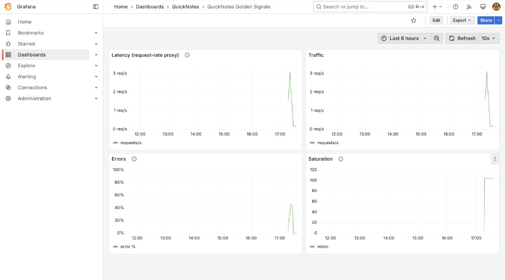
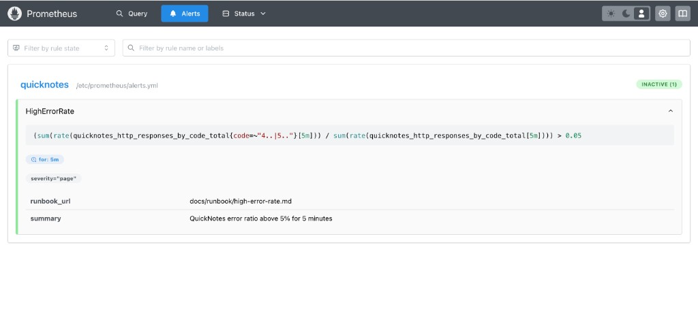

# Lab 8 Submission — SRE & Monitoring

## Task 1 — Prometheus + Grafana + Golden Signals dashboard

### Config files
- Prometheus: `monitoring/prometheus/prometheus.yml`
- Alert rules: `monitoring/prometheus/alerts.yml`
- Grafana datasource: `monitoring/grafana/provisioning/datasources/datasource.yml`
- Grafana dashboard provider: `monitoring/grafana/provisioning/dashboards/dashboard.yml`
- Dashboard JSON: `monitoring/grafana/dashboards/golden-signals.json`
- Compose extension: `compose.yaml` (`quicknotes`, `prometheus`, `grafana`)

### Prometheus targets (`up`)
```text
$ curl -s http://localhost:9090/api/v1/targets | jq -r '.data.activeTargets[] | "\(.labels.job) \(.health)"'
quicknotes up
```

### Grafana dashboard provisioned
```text
$ curl -s -u 'qn-admin:lab8-grafana-pass' 'http://localhost:3000/api/search?query=Golden' | jq -r '.[].title'
QuickNotes Golden Signals
```

Dashboard URL (after `docker compose up -d`): http://localhost:3000/d/quicknotes-golden-signals



**Dashboard evidence (API queries after ~300 mixed requests):**

Traffic (`rate(quicknotes_http_requests_total[5m])`):
```json
"value": [1783952198.718, "0.019614"]
```

Saturation (`quicknotes_notes_total`):
```json
"value": [1783952198.718, "104"]
```

Errors (% 4xx/5xx before injection):
```json
"value": [1783952198.718, "0"]
```
(before deliberate error injection)

### Design questions (a–d)

**a) Pull vs push**  
Prometheus **pulls** `/metrics` from QuickNotes. QuickNotes must be reachable **from Prometheus** on the Compose network (`quicknotes:8080`). If Prometheus cannot scrape, `up==0` and you lose metrics — blind to user-visible issues while the app may still serve traffic.

**b) `scrape_interval: 15s`**  
`5s` increases cardinality churn and storage/load with diminishing returns; `5m` makes alerts/dashboards sluggish and hides short incidents. 15s is a common default balance.

**c) `rate()` vs `irate()` vs `delta()` for Traffic**  
Use **`rate()`** over a range (e.g. `[5m]`) — it smooths per-second counter increase and handles counter resets. `irate()` is spiky; `delta()` is raw and not per-second.

**d) Why provision Grafana from files**  
Git-reviewed, reproducible dashboards on every `docker compose up` — no manual UI clicking, no drift between laptops/CI/staging.

---

## Task 2 — Alert + runbook + trigger

### Alert rule (`monitoring/prometheus/alerts.yml`)
```yaml
- alert: HighErrorRate
  expr: |
    (
      sum(rate(quicknotes_http_responses_by_code_total{code=~"4..|5.."}[5m]))
      /
      sum(rate(quicknotes_http_responses_by_code_total[5m]))
    ) > 0.05
  for: 5m
  labels:
    severity: page
  annotations:
    summary: QuickNotes error ratio above 5% for 5 minutes
    runbook_url: docs/runbook/high-error-rate.md
```

### Alert rule in Prometheus UI



Rule group `quicknotes`, expression and `for: 5m` match `monitoring/prometheus/alerts.yml`.

### Alert observed: `pending` → `firing`
Deliberate traffic: alternating `POST /notes` with malformed JSON (`400`) + healthy `GET /health` (~50% errors) for **6+ minutes**.

Timeline (polled `/api/v1/alerts` every ~5s during 6+ min injection):
```text
start=2026-07-13T14:16:38Z
pending from 2026-07-13T14:17:12Z
firing from 2026-07-13T14:22:12Z (after 5m `for:`)
done 2026-07-13T14:16:38Z -> 2026-07-13T14:23:19Z
```

Firing state (Prometheus `/api/v1/alerts`):
```json
{
  "labels": { "alertname": "HighErrorRate", "severity": "page" },
  "annotations": {
    "runbook_url": "docs/runbook/high-error-rate.md",
    "summary": "QuickNotes error ratio above 5% for 5 minutes"
  },
  "state": "firing",
  "activeAt": "2026-07-13T14:17:12.464142167Z",
  "value": "0.46"
}
```

Grafana Errors panel (same injection window) peaked at ~45% — see dashboard screenshot above. Prometheus UI screenshot was taken after recovery (`INACTIVE`); firing state is from `/api/v1/alerts` during the 6+ min injection run.

### Runbook
Full document: `docs/runbook/high-error-rate.md`

### Design questions (e–g)

**e) Why sustained 5 minutes?**  
Filters single-request noise and brief client bugs; pages only when users see a **real** elevated error rate, reducing alert fatigue.

**f) Symptom vs cause alert**  
Symptom: high HTTP error ratio (user impact). Cause example: `container_cpu_usage > 90%` — may fire during harmless spikes while users are fine; causes on-call to chase the wrong problem.

**g) Alert fatigue threshold**  
If >30% of pages are false positives (users unaffected / no incident), the alert is too noisy — tune threshold, `for:` duration, or scope (e.g. 5xx only).

---

## Bonus — Checkly synthetic monitoring

Not attempted in this submission (no external probe from 2+ regions for ≥30 min).

---

## How to reproduce locally

```bash
docker compose up -d --build
# Grafana: http://localhost:3000  user qn-admin / lab8-grafana-pass
# Prometheus: http://localhost:9090
curl http://localhost:8080/health
```
