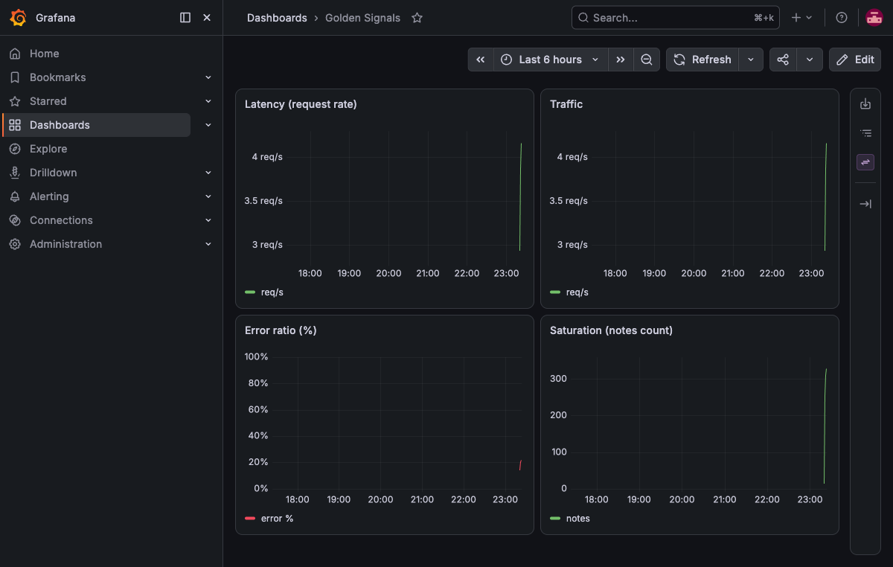
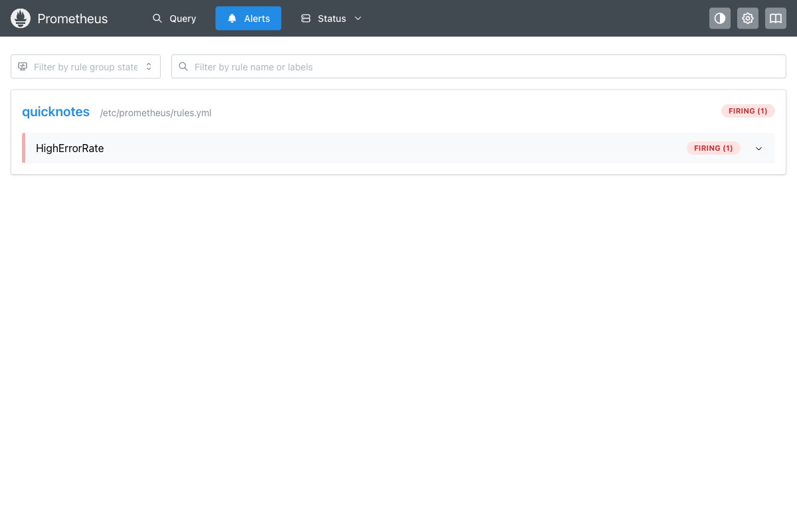

# Lab 8 submission

## Task 1 — Prometheus + Grafana with a Provisioned Dashboard (6 pts)

### 1.1: Layout

```
monitoring/
├── prometheus/
│   ├── prometheus.yml
│   └── rules.yml
└── grafana/
    ├── dashboards/
    │   └── golden-signals.json
    └── provisioning/
        ├── datasources/
        │   └── datasource.yml
        └── dashboards/
            └── dashboard.yml
```

Extended `compose.yaml` from Lab 6 with `prometheus` and `grafana` services.

### Config files

**`monitoring/prometheus/prometheus.yml`:**
```yaml
global:
  scrape_interval: 15s

rule_files:
  - rules.yml

scrape_configs:
  - job_name: quicknotes
    static_configs:
      - targets: ["quicknotes:8080"]
```

**`monitoring/grafana/provisioning/datasources/datasource.yml`:**
```yaml
apiVersion: 1

datasources:
  - name: Prometheus
    type: prometheus
    access: proxy
    url: http://prometheus:9090
    isDefault: true
```

**`monitoring/grafana/provisioning/dashboards/dashboard.yml`:**
```yaml
apiVersion: 1

providers:
  - name: Golden Signals
    orgId: 1
    folder: ""
    type: file
    disableDeletion: false
    updateIntervalSeconds: 30
    options:
      path: /var/lib/grafana/dashboards
```

**`golden-signals.json`** — 4 panels: Latency (request rate proxy), Traffic, Error ratio, Saturation (notes count).

### Grafana dashboard



### Targets health

```
❯ curl -s http://localhost:9090/api/v1/targets | python3 -c "import sys,json;d=json.load(sys.stdin);[print(t['health']) for t in d['data']['activeTargets']]"
up
```

### Design questions (a-d)

**a) Pull vs push — what does Prometheus pulling mean for reachability?**

Prometheus connects to QuickNotes, not the other way. If Prometheus can't reach it — network issue, container restart — scrape fails and graphs go flat. QuickNotes keeps running fine, just no metrics collected.

**b) What problems with `scrape_interval: 5s` vs `5m`?**

5s = 12x more data, more disk I/O, more CPU on both sides. 5m = miss short bursts, alerts react slower.

**c) `rate()` vs `irate()` vs `delta()` — which for the Traffic panel?**

`rate()`. It averages over the window and handles counter resets. `irate()` is too jumpy (last 2 samples only). `delta()` is for gauges.

**d) Why provision Grafana from files instead of clicking through the UI?**

Files are repeatable and survive `docker compose down`. UI dashboards disappear when the container dies.

---

## Task 2 — One Good Alert + Runbook (4 pts)

### Alert rule

```yaml
groups:
  - name: quicknotes
    rules:
      - alert: HighErrorRate
        expr: sum(rate(quicknotes_http_responses_by_code_total{code=~"4..|5.."}[5m])) / sum(rate(quicknotes_http_requests_total[5m])) > 0.05
        for: 5m
        labels:
          severity: page
        annotations:
          summary: "QuickNotes error rate > 5% for 5 minutes"
          runbook: "https://github.com/moflotas/DevOps-Intro/blob/feature/lab8/docs/runbook/high-error-rate.md"
```

### Alert firing

Ran a script that made ~40% error requests for 6+ minutes:

```
Normal → Pending (after 1m) → Firing (after 5m)
```



### Runbook

**`docs/runbook/high-error-rate.md`:** sections for what it means, triage, mitigations, post-incident.

### Design questions (e-g)

**e) Why "sustained for 5 minutes" instead of firing immediately?**

A single bad request could be a flaky client. 5 minutes of sustained >5% errors means it's actually broken. Prevents paging on noise.

**f) Symptom vs cause alerts — example of a cause alert for QuickNotes?**

CPU > 90%. High CPU doesn't always mean user-visible problems. Meanwhile the real issue (corrupted data, 500s) would page no one.

**g) When is an alert too noisy?**

If it pages more than ~1% of the time when users aren't actually affected. Alert should fire only when a human actually needs to do something.
