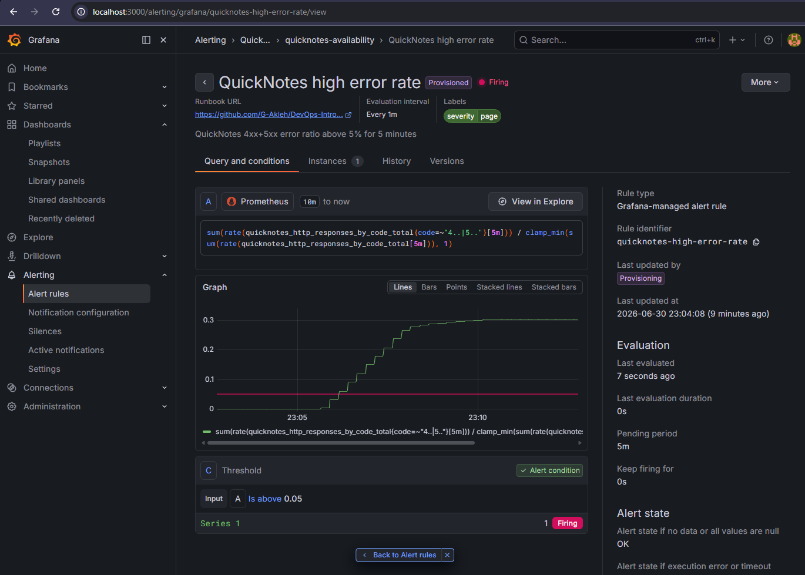
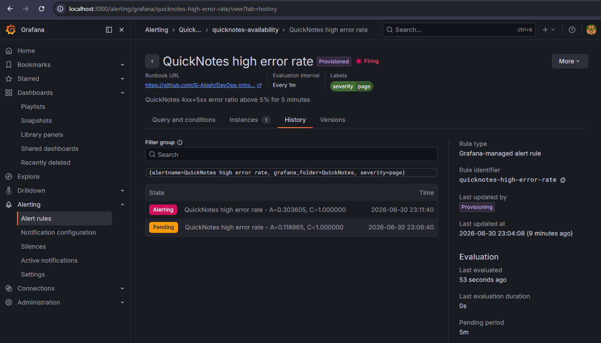
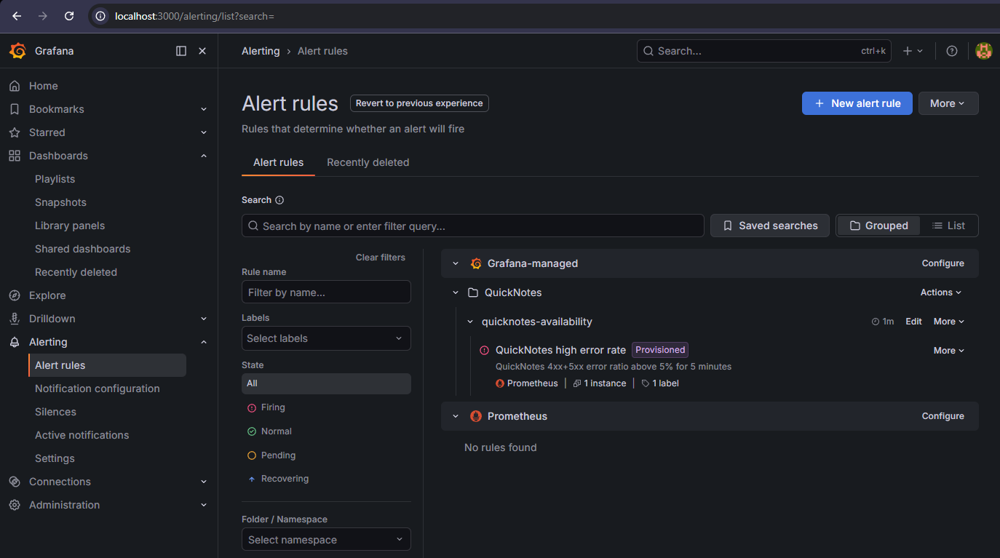

# Lab 8 Submission: SRE & Monitoring

> Stack: QuickNotes (Lab 6 image) + Prometheus `v3.12.0` + Grafana `13.0.3`, all
> in the one `compose.yaml`. Environment: Windows 11, Docker Desktop (WSL2).

---

## Task 1: Prometheus + Grafana with a Provisioned Dashboard

### Files produced

```text
monitoring/
├── prometheus/
│   └── prometheus.yml
└── grafana/
    ├── provisioning/
    │   ├── datasources/datasource.yml   # Prometheus DS, set as default
    │   └── dashboards/dashboard.yml      # file provider -> /var/lib/grafana/dashboards
    └── dashboards/
        └── golden-signals.json           # the 4-panel dashboard
```

Plus `prometheus` + `grafana` services added to the existing Lab 6 `compose.yaml`.

> **Note on layout:** the spec's §1.1 diagram nests `golden-signals.json` under
> `provisioning/dashboards/`, but its §1.4 compose requirement says to mount
> `monitoring/grafana/dashboards` into `/var/lib/grafana/dashboards`. We follow
> §1.4 (and Grafana's own recommendation): provisioning _config_ lives in
> `provisioning/`, dashboard _content_ in a sibling `dashboards/`. Grafana only
> ever sees the in-container path `/var/lib/grafana/dashboards` that the provider
> YAML points at, so the host-side folder name is functionally irrelevant.

#### `monitoring/prometheus/prometheus.yml`

```yaml
global:
  scrape_interval: 15s
  scrape_timeout: 10s

scrape_configs:
  - job_name: quicknotes
    metrics_path: /metrics
    static_configs:
      - targets: ["quicknotes:8080"]
```

The target is the **Compose service name** `quicknotes` + the **in-container** port
`8080` (not the published host port) — Docker's embedded DNS resolves it on the
shared Compose network.

#### `monitoring/grafana/provisioning/datasources/datasource.yml`

```yaml
apiVersion: 1
datasources:
  - name: Prometheus
    type: prometheus
    uid: prometheus
    access: proxy
    url: http://prometheus:9090
    isDefault: true
    editable: false
```

#### `monitoring/grafana/provisioning/dashboards/dashboard.yml`

```yaml
apiVersion: 1
providers:
  - name: golden-signals
    orgId: 1
    folder: ""
    type: file
    disableDeletion: false
    updateIntervalSeconds: 30
    allowUiUpdates: true
    options:
      path: /var/lib/grafana/dashboards
      foldersFromFilesStructure: false
```

#### `monitoring/grafana/dashboards/golden-signals.json`

Full file in the repo: [golden-signals.json](../monitoring/grafana/dashboards/golden-signals.json).
The four panels and their PromQL (matched to the metrics QuickNotes actually
exports on `/metrics`. Note there is **no duration histogram**, so Latency uses
the request-rate proxy):

| Panel           | Golden signal | PromQL                                                                                                                                            |
| --------------- | ------------- | ------------------------------------------------------------------------------------------------------------------------------------------------- |
| Latency (proxy) | Latency       | `sum(rate(quicknotes_http_requests_total[1m]))` — _no histogram exposed; rate stands in_                                                          |
| Traffic         | Traffic       | `sum(rate(quicknotes_http_requests_total[1m]))`                                                                                                   |
| Errors          | Errors        | `sum(rate(quicknotes_http_responses_by_code_total{code=~"4..\|5.."}[5m])) / clamp_min(sum(rate(quicknotes_http_responses_by_code_total[5m])), 1)` |
| Saturation      | Saturation    | `quicknotes_notes_total` (gauge)                                                                                                                  |

#### `compose.yaml` (Lab 8 additions)

```yaml
prometheus:
  image: prom/prometheus:v3.12.0
  depends_on:
    quicknotes:
      condition: service_healthy
  volumes:
    - ./monitoring/prometheus/prometheus.yml:/etc/prometheus/prometheus.yml:ro
  ports:
    - "9090:9090"
  restart: unless-stopped

grafana:
  image: grafana/grafana:13.0.3
  depends_on:
    - prometheus
  volumes:
    - ./monitoring/grafana/provisioning:/etc/grafana/provisioning:ro
    - ./monitoring/grafana/dashboards:/var/lib/grafana/dashboards:ro
    - grafana-data:/var/lib/grafana
  environment:
    GF_SECURITY_ADMIN_USER: admin
    GF_SECURITY_ADMIN_PASSWORD: quicknotes-lab8
    GF_USERS_ALLOW_SIGN_UP: "false"
  ports:
    - "3000:3000"
  restart: unless-stopped
```

### Bring up + verify

**Input:**

```bash
docker compose up --build -d
docker compose ps
```

**Output:**

```text
NAME                        IMAGE                     COMMAND                  SERVICE      CREATED          STATUS                    PORTS
devops-intro-grafana-1      grafana/grafana:13.0.3    "/run.sh"                grafana      14 minutes ago   Up 14 minutes             0.0.0.0:3000->3000/tcp
devops-intro-prometheus-1   prom/prometheus:v3.12.0   "/bin/prometheus --c…"   prometheus   14 minutes ago   Up 14 minutes             0.0.0.0:9090->9090/tcp
devops-intro-quicknotes-1   quicknotes:lab6           "/quicknotes"            quicknotes   14 minutes ago   Up 14 minutes (healthy)   0.0.0.0:8080->8080/tcp
```

Generate ~250 mixed requests (healthy + deliberate 400/404 errors):

```bash
for i in $(seq 1 50); do
  curl -s -o /dev/null http://localhost:8080/notes
  curl -s -o /dev/null http://localhost:8080/health
  curl -s -o /dev/null -X POST -H 'Content-Type: application/json' \
    -d "{\"title\":\"note $i\",\"body\":\"body $i\"}" http://localhost:8080/notes
  curl -s -o /dev/null -X POST -H 'Content-Type: application/json' \
    -d 'not json' http://localhost:8080/notes        # 400
  curl -s -o /dev/null http://localhost:8080/notes/99999   # 404
done
```

Prometheus target is `UP`:

**input**:

```bash
curl http://localhost:9090/api/v1/targets | jq '.data.activeTargets[].health'
```

**output**:

```text
curl http://localhost:9090/api/v1/targets | jq '.data.activeTargets[].health'
  % Total    % Received % Xferd  Average Speed   Time    Time     Time  Current
                                 Dload  Upload   Total   Spent    Left  Speed
100   613  100   613    0     0   253k      0 --:--:-- --:--:-- --:--:--  299k
"up"
```

PromQL behind each panel returns live data:

```bash
# Traffic
curl -sG http://localhost:9090/api/v1/query \
  --data-urlencode 'query=sum(rate(quicknotes_http_requests_total[1m]))'
# Errors ratio
curl -sG http://localhost:9090/api/v1/query \
  --data-urlencode 'query=sum(rate(quicknotes_http_responses_by_code_total{code=~"4..|5.."}[5m])) / clamp_min(sum(rate(quicknotes_http_responses_by_code_total[5m])), 1)'
# Saturation
curl -sG http://localhost:9090/api/v1/query \
  --data-urlencode 'query=quicknotes_notes_total'
```

```text
Traffic     -> 3.196   (req/s, instant)
Errors      -> 0.332   (instant ratio right after the burst; the Errors panel's
                        smoothed 5m-window ratio shows the burst as a ~20% plateau)
Saturation  -> 54      (notes stored)
```

Grafana auto-provisioned both the data source and the dashboard on startup
(`GET /api/datasources`, `GET /api/search`):

```text
Prometheus  prometheus  http://prometheus:9090  default=True
QuickNotes — Golden Signals  uid=quicknotes-golden
```

> Note on the outputs above: the QuickNotes API and the Grafana/Prometheus API
> calls in this section all return raw JSON. For readability the outputs shown
> are each piped through a small filter (`jq`, e.g.
> `... | jq -r '.data.result[0].value[1]'` for the PromQL scalars) that extracts
> only the relevant field. The bare `curl` reproduces the same data as full JSON.

### Screenshots

**Prometheus — target health** (`http://localhost:9090/targets`): the
`quicknotes` job is `1/1 up`, scraping `http://quicknotes:8080/metrics`.


**Grafana dashboard** (`http://localhost:3000/d/quicknotes-golden` →
**QuickNotes — Golden Signals**, auto-loaded). Viewed over the **last 20 minutes**,
the burst is obvious: Traffic/Latency spike to ~4 req/s, the Errors panel
holds a sustained plateau, and Saturation rises to 54 notes stored.


Over the **last 5 minutes** (after the burst aged out of the window), the panels
settle to the steady background traffic, Docker's healthcheck probes plus
Prometheus self-scrapes which confirms that the dashboard tracks live data.


### Design questions

**a) Pull vs push.**

Prometheus **pulls**: it opens the connection to `quicknotes:8080/metrics`, so
**QuickNotes is the side that must be reachable** from Prometheus (Prometheus
itself needs no inbound access). If Prometheus can't reach QuickNotes the scrape
fails, `up` for that target goes to `0`, and panels show gaps/"No data", but
QuickNotes keeps serving users; only our _visibility_ breaks, not the app.

**b) `scrape_interval`.**

At `5s` you ~3× the sample/storage volume and the load
on `/metrics` for little gain (counters are cumulative; `rate()` already
interpolates), and you risk scrapes overrunning `scrape_timeout`. At `5m` you go
nearly blind to short spikes (a 90-second error burst can fall between two
samples) and any `rate()[1m]` query returns no data because a 1m window holds
<2 points. `15s` balances resolution against cost.

**c) `rate()` vs `irate()` vs `delta()`.**

**`rate()`** is right for Traffic: it averages a counter's per-second increase over the window and is
counter-reset-safe, giving a smooth req/s line. `irate()` uses only the last two
points which is too twitchy for a dashboard trend. `delta()` is for **gauges**, not
counters, so it's wrong for a request total.

**d) Why provision from files.**

A fresh `docker compose up` comes up already wired (data source + dashboard
appear with no manual clicking) so the setup is **reproducible**, identical across
machines, and **version-controlled** (the dashboard JSON is reviewed in the
PR like any other code). Clicking through the UI each time is unrepeatable
and lost when the container's volume is wiped.

---

## Task 2: One Good Alert + Runbook

### The alert rule

The alert is a **Grafana provisioned rule** at
[`monitoring/grafana/provisioning/alerting/high-error-rate.yml`](../monitoring/grafana/provisioning/alerting/high-error-rate.yml),
so it loads automatically on startup the same way the data source and dashboard
do. It fires when the **4xx+5xx error ratio stays above 5% for a full 5 minutes**
(`for: 5m`). It carries a `severity: page` label, and its `runbook_url`
annotation links straight to the runbook in this repo.

```yaml
groups:
  - orgId: 1
    name: quicknotes-availability
    folder: QuickNotes
    interval: 1m
    rules:
      - uid: quicknotes-high-error-rate
        title: QuickNotes high error rate
        condition: C
        for: 5m # sustained-breach gate
        labels:
          severity: page
        annotations:
          summary: QuickNotes 4xx+5xx error ratio above 5% for 5 minutes
          runbook_url: https://github.com/G-Akleh/DevOps-Intro/blob/feature/lab8/docs/runbook/high-error-rate.md
        data:
          - refId: A # the error ratio (instant)
            datasourceUid: prometheus
            model:
              expr: >-
                sum(rate(quicknotes_http_responses_by_code_total{code=~"4..|5.."}[5m]))
                / clamp_min(sum(rate(quicknotes_http_responses_by_code_total[5m])), 1)
              instant: true
          - refId: C # threshold: fire when A > 0.05
            datasourceUid: __expr__
            model:
              type: threshold
              expression: A
              conditions:
                - evaluator: { type: gt, params: [0.05] }
```

The rule loads as `Normal` (Grafana's rules API reports `state: inactive`,
`severity: page`, `for: 300s`, runbook URL attached):

```bash
curl -s -u admin:*** http://localhost:3000/api/prometheus/grafana/api/v1/rules
```

```text
rule: QuickNotes high error rate | state: inactive | health: ok | for: 300s
  labels: {'severity': 'page'}
  runbook: https://github.com/G-Akleh/DevOps-Intro/blob/feature/lab8/docs/runbook/high-error-rate.md
```

> The raw endpoint returns a large JSON document; the lines above are that
> response piped through a `jq` filter that pulls out just the rule's name,
> state, `for` duration, label, and runbook URL. To see the full payload, drop
> the filter: `curl -s -u admin:*** http://localhost:3000/api/prometheus/grafana/api/v1/rules`.

**Why a single 4xx can't trip it.** Two things have to line up. First, the
expression measures a _ratio_ over a 5-minute `rate()` window, so one bad request
barely moves the number. And even if the ratio does climb past 5%, the `for: 5m`
clause holds the rule in `Pending` rather than `Firing` until the breach has
lasted five evaluations in a row.

### Triggering it deliberately

A script sends sustained malformed `POST /notes` (≈33% of requests) alongside
healthy traffic for ~8 minutes:

```bash
end=$((SECONDS + 480))
while [ $SECONDS -lt $end ]; do
  curl -s -o /dev/null http://localhost:8080/notes                    # 200
  curl -s -o /dev/null http://localhost:8080/health                   # 200
  curl -s -o /dev/null -X POST -d 'BROKEN_NOT_JSON' \
    http://localhost:8080/notes                                       # 400
  sleep 1
done
```

Observed transition `Normal → Pending → Firing` (polling Grafana's rules API +
the error ratio every 20s):

```text
[23:06:03] STATE -> inactive   (error ratio=0.031)
[23:06:23] ... inactive       (ratio=0.091)
[23:06:44] STATE -> pending    (error ratio=0.119)   <- ratio crossed 5%
[23:07:25] ... pending         (ratio=0.206)
[23:08:27] ... pending         (ratio=0.284)
[23:09:50] ... pending         (ratio=0.299)
[23:11:12] ... pending         (ratio=0.304)
[23:11:53] STATE -> firing     (error ratio=0.303)   <- after the 5m "for" gate
```

Grafana's own **State history** is the authoritative record: the rule went
`Pending` at **23:06:40** (ratio 0.119) and only escalated to `Alerting` at
**23:11:40** (ratio 0.304) — precisely the five-minute gap the `for: 5m` clause
enforces.

**Query & conditions** — the PromQL, the error ratio climbing past the red `0.05`
threshold line, and `Series 1 → Firing`:



**State history** — `Pending` (A=0.119) at 23:06:40 → `Alerting` (A=0.304) at
23:11:40, the 5-minute sustained gate:



**Alert rules list** — the provisioned rule in the `QuickNotes` folder, firing,
carrying the `severity: page` label:



### Design questions

**e) Why "sustained for 5 minutes."**

Real traffic is bursty, so an alert that fired on the first bad request would go
off constantly for things like one malformed payload, a brief deploy hiccup, or a
single timed-out call. An on-call who keeps getting paged for noise soon learns to
ignore the pager. Waiting five minutes acts as a debounce, so it only pages once a
problem has genuinely persisted. That delay is how you tell a real outage apart
from a blip that fixes itself.

**f) Symptom vs cause alerts.**

Ours is a _symptom_ alert, meaning it watches what users actually experience,
namely errors. A _cause_ alert would instead watch an internal condition like
**CPU above 80%** or **memory near the container limit**. Those are worse for two
reasons. First, high CPU often doesn't bother users at all, so you get paged for
nothing. Second, they only catch the failure modes you thought to anticipate, so
something you didn't predict, like a corrupt `notes.json` or a wedged handler, can
flood users with errors while CPU looks perfectly normal, and a cause alert sails
right past it. A symptom alert catches anything that genuinely degrades the
service, whatever the underlying reason.

**g) Alert fatigue threshold.**

The metric to watch is **precision**: out of every page the alert sends, how many
corresponded to a real user impact. A reasonable line is that if **more than half
of its pages fire when nobody was actually affected** (precision below 0.5), the
alert is too noisy and needs retuning, whether by a higher threshold, a longer
`for`, or a tighter query. The goal is for nearly every page to be worth acting
on. Once it becomes a coin flip, people start tuning it out, and the next real
incident gets missed along with the noise.

### Runbook

Full document: [`docs/runbook/high-error-rate.md`](../docs/runbook/high-error-rate.md).
It has the four required sections — **What this alert means** (one sentence),
**Triage steps** (confirm it's live → split 4xx vs 5xx → check `/health`, `ps`,
logs), **Mitigations** (restart, roll back the last deploy, rate-limit a bad
caller), and **Post-incident** (resolve, then a blameless postmortem from the
Lecture 1 template) — written so a 3 AM on-call who has never seen QuickNotes can
act from it.
