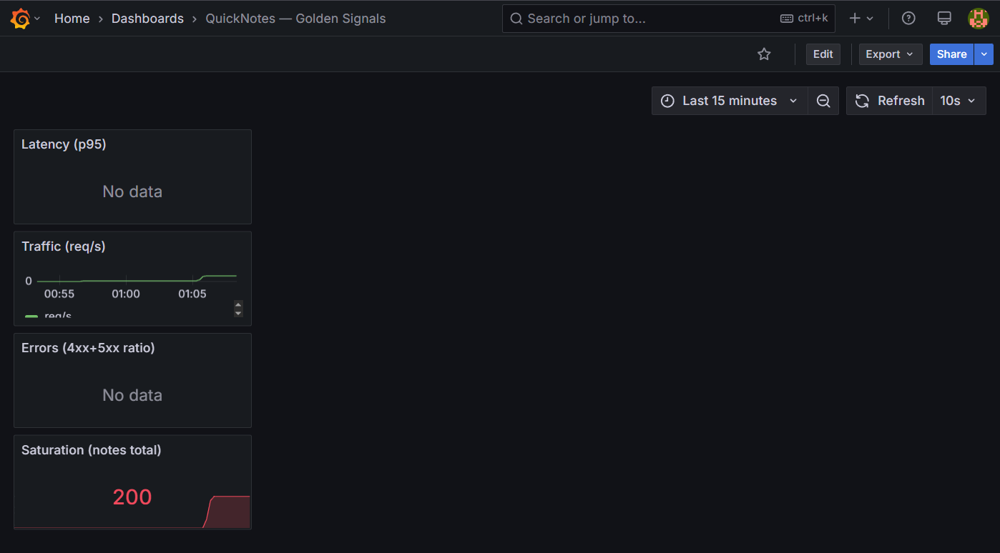
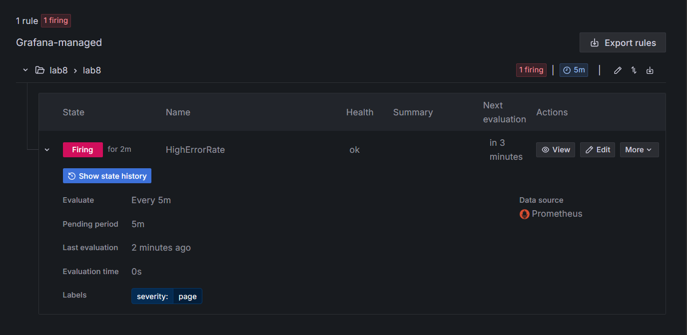
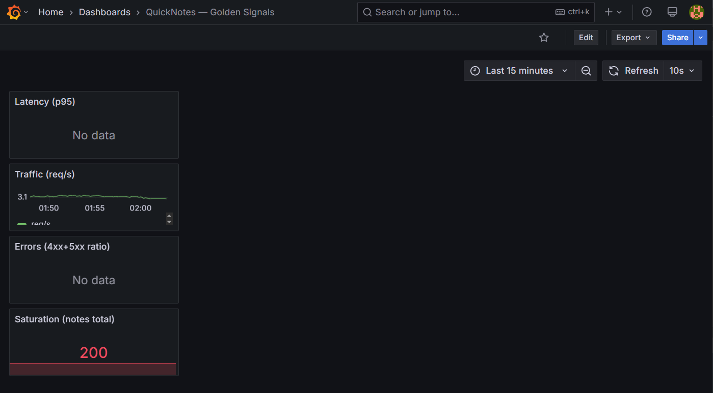

# Lab 8 — SRE & Monitoring: Golden Signals Dashboard + One Good Alert


### Chosen Path
GitHub Actions (same as previous labs).

## Task 1 — Prometheus + Grafana with a Provisioned Dashboard
### 1.1 Layout

```
monitoring/
├── prometheus/
│   └── prometheus.yml
└── grafana/
    └── provisioning/
        ├── datasources/
        │   └── datasource.yml
        └── dashboards/
            ├── dashboard.yml          (provider config)
            └── golden-signals.json    (the actual dashboard)
```

### 1.2-1.4 Config Files

**monitoring/prometheus/prometheus.yml:**
```yaml
global:
  scrape_interval: 15s
scrape_configs:
  - job_name: 'quicknotes'
    static_configs:
      - targets: ['quicknotes:8080']
```

**monitoring/grafana/provisioning/datasources/datasource.yml:**

```
apiVersion: 1
datasources:
  - name: Prometheus
    type: prometheus
    access: proxy
    url: http://prometheus:9090
    isDefault: true
    editable: false
```

**monitoring/grafana/provisioning/dashboards/dashboard.yml:**
```
apiVersion: 1
providers:
  - name: 'default'
    orgId: 1
    folder: ''
    type: file
    disableDeletion: true
    updateIntervalSeconds: 10
    options:
      path: /var/lib/grafana/dashboards
```

**monitoring/grafana/provisioning/dashboards/golden-signals.json:**

```
{
  "title": "QuickNotes — Golden Signals",
  "uid": "quicknotes-golden",
  "panels": [
    {
      "title": "Latency (p95)",
      "type": "timeseries",
      "targets": [
        {
          "expr": "histogram_quantile(0.95, rate(quicknotes_http_request_duration_seconds_bucket[5m]))",
          "legendFormat": "p95"
        }
      ]
    },
    {
      "title": "Traffic (req/s)",
      "type": "timeseries",
      "targets": [
        {
          "expr": "rate(quicknotes_http_requests_total[5m])",
          "legendFormat": "req/s"
        }
      ]
    },
    {
      "title": "Errors (4xx+5xx ratio)",
      "type": "timeseries",
      "targets": [
        {
          "expr": "sum(rate(quicknotes_http_requests_total{status=~\"4..|5..\"}[5m])) / sum(rate(quicknotes_http_requests_total[5m]))",
          "legendFormat": "error ratio"
        }
      ]
    },
    {
      "title": "Saturation (notes total)",
      "type": "stat",
      "targets": [
        {
          "expr": "quicknotes_notes_total",
          "legendFormat": "total notes"
        }
      ]
    }
  ],
  "refresh": "10s",
  "time": { "from": "now-15m", "to": "now" }
}
```

**compose.yaml:**

```
services:
  quicknotes:
    build:
      context: ./app
      dockerfile: Dockerfile
    ports:
      - "8080:8080"
    healthcheck:
      test: ["CMD", "curl", "-f", "http://localhost:8080/health"]
      interval: 10s
      timeout: 5s
      retries: 3

  prometheus:
    image: prom/prometheus:v3.3.0
    ports:
      - "9090:9090"
    volumes:
      - ./monitoring/prometheus/prometheus.yml:/etc/prometheus/prometheus.yml:ro
    command:
      - '--config.file=/etc/prometheus/prometheus.yml'
    depends_on:
      quicknotes:
        condition: service_healthy

  grafana:
    image: grafana/grafana:11.6.0
    ports:
      - "3000:3000"
    environment:
      GF_SECURITY_ADMIN_USER: admin
      GF_SECURITY_ADMIN_PASSWORD: quicknotes
    volumes:
      - ./monitoring/grafana/provisioning:/etc/grafana/provisioning:ro
      - ./monitoring/grafana/provisioning/dashboards:/var/lib/grafana/dashboards:ro
    depends_on:
      - prometheus
```

### 1.5: Design questions

- a) **Pull vs push:** Prometheus pulls. What does that mean for _which side_ (Prometheus or QuickNotes) needs to be reachable? What's the failure mode if Prometheus can't reach QuickNotes?

Prometheus initiates the connection to QuickNotes, so QuickNotes must be reachable from Prometheus, specifically its `/metrics` endpoint. If Prometheus cannot reach QuickNotes, the target shows as DOWN and no metrics are collected for that scrape interval. The failure mode is a gap in metric data: Prometheus does not queue or retry, it simply misses the scrape and moves on. This means transient network issues can cause holes in dashboards.

- b) **`scrape_interval: 15s`** is a default. What query problems do you create by setting it to `5s`? To `5m`?

At 5s: higher resolution but 3× more storage, CPU, and network traffic. Can miss spikes shorter than 5s. At 5m: misses short-lived error bursts entirely a 4-minute incident could be invisible. 15s balances resolution with resource cost, which is why it's the Prometheus default.

- c) **PromQL `rate()` vs `irate()` vs `delta()`** — which one is right for the Traffic panel and why?

`rate()` is correct for the Traffic panel. It calculates the per-second average rate over the full interval, smoothing out momentary spikes and showing a stable trend. `irate()` gives only the instantaneous rate between the last two samples too jumpy for a dashboard. `delta()` gives absolute change, not a rate that wrong unit for "requests per second."

- d) **Why provision Grafana from files** instead of clicking through the UI on every fresh stack?

File-based provisioning makes the Grafana instance disposable and reproducible. `docker compose up` produces a fully configured Grafana with data sources and dashboards — zero manual clicks. This is infrastructure as code. If the container dies, the next one is identical. It also enables GitOps: any change to the dashboard is reviewed in a PR before being applied.


**docker compose up -d**
```
evilmice@DESKTOP-I36ND4E:/mnt/c/Users/Admin/DevOps-Intro$ docker compose up -d --build
[+] Building 23.0s (17/17) FINISHED
 => [internal] load local bake definitions                                                                         0.0s
 => => reading from stdin 548B                                                                                     0.0s
 => [internal] load build definition from Dockerfile                                                               0.0s
 => => transferring dockerfile: 330B                                                                               0.0s
 => [internal] load metadata for docker.io/library/alpine:3.21                                                     1.8s
 => [internal] load metadata for docker.io/library/golang:1.24-alpine                                              1.6s
 => [internal] load .dockerignore                                                                                  0.0s
 => => transferring context: 2B                                                                                    0.0s
 => [builder 1/6] FROM docker.io/library/golang:1.24-alpine@sha256:8bee1901f1e530bfb4a7850aa7a479d17ae3a18beb6e0  12.7s
 => => resolve docker.io/library/golang:1.24-alpine@sha256:8bee1901f1e530bfb4a7850aa7a479d17ae3a18beb6e09064ed54c  0.0s
 => => sha256:c95d909b2488ff78a51d01ca745429e6d281e314006f231fe6e9f219cf5432ca 126B / 126B                         0.6s
 => => sha256:4f4fb700ef54461cfa02571ae0db9a0dc1e0cdb5577484a6d75e68dc38e8acc1 32B / 32B                           0.6s
 => => sha256:f7bdfd728ac2ad72d43b82689890dc698260d3a1049845f48fb3fb942df6c581 79.13MB / 79.13MB                   8.7s
 => => sha256:8f78851c25d251496dd39ebce311b4d914a4a97c0ba1983039165a05fd96b925 296.08kB / 296.08kB                 0.6s
 => => sha256:589002ba0eaed121a1dbf42f6648f29e5be55d5c8a6ee0f8eaa0285cc21ac153 3.86MB / 3.86MB                     2.8s
 => => extracting sha256:589002ba0eaed121a1dbf42f6648f29e5be55d5c8a6ee0f8eaa0285cc21ac153                          0.2s
 => => extracting sha256:8f78851c25d251496dd39ebce311b4d914a4a97c0ba1983039165a05fd96b925                          0.1s
 => => extracting sha256:f7bdfd728ac2ad72d43b82689890dc698260d3a1049845f48fb3fb942df6c581                          3.9s
 => => extracting sha256:c95d909b2488ff78a51d01ca745429e6d281e314006f231fe6e9f219cf5432ca                          0.0s
 => => extracting sha256:4f4fb700ef54461cfa02571ae0db9a0dc1e0cdb5577484a6d75e68dc38e8acc1                          0.0s
 => [internal] load build context                                                                                  0.0s
 => => transferring context: 453B                                                                                  0.0s
 => [stage-1 1/3] FROM docker.io/library/alpine:3.21@sha256:48b0309ca019d89d40f670aa1bc06e426dc0931948452e8491e3d  1.5s
 => => resolve docker.io/library/alpine:3.21@sha256:48b0309ca019d89d40f670aa1bc06e426dc0931948452e8491e3d65087abc  0.0s
 => => sha256:897d797d2723cf0e318402f4d6f37d51b011517e5cf09246b22155f0fa90dc81 3.65MB / 3.65MB                     1.3s
 => => extracting sha256:897d797d2723cf0e318402f4d6f37d51b011517e5cf09246b22155f0fa90dc81                          0.2s
 => [stage-1 2/3] RUN apk add --no-cache curl                                                                     11.6s
 => [builder 2/6] WORKDIR /app                                                                                     0.4s
 => [builder 3/6] COPY go.mod go.sum ./                                                                            0.0s
 => [builder 4/6] RUN go mod download                                                                              0.3s
 => [builder 5/6] COPY . .                                                                                         0.0s
 => [builder 6/6] RUN CGO_ENABLED=0 go build -o quicknotes .                                                       6.7s
 => [stage-1 3/3] COPY --from=builder /app/quicknotes /usr/local/bin/quicknotes                                    0.0s
 => exporting to image                                                                                             0.5s
 => => exporting layers                                                                                            0.3s
 => => exporting manifest sha256:e4b296401a599cfc67b6ad28355ea2da03bddd934e82ff65330a437a497e357b                  0.0s
 => => exporting config sha256:082a3557fd6bcc3aa22a060a165872538b71426e8e0d1404f7c3629e85069be3                    0.0s
 => => exporting attestation manifest sha256:e20a18ea009f8d800dab07829d9deca46de5170941c91030d097e7c1dd34c8b5      0.0s
 => => exporting manifest list sha256:34948385829b86d51c048ec713d21249a6b842c3664ea23a59d007a67579e85e             0.0s
 => => naming to docker.io/library/devops-intro-quicknotes:latest                                                  0.0s
 => => unpacking to docker.io/library/devops-intro-quicknotes:latest                                               0.1s
 => resolving provenance for metadata file                                                                         0.0s
[+] up 5/5
 ✔ Image devops-intro-quicknotes       Built                                                                       23.1s
 ✔ Network devops-intro_default        Created                                                                      0.0s
 ✔ Container devops-intro-quicknotes-1 Healthy                                                                     11.1s
 ✔ Container devops-intro-prometheus-1 Started                                                                     11.2s
 ✔ Container devops-intro-grafana-1    Started                                                                     11.4s
```

### 1.7: Generate traffic + verify

```
evilmice@DESKTOP-I36ND4E:/mnt/c/Users/Admin/DevOps-Intro$ for i in {1..200}; do
>   curl -s -X POST http://localhost:8080/notes \
>     -H 'Content-Type: application/json' \
>     -d '{"title":"note '$i'","body":"generated"}' > /dev/null
-s http:>   curl -s http://localhost:8080/health > /dev/null
>   curl -s http://localhost:8080/notes/1 > /dev/null
>   sleep 0.1
> done
one generating traffic"
evilmice@DESKTOP-I36ND4E:/mnt/c/Users/Admin/DevOps-Intro$ echo "Done generating traffic"
Done generating traffic
```

`http://localhost:9090/targets` shows `quicknotes` as `UP`
```
evilmice@DESKTOP-I36ND4E:/mnt/c/Users/Admin/DevOps-Intro$ curl -s http://localhost:9090/api/v1/targets
{"status":"success","data":{"activeTargets":[{"discoveredLabels":{"__address__":"quicknotes:8080","__metrics_path__":"/metrics","__scheme__":"http","__scrape_interval__":"15s","__scrape_timeout__":"10s","job":"quicknotes"},"labels":{"instance":"quicknotes:8080","job":"quicknotes"},"scrapePool":"quicknotes","scrapeUrl":"http://quicknotes:8080/metrics","globalUrl":"http://quicknotes:8080/metrics","lastError":"","lastScrape":"2026-06-27T22:04:04.388273077Z","lastScrapeDuration":0.00075004,"health":"up","scrapeInterval":"15s","scrapeTimeout":"10s"}],"droppedTargets":[],"droppedTargetCounts":{"quicknotes":0}}}evilmice@DESKTOP-I36ND4E:/mnt/c/Users/Admin/DevOps-Intro$ curl -s -o /dev/null -w "%{http_code}" http://localhost:3000
302evilmice@DESKTOP-I36ND4E:/mnt/c/Users/Admin/DevOps-Intro$ curl -s http://localhost:8080/health
{"notes":0,"status":"ok"}
```

`http://localhost:3000` shows your dashboard (auto-loaded) with non-trivial graphs


### 1.8: Document

All here, in `submissions/lab8.md`.

## Task 2 — One Good Alert + Runbook (4 pts)

### 2.1 Alert Rule

**Name:** HighErrorRate  
**PromQL:**
```
sum(rate(quicknotes_http_responses_by_code_total{code=~"4..|5.."}[5m])) / sum(rate(quicknotes_http_responses_by_code_total[5m])) > 0.05
```
**For:** 5m  
**Labels:** severity: page

### 2.2 Runbook

It is also in: `docs/runbook/high-error-rate.md`

```
# Runbook: High Error Rate on QuickNotes

## What This Alert Means
The ratio of 4xx and 5xx HTTP responses to total requests has exceeded 5% sustained for 5 minutes. Users are experiencing errors.

## Triage Steps
1. **Check the dashboard.** Open Grafana → QuickNotes Golden Signals. Confirm the error panel shows elevated errors and note the time it started.
2. **Check recent deploys.** `git log --oneline -10` — did a change go out just before the spike? If yes, rollback is the first option.
3. **Check downstream dependencies.** Is the database/file store accessible? `docker compose logs quicknotes | tail -50` — look for connection errors or timeouts.
4. **Check resource usage.** `docker stats quicknotes` — is the container CPU/memory saturated?
5. **Check logs for patterns.** `docker compose logs quicknotes | grep -i error | tail -100` — are the errors all 4xx (bad client requests) or 5xx (server failures)?

## Mitigations
1. **Rollback.** If a recent deploy correlates with the spike, revert to the previous known-good image: `docker compose up -d quicknotes` with the previous tag.
2. **Restart.** If the service is degraded without an obvious cause, restart it: `docker compose restart quicknotes`.
3. **Rate-limit.** If the errors are caused by a bad actor, add rate limiting via a reverse proxy or the application itself.

## Post-Incident
After the alert resolves:
- Write an incident report using the postmortem template from Lecture 1.
- Create a GitHub issue linking to the runbook and the postmortem.
- If this alert fired for a reason not covered in the triage steps, update this runbook.
```


### 2.3 Alert in Firing State

Triggering allert with: 
```
while true; do
  curl -s -X POST http://localhost:8080/notes \
    -H 'Content-Type: application/json' \
    -d 'invalid' > /dev/null
  sleep 0.5
done
```

Waited for 5 minutes and got -



metrics 


### 2.4: Design questions

- e) **Why "sustained for 5 minutes"** instead of "fire immediately on first bad request"?

A single bad request is noise, it could be a client typo, a network blip, or a transient glitch. Alerting on every 4xx would wake someone up for a non-issue. 5 minutes of sustained errors means the problem is real and not self-healing. This prevents alert fatigue, which Lecture 8 identified as the bigger danger than too few alerts.

- f) **Symptom alerts vs cause alerts:** the alert above is a symptom alert. What's an example of a _cause_ alert someone might write for QuickNotes? Why is it worse?

A cause alert would be "CPU > 90%" or "memory > 80%". The HighErrorRate alert is a symptom alert, it measures user impact directly. The cause alert is worse because CPU can spike harmlessly (legitimate traffic surge, GC cycle), and an alert would page without user impact. Symptom alerts answer "are users affected?" — cause alerts only hint at "maybe something is wrong."

- g) **Alert fatigue:** Lecture 8 cited it as the bigger danger than too few alerts. What's a quantitative threshold ("page X% of the time the user wasn't actually affected") that would mean your alert is too noisy?

Lecture 8's rule: if an alert pages more than 5% of the time when the user wasn't actually affected, it's too noisy. Quantitatively: if more than 1 in 20 pages results in "no user impact found," the threshold should be raised, the window widened, or an additional condition added. Alerts that fire on non-issues train on-call engineers to ignore them, which is worse than having no alert at all.

### 2.5: Document

All here.

