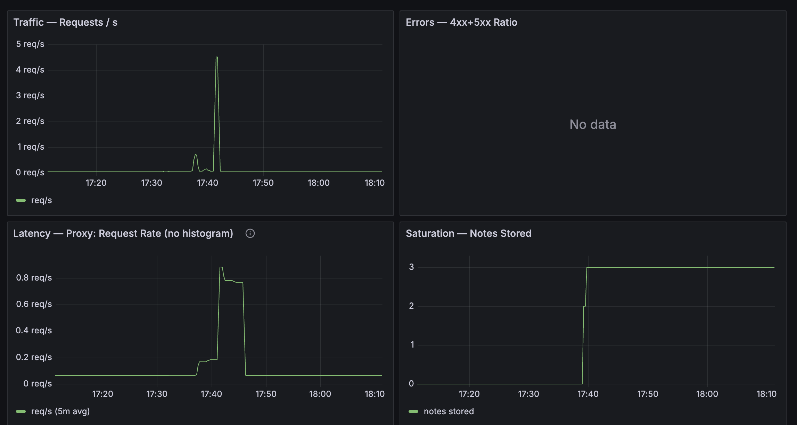
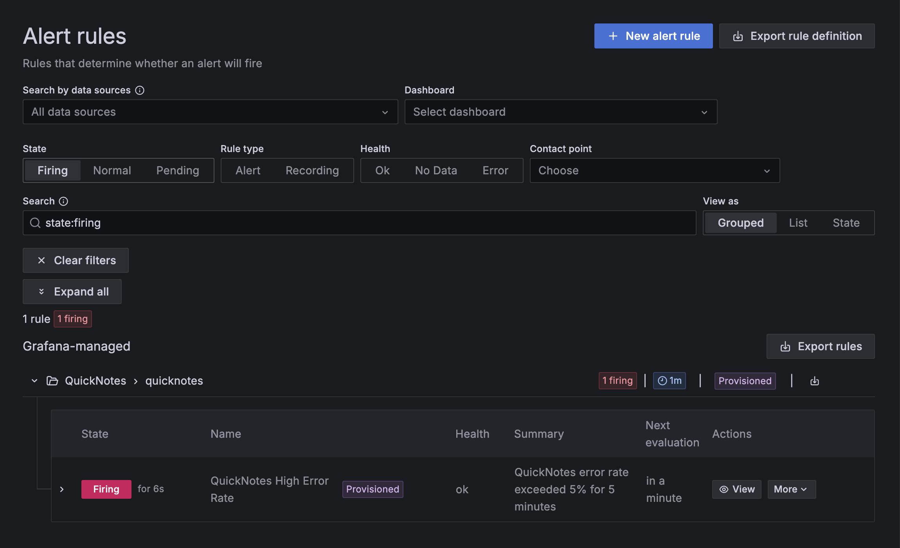

# Task 1

## Design questions

1. Pull vs push: which side needs to be reachable?

Prometheus pulls — it initiates the HTTP request to /metrics. This means QuickNotes must be reachable from Prometheus, not the other way around. QuickNotes doesn't need to know Prometheus exists.

Failure mode: if Prometheus can't reach QuickNotes (container down, wrong hostname, wrong port), the target shows DOWN in /targets and the scrape fails silently — no metrics are recorded for that interval. The app keeps running; only observability is lost. You won't know until you notice missing data in dashboards.

2. scrape_interval: 5s vs 5m — what problems do each cause?

5s — high cardinality write load on Prometheus storage, TSDB churn, and rate() windows become harder to reason about. A rate(metric[1m]) over 5s scrapes has only 12 data points — statistically fine, but you burn disk and CPU for marginal resolution gain on a low-traffic app.

5m — rate() requires at least 2 data points in its window, so the window must be strictly greater than one scrape interval (>5m). A spike that lasts 3 minutes is invisible. Alert `for:` gates become unreliable because a single missed scrape covers the entire evaluation window.

3. rate() vs irate() vs delta() for the Traffic panel

Use rate(). It calculates the per-second average rate over the full range window, smoothing out spikes — the right signal for a traffic trend panel where you want to see sustained load.

irate() uses only the last two data points, making it highly sensitive to single-interval spikes. It is suited for fast-moving counters where you want the instantaneous rate; wrong for traffic where you want trend visibility.

delta() returns the absolute change in value over the window, not a per-second rate. It's for gauges (e.g. memory), not counters like quicknotes_http_requests_total.

4. Why provision Grafana from files instead of clicking through the UI?

Clicking through the UI stores state only in Grafana's SQLite database inside the container. docker compose down destroys the container and the dashboard is gone. File-based provisioning means the dashboard is version-controlled, reproducible on every docker compose up, and reviewable in a PR — the same reasons you don't configure CI by clicking buttons in the Jenkins UI.

## Config files

**monitoring/prometheus/prometheus.yml**

```yaml
global:
  scrape_interval: 15s

scrape_configs:
  - job_name: 'quicknotes'
    static_configs:
      - targets: ['quicknotes:8080']
```

**monitoring/grafana/provisioning/datasources/datasources.yml**

```yaml
apiVersion: 1

datasources:
  - name: Prometheus
    type: prometheus
    uid: prometheus
    access: proxy
    url: http://prometheus:9090
    isDefault: true
    editable: false
```

**monitoring/grafana/provisioning/dashboards/dashboard.yml**

```yaml
apiVersion: 1

providers:
  - name: default
    orgId: 1
    folder: ""
    type: file
    disableDeletion: false
    updateIntervalSeconds: 10
    options:
      path: /var/lib/grafana/dashboards
```

Full dashboard JSON: [monitoring/grafana/dashboards/golden-signals.json](../monitoring/grafana/dashboards/golden-signals.json)

## Grafana screenshot



## Prometheus

Input: `curl http://localhost:9090/api/v1/targets | jq '.data.activeTargets[].health'`
Output:
```
  % Total    % Received % Xferd  Average Speed   Time    Time     Time  Current
                                 Dload  Upload   Total   Spent    Left  Speed
100   613  100   613    0     0   115k      0 --:--:-- --:--:-- --:--:--  119k
"up"
```

# Task 2

## Firing



## Alert rule definition

**monitoring/grafana/provisioning/alerting/alerts.yml**

```yaml
apiVersion: 1

groups:
  - orgId: 1
    name: quicknotes
    folder: QuickNotes
    interval: 1m
    rules:
      - uid: quicknotes-high-error-rate
        title: QuickNotes High Error Rate
        condition: B
        data:
          - refId: A
            relativeTimeRange:
              from: 300
              to: 0
            datasourceUid: prometheus
            model:
              expr: >
                sum(rate(quicknotes_http_responses_by_code_total{code=~"4..|5.."}[5m]))
                /
                sum(rate(quicknotes_http_requests_total[5m]))
              instant: true
              refId: A
          - refId: B
            datasourceUid: __expr__
            model:
              type: threshold
              refId: B
              expression: A
              conditions:
                - evaluator:
                    type: gt
                    params:
                      - 0.05
                  operator:
                    type: and
                  query:
                    params:
                      - A
                  reducer:
                    type: last
        noDataState: NoData
        execErrState: Error
        for: 5m
        labels:
          severity: page
        annotations:
          summary: "QuickNotes error rate exceeded 5% for 5 minutes"
          runbook_url: "docs/runbook/high-error-rate.md"
        isPaused: false
```

## Runbook

**docs/runbook/high-error-rate.md**

**Alert:** `QuickNotes High Error Rate`
**Severity:** page
**Condition:** HTTP error ratio (4xx + 5xx) > 5% sustained for 5 minutes

### What this alert means

More than 5% of requests to QuickNotes have been returning errors continuously for at least 5 minutes, meaning users are actively experiencing failures.

### Triage steps

1. **Check which status codes are spiking.**
   Open Grafana → Golden Signals dashboard → Errors panel, or run:
   ```
   curl -s http://localhost:9090/api/v1/query \
     --data-urlencode 'query=quicknotes_http_responses_by_code_total' \
     | jq '.data.result[] | {code: .metric.code, value: .value[1]}'
   ```
   5xx = server-side fault. 4xx = client or routing issue.

2. **Check if the container is running and healthy.**
   ```
   docker compose ps
   docker compose logs quicknotes --tail=50
   ```
   Look for panics, `listen` errors, or `store:` failures. If the container has restarted, check `docker compose logs --since=10m`.

3. **Check if the data volume is writable.**
   QuickNotes writes `notes.json` on every `POST` and `DELETE`. If the named volume is full or permissions changed, writes return 500:
   ```
   docker volume inspect quicknotes-data
   df -h $(docker volume inspect quicknotes-data --format '{{ .Mountpoint }}')
   ```

4. **Confirm Prometheus is still scraping.**
   Open `http://localhost:9090/targets` — verify `quicknotes` shows `UP`. If `DOWN`, the metrics themselves may be stale and the alert could be a false positive from a scrape gap.

### Mitigations

1. **Restart the container** — if logs show a transient fault (SIGPIPE, temporary lock contention):
   ```
   docker compose restart quicknotes
   ```
   Verify traffic normalises within 30 seconds by watching the Errors panel.

2. **Roll back to the last known-good image** — if the error spike started after a deploy:
   ```
   docker compose down
   # edit compose.yaml: change image tag to the previous version
   docker compose up -d
   ```

### Post-incident

Once the alert resolves:

1. Record the incident timeline: when the alert fired, when it was acknowledged, when it resolved.
2. Identify root cause from logs and metrics.
3. Write a postmortem following the Lecture 1 postmortem template — focus on what failed, what detected it, and what prevents recurrence.
4. If the alert fired on noise (e.g. a deploy rollout that resolved in <5 min), consider tightening `for:` duration or excluding specific codes.

## Design questions

e) **Why "sustained for 5 minutes" instead of firing immediately?**

A single bad request — one malformed JSON body, one 404 — would fire the alert immediately and wake someone up at 3 AM for a non-event. The `for: 5m` gate requires the error ratio to stay above 5% continuously. That filters out transient blips (a deploy rollout, a single misbehaving client) and only pages when there is a real, ongoing user-facing problem worth waking someone up for.

f) **Symptom alert vs cause alert — example and why cause is worse**

A cause alert for QuickNotes: `quicknotes_notes_total > 1000` (too many notes stored) or alerting on container CPU > 80%.

Cause alerts are worse because they fire on internal state that may or may not affect users. CPU at 80% might mean the app is healthy and busy. A full notes store might be fine if requests still succeed. Cause alerts produce noise without actionable signal — you're paged for something that isn't hurting users yet, and often never will. The error-rate alert fires only when users are already seeing failures.

g) **Quantitative threshold for "alert is too noisy"**

From Google SRE practice (Rob Ewaschuk, "My Philosophy on Alerting", also covered in the SRE Workbook Chapter 5): if the alert fires and fewer than 50% of pages result in a human taking action, the alert is too noisy. A tighter threshold used in practice: if the user-facing error rate shows no impact in more than 10% of firings, the precision is too low and the alert should be tightened or demoted to a warning.
