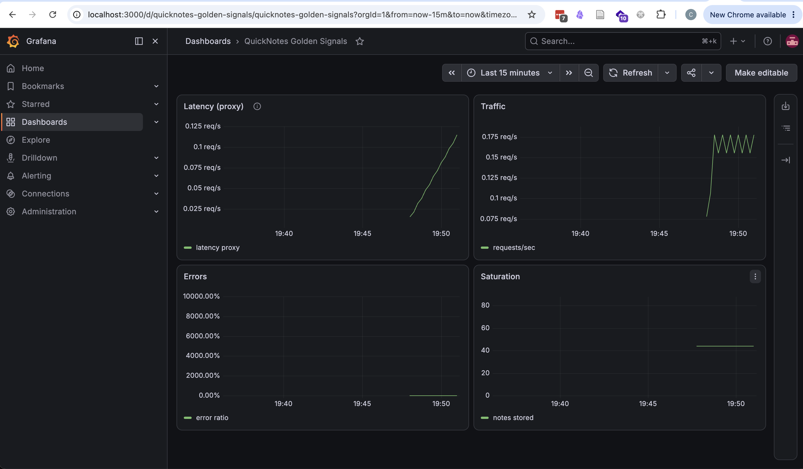
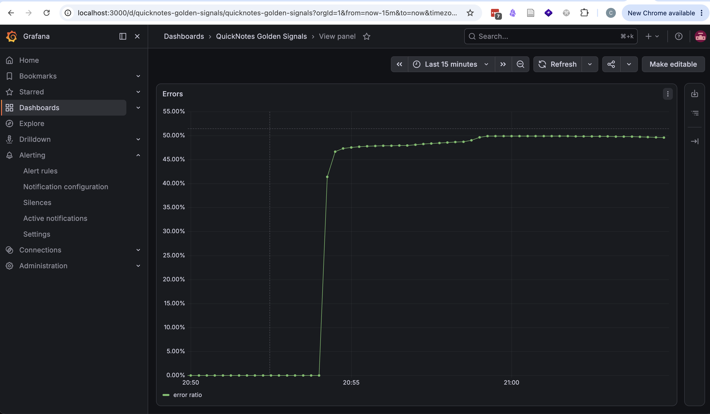
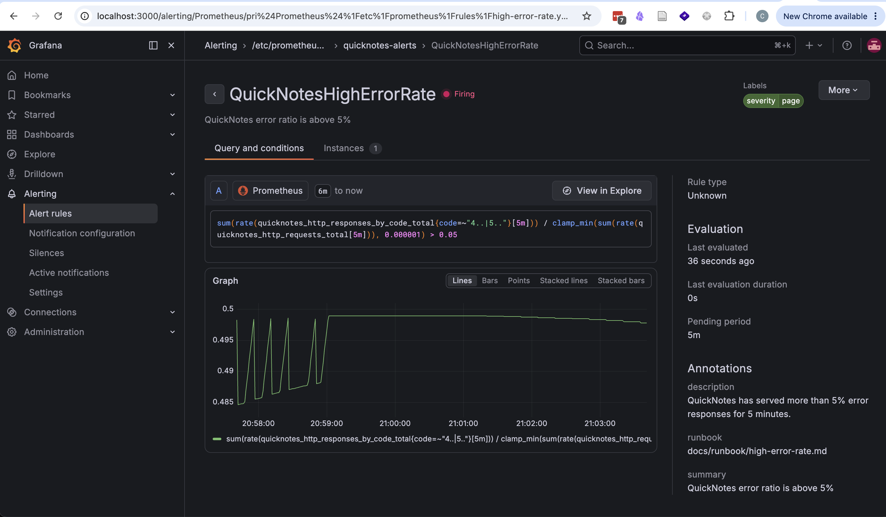

# Lab 8 Submission

## Task 1 — Prometheus + Grafana with a Provisioned Dashboard

### Config files

- [compose.yaml](../compose.yaml)
- [monitoring/prometheus/prometheus.yml](../monitoring/prometheus/prometheus.yml)
- [monitoring/grafana/provisioning/datasources/datasource.yml](../monitoring/grafana/provisioning/datasources/datasource.yml)
- [monitoring/grafana/provisioning/dashboards/dashboard.yml](../monitoring/grafana/provisioning/dashboards/dashboard.yml)
- [monitoring/grafana/provisioning/dashboards/golden-signals.json](../monitoring/grafana/provisioning/dashboards/golden-signals.json)

### What was added

- Prometheus `v3.4.2` with a single `quicknotes` scrape job targeting `quicknotes:8080` every 15 seconds.
- Grafana `13.1.0` with a provisioned Prometheus datasource and a provisioned dashboard named `QuickNotes Golden Signals`.
- Four dashboard panels:
  - `Latency (proxy)` using `sum(rate(quicknotes_http_requests_total[5m]))` because QuickNotes does not expose a latency histogram yet.
  - `Traffic` using `sum(rate(quicknotes_http_requests_total[1m]))`.
  - `Errors` using `(4xx + 5xx) / total` over 5 minutes.
  - `Saturation` using `quicknotes_notes_total`.

### Verification

Stack state after `docker compose up -d --build`:

```text
NAME                        IMAGE                    SERVICE      STATUS                        PORTS
devops-intro-grafana-1      grafana/grafana:13.1.0  grafana      Up About a minute             0.0.0.0:3000->3000/tcp
devops-intro-prometheus-1   prom/prometheus:v3.4.2  prometheus   Up About a minute             0.0.0.0:9090->9090/tcp
devops-intro-quicknotes-1   quicknotes:lab6         quicknotes   Up About a minute (healthy)   0.0.0.0:8080->8080/tcp
```

I generated more than 200 mixed requests against QuickNotes: `120x GET /notes`, `40x GET /notes/999999` (intentional `404`), and `40x POST /notes` with valid JSON.

Prometheus target health:

```text
"health":"up"
```

Grafana dashboard auto-provisioning proof via API:

```text
quicknotes-golden-signals
```

Example live query values from Prometheus after traffic generation:

```text
Latency proxy: 0.023733646520512647
Traffic:       0.12782229404055884
Errors:        0
Saturation:    44
```

Grafana dashboard screenshot:

 

### Design answers

#### - a) **Pull vs push:** Prometheus pulls. What does that mean for *which side* (Prometheus or QuickNotes) needs to be reachable? What's the failure mode if Prometheus can't reach QuickNotes?

Prometheus uses a pull model, which means Prometheus must be able to reach QuickNotes over the network and fetch `/metrics` itself. QuickNotes does not initiate any connection to Prometheus. If Prometheus cannot reach QuickNotes, the failure mode is not that the app stops serving users; the failure mode is observability loss: the target becomes `down`, the `up` metric drops to `0`, and the dashboard and alerts lose fresh data.

#### b) **`scrape_interval: 15s`** is a default. What query problems do you create by setting it to `5s`? To `5m`?

At `5s`, you create much higher storage churn and more scrape overhead for very little value in a small service like QuickNotes. You also make dashboards noisier because short-window `rate()` calculations react to small counter changes more sharply. At `5m`, you go too far the other way: dashboards and alerts become sluggish, short incidents get smoothed away, and a 5-minute alert window may need two full scrape points before it even has enough data to show the trend clearly. 15 seconds is a practical middle ground for a small stack.

#### c) **PromQL `rate()` vs `irate()` vs `delta()`** — which one is right for the Traffic panel and why?

`rate()` is the right choice for the Traffic panel because `quicknotes_http_requests_total` is a counter and the panel should show a stable requests-per-second trend over a time window. `irate()` is more volatile because it only uses the last two samples, which is better for very spiky near-instant inspection than for a default dashboard panel. `delta()` is wrong here because it returns the raw increase over the range rather than a per-second rate, and it is not the standard way to visualize traffic from a counter.

#### d) **Why provision Grafana from files** instead of clicking through the UI on every fresh stack?

Provisioning Grafana from files makes the monitoring stack reproducible, reviewable, and version-controlled. A fresh `docker compose up` gets the same datasource and dashboard every time without manual UI clicks. That also means changes to queries, panel titles, or datasource wiring go through normal Git review instead of living as undocumented state inside one developer's local Grafana volume.

## Task 2 — One Good Alert + Runbook

### Alert rule definition

Rule file:

- [monitoring/prometheus/rules/high-error-rate.yml](../monitoring/prometheus/rules/high-error-rate.yml)

```yaml
groups:
  - name: quicknotes-alerts
    rules:
      - alert: QuickNotesHighErrorRate
        expr: |
          sum(rate(quicknotes_http_responses_by_code_total{code=~"4..|5.."}[5m]))
            /
          clamp_min(sum(rate(quicknotes_http_requests_total[5m])), 0.000001)
            > 0.05
        for: 5m
        labels:
          severity: page
        annotations:
          summary: QuickNotes error ratio is above 5%
          description: QuickNotes has served more than 5% error responses for 5 minutes.
          runbook: docs/runbook/high-error-rate.md
```

This is a symptom alert because it pages on user-visible failures, not on a low-level host metric.

### Trigger method

I triggered the alert with sustained mixed traffic for more than 7 minutes:

- healthy traffic: repeated `GET /notes`
- failing traffic: repeated malformed `POST /notes` requests, which QuickNotes correctly returned as `400`

This produced a sustained error ratio close to `0.49`, well above the `0.05` threshold.

### Observed alert transition

Prometheus API samples during the run:

```text
2026-06-30T17:54:01Z state=inactive ratio=0 ok=1 bad=1
2026-06-30T17:55:01Z state=inactive ratio=0.47702171072953575 ok=2213 bad=2213
2026-06-30T17:56:01Z state=pending ratio=0.4804334754537703 ok=4474 bad=4474
2026-06-30T17:57:01Z state=pending ratio=0.4813993459198989 ok=6716 bad=6716
2026-06-30T17:58:01Z state=pending ratio=0.4856468217381693 ok=8961 bad=8961
2026-06-30T17:59:01Z state=pending ratio=0.49826494689064627 ok=11192 bad=11192
2026-06-30T18:00:01Z state=pending ratio=0.4989169335091354 ok=13362 bad=13362
2026-06-30T18:01:01Z state=pending ratio=0.49891386475255 ok=15604 bad=15604
```

Final alert API output in `firing` state:

```json
{
  "status": "success",
  "data": {
    "alerts": [
      {
        "labels": {
          "alertname": "QuickNotesHighErrorRate",
          "severity": "page"
        },
        "annotations": {
          "description": "QuickNotes has served more than 5% error responses for 5 minutes.",
          "runbook": "docs/runbook/high-error-rate.md",
          "summary": "QuickNotes error ratio is above 5%"
        },
        "state": "firing",
        "activeAt": "2026-06-30T17:55:04.682872047Z",
        "value": "4.989169335091354e-01"
      }
    ]
  }
}
```

Prometheus rule state at firing time:

```text
state: firing
severity: page
runbook: docs/runbook/high-error-rate.md
lastEvaluation: 2026-06-30T18:01:04.658174793Z
```

### Screenshots:


Error ratio dashboard


Firing an alert

### Runbook

Runbook file:

- [docs/runbook/high-error-rate.md](../docs/runbook/high-error-rate.md)

```markdown
# High Error Rate

## What this alert means

QuickNotes is returning more than 5% `4xx` and `5xx` responses for at least 5 minutes, which indicates sustained user-visible failures.

## Triage steps

1. Open Prometheus or Grafana and confirm the alert is real by checking the current error ratio together with request traffic volume.
2. Split the failing traffic by status code and endpoint to determine whether the spike is mostly client errors (`400`/`404`) or server-side failures (`500`).
3. Check recent QuickNotes container logs and `docker compose ps` to confirm the application is still healthy and has not restarted unexpectedly.
4. Compare the Errors panel with the Traffic and Saturation panels to see whether the incident lines up with a traffic spike, data growth, or a specific request pattern.

## Mitigations

1. Stop the bleeding by throttling or blocking the failing request pattern if one bad client or script is generating malformed traffic.
2. Roll back the most recent QuickNotes configuration or image change if the error spike started immediately after a deploy.
3. If the data file is corrupted or the app is unhealthy, restart the QuickNotes container and validate `/health` before sending more traffic.

## Post-incident

Write a blameless postmortem with timeline, root cause, customer impact, and follow-up actions. You can use the course guidance in [Lecture 1](../../lectures/lec1.md) under the blameless postmortem section as the template baseline.
```

### Design answers

#### e) **Why "sustained for 5 minutes" instead of "fire immediately on first bad request"?**

Because one bad request is not enough evidence of a user-impacting incident. A single malformed request, a browser refresh race, or one client bug can create isolated `4xx` responses without meaning the service is degraded for everyone else. Requiring the breach to persist for 5 minutes filters out transient spikes and pages only when the symptom is sustained long enough to deserve human interruption.

#### f) **Symptom alerts vs cause alerts:** the alert above is a symptom alert. What's an example of a *cause* alert someone might write for QuickNotes? Why is it worse?

A cause alert would be something like `container_cpu_usage > 80%` or `memory usage > 90%` on the QuickNotes container. That is worse because it pages on an implementation detail instead of on what users actually experience. High CPU might be harmless during a short burst, and low CPU does not guarantee the service is healthy. Symptom alerts are better because they tie directly to failing requests or latency that users can feel.

#### g) **Alert fatigue:** Lecture 8 cited it as the bigger danger than too few alerts. What's a quantitative threshold that would mean your alert is too noisy?

If roughly 20% or more of pages turn out to be false positives or non-actionable, the alert is too noisy and should be redesigned. That means one in five wake-ups did not correspond to real user harm, which is already enough to train responders to distrust the signal. For a paging alert, the expected false-positive rate should be much lower than that.