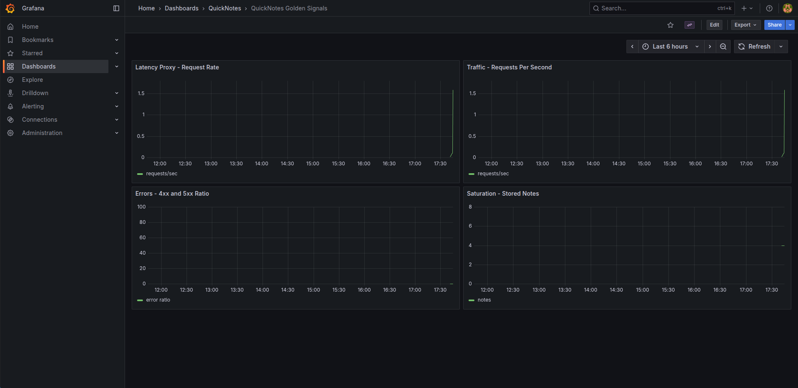

# Lab 8 Submission

## Task 1 - Prometheus + Grafana with a Provisioned Dashboard

### Config files

- Prometheus scrape config: [`monitoring/prometheus/prometheus.yml`](../monitoring/prometheus/prometheus.yml)
- Grafana Prometheus datasource provisioning: [`monitoring/grafana/provisioning/datasources/datasource.yml`](../monitoring/grafana/provisioning/datasources/datasource.yml)
- Grafana dashboard provider provisioning: [`monitoring/grafana/provisioning/dashboards/dashboard.yml`](../monitoring/grafana/provisioning/dashboards/dashboard.yml)
- Grafana golden signals dashboard JSON: [`monitoring/grafana/dashboards/golden-signals.json`](../monitoring/grafana/dashboards/golden-signals.json)

The Compose extension is in [`compose.yaml`](../compose.yaml). It adds:

- `prometheus` on `localhost:9090`, scraping QuickNotes at `quicknotes:8080`
- `grafana` on `localhost:3000`, loading provisioning from `monitoring/grafana/provisioning`
- Dashboard JSON mounted from `monitoring/grafana/dashboards`

### Grafana dashboard screenshot



### Prometheus target health

Command:

```bash
curl -s http://localhost:9090/api/v1/targets | jq '.data.activeTargets[].health'
```

Output:

```text
"up"
```

### Design questions

#### a. Pull vs push

Prometheus uses a pull model, so Prometheus must be able to reach the QuickNotes service over the Compose network. QuickNotes only needs to expose `/metrics`; it does not send metrics to Prometheus itself.

If Prometheus cannot reach QuickNotes, the scrape target becomes `down`, new QuickNotes samples stop arriving, and dashboard panels based on those metrics become stale or empty.

#### b. `scrape_interval: 15s`

A `15s` scrape interval is a reasonable default because it gives enough resolution for short service behavior without creating too much time-series load.

Setting it to `5s` creates more samples, more storage usage, and more query work. It can also make short-window graphs look noisy if the application traffic is low.

Setting it to `5m` loses too much detail. Short incidents may be missed or appear very late, and `rate()` queries over normal dashboard windows become less useful because there are fewer samples to calculate from.

#### c. `rate()` vs `irate()` vs `delta()`

The Traffic panel should use `rate()` because `quicknotes_http_requests_total` is a counter. `rate()` calculates the per-second average increase over a time window and smooths normal scrape-to-scrape variation.

`irate()` uses only the last two samples, so it is better for very spiky, near-instant graphs but is too noisy for a main traffic panel. `delta()` gives the raw change over a window, not a per-second request rate, so it is less appropriate for traffic.

#### d. Why provision Grafana from files?

Provisioning Grafana from files makes the dashboard repeatable and reviewable. A fresh `docker compose up` can recreate the datasource and dashboard without manual clicking in the UI.

It also means dashboard changes can be versioned in Git, reviewed in a PR, and reused by anyone running the stack.
