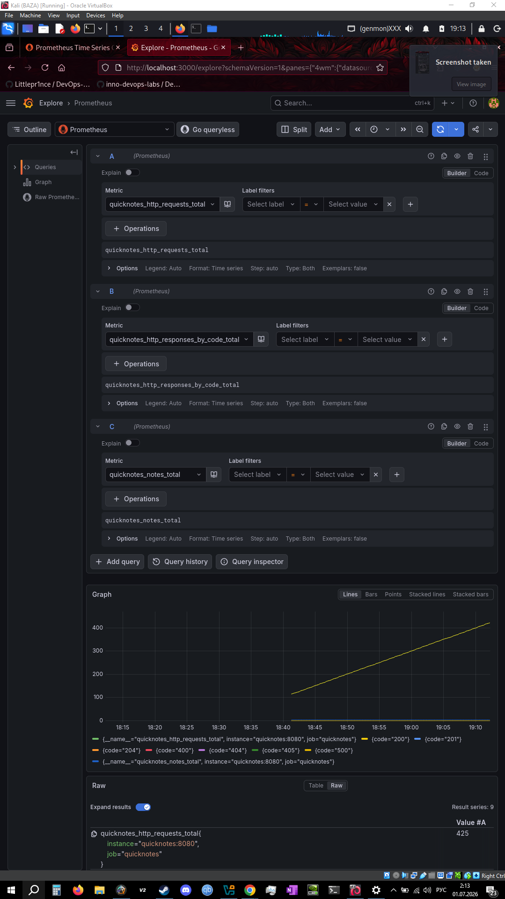
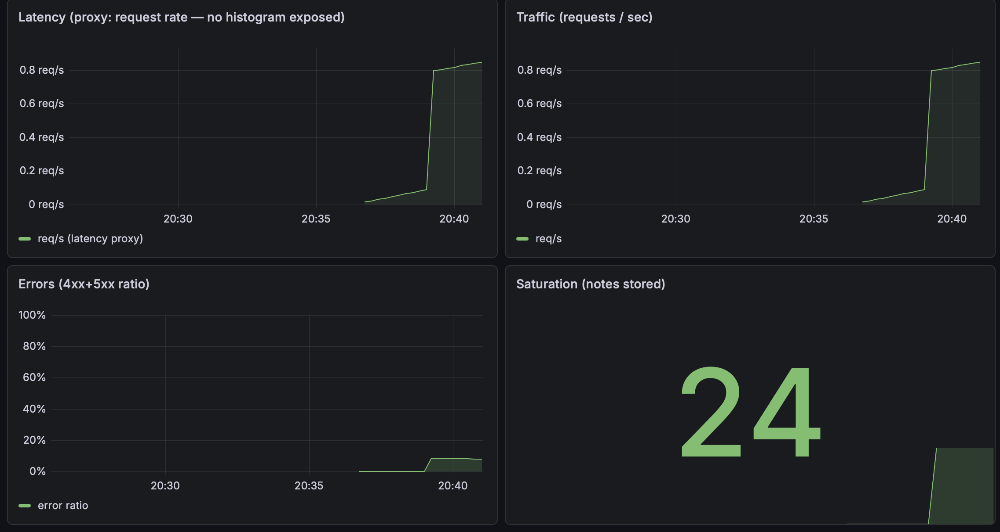
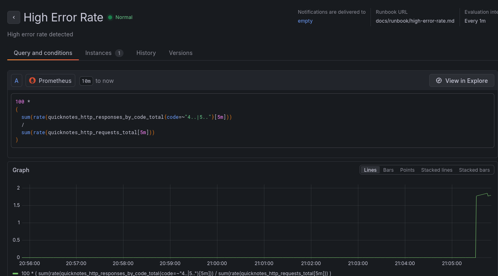
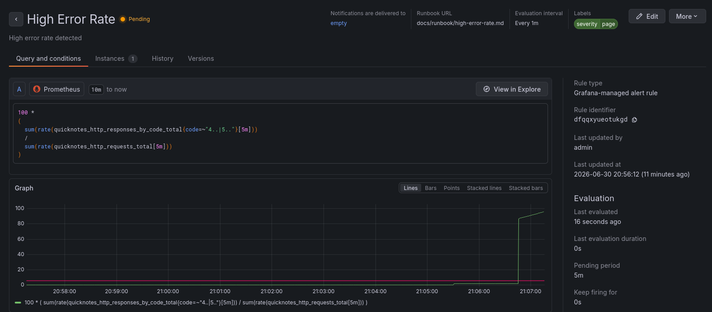
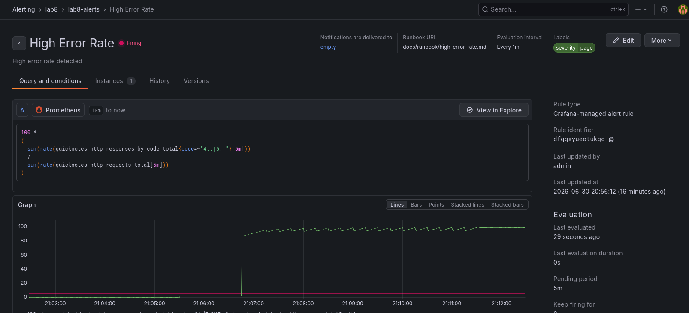

# Lab 8 submission

# Lab 8

## Task 1 — Prometheus + Grafana with a Provisioned Dashboard

### 1.1 Environment preparation

This lab extends the Lab 6 Docker Compose stack by adding Prometheus and Grafana.

The objective was to collect QuickNotes metrics, provision Grafana automatically,
and build a dashboard containing the four golden signals.

Project structure:
```text
monitoring/
├── prometheus
│   └── prometheus.yml
└── grafana
    ├── dashboards
    │   └── golden-signals.json
    └── provisioning
        ├── dashboards
        │   └── dashboard.yml
        └── datasources
            └── datasource.yml
```
### 1.2 Prometheus configuration

monitoring/prometheus/prometheus.yml configuration:
```yaml
global:
  scrape_interval: 15s

scrape_configs:
  - job_name: quicknotes
    static_configs:
      - targets:
          - quicknotes:8080
```
The QuickNotes service is scraped every 15 seconds using the Compose service name.

### 1.3 Grafana provisioning

Datasource configuration:
```yaml
apiVersion: 1
datasources:
  - name: Prometheus
    type: prometheus
    access: proxy
    url: http://prometheus:9090
    isDefault: true
    editable: false
```

Dashboard provider:
```yaml
apiVersion: 1
providers:
  - name: Golden Signals
    orgId: 1
    folder: ""
    type: file
    disableDeletion: false
    editable: true

    options:
      path: /var/lib/grafana/dashboards
```
The dashboard JSON is automatically loaded from:
```text
/var/lib/grafana/dashboards/golden-signals.json
```

### 1.4 Compose integration

Prometheus and Grafana were added to the existing Lab 6 compose stack.
Verification:
```bash
┌──(p4in㉿kali)-[~/Desktop/DevOps-Intro]
└─$ docker-compose ps  
NAME                        IMAGE                    COMMAND                  SERVICE      CREATED             STATUS                       PORTS
devops-intro-grafana-1      grafana/grafana:13.0.3   "/run.sh"                grafana      49 minutes ago      Up 49 minutes                0.0.0.0:3000->3000/tcp, [::]:3000->3000/tcp
devops-intro-prometheus-1   prom/prometheus:v3.5.0   "/bin/prometheus --c…"   prometheus   About an hour ago   Up About an hour             0.0.0.0:9090->9090/tcp, [::]:9090->9090/tcp
devops-intro-quicknotes-1   quicknotes:lab6          "/quicknotes"            quicknotes   About an hour ago   Up About an hour (healthy)   0.0.0.0:8080->8080/tcp, [::]:8080->8080/tcp
```
All monitoring services started successfully.

### 1.5 Verify Prometheus scraping

Command:
```bash
┌──(p4in㉿kali)-[~/Desktop/DevOps-Intro]
└─$ curl -s http://localhost:9090/api/v1/targets | jq '.data.activeTargets[].health'
"up"
```
This confirms that Prometheus successfully scrapes QuickNotes metrics.

### 1.6 Golden Signals Dashboard

The dashboard was provisioned automatically during Grafana startup.
Panels:

| Signal | Query |
|----------|----------|
| Latency (Proxy) | `rate(quicknotes_http_requests_total[1m])` |
| Traffic | `rate(quicknotes_http_requests_total[1m])` |
| Error Ratio | `100 * (sum(rate(quicknotes_http_responses_by_code_total{code=~"4..|5.."}[5m])) / sum(rate(quicknotes_http_requests_total[5m])))` |
| Saturation | `quicknotes_notes_total` |

The application does not expose request-duration histograms, therefore the request rate metric is used as the latency proxy allowed by the lab specification.

Metric exploration screenshot:


### Dashboard Provisioning Verification

The dashboard was initially created as a placeholder JSON file and then updated using the Grafana UI.
The final dashboard configuration was exported from Grafana (Settings → JSON Model) and saved.

### Configuration Files

- [monitoring/prometheus/prometheus.yml](../monitoring/prometheus/prometheus.yml)
- [monitoring/grafana/provisioning/datasources/datasource.yml](../monitoring/grafana/provisioning/datasources/datasource.yml)
- [monitoring/grafana/provisioning/dashboards/dashboard.yml](../monitoring/grafana/provisioning/dashboards/dashboard.yml)
- [monitoring/grafana/dashboards/golden-signals.json](../monitoring/grafana/dashboards/golden-signals.json)

### 1.7 Generate traffic and verify

Traffic was generated against QuickNotes using repeated requests:
```bash
┌──(p4in㉿kali)-[~/Desktop/DevOps-Intro]
└─$ for i in $(seq 1 200); do
  curl -s http://localhost:8080/notes >/dev/null
done
```
After generating traffic:
- Prometheus target status remained UP.
- Traffic and Latency (Proxy) panels showed a visible increase.
- Error ratio remained near 0%.
- Saturation remained stable.
Dashboard screenshot:


### 1.8 Design questions

#### a) Pull vs push: Prometheus pulls. What does that mean for which side (Prometheus or QuickNotes) needs to be reachable? What's the failure mode if Prometheus can't reach QuickNotes?

Prometheus uses a pull model.
Prometheus initiates requests to QuickNotes and retrieves metrics from `/metrics`.
QuickNotes does not send metrics anywhere.
If Prometheus cannot reach QuickNotes, scraping fails and the target becomes DOWN.

#### b) scrape_interval: 15s is a default. What query problems do you create by setting it to 5s? To 5m?

A 5-second scrape interval provides more detailed data but increases storage usage,
network traffic, and query cost.
A 5-minute scrape interval reduces storage consumption but may miss short incidents
and delays alert detection.
The default value of 15 seconds provides a good balance.

#### c) PromQL rate() vs irate() vs delta() — which one is right for the Traffic panel and why?

- `rate()` is the correct choice for the Traffic panel because it calculates a stable average request rate over time.
- `irate()` reacts more aggressively to short-term spikes and is better suited for debugging.
- `delta()` measures the absolute counter increase and is generally not appropriate for request-rate dashboards.

#### d) Why provision Grafana from files instead of clicking through the UI on every fresh stack?

Provisioning allows dashboards and datasources to be version controlled alongside application code.
A fresh deployment automatically receives identical monitoring configuration without manual UI setup.
This approach improves reproducibility and prevents configuration drift.


# Task 2 — Alert Rule and Runbook

## 2.1 Runbook

Runbook created for the alert:
```
# High Error Rate
## Summary
This alert indicates that more than 5% of HTTP requests are returning 4xx or 5xx responses for at least 5 minutes.

## Detection
Check the Grafana Golden Signals dashboard:
- Error Ratio
- Traffic
- Saturation
Verify the current error rate and identify whether errors are client-side (4xx) or server-side (5xx).

## Investigation
Inspect application logs:
docker-compose logs quicknotes

Inspect container health:
docker-compose ps

Verify Prometheus target status:
curl -s http://localhost:9090/api/v1/targets | jq .

## Mitigation
- Restart QuickNotes if the service is unhealthy.
- Investigate recent code or configuration changes.
- Reduce malformed client traffic if excessive 4xx responses are observed.

## Escalation
Severity: page
Escalate if the error rate remains above threshold after mitigation attempts.

## Post-incident
After the error ratio is back under 5% and stable, write a blameless postmortem (what happened, why, and what changes) with timeline, root cause, what detected it and follow-up actions.
```
- [`docs/runbook/high-error-rate.md`](../docs/runbook/high-error-rate.md)

## 2.2 Alert Rule
Alert name:
```text
High Error Rate
```
PromQL expression:
```promql
100 *
(
  sum(rate(quicknotes_http_responses_by_code_total{code=~"4..|5.."}[5m]))
  /
  sum(rate(quicknotes_http_requests_total[5m]))
)
```
Alert condition:
```text
Error ratio > 5%
for 5 minutes
```
Labels:
```text
severity=page
```
Runbook URL:
```text
docs/runbook/high-error-rate.md
```
Evaluation interval:
```text
1 minute
```

## 2.3 Alert Verification
A stream of invalid requests was generated to intentionally increase the HTTP error rate.
My command:
```bash
┌──(p4in㉿kali)-[~/Desktop/DevOps-Intro]
└─$ while true; do
  for i in $(seq 1 100); do
    curl -s -X POST http://localhost:8080/notes >/dev/null
  done
  sleep 1
done
```
The alert transitioned through:
```text
Normal → Pending → Firing
```
Alert firing screenshot:




The alert successfully triggered after the error ratio remained above the configured threshold for longer than the 5-minute pending period.

### 2.4 Design questions

#### e) Why "sustained for 5 minutes" instead of "fire immediately on first bad request"?

A single failed request does not necessarily indicate a real service problem.
Occasional client mistakes, network glitches, or malformed requests can generate
isolated errors without affecting overall service health.
Requiring the error ratio to remain above the threshold for 5 minutes reduces false positives and ensures that operators are only paged for persistent issues that are likely impacting users.

#### f) Symptom alerts vs cause alerts: the alert above is a symptom alert. What's an example of a cause alert someone might write for QuickNotes? Why is it worse?

An example of a cause alert would be:
```text
Disk usage on the Docker volume exceeds 80%
```
or
```text
Container memory usage exceeds 500 MB
```
These alerts focus on a possible cause rather than an observed user impact.
Cause alerts are usually worse because they require assumptions about how the system behaves.
High memory usage or disk usage may not actually affect users,
while a high error ratio directly indicates degraded service quality.
Symptom alerts measure what users experience, making them more reliable indicators for paging.

#### g) Alert fatigue: Lecture 8 cited it as the bigger danger than too few alerts. What's a quantitative threshold ("page X% of the time the user wasn't actually affected") that would mean your alert is too noisy?

If more than 20% of pages occur without any meaningful user impact, the alert is too noisy.
At that point engineers begin to lose trust in the alert, increasing the risk that real incidents will be ignored or acknowledged slowly.
An effective paging alert should have a low false-positive rate and should usually indicate a genuine user-facing problem.
