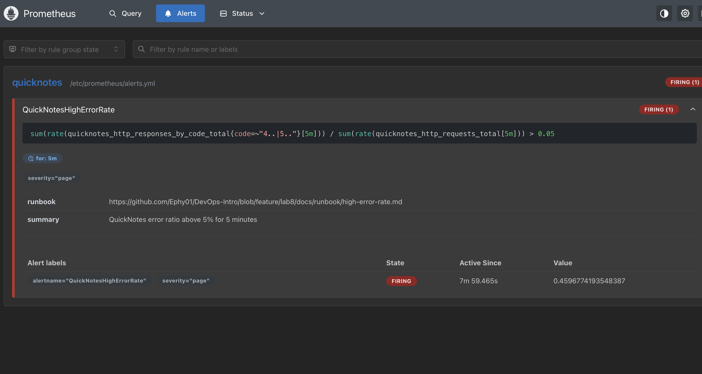

# Lab 8 — SRE & Monitoring: Golden Signals + One Good Alert

> Lab was done on My MacBook Air M4. I extended the Lab 6 Compose stack with
> Prometheus v3.11.2 and Grafana 13.0.2. QuickNotes exposes counters and a gauge
> but no latency histogram, so the Latency panel is a request-rate proxy.

What I have done?

---

## Task 1 — Prometheus + Grafana with dashboard

### prometheus/prometheus.yml

```
global:
  scrape_interval: 15s

rule_files:
  - alerts.yml

scrape_configs:
  - job_name: quicknotes
    static_configs:
      - targets: ['quicknotes:8080']
```

### grafana/provisioning/datasources/datasource.yml

```
apiVersion: 1
datasources:
  - name: Prometheus
    uid: prometheus
    type: prometheus
    access: proxy
    url: http://prometheus:9090
    isDefault: true
```

### grafana/provisioning/dashboards/dashboard.yml

```
apiVersion: 1
providers:
  - name: golden-signals
    type: file
    disableDeletion: false
    updateIntervalSeconds: 10
    options:
      path: /etc/grafana/provisioning/dashboards
      foldersFromFilesStructure: false
```

### grafana/provisioning/dashboards/golden-signals.json

The full dashboard JSON is in the repo at
`monitoring/grafana/provisioning/dashboards/golden-signals.json`.
 Four panels, one per golden signal:

- **Latency** (proxy) — `sum(rate(quicknotes_http_requests_total[1m]))` 
- **Traffic** — `sum(rate(quicknotes_http_requests_total[5m]))`
- **Errors** — `sum(rate(quicknotes_http_responses_by_code_total{code=~"4..|5.."}[5m])) / sum(rate(quicknotes_http_requests_total[5m]))`
- **Saturation** — `quicknotes_notes_total`

### Compose 

```
  prometheus:
    image: prom/prometheus:v3.11.2
    container_name: prometheus
    command:
      - --config.file=/etc/prometheus/prometheus.yml
    volumes:
      - ./monitoring/prometheus:/etc/prometheus:ro
    ports:
      - "9090:9090"
    depends_on:
      quicknotes:
        condition: service_healthy
    restart: unless-stopped

  grafana:
    image: grafana/grafana:13.0.2
    container_name: grafana
    environment:
      GF_SECURITY_ADMIN_USER: admin
      GF_SECURITY_ADMIN_PASSWORD: "${GRAFANA_PASSWORD:-please-change-me}"
    volumes:
      - ./monitoring/grafana/provisioning:/etc/grafana/provisioning:ro
    ports:
      - "3000:3000"
    depends_on:
      - prometheus
    restart: unless-stopped
```

### Prometheus target is up

```text
ephy@Starless-night DevOps-Intro % curl -s http://localhost:9090/api/v1/targets | jq '.data.activeTargets[].health'

"up"
```

### Dashboard with traffic


### Design questions

**a) Pull vs push — which side has to be reachable, and the failure mode.**
Prometheus pulls, so it's Prometheus that has to reach QuickNotes — not the other
way round. 

QuickNotes is just exposing
`/metrics`. So if Prometheus can't reach it, the target flips to `up == 0`:
scrapes fail, panels go to gaps / "No data" = lose of visibility. But the app
keeps working — monitoring is down, not QuickNotes. 
I'd catch it from
the `up` check and the `/targets` page.

**b) `scrape_interval: 15s` — what breaks at 5s? at 5m?**
At 5s I'd hit `/metrics` 3x as often — 3x the samples to store,
more load on the app — for basically no extra signal, since these metrics don't
move that fast and `rate()` gets noisier on tiny windows. At 5m it's the opposite:
too sparse. Short spikes slip between scrapes, `rate()` and the alert react slow. For example:  3-min error burst might never get sampled enough to fire
15s is the sweet spot.

**c) `rate()` vs `irate()` vs `delta()**

`rate()` — per-second average over the window, smoothed, made for counters.
That's exactly Traffic: requests are a counter and I want the smooth req/s trend.
`irate()` only looks at the last two samples — too spiky for a dashboard
line. `delta()` is for gauges (absolute change) and doesn't handle counter resets,
so it's just wrong here. So `rate()` is the answer for traffic.

**d) Why provision Grafana from files instead of clicking the UI.**
Because clicks don't survive anything. Provisioning from files means a fresh
stack — CI, a teammate, disaster recovery — comes up with the same datasource and
dashboards on its own, all version-controlled and reviewable in git. So it is ablout reproduciability. 

---

## Task 2 — One good alert + runbook

### Alert rule:

```
groups:
  - name: quicknotes
    rules:
      - alert: QuickNotesHighErrorRate
        expr: |
          sum(rate(quicknotes_http_responses_by_code_total{code=~"4..|5.."}[5m]))
          /
          sum(rate(quicknotes_http_requests_total[5m]))
          > 0.05
        for: 5m
        labels:
          severity: page
        annotations:
          summary: "QuickNotes error ratio above 5% for 5 minutes"
          runbook: "https://github.com/Ephy01/DevOps-Intro/blob/feature/lab8/docs/runbook/high-error-rate.md"
```

### Alert Firing



### Runbook with explantions

```

To whom might read this at 3AM


## What does this error even mean?
QuickNotes is returning 4xx/5xx for more than 5% of requests, sustained over
5 minutes - users are seeing failures right now.

## Triage steps
1. Confirm scope in Grafana -> "QuickNotes - Golden Signals" -> Errors panel
   (http://localhost:3000): is the ratio still climbing?
2. Break down by status code in Prometheus:
   `sum by (code) (rate(quicknotes_http_responses_by_code_total[5m]))`.
   5xx = server fault; 4xx = bad client input or a broken deploy contract.
3. Check the app is alive: `docker compose ps` (is `quicknotes` healthy?),
   `curl -s localhost:8080/health`, and `docker compose logs --tail=100 quicknotes`.
4. Correlate with changes: any deploy/config change in the last 30 min?

## How to mitigate
- Roll back the last image/config: `docker compose down`, restore the last good
  `compose.yaml`/image, `docker compose up -d --build`.
- Shed the bad source: if one client/IP floods malformed requests, block it at the
  proxy; if a feature faults, revert that change.
- If saturation-driven (disk/data dir full), free space and restart the container
  to restore service while you investigate.

## After it calms down
- When the error ratio holds under 5% for 10+ minutes, resolve the alert.
- Writepostmortem: timeline, root cause, what
  detection/mitigation worked, action items. 

```

### Design questions

**e) Why "sustained for 5 minutes" instead of firing on the first bad request.**
Because firing on the first bad request would trigger me for every trifle — one client
sending garbage, a momentary spike, a single failed healthcheck — stuff that fixes
itself in seconds. The `for: 5m` gate trades a bit of detection latency for way
fewer false pages, so when it does page it's a real, ongoing problem users
actually feel.

**f) Symptom vs cause alert.**
My error-ratio alert is a symptom alert — it watches what users actually get. A cause alert for QuickNotes would be something like
"CPU > 80%" or "disk 90% full". Those are worse because high CPU does not
necessarily mean anyone  is hurting (could be headroom, a batch job) — so you page
on non-problems AND still miss real user-facing failures that don't move that one
metric. Alert on what users feel, not on proxies.

**g) Alert fatigue**
Quick rule I'd use: if more than about half the pages are non-actionable — user
wasn't actually affected, nobody did anything — the alert is too noisy and needs
retuning. Google
SRE frames it as keeping precision high; a low-precision pager just trains everyone
to ignore it, which is more dangerous than having too few alerts.

---

## Bonus Task — Synthetic monitoring 

I created public URL via `cloudflared tunnel --url http://localhost:8080`, then a Checkly
API check on `/health`, every 1 min, from 2 regions (Frankfurt + Singapore),
asserting status 200 and response timeout = 2 s. I left it running from 5:10AM to 5:45AM. 

| | Prometheus (inside Compose net) | Checkly (2 regions) |
|--|---|---|
| Avg latency p50 | `not available` | 236ms (Frank), 779ms(Sing) |
| Avg latency p95 | `not available` | 1.335ms(Frank), 1.2s(Sing)|
| Errors observed | 0 | 0 |

**Analysis.**
Checkly catches stuff Prometheus simply can't see: DNS errors, TLS/cert problems,
the tunnel being down, regional network issues, or the whole box being
offline. Prometheus lives inside that very same box, so if it dies it dies quietly with
it. 

Prometheus catches what Checkly can't: internal per-endpoint error ratios, the
per-code breakdown, metrics like notes_total.

External(checky) is the users like  view.
Internal is the system view. 

Bacically, nice to have both of them Checkly tells  _that_
users feel pain, Prometheus tells me _why_.
