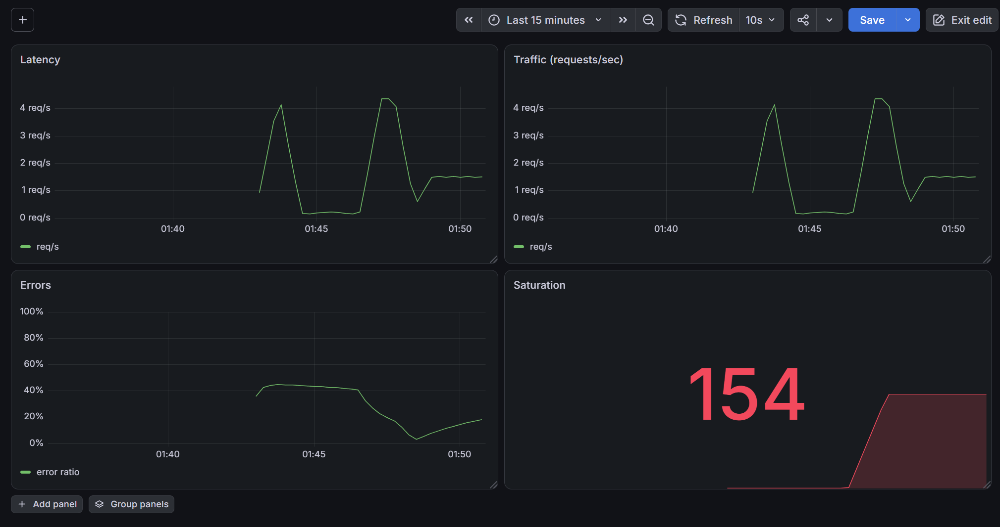
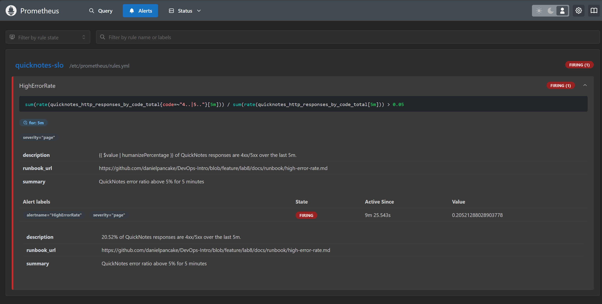

# Lab 8: SRE & Monitoring: Golden Signals Dashboard + One Good Alert

## Task 1: Prometheus + Grafana with a Provisioned Dashboard

### Config files

```text
monitoring/
├── prometheus/
│   ├── prometheus.yml
│   └── rules.yml
└── grafana/
    ├── provisioning/
    │   ├── datasources/datasource.yml
    │   └── dashboards/dashboard.yml
    └── dashboards/golden-signals.json
```

**`monitoring/prometheus/prometheus.yml`**

```yaml
global:
  scrape_interval: 15s

rule_files:
  - /etc/prometheus/rules.yml

scrape_configs:
  - job_name: quicknotes
    static_configs:
      - targets: ["quicknotes:8080"]
```

**`monitoring/grafana/provisioning/datasources/datasource.yml`**

```yaml
apiVersion: 1
datasources:
  - name: Prometheus
    type: prometheus
    uid: prometheus
    access: proxy
    url: http://prometheus:9090
    isDefault: true
```

**`monitoring/grafana/provisioning/dashboards/dashboard.yml`**

```yaml
apiVersion: 1
providers:
  - name: golden-signals
    type: file
    options:
      path: /var/lib/grafana/dashboards
```

**`monitoring/grafana/dashboards/golden-signals.json`** has four panels, one per golden signal:

| Golden signal | Query |
|---|---|
| Latency (proxy, no duration histogram exposed) | `rate(quicknotes_http_requests_total[1m])` |
| Traffic | `rate(quicknotes_http_requests_total[1m])` |
| Errors | `sum(rate(quicknotes_http_responses_by_code_total{code=~"4..\|5.."}[5m])) / sum(rate(quicknotes_http_responses_by_code_total[5m]))` |
| Saturation | `quicknotes_notes_total` (gauge) |

**Latency note:** QuickNotes' `/metrics` only exposes counters and gauges, no `_bucket`
histogram, so real request-duration percentiles are not available. As the lab allows, the
request rate is used as the latency proxy.

**Compose extension** (`compose.yaml`) adds two services:

- `prometheus`: image `prom/prometheus:v3.1.0`, mounts `prometheus.yml` and `rules.yml`
  read-only, publishes port 9090, `depends_on: quicknotes (condition: service_healthy)`.
- `grafana`: image `grafana/grafana:13.1.0`, mounts the provisioning and dashboards folders
  read-only, reads `GF_SECURITY_ADMIN_*` from the environment (no committed password),
  publishes port 3000, `depends_on: prometheus`.

### Verification

Target health (`up == 1`):

```text
$ curl -s "localhost:9090/api/v1/query?query=up"
{"status":"success","data":{"resultType":"vector","result":[
  {"metric":{"__name__":"up","instance":"quicknotes:8080","job":"quicknotes"},"value":[...,"1"]}]}}
```

Grafana provisioned both the data source and the dashboard:

```text
curl -s -u admin:$PW localhost:3000/api/datasources   -> name "Prometheus", uid "prometheus", isDefault true
curl -s -u admin:$PW localhost:3000/api/search?query=Golden -> uid "golden-signals"
curl -s -u admin:$PW localhost:3000/api/health        -> {"database":"ok","version":"13.1.0"}
```



### Design questions

**a) Pull vs push.** Prometheus pulls. It starts the scrape, so QuickNotes has to be
reachable by Prometheus on the right host and port. The other direction does not matter.
If Prometheus cannot reach QuickNotes, the scrape fails, the `up` metric for that target
goes to `0`, and new samples stop (gaps on the dashboard). The app still serves users; only
monitoring is lost, which is itself worth an alert.

**b) `scrape_interval`.** At `5s` you triple the number of samples and the storage and
memory cost for little extra signal, and scrapes may not finish before the next one starts.
At `5m` you miss anything shorter than about 10 minutes: short spikes fall between scrapes,
and `rate()` over a short window returns no data because it needs at least 2 samples in the
window. 15s is a good default.

**c) `rate()` vs `irate()` vs `delta()`.** `rate()` is the right one for Traffic. It gives the
per-second average over the window and handles counter resets on restart, so the line is
smooth. `irate()` only uses the last two points, so it is too spiky. `delta()` is for gauges,
not for counters, so it is the wrong tool here.

**d) Why provision from files.** Clicking through the UI is not repeatable. A fresh stack
(CI, a teammate, a rebuild) starts empty, and the config only lives in Grafana's database with
no review history. Provisioning from files makes the data source and dashboard version
controlled, reviewable, and the same on every `docker compose up`.

---

## Task 2: One Good Alert + Runbook

### Alert rule (`monitoring/prometheus/rules.yml`)

```yaml
groups:
  - name: quicknotes-slo
    rules:
      - alert: HighErrorRate
        expr: |
          sum(rate(quicknotes_http_responses_by_code_total{code=~"4..|5.."}[5m]))
          /
          sum(rate(quicknotes_http_responses_by_code_total[5m]))
          > 0.05
        for: 5m
        labels:
          severity: page
        annotations:
          summary: "QuickNotes error ratio above 5% for 5 minutes"
          description: "{{ $value | humanizePercentage }} of QuickNotes responses are 4xx/5xx over the last 5m."
          runbook_url: "https://github.com/danielpancake/DevOps-Intro/blob/feature/lab8/docs/runbook/high-error-rate.md"
```

- Fires when the 4xx+5xx ratio goes above 5%, measured over a 5m `rate()` window.
- `for: 5m` means the breach must be sustained. A single 4xx burst keeps it in `Pending` and
  it never reaches `Firing`.
- Has a `severity: page` label and a `runbook_url` annotation that points at the runbook.
- The expression returns a single number, so it is alert-safe.

### Runbook

Full runbook: [`docs/runbook/high-error-rate.md`](../docs/runbook/high-error-rate.md). It has
the four required sections: What this alert means, Triage steps (4 ordered), Mitigations
(roll back, restart, shed bad traffic), and Post-incident (blameless postmortem per Lecture 1).

### Trigger the alert

Sustained error injection alongside healthy traffic (about 50% error ratio, well above 5%):

```bash
for i in $(seq 1 420); do
  curl -s -o /dev/null -X POST localhost:8080/notes -H "Content-Type: application/json" -d '{"bad":true}'
  curl -s -o /dev/null localhost:8080/notes
  sleep 1
done
```

The alert moved from `Normal` to `Pending` to `Firing` at `http://localhost:9090/alerts`. The
`for: 5m` gate holds it in `Pending` for the first 5 minutes before it fires.



### Design questions

**e) Why sustained for 5 minutes.** A single bad request (a malformed POST, one client retry)
is normal noise, not an incident. Paging on the first 4xx would wake on-call for nothing. The
`for: 5m` gate only fires when the error rate stays high long enough to mean real, ongoing
user impact, so it filters out short blips.

**f) Symptom vs cause alerts.** This rule is a symptom alert: it watches what users actually
see (failed requests). A cause alert would be something like "container CPU above 80%" or
"disk for `/data` above 90%". Cause alerts are worse because high CPU does not always hurt
anyone, and users can be in pain from causes you never thought to watch. You get a noisy
alert that often means nothing and still miss real outages.

**g) Alert fatigue threshold.** A reasonable line: if more than about 50% of pages from this
alert have no real user impact when someone checks, the alert is too noisy and should be
retuned by raising the threshold, making `for:` longer, or narrowing the error set. In SLO
terms: if it pages while you are still well inside your error budget, it fires too eagerly.
