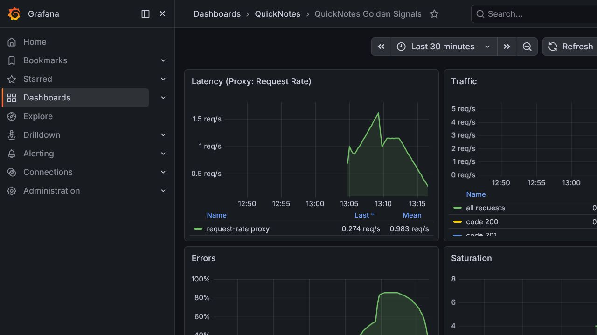
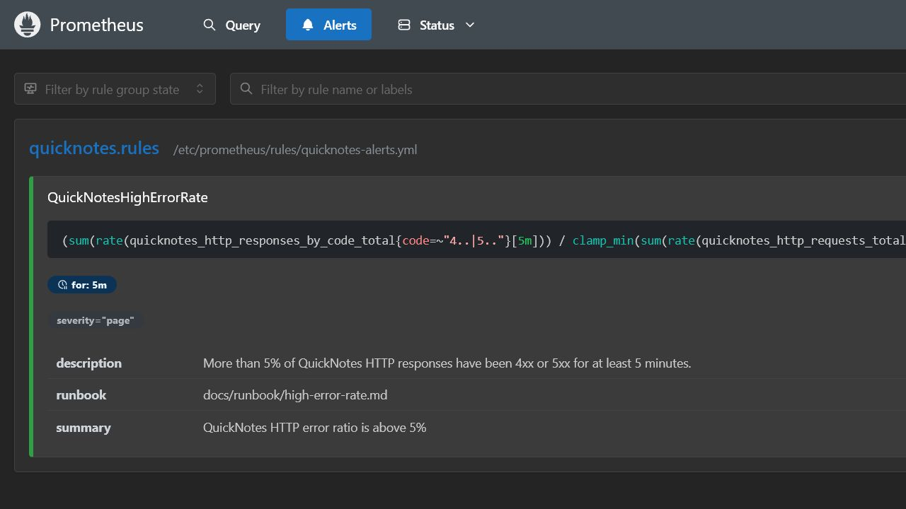

# Lab 8 - SRE & Monitoring: Golden Signals Dashboard + One Good Alert

## Implemented files

- [`compose.yaml`](../compose.yaml)
- [`.env.example`](../.env.example)
- [`app/.dockerignore`](../app/.dockerignore)
- [`app/Dockerfile`](../app/Dockerfile)
- [`app/cmd/healthcheck/main.go`](../app/cmd/healthcheck/main.go)
- [`monitoring/prometheus/prometheus.yml`](../monitoring/prometheus/prometheus.yml)
- [`monitoring/prometheus/rules/quicknotes-alerts.yml`](../monitoring/prometheus/rules/quicknotes-alerts.yml)
- [`monitoring/grafana/provisioning/datasources/datasource.yml`](../monitoring/grafana/provisioning/datasources/datasource.yml)
- [`monitoring/grafana/provisioning/dashboards/dashboard.yml`](../monitoring/grafana/provisioning/dashboards/dashboard.yml)
- [`monitoring/grafana/dashboards/golden-signals.json`](../monitoring/grafana/dashboards/golden-signals.json)
- [`docs/runbook/high-error-rate.md`](../docs/runbook/high-error-rate.md)
- [`submissions/lab8-grafana-dashboard.png`](lab8-grafana-dashboard.png)
- [`submissions/lab8-prometheus-alert-firing.png`](lab8-prometheus-alert-firing.png)

The Lab 8 stack runs QuickNotes, Prometheus, and Grafana from Compose. Grafana loads the Prometheus data source and the QuickNotes Golden Signals dashboard from files at startup.

## How to run

```powershell
$env:GRAFANA_ADMIN_PASSWORD='replace-with-a-unique-password'
docker compose up --build -d
```

Useful endpoints:

- QuickNotes: <http://localhost:8080/health>
- Prometheus targets: <http://localhost:9090/targets>
- Grafana: <http://localhost:3000>

## Prometheus config

```yaml
global:
  scrape_interval: 15s
  evaluation_interval: 15s

rule_files:
  - /etc/prometheus/rules/*.yml

scrape_configs:
  - job_name: quicknotes
    metrics_path: /metrics
    static_configs:
      - targets:
          - quicknotes:8080
```

## Grafana provisioning

Datasource:

```yaml
apiVersion: 1

datasources:
  - name: Prometheus
    uid: prometheus
    type: prometheus
    access: proxy
    url: http://prometheus:9090
    isDefault: true
    editable: false
```

Dashboard provider:

```yaml
apiVersion: 1

providers:
  - name: QuickNotes
    orgId: 1
    folder: QuickNotes
    type: file
    disableDeletion: false
    updateIntervalSeconds: 30
    allowUiUpdates: false
    options:
      path: /var/lib/grafana/dashboards
      foldersFromFilesStructure: false
```

Dashboard JSON is stored in [`monitoring/grafana/dashboards/golden-signals.json`](../monitoring/grafana/dashboards/golden-signals.json). It has four panels:

| Golden signal | PromQL |
|---|---|
| Latency | `sum(rate(quicknotes_http_requests_total[5m]))` as the lab-approved proxy, because QuickNotes does not expose a request-duration histogram |
| Traffic | `sum(rate(quicknotes_http_requests_total[1m]))` and response rate by status code |
| Errors | `100 * sum(rate(quicknotes_http_responses_by_code_total{code=~"4..|5.."}[5m])) / clamp_min(sum(rate(quicknotes_http_requests_total[5m])), 0.001)` |
| Saturation | `quicknotes_notes_total` |

## Generate traffic and verify

Mixed traffic command used to make the dashboard non-empty:

```powershell
1..160 | ForEach-Object {
  Invoke-RestMethod http://localhost:8080/notes | Out-Null
}
1..30 | ForEach-Object {
  Invoke-RestMethod http://localhost:8080/notes/999999 -SkipHttpErrorCheck | Out-Null
}
1..20 | ForEach-Object {
  Invoke-RestMethod http://localhost:8080/notes `
    -Method Post `
    -ContentType 'application/json' `
    -Body (@{ title = "lab8-$($_)"; body = "generated traffic" } | ConvertTo-Json) | Out-Null
}
```

Prometheus target health command:

```powershell
curl http://localhost:9090/api/v1/targets | jq '.data.activeTargets[].health'
```

Observed result:

```text
health scrapeUrl                      lastError
------ ---------                      ---------
up     http://quicknotes:8080/metrics
```

Dashboard screenshot evidence:



Grafana API also confirmed the provisioned dashboard was loaded:

```json
[
  {
    "uid": "quicknotes-golden-signals",
    "title": "QuickNotes Golden Signals",
    "url": "/d/quicknotes-golden-signals/quicknotes-golden-signals",
    "type": "dash-db",
    "folderTitle": "QuickNotes"
  }
]
```

The dashboard shows non-trivial Traffic, Errors, and Saturation panels. The Latency panel intentionally uses the request-rate proxy because the app does not publish duration buckets.

## Task 1 design questions

### a) Pull vs push

Prometheus pulls metrics, so Prometheus must be able to reach QuickNotes on the Compose network at `quicknotes:8080`. QuickNotes does not need to know where Prometheus is. If Prometheus cannot reach QuickNotes, the target becomes `down`, `up{job="quicknotes"}` becomes `0`, and dashboards/alerts based on QuickNotes metrics go stale.

### b) `scrape_interval: 15s`

At `5s`, the system stores three times as many samples, increases scrape load, and makes short-range `rate()` queries noisier because counter increments are spread across tiny windows. At `5m`, dashboards become slow to react, alert evaluation has very few samples inside a 5-minute window, and `rate()` becomes coarse enough to hide short incidents.

### c) `rate()` vs `irate()` vs `delta()`

The Traffic panel should use `rate()` because `quicknotes_http_requests_total` is a counter and traffic needs a stable per-second trend over a window. `irate()` only uses the last two samples and is better for very spiky debugging, not a dashboard overview. `delta()` is for gauges or absolute change over a range, not a per-second counter rate.

### d) Why provision Grafana from files

Provisioned dashboards and data sources are repeatable, reviewable, and versioned. A fresh `docker compose up` produces the same dashboard without manual clicking, and changes to observability can be reviewed in Git like application code.

## Alert rule definition

The alert is implemented as a Prometheus rule in [`monitoring/prometheus/rules/quicknotes-alerts.yml`](../monitoring/prometheus/rules/quicknotes-alerts.yml):

```yaml
groups:
  - name: quicknotes.rules
    rules:
      - alert: QuickNotesHighErrorRate
        expr: |
          (
            sum(rate(quicknotes_http_responses_by_code_total{code=~"4..|5.."}[5m]))
            /
            clamp_min(sum(rate(quicknotes_http_requests_total[5m])), 0.001)
          ) > 0.05
        for: 5m
        labels:
          severity: page
        annotations:
          summary: QuickNotes HTTP error ratio is above 5%
          description: More than 5% of QuickNotes HTTP responses have been 4xx or 5xx for at least 5 minutes.
          runbook: docs/runbook/high-error-rate.md
```

This does not fire on a single 4xx burst because the expression must stay above 5% for 5 minutes.

## Trigger the alert deliberately

Run sustained malformed requests for more than 5 minutes:

```powershell
$end = (Get-Date).AddMinutes(6)
while ((Get-Date) -lt $end) {
  Invoke-RestMethod http://localhost:8080/notes `
    -Method Post `
    -ContentType 'application/json' `
    -Body '{"bad":' `
    -SkipHttpErrorCheck | Out-Null
  Start-Sleep -Seconds 1
}
```

Alert state can be checked in Prometheus:

```powershell
curl http://localhost:9090/api/v1/alerts | jq '.data.alerts[] | {name: .labels.alertname, state: .state, severity: .labels.severity}'
```

Observed firing-state excerpt from Prometheus:

```json
{
  "labels": {
    "alertname": "QuickNotesHighErrorRate",
    "severity": "page"
  },
  "annotations": {
    "description": "More than 5% of QuickNotes HTTP responses have been 4xx or 5xx for at least 5 minutes.",
    "runbook": "docs/runbook/high-error-rate.md",
    "summary": "QuickNotes HTTP error ratio is above 5%"
  },
  "state": "firing",
  "activeAt": "2026-06-30T10:18:30.540651443Z",
  "value": "8.527607361963191e-01"
}
```

Prometheus alert UI evidence:



## Runbook

The full runbook is stored at [`docs/runbook/high-error-rate.md`](../docs/runbook/high-error-rate.md).

### What this alert means

More than 5% of QuickNotes HTTP requests have returned 4xx or 5xx responses for at least 5 minutes, so users are likely seeing failed API calls.

### Triage steps

1. Open the QuickNotes Golden Signals dashboard and confirm whether the error ratio is still above 5% and whether traffic changed at the same time.
2. In Prometheus, compare response-code rates with `sum by (code) (rate(quicknotes_http_responses_by_code_total[5m]))` to identify whether the failures are mostly 400, 404, or 500.
3. Check application health with `curl http://localhost:8080/health` and inspect the QuickNotes container logs with `docker compose logs quicknotes --since 15m`.
4. If 5xx responses are present, check whether writes to `/data/notes.json` are failing by creating a test note and reading it back.
5. Identify the most recent operational change: image rebuild, Compose restart, data volume change, configuration edit, or traffic generation script.

### Mitigations

1. If the issue followed a new image or config change, roll back to the last known-good image or revert the configuration and restart QuickNotes.
2. If malformed client traffic is causing a 4xx storm, block or rate-limit the source and keep the service running for healthy clients.
3. If persistence is failing, stop write-heavy traffic, preserve the `quicknotes-data` volume, and restore the last good `notes.json` backup before accepting writes again.

### Post-incident

Write a short blameless postmortem using the approach from [Lecture 1: Blameless Postmortems](../lectures/lec1.md), including timeline, customer impact, root cause, detection gap, and follow-up action items. Update this runbook if any step was missing or misleading during the incident.

## Task 2 design questions

### e) Why sustained for 5 minutes

A single bad request may be a typo, a client bug, or a normal 404. Paging immediately would create noise. Requiring 5 minutes of elevated error ratio pages only when the problem is sustained enough to affect users and gives transient bursts time to recover without waking someone.

### f) Symptom alerts vs cause alerts

A cause alert for QuickNotes might be `quicknotes_notes_total > 1000` or `container CPU > 80%`. It is worse as a page because high note count or CPU may not hurt users, while a high HTTP error ratio directly measures failed user-visible behavior. Cause metrics are useful on dashboards and in triage, but symptom alerts are better pages.

### g) Alert fatigue threshold

If more than 20% of pages happen when users were not actually affected or no immediate human action was needed, this alert is too noisy. At that point on-call will start distrusting the signal, so the threshold, window, or severity should be changed.

## Bonus task

Not attempted, by request. No Checkly probe, public tunnel, external-region comparison table, or synthetic-monitoring bonus evidence is included in this submission.
