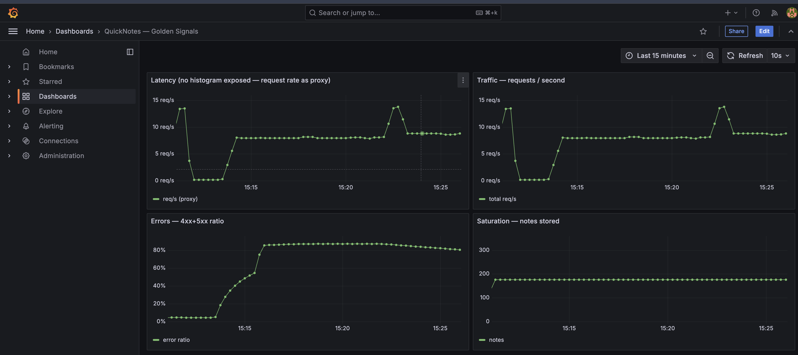
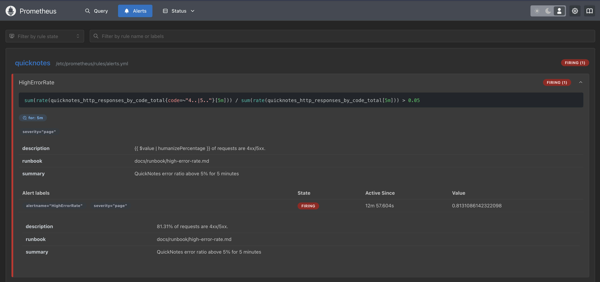

# Lab 8 — SRE & Monitoring

`docker compose up -d` now brings up QuickNotes + Prometheus + Grafana. Grafana auto-loads a
four-panel golden-signals dashboard, and a Prometheus alert pages when the error ratio stays above
5% for 5 minutes. Everything below is from a real run on this machine (Docker 29.4.3, arm64).

## Task 1 — Prometheus + Grafana

### Config files

**`monitoring/prometheus/prometheus.yml`**
```yaml
global:
  scrape_interval: 15s
rule_files:
  - /etc/prometheus/rules/*.yml
scrape_configs:
  - job_name: quicknotes
    metrics_path: /metrics
    static_configs:
      - targets: ["quicknotes:8080"]     # Compose DNS resolves the service name
```

**`monitoring/grafana/provisioning/datasources/datasource.yml`**
```yaml
apiVersion: 1
datasources:
  - name: Prometheus
    uid: prometheus
    type: prometheus
    access: proxy
    url: http://prometheus:9090
    isDefault: true
```

**`monitoring/grafana/provisioning/dashboards/dashboard.yml`** points Grafana at
`/var/lib/grafana/dashboards`, where `golden-signals.json` is mounted. The dashboard has four
panels, one per golden signal:

| Panel | PromQL |
|-------|--------|
| Latency (no histogram exposed — rate proxy) | `sum(rate(quicknotes_http_requests_total[1m]))` |
| Traffic | `sum(rate(quicknotes_http_requests_total[1m]))` |
| Errors | `sum(rate(quicknotes_http_responses_by_code_total{code=~"4..\|5.."}[5m])) / sum(rate(quicknotes_http_responses_by_code_total[5m]))` |
| Saturation | `quicknotes_notes_total` |

(QuickNotes exposes no latency histogram, so Latency uses the request-rate proxy the lab allows.)

The `compose.yaml` adds pinned `prom/prometheus:v3.1.0` (port 9090) and `grafana/grafana:11.4.0`
(port 3000), with `prometheus` gated on `quicknotes: { condition: service_healthy }` and Grafana
admin credentials set via `GF_SECURITY_ADMIN_*` (no default password).

### Verification (after ~200 requests of traffic)

```text
# Prometheus target is UP
$ curl -s localhost:9090/api/v1/targets | jq -r '.data.activeTargets[] | "\(.labels.job) -> \(.health)"'
quicknotes -> up   (http://quicknotes:8080/metrics)

# Grafana provisioned the datasource + dashboard automatically
$ curl -s -u admin:*** localhost:3000/api/datasources | jq -r '.[].name'
Prometheus   (default, url=http://prometheus:9090)

$ curl -s -u admin:*** localhost:3000/api/dashboards/uid/quicknotes-golden | jq -r '.dashboard.panels[].title'
Latency (no histogram exposed — request rate as proxy)
Traffic — requests / second
Errors — 4xx+5xx ratio
Saturation — notes stored
```

**Dashboard screenshot (with traffic):**



### Design questions

**a) Prometheus pulls — which side must be reachable, and the failure mode?**
Prometheus reaches *out* to QuickNotes, so **QuickNotes** is the side that must be reachable (its
`/metrics` on the Compose network). If Prometheus can't reach it, the scrape fails and the target
goes `up == 0` — panels show gaps/"no data" and you can alert on `up == 0`. QuickNotes itself is
unaffected: it doesn't push anything, so it neither knows nor cares. The blind spot is in the
monitoring, not the app.

**b) `scrape_interval: 15s` — what breaks at 5s? at 5m?**
At **5s** you triple the scrape load and storage for almost no signal — most metrics don't change
meaningfully that fast, and `rate()` over tiny windows gets noisy. At **5m** you go blind to
anything shorter than 5 minutes: a 2-minute outage between scrapes is invisible, alerts react
slowly, and your rate windows / `for:` durations have to be much larger than the scrape interval
(rule of thumb: scrape interval ≲ ¼ of the rate window), so a 5m scrape breaks 5m-window queries.

**c) `rate()` vs `irate()` vs `delta()` for Traffic?**
`rate()`. The metric is a counter, and `rate()` gives the per-second average over the window while
smoothing scrape jitter and handling counter resets — exactly what a traffic graph wants. `irate()`
only uses the last two samples, so it's too spiky for a dashboard (fine for high-res zoom).
`delta()` is for gauges and doesn't handle counter resets, so it's wrong for a counter.

**d) Why provision Grafana from files?**
Because a fresh stack should come up correct with zero clicking. The datasource and dashboard are
in git — code-reviewed, versioned, rollback-able — and identical on every machine. Clicking through
the UI each time is unrepeatable, drifts, and is lost the moment the container is recreated.

## Task 2 — One good alert + runbook

### Alert rule (`monitoring/prometheus/rules/alerts.yml`)

```yaml
- alert: HighErrorRate
  expr: |
    sum(rate(quicknotes_http_responses_by_code_total{code=~"4..|5.."}[5m]))
    / sum(rate(quicknotes_http_responses_by_code_total[5m])) > 0.05
  for: 5m
  labels:
    severity: page
  annotations:
    summary: "QuickNotes error ratio above 5% for 5 minutes"
    runbook: "docs/runbook/high-error-rate.md"
```

The `for: 5m` is what stops a single 4xx burst from paging.

### Triggered it for real

I ran a sustained error load (~8 bad `POST /notes`/sec alongside healthy traffic) and watched the
alert transition through all three states:

```text
error_ratio=0.28   alert=inactive
error_ratio=0.40   alert=pending      (activeAt 12:13:21)
error_ratio=0.54   alert=pending
...                 alert=pending      (~5 min)
                    alert=firing       (12:19, value 0.87)
```

Firing alert as Prometheus reports it:

```json
{
  "state": "firing",
  "value": "0.87",
  "severity": "page",
  "summary": "QuickNotes error ratio above 5% for 5 minutes",
  "runbook": "docs/runbook/high-error-rate.md"
}
```

`Normal → Pending → Firing`, ~5 minutes between crossing 5% and paging — exactly the sustained-breach
behaviour required.

**Firing alert screenshot:**



### Runbook

Full runbook at `docs/runbook/high-error-rate.md` — sections: what the alert means, three ordered
triage steps (confirm on the dashboard → check the service is up → read the logs), mitigations
(roll back the deploy, rate-limit a bad client, restart the wedged process), and post-incident
(blameless postmortem from the Lecture 1 template).

### Design questions

**e) Why "sustained for 5 minutes" instead of firing on the first bad request?**
Low-level errors are normal — a single bad request or a brief deploy hiccup isn't worth waking
anyone. Requiring 5 minutes filters transient noise and only pages when there's a real, ongoing
problem users are actually feeling. You trade a little detection latency for far fewer false pages.

**f) Symptom vs cause alert?**
This is a symptom alert — it fires on what users see (errors). A cause alert would be something like
"CPU > 80%" or "container restarted." Cause alerts are worse because the cause often doesn't affect
users (high CPU with fine latency = a false page), and they don't generalize — there are countless
possible causes but only a few symptoms that matter. Alert on the symptom; use dashboards to chase
the cause.

**g) Alert fatigue — a noisy-threshold number?**
If more than roughly **1 in 5 pages (~20%)** fires when users weren't actually affected, the alert
is too noisy and people start ignoring it (which is more dangerous than missing one). The fix is to
raise the threshold or lengthen the `for:` until precision is back up — a page should almost always
mean "a human needs to act now."
