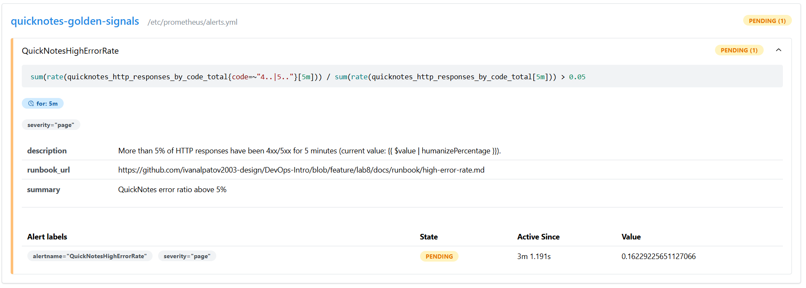
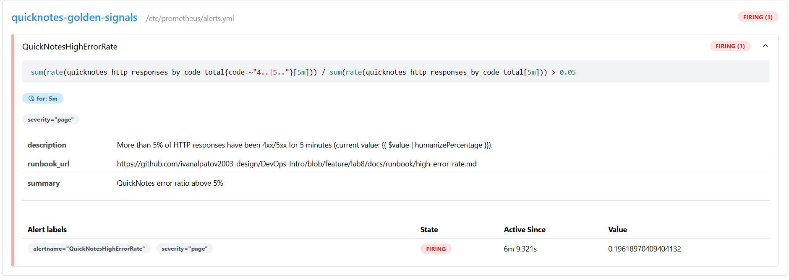
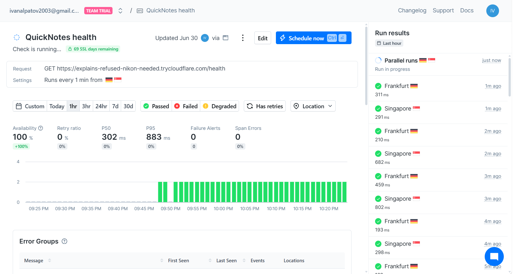

# Lab 8 — SRE & Monitoring: Golden Signals + One Good Alert

**Author:** Ivan Alpatov
**Stack:** Prometheus v3.12.0 + Grafana 13.1.0, layered onto the Lab 6 Compose deployment of QuickNotes.

---

## Task 1 — Prometheus + Grafana with a provisioned dashboard

### Files

| File | Purpose |
|------|---------|
| `monitoring/prometheus/prometheus.yml` | 15s scrape, one `quicknotes` job targeting `quicknotes:8080` |
| `monitoring/prometheus/alerts.yml` | high-error-rate alert (Task 2) |
| `monitoring/grafana/provisioning/datasources/datasource.yml` | Prometheus data source (uid `prometheus`), default |
| `monitoring/grafana/provisioning/dashboards/dashboard.yml` | file provider → `/var/lib/grafana/dashboards` |
| `monitoring/grafana/dashboards/golden-signals.json` | 4-panel golden-signals dashboard |
| `compose.yaml` | extended with `prometheus` + `grafana` services |

### Golden-signal queries (mapped to what QuickNotes actually exposes)

QuickNotes `/metrics` exposes: `quicknotes_http_requests_total` (counter, no labels),
`quicknotes_http_responses_by_code_total{code}` (counter), `quicknotes_notes_total` (gauge).
**No latency histogram is exposed**, so latency is proxied by request rate, as the spec allows.

| Signal | PromQL |
|--------|--------|
| Latency (proxy) | `sum(rate(quicknotes_http_requests_total[5m]))` |
| Traffic | `sum(rate(quicknotes_http_requests_total[1m]))` |
| Errors | `sum(rate(quicknotes_http_responses_by_code_total{code=~"4..\|5.."}[5m])) / sum(rate(quicknotes_http_responses_by_code_total[5m]))` |
| Saturation | `quicknotes_notes_total` |

### Evidence


Target health:

```text
$ curl.exe http://localhost:9090/api/v1/targets

{"status":"success","data":{"activeTargets":[{"discoveredLabels":{"__address__":"quicknotes:8080","__metrics_path__":"/metrics","__scheme__":"http","job":"quicknotes"},"labels":{"instance":"quicknotes:8080","job":"quicknotes"},"scrapePool":"quicknotes","scrapeUrl":"http://quicknotes:8080/metrics","lastError":"","lastScrape":"2026-06-30T18:15:59Z","health":"up","scrapeInterval":"15s","scrapeTimeout":"10s"}]}}
```

Confirms `health: "up"` for the `quicknotes` job — no scrape errors.

### Design questions

**a) Pull vs push — who must be reachable, and the failure mode.**
Prometheus pulls, so it initiates every connection: the **QuickNotes** side must be reachable from
Prometheus (`quicknotes:8080` resolvable and open inside the Compose network). QuickNotes never
connects out. If Prometheus can't reach it, the scrape fails, `up{job="quicknotes"}` flips to `0`,
the target shows **DOWN** in `/targets`, and the golden-signal series stop getting fresh samples
(gaps on the graphs). Prometheus itself keeps running — you lose *visibility*, not the monitoring
system. Note a subtle trap: a ratio alert can go to no-data/NaN rather than fire when the target is
down, which is why a separate `up == 0` alert is also worth having.

**b) `scrape_interval` at 5s vs 5m.**
- **5s:** 3x more samples -> 3x storage and more CPU on both Prometheus and the scraped app, for very
  little extra signal on a low-traffic service. Short rate windows still need >=2 samples, so it works,
  but you pay cost without insight.
- **5m:** far too coarse — short spikes and brief outages can fall between samples and be invisible.
  `rate()`/`increase()` over short ranges break (a `rate(...[1m])` with a 5m interval returns nothing,
  because there are fewer than two samples in the range), and any `for: 5m` alert effectively needs
  ~10 minutes of sustained badness before it can fire. Detection latency balloons.

**c) `rate()` vs `irate()` vs `delta()` for Traffic.**
`rate()`. The request metric is a **counter** (monotonically increasing, resets on restart). `rate()`
gives the per-second average increase across the window and correctly handles counter resets — exactly
"requests per second." `irate()` uses only the last two samples -> very spiky and can miss activity
between scrapes; fine for zoomed-in debugging, poor for a steady traffic panel. `delta()` is for
**gauges** and does not account for counter resets, so it's the wrong tool for a counter entirely.

**d) Why provision Grafana from files instead of clicking the UI.**
Reproducibility and GitOps. A fresh `docker compose up` on any machine — a teammate's laptop, CI, the
grader's box — boots with the data source and dashboard already present and identical, with zero manual
steps. The config is version-controlled (diffable, reviewable in a PR), survives container recreation
(Grafana's embedded DB here is ephemeral and is wiped by `docker compose down -v`), and prevents drift
between environments. A dashboard built by clicking exists only in that one Grafana's database and
vanishes when the volume goes.

---

## Task 2 — One good alert + runbook

### Alert rule

See `monitoring/prometheus/alerts.yml`. It fires when the 4xx+5xx ratio exceeds **5%** sustained for
**5 minutes**, carries `severity: page`, and annotates a `runbook_url` pointing at
`docs/runbook/high-error-rate.md`. A single 4xx burst cannot trip it: the `rate(...[5m])` smooths the
ratio and `for: 5m` requires the breach to persist.

### Evidence





### Runbook

Full runbook lives at `docs/runbook/high-error-rate.md` (What it means -> Triage -> Mitigations ->
Post-incident with postmortem template link).

### Design questions

**e) Why "sustained 5 minutes" instead of firing immediately.**
A single failed request (one malformed call from a flaky client) is noise, not an incident. Paging on
the first bad request would wake an engineer for transients that self-heal — a pod restart, a deploy
that auto-rolled back — which is exactly how you train people to ignore the pager. Requiring the symptom
to persist 5 minutes means the problem is real and ongoing. The trade-off is accepting up to ~5 minutes
of detection latency in exchange for precision and on-call sanity.

**f) Symptom vs cause alert.**
The error-ratio alert is a **symptom** alert — it fires on what users actually feel (failed requests).
A **cause** alert would be e.g. "CPU > 90%" or "disk 80% full." Cause alerts are worse for paging on two
fronts: false positives — high CPU on an over-provisioned or batch workload harms no user yet still
pages — and false negatives — users get hurt by causes you never enumerated (a dependency timeout, a bad
config), which your specific cause alert silently misses. Symptom alerts sit closest to the user, are
fewer, and catch *unknown* failure modes. Cause metrics belong on the dashboard as diagnostic context
once a symptom alert has already fired.

**g) Alert fatigue — a quantitative "too noisy" threshold.**
Tie it to actionability: if this alert pages while the user was **not actually affected** more than,
say, **~30% of the time**, it's too noisy and must be retuned (raise the threshold, lengthen `for:`, or
narrow the query to the endpoints that matter). The guiding principle from the SRE material is that
every page should be actionable — a precision well below that bar means on-call starts reflexively
acknowledging and ignoring, which is more dangerous than having one alert too few.

---

## Bonus — Synthetic monitoring from the outside

### Setup

- Public URL via Cloudflare quick tunnel: `cloudflared tunnel --url http://localhost:8080`
- Checkly API check `QuickNotes health`: `GET https://<tunnel>.trycloudflare.com/health`, 1-minute
  frequency, 2 locations (Frankfurt + Singapore), assertions: status code == 200, response time < 2000ms
- Ran for 30+ minutes, alternating between the two regions every minute



### Compare internal vs external

| | Prometheus (inside the Compose net) | Checkly (Frankfurt + Singapore) |
|--|---|---|
| Avg latency p50 | N/A - no latency histogram exposed by QuickNotes (see Task 1 note) | 302 ms |
| Avg latency p95 | N/A - same limitation | 883 ms |
| Errors observed | 0% (alert `QuickNotesHighErrorRate` is `INACTIVE`; ratio back under 5% after the deliberate Task-2 error burst ended) | 0% (Availability 100%, Failure Alerts 0, Span Errors 0) |

What kind of failure would Checkly catch that Prometheus cannot? Anything that breaks the path
*between* the user and the app but leaves the app itself fine: the Cloudflare tunnel process dying,
DNS for the public hostname failing, TLS/certificate issues, the home network or ISP going down, or
a firewall blocking the egress port (we actually hit this ourselves - cloudflared's region2
connectivity pre-check failed on this network). Prometheus, sitting inside the Compose network, would
keep reporting up == 1 and 0% errors the entire time, completely blind to the outage a real user
would experience.

What kind would Prometheus catch that Checkly cannot? Internal degradation that never reaches the
single externally-probed /health endpoint: an elevated error ratio on /notes while /health stays
green, saturation creeping up (quicknotes_notes_total growing toward a limit), or a slow memory leak
visible only in process-level metrics. Checkly only samples one URL once a minute from outside, so a
problem confined to a different route, or one that resolves between two of its polling windows, is
invisible to it.

