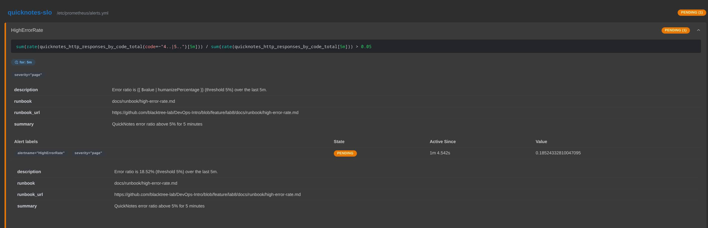
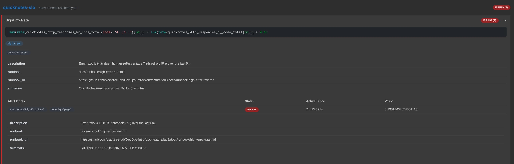

# Lab 8 Submission - SRE & Monitoring: Golden Signals Dashboard + One Good Alert

---

## Task 1 - Prometheus + Grafana with a Provisioned Dashboard

### 1.1 Layout

```text
monitoring/
├── prometheus/
│   ├── prometheus.yml
│   └── alerts.yml                     (Task 2)
└── grafana/
    └── provisioning/
        ├── datasources/datasource.yml
        └── dashboards/
            ├── dashboard.yml          (provider)
            └── golden-signals.json    (4-panel dashboard)
```
Plus `prometheus` + `grafana` services added to the existing Lab 6 `compose.yaml`.

### 1.2 prometheus.yml

```yaml
global:
  scrape_interval: 15s
  evaluation_interval: 15s

rule_files:
  - /etc/prometheus/alerts.yml

scrape_configs:
  - job_name: quicknotes
    static_configs:
      - targets: ["quicknotes:8080"]   # Compose service name + container port
```

### 1.3 Grafana provisioning

```yaml
# datasources/datasource.yml
apiVersion: 1
datasources:
  - name: Prometheus
    type: prometheus
    access: proxy
    url: http://prometheus:9090
    isDefault: true
    uid: prometheus
```
```yaml
# dashboards/dashboard.yml (provider)
apiVersion: 1
providers:
  - name: golden-signals
    type: file
    options:
      path: /etc/grafana/provisioning/dashboards
```

### 1.4 Dashboard — four golden-signal panels

Full dashboard: `monitoring/grafana/provisioning/dashboards/golden-signals.json`. The four panels' PromQL:

| Panel | Signal | PromQL |
|-------|--------|--------|
| Traffic — requests/sec | Traffic | `sum(rate(quicknotes_http_requests_total[1m]))` |
| Errors — 4xx+5xx ratio | Errors | `sum(rate(quicknotes_http_responses_by_code_total{code=~"4..\|5.."}[5m])) / sum(rate(quicknotes_http_responses_by_code_total[5m]))` |
| Latency (proxy) | Latency | `sum(rate(quicknotes_http_requests_total[1m]))` |
| Saturation — notes stored | Saturation | `quicknotes_notes_total` |

QuickNotes exposes **no latency histogram** (only counters + a gauge), so per lab §1.3 the Latency panel uses request-rate as the allowed proxy, labelled honestly in the panel title.

### 1.5 compose.yaml additions

```yaml
  prometheus:
    image: prom/prometheus:v3.1.0
    volumes:
      - ./monitoring/prometheus/prometheus.yml:/etc/prometheus/prometheus.yml:ro
      - ./monitoring/prometheus/alerts.yml:/etc/prometheus/alerts.yml:ro
    ports: ["9090:9090"]
    depends_on:
      quicknotes: { condition: service_healthy }
    restart: unless-stopped

  grafana:
    image: grafana/grafana:13.0.3
    environment:
      GF_SECURITY_ADMIN_USER: "${GRAFANA_ADMIN_USER:-admin}"
      GF_SECURITY_ADMIN_PASSWORD: "${GRAFANA_ADMIN_PASSWORD:-changeme-lab8}"
    volumes:
      - ./monitoring/grafana/provisioning:/etc/grafana/provisioning:ro
      - grafana-data:/var/lib/grafana
    ports: ["3000:3000"]
    depends_on: [prometheus]
    restart: unless-stopped
```

### 1.6 Verification

```text
$ curl -s http://127.0.0.1:9090/api/v1/targets | jq '.data.activeTargets[].health'
"up"
```

Grafana dashboard after ~200 mixed requests (screenshot):


- Traffic peaks ~9.5 req/s · Errors ~6–7% (injected 400/404) · Latency-proxy mirrors traffic · Saturation = 4 notes.

### 1.7 Design Questions

**a) Pull vs push — which side must be reachable, and the failure mode?**
Prometheus **pulls**: it initiates `GET /metrics` to each target. So the **target (QuickNotes) must be reachable *by* Prometheus** on the scrape port; QuickNotes never needs to reach Prometheus. If Prometheus can't reach QuickNotes, the target shows **`up == 0`** in `/targets`, scrapes fail, and dependent panels/alerts go stale or "no data" — but the app itself keeps serving users; you've only lost *visibility*. A bonus of pull: a target that vanishes is explicitly detectable (`up == 0`), whereas with push a silent client is indistinguishable from a healthy-but-quiet one.

**b) `scrape_interval: 15s` → `5s` or `5m`?**
`5s`: 3× the scrape/storage load and pressure on the target's `/metrics`; more TSDB samples (disk/memory); little added signal — and very short `rate()` windows get noisier. `5m`: metrics become coarse — short spikes vanish (a 90-second error burst between scrapes is invisible), `rate()`/alerts over `[1m]` break because there's fewer than two samples in the window ("no data"), and alerting is sluggish (up to 5 min blind). 15s balances resolution against cost.

**c) `rate()` vs `irate()` vs `delta()` for Traffic?**
**`rate()`** — correct here. It's the per-second average over the whole window using all samples, handles counter resets, and is smooth enough for a dashboard/alert on a **counter** like `quicknotes_http_requests_total`. `irate()` uses only the last two samples → very spiky/aliased, good for close-up debugging but jittery on a graph. `delta()` is for **gauges** (difference over a window, can be negative) and misbehaves on a counter. Traffic is a counter on a dashboard → `rate()`.

**d) Why provision Grafana from files?**
Reproducibility and GitOps: a fresh stack comes up fully wired (datasource + dashboards) on `docker compose up`, with zero manual clicking. The config is version-controlled, diffable, and code-reviewed, and it's identical across dev/CI/prod. Click-through setup is unrepeatable, undocumented, lost whenever the container/volume is recreated, and drifts between environments. Provisioning is infrastructure-as-code for dashboards.

---

## Task 2 - One Good Alert + Runbook

### 2.1 Alert rule (`monitoring/prometheus/alerts.yml`)

```yaml
groups:
  - name: quicknotes-slo
    rules:
      - alert: HighErrorRate
        expr: |
          sum(rate(quicknotes_http_responses_by_code_total{code=~"4..|5.."}[5m]))
          /
          sum(rate(quicknotes_http_responses_by_code_total[5m]))
          > 0.05
        for: 5m
        labels:
          severity: page
        annotations:
          summary: "QuickNotes error ratio above 5% for 5 minutes"
          description: "Error ratio is {{ $value | humanizePercentage }} (threshold 5%) over the last 5m."
          runbook_url: "https://github.com/blacktree-lab/DevOps-Intro/blob/feature/lab8/docs/runbook/high-error-rate.md"
```
The `for: 5m` gate (plus the `[5m]` rate window) means a single 4xx burst never fires it — only a sustained breach does.

### 2.2 Runbook

Full runbook: `docs/runbook/high-error-rate.md` — sections: **What it means**, **Triage** (confirm real → split 4xx/5xx → correlate with recent change), **Mitigations** (roll back, restart, shed bad traffic, check storage), **Post-incident** (blameless postmortem + action items).

### 2.3 Alert firing

**Rule loaded in Prometheus:**
```text
$ curl -s http://127.0.0.1:9090/api/v1/rules | jq '.data.groups[].rules[] | {alert:.name, state:.state, health:.health}'
{ "alert": "HighErrorRate", "state": "inactive", "health": "ok" }
```

**Under sustained ~20% error injection** (8 good : 2 bad requests/sec), the alert
crosses the 5% threshold and enters `pending` while the `for: 5m` timer runs — it
does **not** page instantly, which is the sustained-breach gate working as designed:



```text
Alert:        HighErrorRate
State:        PENDING  (Active Since 45s → flips to FIRING at 5m)
severity:     page
Value:        0.1814  (18.15% error ratio, threshold 5%)
description:  Error ratio is 18.15% (threshold 5%) over the last 5m.
runbook_url:  https://github.com/blacktree-lab/DevOps-Intro/blob/feature/lab8/docs/runbook/high-error-rate.md
```

After the breach holds for a full 5 minutes the state transitions
`inactive → pending → firing`:



### 2.4 Design Questions

**e) Why "sustained for 5 minutes" instead of firing on the first bad request?**
A single failed request, or a brief blip, usually isn't user-meaningful and is often self-correcting (a transient network hiccup, one misbehaving client). Paging on it creates alert fatigue and wakes someone for noise. Requiring 5 sustained minutes proves the problem is real and ongoing before paging, trading a few minutes of detection latency for far fewer false pages.

**f) Symptom vs cause alert — a cause alert for QuickNotes, and why it's worse.**
Ours is a **symptom** alert (users are seeing errors). A **cause** alert would be e.g. `CPU > 80%` or `container memory > 90%`. It's worse because it produces both false positives (high CPU during a backup/batch that no user notices → needless page) and false negatives (users failing while CPU looks fine → missed incident). Cause metrics are many and noisy — you'd need dozens of cause alerts to cover every failure mode, whereas one symptom alert ("users are getting errors") catches them all regardless of root cause. Symptom alerts map to user impact; cause alerts only guess at it.

**g) Alert fatigue — a quantitative "too noisy" threshold.**
A practical rule: if **more than ~20% of the times this alert pages, the user wasn't actually impacted** (precision < ~80%), it's too noisy and must be tuned, raise the threshold, lengthen `for:`, or make the expression more symptom-specific. Once on-call learns that roughly one in five pages is nonsense, they start ignoring all of them, which is worse than having no alert. (Google SRE's guidance: alerts must be actionable; aim for high precision *and* recall.)
