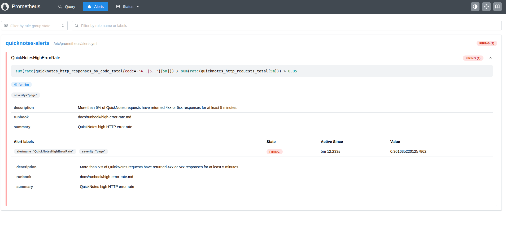

# Lab 8 Submission

## Task 1 - Prometheus + Grafana with a Provisioned Dashboard

### Config files

- Prometheus scrape config: [`monitoring/prometheus/prometheus.yml`](../monitoring/prometheus/prometheus.yml)
- Grafana Prometheus datasource provisioning: [`monitoring/grafana/provisioning/datasources/datasource.yml`](../monitoring/grafana/provisioning/datasources/datasource.yml)
- Grafana dashboard provider provisioning: [`monitoring/grafana/provisioning/dashboards/dashboard.yml`](../monitoring/grafana/provisioning/dashboards/dashboard.yml)
- Grafana golden signals dashboard JSON: [`monitoring/grafana/dashboards/golden-signals.json`](../monitoring/grafana/dashboards/golden-signals.json)

The Compose extension is in [`compose.yaml`](../compose.yaml). It adds:

- `prometheus` on `localhost:9090`, scraping QuickNotes at `quicknotes:8080`
- `grafana` on `localhost:3000`, loading provisioning from `monitoring/grafana/provisioning`
- Dashboard JSON mounted from `monitoring/grafana/dashboards`

### Grafana dashboard screenshot


### Prometheus target health

Command:

```bash
curl -s http://localhost:9090/api/v1/targets | jq '.data.activeTargets[].health'
```

Output:

```text
"up"
```

### Design questions

#### a. Pull vs push

Prometheus uses a pull model, so Prometheus must be able to reach the QuickNotes service over the Compose network. QuickNotes only needs to expose `/metrics`; it does not send metrics to Prometheus itself.

If Prometheus cannot reach QuickNotes, the scrape target becomes `down`, new QuickNotes samples stop arriving, and dashboard panels based on those metrics become stale or empty.

#### b. `scrape_interval: 15s`

A `15s` scrape interval is a reasonable default because it gives enough resolution for short service behavior without creating too much time-series load.

Setting it to `5s` creates more samples, more storage usage, and more query work. It can also make short-window graphs look noisy if the application traffic is low.

Setting it to `5m` loses too much detail. Short incidents may be missed or appear very late, and `rate()` queries over normal dashboard windows become less useful because there are fewer samples to calculate from.

#### c. `rate()` vs `irate()` vs `delta()`

The Traffic panel should use `rate()` because `quicknotes_http_requests_total` is a counter. `rate()` calculates the per-second average increase over a time window and smooths normal scrape-to-scrape variation.

`irate()` uses only the last two samples, so it is better for very spiky, near-instant graphs but is too noisy for a main traffic panel. `delta()` gives the raw change over a window, not a per-second request rate, so it is less appropriate for traffic.

#### d. Why provision Grafana from files?

Provisioning Grafana from files makes the dashboard repeatable and reviewable. A fresh `docker compose up` can recreate the datasource and dashboard without manual clicking in the UI.

It also means dashboard changes can be versioned in Git, reviewed in a PR, and reused by anyone running the stack.

## Task 2 - One Good Alert + Runbook

### Alert rule definition

The Prometheus alert rule is defined in [`monitoring/prometheus/alerts.yml`](../monitoring/prometheus/alerts.yml):

```yaml
groups:
  - name: quicknotes-alerts
    rules:
      - alert: QuickNotesHighErrorRate
        expr: |
          sum(rate(quicknotes_http_responses_by_code_total{code=~"4..|5.."}[5m]))
          /
          sum(rate(quicknotes_http_requests_total[5m]))
          > 0.05
        for: 5m
        labels:
          severity: page
        annotations:
          summary: "QuickNotes high HTTP error rate"
          description: "More than 5% of QuickNotes requests have returned 4xx or 5xx responses for at least 5 minutes."
          runbook: "docs/runbook/high-error-rate.md"
```

Prometheus loads the rule from [`monitoring/prometheus/prometheus.yml`](../monitoring/prometheus/prometheus.yml), and [`compose.yaml`](../compose.yaml) mounts the rule file into the Prometheus container.

### Alert firing screenshot



### Runbook

The runbook is stored at [`docs/runbook/high-error-rate.md`](../docs/runbook/high-error-rate.md).

```md
# High Error Rate Runbook

## What this alert means

More than 5% of QuickNotes HTTP requests have returned 4xx or 5xx responses for at least 5 minutes.

## Triage steps

1. Open Prometheus at `http://localhost:9090/alerts` and confirm `QuickNotesHighErrorRate` is firing.
2. Check the current error ratio in Prometheus with `sum(rate(quicknotes_http_responses_by_code_total{code=~"4..|5.."}[5m])) / sum(rate(quicknotes_http_requests_total[5m]))`.
3. Check which status codes are increasing with `sum by (code) (rate(quicknotes_http_responses_by_code_total[5m]))`.
4. Review QuickNotes logs with `docker compose logs quicknotes`.
5. Verify the application health endpoint with `curl http://localhost:8080/health`.

## Mitigations

1. If malformed client traffic is causing 4xx errors, stop or block the bad traffic source.
2. If QuickNotes is returning 5xx errors, restart the service with `docker compose restart quicknotes`.
3. If logs show persistence or data volume errors, stop write traffic temporarily and inspect the `quicknotes-data` volume before restarting.

## Post-incident

After the incident, write a postmortem using the Lecture 1 postmortem template. Include the timeline, user impact, root cause, detection path, response actions, and follow-up work.
```

### Alert trigger evidence

The alert was triggered by sending sustained malformed `POST /notes` requests alongside healthy traffic until the Prometheus alert transitioned from `Pending` to `Firing`.

Example error traffic:

```bash
while true; do
  curl -s -o /dev/null -X POST http://localhost:8080/notes \
    -H 'Content-Type: application/json' \
    -d '{bad json'
  sleep 1
done
```

Example healthy traffic:

```bash
while true; do
  curl -s -o /dev/null http://localhost:8080/notes
  sleep 1
done
```

### Design questions

#### e. Why sustained for 5 minutes?

The alert waits for a sustained 5-minute breach so one malformed request, a short client mistake, or a brief traffic spike does not page someone unnecessarily. The goal is to page only when users are likely seeing an ongoing problem.

#### f. Symptom alerts vs cause alerts

This is a symptom alert because it detects user-visible HTTP failures. A cause alert for QuickNotes might be "the QuickNotes container restarted" or "the notes data file write failed."

That kind of cause alert is worse as a paging alert because the cause may not actually affect users. A container restart could be harmless if the service recovers quickly, while a high error-rate alert directly measures failed user requests.

#### g. Alert fatigue threshold

If more than about 30% of pages happen when users were not actually affected, this alert is too noisy. At that point, the threshold, duration, route, or severity should be tuned so paging remains reserved for real user-impacting incidents.
