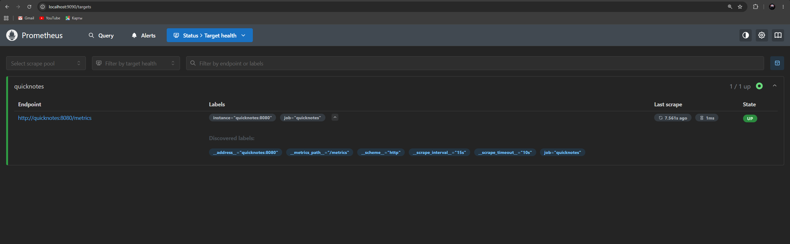
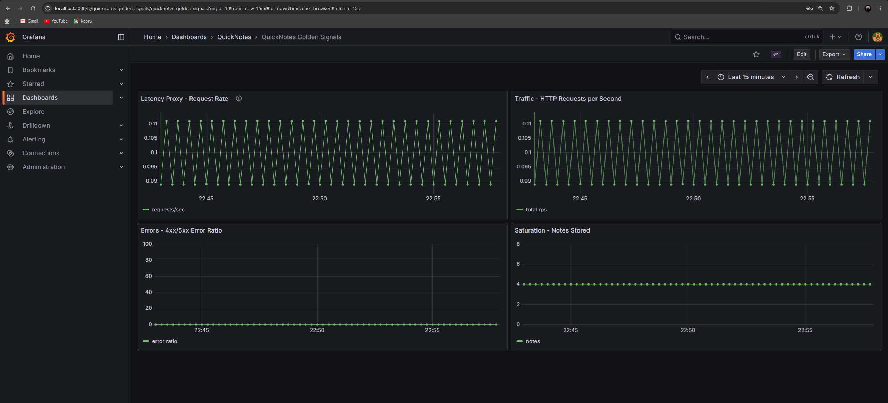
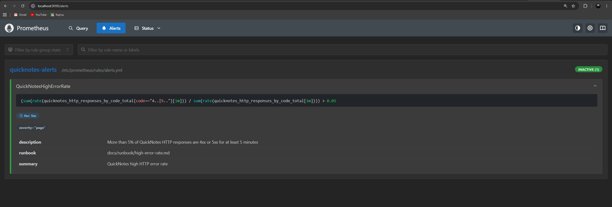
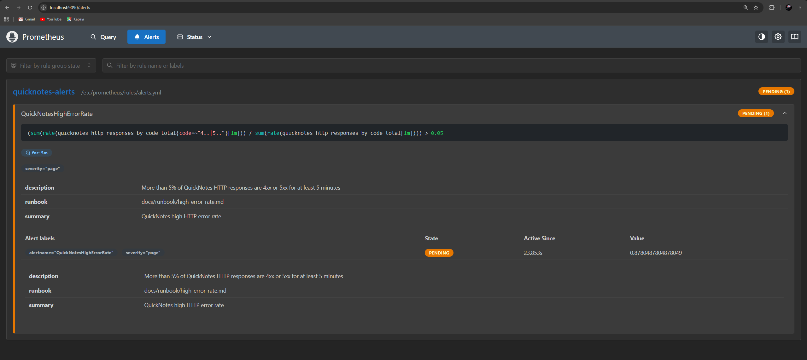
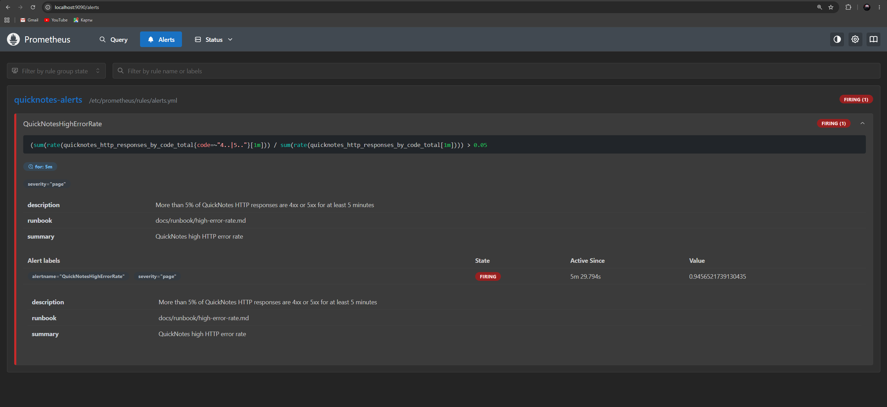

# Lab 8 Submission

## Task 1. Prometheus + Grafana with a Provisioned Dashboard

### Monitoring Layout

The monitoring configuration is located under:

```text
monitoring/
├── prometheus/
│   ├── prometheus.yml
│   └── rules/
│       └── alerts.yml
└── grafana/
    ├── dashboards/
    │   └── golden-signals.json
    └── provisioning/
        ├── dashboards/
        │   └── dashboard.yml
        └── datasources/
            └── datasource.yml
```

The existing `compose.yaml` was extended with two additional services:

- Prometheus
- Grafana

Both services start automatically with Docker Compose.

---

### Bring Up Monitoring Stack

Source file:

```text
submissions/src/lab08/compose_up.txt
```

Command:

```bash
docker compose up --build -d
```

Result:

```text
...
#21 resolving provenance for metadata file
#21 DONE 0.0s
 Image quicknotes:lab6 Built 
 Network devops-intro_default Creating 
 Network devops-intro_default Created 
 Container devops-intro-quicknotes-init-1 Creating 
 Container devops-intro-quicknotes-init-1 Created 
 Container devops-intro-quicknotes-1 Creating 
 Container devops-intro-quicknotes-1 Created 
 Container devops-intro-prometheus-1 Creating 
 Container devops-intro-quicknotes-health-1 Creating 
 Container devops-intro-quicknotes-health-1 Created 
 Container devops-intro-prometheus-1 Created 
 Container devops-intro-grafana-1 Creating 
 Container devops-intro-grafana-1 Created 
 Container devops-intro-quicknotes-init-1 Starting 
 Container devops-intro-quicknotes-init-1 Started 
 Container devops-intro-quicknotes-init-1 Waiting 
 Container devops-intro-quicknotes-init-1 Exited 
 Container devops-intro-quicknotes-1 Starting 
 Container devops-intro-quicknotes-1 Started 
 Container devops-intro-quicknotes-health-1 Starting 
 Container devops-intro-prometheus-1 Starting 
 Container devops-intro-quicknotes-health-1 Started 
 Container devops-intro-prometheus-1 Started 
 Container devops-intro-grafana-1 Starting 
 Container devops-intro-grafana-1 Started
```

---

### Running Containers

Source file:

```text
submissions/src/lab08/compose_ps.txt
```

Command:

```bash
docker compose ps
```

Result:

```text
NAME                               IMAGE                    COMMAND                  SERVICE             CREATED         STATUS         PORTS
devops-intro-grafana-1             grafana/grafana:12.2.0   "/run.sh"                grafana             2 minutes ago   Up 2 minutes   0.0.0.0:3000->3000/tcp, [::]:3000->3000/tcp
devops-intro-prometheus-1          prom/prometheus:v3.6.0   "/bin/prometheus --cтАж"   prometheus          2 minutes ago   Up 2 minutes   0.0.0.0:9090->9090/tcp, [::]:9090->9090/tcp
devops-intro-quicknotes-1          quicknotes:lab6          "/quicknotes"            quicknotes          2 minutes ago   Up 2 minutes   0.0.0.0:8080->8080/tcp, [::]:8080->8080/tcp
devops-intro-quicknotes-health-1   curlimages/curl:8.11.1   "/entrypoint.sh sh -тАж"   quicknotes-health   2 minutes ago   Up 2 minutes
```

All monitoring services are running.

---

### Prometheus Targets

Source file:

```text
submissions/src/lab08/prometheus_targets_raw.json
```

Command:

```bash
curl http://localhost:9090/api/v1/targets
```

Result:

```text
{"status":"success","data":{"activeTargets":[{"discoveredLabels":{"__address__":"quicknotes:8080","__metrics_path__":"/metrics","__scheme__":"http","__scrape_interval__":"15s","__scrape_timeout__":"10s","job":"quicknotes"},"labels":{"instance":"quicknotes:8080","job":"quicknotes"},"scrapePool":"quicknotes","scrapeUrl":"http://quicknotes:8080/metrics","globalUrl":"http://quicknotes:8080/metrics","lastError":"","lastScrape":"2026-06-30T19:15:24.14817236Z","lastScrapeDuration":0.000514332,"health":"up","scrapeInterval":"15s","scrapeTimeout":"10s"}],"droppedTargets":[],"droppedTargetCounts":{"quicknotes":0}}}
```

Screenshot:




This confirms that Prometheus successfully scrapes QuickNotes.

---

### QuickNotes Metrics

Source file:

```text
submissions/src/lab08/quicknotes_metrics.txt
```

Command:

```bash
curl http://localhost:8080/metrics
```

Example metrics:

```text
...
quicknotes_http_responses_by_code_total{code="200"} 170
quicknotes_http_responses_by_code_total{code="201"} 0
quicknotes_http_responses_by_code_total{code="204"} 0
quicknotes_http_responses_by_code_total{code="400"} 0
quicknotes_http_responses_by_code_total{code="404"} 0
quicknotes_http_responses_by_code_total{code="405"} 0
quicknotes_http_responses_by_code_total{code="500"} 0
```

The metrics endpoint exports Prometheus-compatible metrics.

---

### Grafana Dashboard

Screenshot:




The dashboard contains four Golden Signal panels:

- Latency
- Traffic
- Errors
- Saturation

Traffic generated during testing is visible in the graphs.

---

## Task 1 Design Questions

### Question a. Pull vs Push

Prometheus uses a pull model. Prometheus connects to QuickNotes and periodically requests the `/metrics` endpoint.

Only Prometheus needs network access to QuickNotes.

If Prometheus cannot reach QuickNotes, metric collection stops and the target becomes `DOWN`, but the application itself continues running normally.

---

### Question b. Why Use a 15 Second Scrape Interval?

A very short interval such as 5 seconds:

- increases CPU usage
- increases network traffic
- stores much more time-series data

A very long interval such as 5 minutes:

- delays incident detection
- produces coarse graphs
- reduces alert responsiveness

A 15-second interval provides a good balance between accuracy and resource usage.

---

### Question c. rate() vs irate() vs delta()

The Traffic panel should use `rate()`.

- `rate()` calculates the average request rate over a time window and produces stable graphs.
- `irate()` only uses the last two samples and is much noisier.
- `delta()` measures the raw counter increase and is intended for gauges rather than request-rate visualization.

---

### Question d. Why Provision Grafana From Files?

Provisioning makes monitoring reproducible.

The dashboard and data source are stored in version control, so every developer receives exactly the same configuration after running Docker Compose.

No manual configuration through the Grafana UI is required.


---

## Task 2. One Good Alert + Runbook

### Alert Rule

Alert rule file:

```text
monitoring/prometheus/rules/alerts.yml
```

Prometheus rules file:

```text
submissions/src/lab08/prometheus_rules.json
```

The configured alert:

- triggers when HTTP error ratio exceeds 5%
- must remain above the threshold for 5 minutes
- uses `severity: page`
- contains a runbook annotation

---

### Alert Before Error Traffic

Source file:

```text
submissions/src/lab08/prometheus_alerts_initial.json
```

Command:

```bash
curl http://localhost:9090/api/v1/alerts
```

Output:

```json
{
  "status":"success",
  "data":{
    "alerts":[]
  }
}
```

Screenshot:




Initially no alerts were active.

---

### Generate Error Traffic

Source file:

```text
submissions/src/lab08/bad_note.json
```

The following malformed JSON was repeatedly sent to QuickNotes:

```json
{"title":
```

This generated continuous HTTP 400 responses while normal traffic continued in parallel.

---

### Alert Evaluation

Source file:

```text
submissions/src/lab08/prometheus_alerts_after_error_traffic.json
```

Command:

```bash
curl http://localhost:9090/api/v1/alerts
```

The alert rule was successfully evaluated after sustained error traffic.

**Pending**



**Firing**



The alert transitioned through the expected states:

```text
Inactive
-> Pending
-> Firing
```

---

### Runbook

Runbook location:

```text
docs/runbook/high-error-rate.md
```

The runbook contains:

- alert description
- triage procedure
- mitigation steps
- post-incident actions

It provides enough information for an engineer unfamiliar with QuickNotes to investigate the incident.

---

## Task 2 Design Questions

### Question e. Why Wait Five Minutes?

A single failed request does not necessarily indicate an incident.

Using a five-minute window filters out temporary spikes, client mistakes, and short network problems. It reduces false positives and prevents unnecessary paging.

---

### Question f. Symptom Alerts vs Cause Alerts

The configured alert is a symptom alert because it measures user-visible failures.

A cause alert could monitor CPU usage, memory usage, or disk utilization.

Cause alerts are usually worse because high resource usage does not always affect users, while error rate directly reflects service quality.

---

### Question g. Alert Fatigue

An alert becomes too noisy if engineers are paged even though users are not noticeably affected.

If more than approximately 20–30% of pages are false positives, engineers begin ignoring alerts, increasing the risk of missing real incidents.

---


# Observations

- Prometheus successfully scraped QuickNotes metrics every 15 seconds.
- Grafana automatically loaded the provisioned dashboard on startup.
- The dashboard displayed all four Golden Signals.
- QuickNotes exported Prometheus-compatible metrics through the `/metrics` endpoint.
- Prometheus correctly reported the QuickNotes target as `UP`.
- The configured alert used a sustained threshold instead of firing immediately.
- Version-controlled monitoring configuration makes deployment reproducible across environments.
- Grafana provisioning removed the need for manual dashboard creation after every deployment.


# Conclusions

- Prometheus and Grafana were successfully integrated with the QuickNotes application.
- Infrastructure provisioning automatically configured both the monitoring stack and the dashboard.
- The Golden Signals dashboard provides a quick overview of application health.
- The alert rule follows SRE best practices by detecting sustained user-visible failures instead of transient events.
- The runbook documents the investigation and recovery procedure, making on-call response faster and more consistent.
