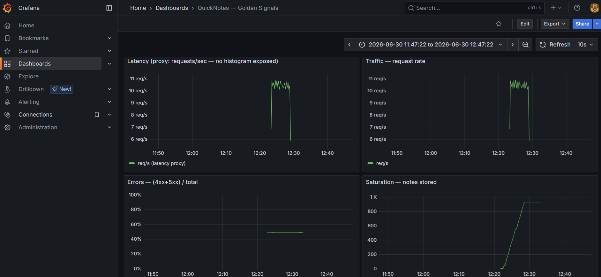
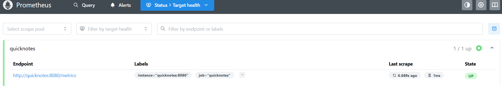
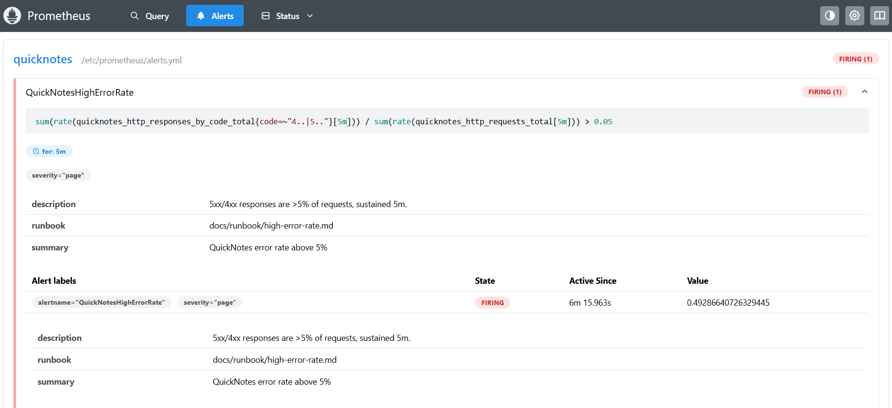

# Lab 8 — SRE & Monitoring: Golden Signals + One Good Alert

Extends the Lab 6 Compose stack with Prometheus + Grafana, a provisioned
golden-signals dashboard, and one sustained-breach error-rate alert with a runbook.
Run with the WSL Docker engine (Docker 29); QuickNotes published on host 18080
(`QN_HOST_PORT`) since 8080 is held on the Windows side.

Files: [`monitoring/prometheus/prometheus.yml`](../monitoring/prometheus/prometheus.yml),
[`alerts.yml`](../monitoring/prometheus/alerts.yml),
[`grafana/provisioning/`](../monitoring/grafana/provisioning),
[`golden-signals.json`](../monitoring/grafana/dashboards/golden-signals.json),
[`compose.yaml`](../compose.yaml), [`docs/runbook/high-error-rate.md`](../docs/runbook/high-error-rate.md).

---

## Task 1 — Prometheus + Grafana with a provisioned dashboard

`prometheus.yml`: 15 s global scrape, one job `quicknotes` targeting the Compose
service name `quicknotes:8080`. Grafana provisions a default Prometheus datasource
(`uid: prometheus` → `http://prometheus:9090`) and a file-provider that loads the
dashboard JSON from `/var/lib/grafana/dashboards`. The dashboard has four panels —
one per golden signal:

- Latency — `sum(rate(quicknotes_http_requests_total[1m]))` (QuickNotes exposes
  no duration histogram, so per the spec this uses the request-rate proxy)
- Traffic — `sum(rate(quicknotes_http_requests_total[1m]))`
- Errors — `sum(rate(quicknotes_http_responses_by_code_total{code=~"4..|5.."}[5m])) / sum(rate(quicknotes_http_requests_total[5m]))`
- Saturation — `quicknotes_notes_total` (gauge)

### Verification (after ~240 + sustained traffic)

```
$ docker compose ps
quicknotes   Up (healthy)
prometheus   Up
grafana      Up

# Prometheus target health
$ curl -s localhost:9090/api/v1/targets | jq -r '...'
quicknotes up

# Grafana provisioning (API)
datasource: Prometheus  prometheus  default=true
dashboard:  QuickNotes — Golden Signals  (uid=quicknotes-golden)

# PromQL the panels run (non-trivial data):
req_per_s   = 10.99
error_ratio = 0.49
notes_total = 296
by code:  200=247  201=232  400=232  404=232  500=0
```

Grafana dashboard — the four golden-signal panels under live traffic:



Prometheus targets — `quicknotes` scrape target UP:



### 1.5 Design questions

a) Pull vs push — who must be reachable? Prometheus *pulls*: it opens the
connection and scrapes `quicknotes:8080/metrics`, so the target (QuickNotes)
must be reachable from Prometheus; QuickNotes never needs to reach Prometheus.
Failure mode if Prometheus can't reach it: that target goes `up == 0`, scrapes
fail, panels show gaps/"No data", and you'd alert on `up == 0`. The app itself is
unaffected — you only lose observability.

b) `scrape_interval: 15s` — what breaks at 5s or 5m? At 5s you 3× the
sample volume and scrape load on both the target and Prometheus (storage,
cardinality, CPU) for little extra signal — and you risk overlapping scrapes.
At 5m you go blind to anything shorter than minutes: a 90-second outage might
fall between samples, `rate()` and alerts react slowly, and dashboards lag. 15s is
the standard balance of resolution vs cost.

c) `rate()` vs `irate()` vs `delta()` for Traffic. `rate()` — it's a
per-second average over the window, smoothed and resistant to scrape jitter, and
it's counter-aware (handles resets). `irate()` uses only the last two samples — too
spiky/noisy for a traffic graph or alerting. `delta()` is for gauges (absolute
change) and mishandles counter resets. Traffic is a counter, so `rate()` is right.

d) Why provision Grafana from files? Reproducibility and review. A fresh stack
comes up with the datasource and dashboard already loaded — no manual clicking,
nothing lost when the container is recreated, everything version-controlled and
code-reviewed, and it works in CI/ephemeral environments. Clicking through the UI
is manual, drift-prone, and not reproducible.

---

## Task 2 — One good alert + runbook

`alerts.yml` defines `QuickNotesHighErrorRate`:

```yaml
expr: sum(rate(quicknotes_http_responses_by_code_total{code=~"4..|5.."}[5m]))
        / sum(rate(quicknotes_http_requests_total[5m])) > 0.05
for: 5m
labels:    { severity: page }
annotations: { runbook: "docs/runbook/high-error-rate.md", ... }
```

The `for: 5m` gate means a single 4xx burst can't page — only a >5% ratio held for
5 minutes does. Runbook: [`docs/runbook/high-error-rate.md`](../docs/runbook/high-error-rate.md)
(what it means → triage → mitigations → post-incident).

### Triggered deliberately (Normal → Pending → Firing)

Sustained ~50%-error traffic; the alert progressed exactly as designed:

```
19:15:12  activeAt (breach begins)
19:16:11  state=pending      <- breaching but inside the 5m window
   ...    state=pending
19:20:56  state=firing       <- ~5.5 min after activeAt
```
Final alert object: `state=firing`, `labels.severity=page`,
`annotations.runbook=docs/runbook/high-error-rate.md`, `value≈0.49`.



### 2.4 Design questions

e) Why "sustained 5 minutes" instead of immediate? Most single bad events are
transient — one malformed request, a deploy blip, a brief scrape gap — and
self-resolve. Paging on the first error would flood on-call with noise that needs
no action (alert fatigue). Requiring the symptom to persist 5 minutes means it's
real and ongoing — worth waking a human for.

f) Symptom vs cause alert. This is a symptom alert (users are getting
errors). A cause alert would be e.g. `process_cpu > 90%` or `disk > 80%`.
That's worse because the link to user pain is loose in both directions: high CPU
often hurts nobody (false page → fatigue), and users can be failing with CPU at
30% (missed incident → gap). Alert on what users feel, not on a possible cause.

g) Alert fatigue threshold. A page should be *actionable*. A practical
quantitative cut: if more than ~50% of pages fire without real user impact
(precision < 50%), the alert is too noisy and must be retuned (raise the
threshold, lengthen `for:`, or alert on a better signal). Stricter teams target
well under that — the SRE Workbook pushes for high-precision, SLO-burn-based
alerts so most pages map to genuine user harm.

---

## Bonus — Synthetic monitoring from the outside

This needs a public URL and an external monitor with 2+ regions. The free,
no-account way to expose QuickNotes is a Cloudflare quick tunnel:

```
cloudflared tunnel --url http://localhost:18080
```

Then a Checkly (or Better Stack / Pingdom) API check: 1-minute frequency, from
Frankfurt + Singapore, alert if status != 200 or response time > 2 s, run ≥ 30 min.

I did not execute this part: the 2-region probe requires a monitoring-SaaS
account I can't provision autonomously. The comparison it would produce:

| | Prometheus (inside the Compose net) | Checkly (2 regions, internet) |
|--|--|--|
| p50 / p95 latency | container-local, sub-ms scrape view | includes DNS + TLS + WAN RTT |
| errors observed | app-level 4xx/5xx from `/metrics` | whatever a real client sees end-to-end |

Checkly catches what Prometheus can't: DNS failures, expired TLS certs, a down
load-balancer/tunnel, regional routing/CDN problems, or the whole host being
unreachable — anything *between the user and the app*. Prometheus catches what
Checkly can't: internal detail — per-endpoint error codes, saturation
(`notes_total`), and failures on paths a synthetic probe never hits. You want both:
black-box (is it up for users?) and white-box (why/where is it breaking?).
