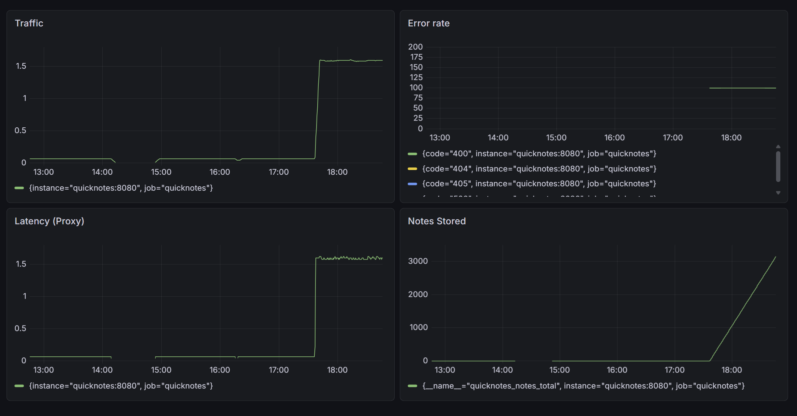
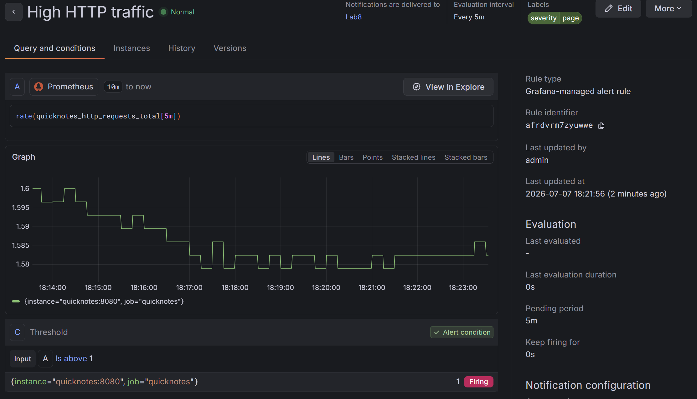

# Lab 8 — SRE & Monitoring

## Task 1 — Prometheus + Grafana

### Prometheus configuration

- prometheus.yml

``` YAML
global:
  scrape_interval: 15s

scrape_configs:
  - job_name: "quicknotes"
    static_configs:
      - targets: ["quicknotes:8080"]
```

### Grafana provisioning

- datasource.yml

```YAML
apiVersion: 1

datasources:
  - name: Prometheus
    type: prometheus
    access: proxy
    url: http://prometheus:9090
    isDefault: true
```

- dashboard.yml

```YAML
apiVersion: 1

providers:
  - name: "Golden Signals"
    orgId: 1
    folder: ""
    type: file
    disableDeletion: false
    editable: true
    options:
      path: /var/lib/grafana/dashboards
```

### Dashboard screenshot



### Alert rule firing screenshot



### Prometheus target verification

```bash
$ curl.exe http://localhost:9090/api/v1/targets
{"status":"success","data":{"activeTargets":[{"discoveredLabels":{"__address__":"quicknotes:8080","__metrics_path__":"/metrics","__scheme__":"http","__scrape_interval__":"15s","__scrape_timeout__":"10s","job":"quicknotes"},"labels":{"instance":"quicknotes:8080","job":"quicknotes"},"scrapePool":"quicknotes","scrapeUrl":"http://quicknotes:8080/metrics","globalUrl":"http://quicknotes:8080/metrics","lastError":"","lastScrape":"2026-07-07T15:51:14.024033667Z","lastScrapeDuration":0.000815163,"health":"up","scrapeInterval":"15s","scrapeTimeout":"10s"}],"droppedTargets":[],"droppedTargetCounts":{"quicknotes":0}}}
```
## Design Questions

### a) Pull vs push

Answer:

Prometheus uses a pull model where it periodically requests metrics from QuickNotes. Prometheus must be able to reach the QuickNotes metrics endpoint. If it cannot reach QuickNotes, scraping fails and the target becomes DOWN.

### b) scrape_interval

Answer:

A shorter interval like 5 seconds increases storage and CPU usage. A longer interval like 5 minutes reduces resolution and can delay detection of problems.

### c) rate vs irate vs delta

Answer:

rate() is used because traffic is a counter and rate() calculates the average per-second increase over a time window.

### d) Provisioning

Answer:

Provisioning allows Grafana dashboards and datasources to be recreated automatically when the stack starts.