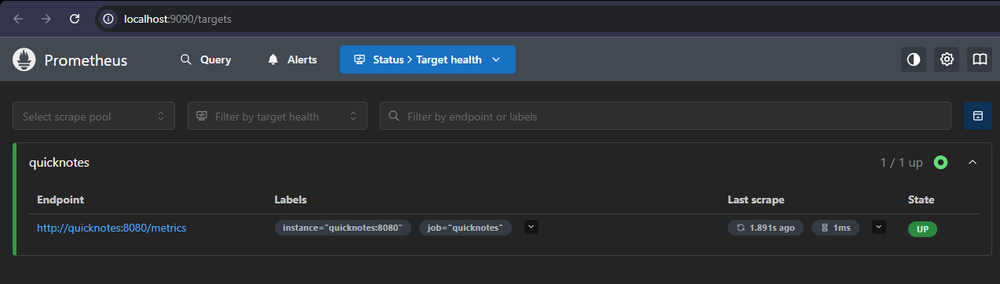
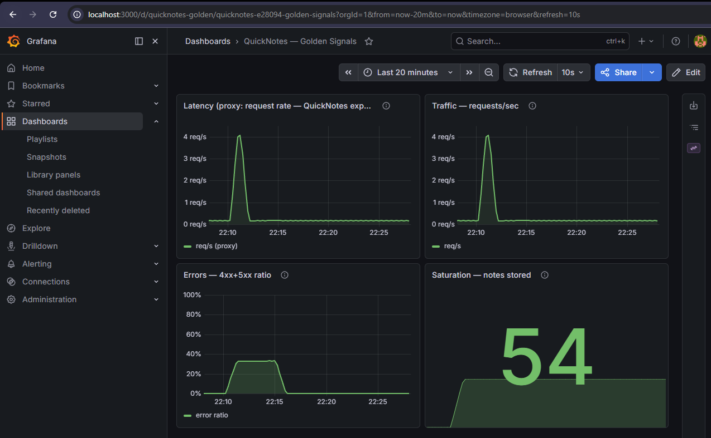
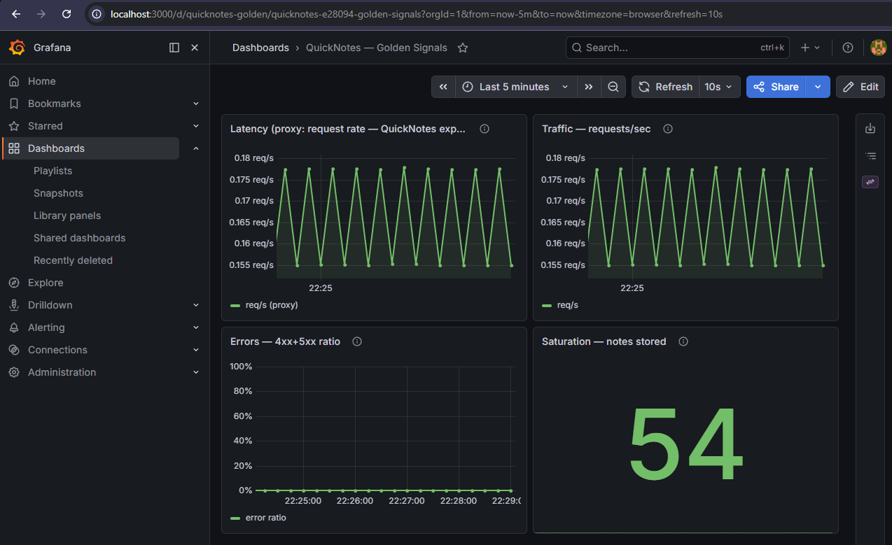

# Lab 8 — SRE & Monitoring: Golden Signals Dashboard + One Good Alert

> Stack: QuickNotes (Lab 6 image) + Prometheus `v3.12.0` + Grafana `13.0.3`, all
> in the one `compose.yaml`. Environment: Windows 11, Docker Desktop (WSL2).

---

## Task 1 — Prometheus + Grafana with a Provisioned Dashboard

### Files produced

```text
monitoring/
├── prometheus/
│   └── prometheus.yml
└── grafana/
    ├── provisioning/
    │   ├── datasources/datasource.yml   # Prometheus DS, set as default
    │   └── dashboards/dashboard.yml      # file provider -> /var/lib/grafana/dashboards
    └── dashboards/
        └── golden-signals.json           # the 4-panel dashboard
```

Plus `prometheus` + `grafana` services added to the existing Lab 6 `compose.yaml`.

#### `monitoring/prometheus/prometheus.yml`

```yaml
global:
  scrape_interval: 15s
  scrape_timeout: 10s

scrape_configs:
  - job_name: quicknotes
    metrics_path: /metrics
    static_configs:
      - targets: ["quicknotes:8080"]
```

The target is the **Compose service name** `quicknotes` + the **in-container** port
`8080` (not the published host port) — Docker's embedded DNS resolves it on the
shared Compose network.

#### `monitoring/grafana/provisioning/datasources/datasource.yml`

```yaml
apiVersion: 1
datasources:
  - name: Prometheus
    type: prometheus
    uid: prometheus
    access: proxy
    url: http://prometheus:9090
    isDefault: true
    editable: false
```

#### `monitoring/grafana/provisioning/dashboards/dashboard.yml`

```yaml
apiVersion: 1
providers:
  - name: golden-signals
    orgId: 1
    folder: ""
    type: file
    disableDeletion: false
    updateIntervalSeconds: 30
    allowUiUpdates: true
    options:
      path: /var/lib/grafana/dashboards
      foldersFromFilesStructure: false
```

#### `monitoring/grafana/dashboards/golden-signals.json`

Full file in the repo: [golden-signals.json](../monitoring/grafana/dashboards/golden-signals.json).
The four panels and their PromQL (matched to the metrics QuickNotes actually
exports on `/metrics`. Note there is **no duration histogram**, so Latency uses
the request-rate proxy):

| Panel           | Golden signal | PromQL                                                                                                                                            |
| --------------- | ------------- | ------------------------------------------------------------------------------------------------------------------------------------------------- |
| Latency (proxy) | Latency       | `sum(rate(quicknotes_http_requests_total[1m]))` — _no histogram exposed; rate stands in_                                                          |
| Traffic         | Traffic       | `sum(rate(quicknotes_http_requests_total[1m]))`                                                                                                   |
| Errors          | Errors        | `sum(rate(quicknotes_http_responses_by_code_total{code=~"4..\|5.."}[5m])) / clamp_min(sum(rate(quicknotes_http_responses_by_code_total[5m])), 1)` |
| Saturation      | Saturation    | `quicknotes_notes_total` (gauge)                                                                                                                  |

#### `compose.yaml` (Lab 8 additions)

```yaml
prometheus:
  image: prom/prometheus:v3.12.0
  depends_on:
    quicknotes:
      condition: service_healthy
  volumes:
    - ./monitoring/prometheus/prometheus.yml:/etc/prometheus/prometheus.yml:ro
  ports:
    - "9090:9090"
  restart: unless-stopped

grafana:
  image: grafana/grafana:13.0.3
  depends_on:
    - prometheus
  volumes:
    - ./monitoring/grafana/provisioning:/etc/grafana/provisioning:ro
    - ./monitoring/grafana/dashboards:/var/lib/grafana/dashboards:ro
    - grafana-data:/var/lib/grafana
  environment:
    GF_SECURITY_ADMIN_USER: admin
    GF_SECURITY_ADMIN_PASSWORD: quicknotes-lab8
    GF_USERS_ALLOW_SIGN_UP: "false"
  ports:
    - "3000:3000"
  restart: unless-stopped
```

### Bring up + verify

**Input:**

```bash
docker compose up --build -d
docker compose ps
```

**Output:**

```text
NAME                        IMAGE                     COMMAND                  SERVICE      CREATED          STATUS                    PORTS
devops-intro-grafana-1      grafana/grafana:13.0.3    "/run.sh"                grafana      14 minutes ago   Up 14 minutes             0.0.0.0:3000->3000/tcp
devops-intro-prometheus-1   prom/prometheus:v3.12.0   "/bin/prometheus --c…"   prometheus   14 minutes ago   Up 14 minutes             0.0.0.0:9090->9090/tcp
devops-intro-quicknotes-1   quicknotes:lab6           "/quicknotes"            quicknotes   14 minutes ago   Up 14 minutes (healthy)   0.0.0.0:8080->8080/tcp
```

Generate ~250 mixed requests (healthy + deliberate 400/404 errors):

```bash
for i in $(seq 1 50); do
  curl -s -o /dev/null http://localhost:8080/notes
  curl -s -o /dev/null http://localhost:8080/health
  curl -s -o /dev/null -X POST -H 'Content-Type: application/json' \
    -d "{\"title\":\"note $i\",\"body\":\"body $i\"}" http://localhost:8080/notes
  curl -s -o /dev/null -X POST -H 'Content-Type: application/json' \
    -d 'not json' http://localhost:8080/notes        # 400
  curl -s -o /dev/null http://localhost:8080/notes/99999   # 404
done
```

Prometheus target is `UP`:

**input**:

```bash
curl http://localhost:9090/api/v1/targets | jq '.data.activeTargets[].health'
```

**output**:

```text
curl http://localhost:9090/api/v1/targets | jq '.data.activeTargets[].health'
  % Total    % Received % Xferd  Average Speed   Time    Time     Time  Current
                                 Dload  Upload   Total   Spent    Left  Speed
100   613  100   613    0     0   253k      0 --:--:-- --:--:-- --:--:--  299k
"up"
```

PromQL behind each panel returns live data:

```bash
# Traffic
curl -sG http://localhost:9090/api/v1/query \
  --data-urlencode 'query=sum(rate(quicknotes_http_requests_total[1m]))'
# Errors ratio
curl -sG http://localhost:9090/api/v1/query \
  --data-urlencode 'query=sum(rate(quicknotes_http_responses_by_code_total{code=~"4..|5.."}[5m])) / clamp_min(sum(rate(quicknotes_http_responses_by_code_total[5m])), 1)'
# Saturation
curl -sG http://localhost:9090/api/v1/query \
  --data-urlencode 'query=quicknotes_notes_total'
```

```text
Traffic     -> 3.196   (req/s, instant)
Errors      -> 0.332   (instant ratio right after the burst; the Errors panel's
                        smoothed 5m-window ratio shows the burst as a ~20% plateau)
Saturation  -> 54      (notes stored)
```

Grafana auto-provisioned both the data source and the dashboard on startup
(`GET /api/datasources`, `GET /api/search`):

```text
Prometheus  prometheus  http://prometheus:9090  default=True
QuickNotes — Golden Signals  uid=quicknotes-golden
```

### Screenshots

**Prometheus — target health** (`http://localhost:9090/targets`): the
`quicknotes` job is `1/1 up`, scraping `http://quicknotes:8080/metrics`.



**Grafana dashboard** (`http://localhost:3000/d/quicknotes-golden` →
**QuickNotes — Golden Signals**, auto-loaded). Viewed over the **last 20 minutes**,
the burst is obvious: Traffic/Latency spike to ~4 req/s, the Errors panel
holds a sustained plateau, and Saturation rises to 54 notes stored.



Over the **last 5 minutes** (after the burst aged out of the window), the panels
settle to the steady background traffic, Docker's healthcheck probes plus
Prometheus self-scrapes which confirms that the dashboard tracks live data.



### Design questions

**a) Pull vs push.** Prometheus **pulls** — it opens the connection to
`quicknotes:8080/metrics`, so **QuickNotes is the side that must be reachable**
from Prometheus (Prometheus itself needs no inbound access). If Prometheus can't
reach QuickNotes the scrape fails, `up` for that target goes to `0`, and panels
show gaps/"No data" — but QuickNotes keeps serving users; only our _visibility_
breaks, not the app.

**b) `scrape_interval`.** At `5s` you ~3× the sample/storage volume and the load
on `/metrics` for little gain (counters are cumulative; `rate()` already
interpolates), and you risk scrapes overrunning `scrape_timeout`. At `5m` you go
nearly blind to short spikes — a 90-second error burst can fall between two
samples — and any `rate()[1m]` query returns no data because a 1m window holds
<2 points. `15s` balances resolution against cost.

**c) `rate()` vs `irate()` vs `delta()`.** **`rate()`** is right for Traffic: it
averages a counter's per-second increase over the window and is
counter-reset-safe, giving a smooth req/s line. `irate()` uses only the last two
points — too twitchy for a dashboard trend. `delta()` is for **gauges**, not
counters, so it's wrong for a request total.

**d) Why provision from files.** A fresh `docker compose up` comes up already
wired — data source + dashboard appear with no manual clicking — so the setup is
reproducible, identical across machines, and **version-controlled** (the
dashboard JSON is reviewed in the PR like any other code). Clicking through the
UI each time is unrepeatable and lost when the container's volume is wiped.
