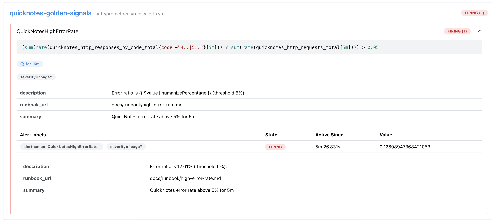
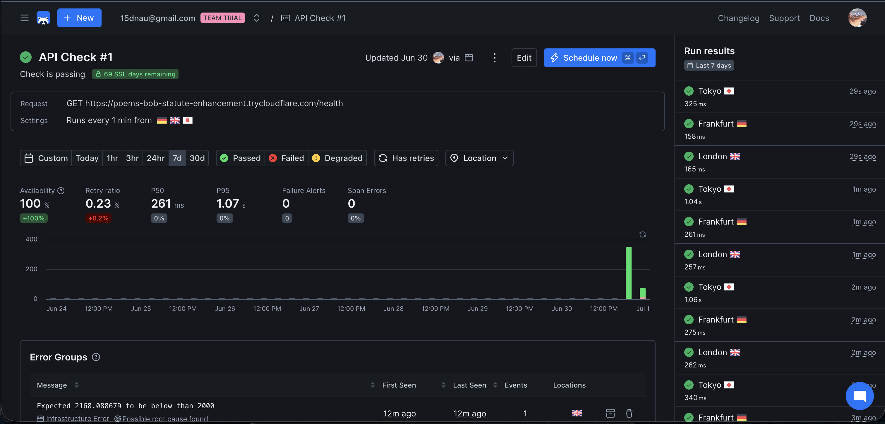

# Lab 8 — SRE & Monitoring: Golden Signals Dashboard + One Good Alert

**Author:** Dmitrii · **Branch:** `feature/lab8`

QuickNotes (Lab 6) now runs alongside Prometheus and Grafana in the Compose stack.
Prometheus scrapes QuickNotes' `/metrics`, Grafana auto-provisions a four-panel
golden-signals dashboard and a Prometheus datasource, and a Prometheus rule pages on a
sustained >5% error rate. Everything is provisioned from files — a fresh
`docker compose up` reproduces the whole observability stack with zero manual clicks.

---

## Task 1 — Prometheus + Grafana with a Provisioned Dashboard

### Layout

```
monitoring/
├── prometheus/
│   ├── prometheus.yml
│   └── rules/
│       └── alerts.yml
└── grafana/
    ├── dashboards/
    │   └── golden-signals.json          # the dashboard (mounted at /var/lib/grafana/dashboards)
    └── provisioning/
        ├── datasources/
        │   └── datasource.yml           # Prometheus datasource, set default
        └── dashboards/
            └── dashboard.yml            # provider: load JSON from /var/lib/grafana/dashboards
```

### Config files

**`monitoring/prometheus/prometheus.yml`** — 15s scrape interval, one job targeting the
QuickNotes Compose service by name + container port:

```yaml
global:
  scrape_interval: 15s
  evaluation_interval: 15s

rule_files:
  - /etc/prometheus/rules/*.yml

scrape_configs:
  - job_name: quicknotes
    metrics_path: /metrics
    static_configs:
      - targets: ["quicknotes:8080"]      # Compose DNS resolves this inside the network
```

**`monitoring/grafana/provisioning/datasources/datasource.yml`** — Prometheus datasource,
default, pointing at the Compose service:

```yaml
apiVersion: 1
datasources:
  - name: Prometheus
    type: prometheus
    uid: prometheus
    access: proxy
    url: http://prometheus:9090
    isDefault: true
    editable: false
```

**`monitoring/grafana/provisioning/dashboards/dashboard.yml`** — file provider pointing at
the mount path:

```yaml
apiVersion: 1
providers:
  - name: golden-signals
    orgId: 1
    type: file
    options:
      path: /var/lib/grafana/dashboards
```

**`monitoring/grafana/dashboards/golden-signals.json`** — the dashboard. Four panels, one
per golden signal (full JSON in the repo):

| Panel | PromQL |
|-------|--------|
| **Latency** (proxy — no histogram exposed) | `sum(rate(quicknotes_http_requests_total[5m]))` |
| **Traffic** | `sum(rate(quicknotes_http_requests_total[5m]))` |
| **Errors** | `sum(rate(quicknotes_http_responses_by_code_total{code=~"4..\|5.."}[5m])) / sum(rate(quicknotes_http_requests_total[5m]))` |
| **Saturation** | `quicknotes_notes_total` |

> QuickNotes exposes only counters/gauges (no request-duration histogram), so the Latency
> panel uses the request-rate proxy the spec permits.

**`compose.yaml`** extension — pinned images, read-only config mounts, healthcheck gate,
no default Grafana creds:

```yaml
  prometheus:
    image: prom/prometheus:v3.5.0
    volumes:
      - ./monitoring/prometheus/prometheus.yml:/etc/prometheus/prometheus.yml:ro
      - ./monitoring/prometheus/rules:/etc/prometheus/rules:ro
    command: [--config.file=/etc/prometheus/prometheus.yml]
    ports: ["9090:9090"]
    depends_on:
      quicknotes: { condition: service_healthy }
    restart: unless-stopped

  grafana:
    image: grafana/grafana:13.0.2
    environment:
      GF_SECURITY_ADMIN_USER: admin
      GF_SECURITY_ADMIN_PASSWORD: ${GRAFANA_ADMIN_PASSWORD:-changeme-please}
    volumes:
      - ./monitoring/grafana/provisioning:/etc/grafana/provisioning:ro
      - ./monitoring/grafana/dashboards:/var/lib/grafana/dashboards:ro
    ports: ["3000:3000"]
    depends_on: [prometheus]
    restart: unless-stopped
```

> Lab-6 fix found while wiring this up: the QuickNotes healthcheck must invoke the binary's
> `healthcheck` **subcommand** (`["CMD", "/quicknotes", "healthcheck"]`), not a `-health`
> flag — otherwise the container never reports healthy and `depends_on:
> condition: service_healthy` blocks Prometheus from starting.

### Verification

Prometheus target is `up`:

```
$ curl -s http://localhost:9090/api/v1/targets | jq '.data.activeTargets[].health'
"up"
```

Grafana auto-loaded the dashboard ( `GET /api/search?type=dash-db` ):

```json
{ "title": "QuickNotes — Golden Signals", "uid": "quicknotes-golden" }
```

After ~200 mixed requests + sustained traffic, all four panels show non-trivial graphs
(Traffic/Latency ≈ 0.8 req/s, Errors crossing the 5% threshold line, Saturation = 24 notes).


### Design questions

**a) Pull vs push.** Prometheus *pulls*, so **QuickNotes must be reachable from Prometheus**
at `quicknotes:8080` on the Compose network — QuickNotes never needs to know Prometheus
exists. Failure mode: if Prometheus can't reach QuickNotes, the target goes `up == 0` and
every panel goes "No data"; we lose *visibility*, but QuickNotes keeps serving users
normally. (We are blind, not down.)

**b) `scrape_interval`.** `5s` triples sample volume → 3× storage and TSDB cardinality
pressure plus extra load on the scraped target, for little added signal. `5m` is cheap but
coarse: outages or spikes shorter than 5 minutes fall between scrapes and are invisible, and
`rate()` over short windows breaks because it needs several samples inside the window. `15s`
balances resolution against cost.

**c) `rate()` vs `irate()` vs `delta()`.** Use **`rate()`** for Traffic. It's the
per-second average increase of a monotonic **counter** over the window, which smooths scrape
jitter and counter resets — ideal for a dashboard. `irate()` uses only the last two samples,
so it's spiky and better for fast-moving alerting expressions, not trend panels. `delta()` is
for **gauges** (non-monotonic), so it's wrong for a counter like
`quicknotes_http_requests_total`.

**d) Why provision from files.** Reproducibility and review: the datasource and dashboard are
versioned in git, recreated identically on every `docker compose up`, survive container
re-creation, and change through PRs instead of undocumented UI clicks. No "works on my
Grafana" drift.

---

## Task 2 — One Good Alert + Runbook

### Alert rule — `monitoring/prometheus/rules/alerts.yml`

```yaml
groups:
  - name: quicknotes-golden-signals
    rules:
      - alert: QuickNotesHighErrorRate
        expr: |
          (
            sum(rate(quicknotes_http_responses_by_code_total{code=~"4..|5.."}[5m]))
            /
            sum(rate(quicknotes_http_requests_total[5m]))
          ) > 0.05
        for: 5m
        labels:
          severity: page
        annotations:
          summary: "QuickNotes error rate above 5% for 5m"
          description: "Error ratio is {{ $value | humanizePercentage }} (threshold 5%)."
          runbook_url: "docs/runbook/high-error-rate.md"
```

Why this satisfies "sustained, not single-event": the `rate(...[5m])` window already smooths
a single 4xx burst, and `for: 5m` then requires the breach to *persist* before the alert
leaves `Pending`. A single malformed request can't page anyone. If traffic is zero the
division is absent, so the rule stays Inactive instead of firing on NaN.

### Observed firing

Drove ~14% errors (6 healthy GETs + 1 malformed `POST /notes` per second) sustained for
more than 5 minutes and watched the transition:

```
[17:43:42] state=pending
[17:43:57] state=pending
[17:44:12] state=pending
[17:44:27] state=firing      ← exactly 5m after activeAt 17:39:17
```

Firing payload:

```json
{
  "labels":  { "alertname": "QuickNotesHighErrorRate", "severity": "page" },
  "annotations": {
    "description": "Error ratio is 12.39% (threshold 5%).",
    "runbook_url": "docs/runbook/high-error-rate.md"
  },
  "state": "firing",
  "value": "0.1239"
}
```



### Runbook

Lives next to the code at [`docs/runbook/high-error-rate.md`](../docs/runbook/high-error-rate.md)
and is auto-linked from the alert's `runbook_url` annotation. Full text:

> # Runbook — QuickNotes High Error Rate
>
> **Alert:** `QuickNotesHighErrorRate` · **Severity:** page
>
> ## What this alert means
> More than 5% of HTTP responses from QuickNotes have been 4xx/5xx for at least
> 5 minutes — users are seeing real failures right now, not a one-off blip.
>
> ## Triage steps (in order)
> 1. **Confirm it's real, not a probe artifact.** Open Grafana →
>    *QuickNotes — Golden Signals* (http://localhost:3000) and check the **Errors**
>    panel is still above the red 5% line, and **Traffic** is non-zero (a divide on
>    near-zero traffic can spike the ratio).
> 2. **Find which status code dominates.** In Prometheus (http://localhost:9090),
>    run `topk(5, sum by (code) (rate(quicknotes_http_responses_by_code_total[5m])))`.
>    `5xx` ⇒ server/app fault; mostly `4xx` ⇒ bad client traffic or a broken caller.
> 3. **Read the logs around the spike.** `docker compose logs --since=15m quicknotes`.
>    Look for panics, `failed to persist note`, or a flood of `invalid JSON body`.
> 4. **Check saturation & the host.** Glance at the **Saturation** panel and
>    `docker compose ps` / `docker stats quicknotes` — is the container restarting,
>    OOM-killed, or out of disk for `/data`?
>
> ## Mitigations (stop the bleeding)
> - **Roll back** to the last known-good image: redeploy the previous
>   `quicknotes` tag and `docker compose up -d quicknotes`.
> - **Restart the service** to clear a wedged process: `docker compose restart quicknotes`.
> - **Shed bad traffic** if the errors are an abusive/broken client: block the
>   source upstream (reverse proxy / firewall) until the caller is fixed.
>
> ## Post-incident
> Once errors are back below 5%, mark the alert resolved and write a blameless
> postmortem using the Lecture 1 template (`lectures/` → postmortem template):
> timeline, root cause, what detected it (this alert), and the follow-up actions
> to prevent recurrence.

A 3 AM on-call who has never seen QuickNotes can act from this: every step names the exact
URL or command to run.

### Design questions

**e) Why sustained 5 minutes.** A single bad request (one client sending malformed JSON)
isn't an incident — paging on it trains on-call to ignore pages. Requiring the breach to hold
for 5 minutes filters transient blips and only pages on a *real, ongoing, user-facing*
problem. It trades a few minutes of detection latency for far fewer false pages.

**f) Symptom vs cause.** Our alert is a **symptom** alert — it fires on what users actually
experience (failed responses). A **cause** alert would be e.g. "QuickNotes CPU > 90%" or
"`/data` disk > 80%". Cause alerts are worse on both sides: high CPU may never hurt a user
(false page on a proxy metric), *and* errors can happen at normal CPU (missed incident). You
end up paging on a guess about *why* instead of the *what users feel*.

**g) Alert fatigue threshold.** If more than ~**20–30%** of pages from this alert fire when
**no user was actually harmed** (no SLO burn, traffic was near-zero, or it self-resolved
before anyone acted), the alert is too noisy and must be retuned — raise the threshold,
lengthen `for:`, or switch to an SLO burn-rate alert. Past roughly one-in-three false pages,
on-call starts reflexively dismissing it, which is worse than not having the alert.

---

## Bonus — Synthetic Monitoring from the Outside

Exposed QuickNotes publicly with `cloudflared tunnel --url http://localhost:8080`
(`https://poems-bob-statute-enhancement.trycloudflare.com`) and configured a **Checkly API
check** hitting `<tunnel>/health` **every 1 minute from 3 regions** (Germany 🇩🇪, UK 🇬🇧,
Japan 🇯🇵 — ≥ 2 required), asserting `status == 200` and `response time < 2000 ms`. Left it
running > 30 minutes: **100% availability, 0 failures.**



### Internal vs external, same window

Prometheus (last 30 min, queried directly):

```
$ curl -s 'http://localhost:9090/api/v1/query' \
    --data-urlencode 'query=sum(rate(quicknotes_http_requests_total[30m]))' | jq -r '.data.result[0].value[1]'
0.2168            # ≈ 0.22 req/s

$ curl -s 'http://localhost:9090/api/v1/query' \
    --data-urlencode 'query=sum(rate(quicknotes_http_responses_by_code_total{code=~"4..|5.."}[30m])) / sum(rate(quicknotes_http_requests_total[30m]))' | jq -r '.data.result[0].value[1]'
0                 # 0% errors this window
```

| | Prometheus (inside the Compose net) | Checkly (3 regions, external) |
|--|---|---|
| Avg latency **p50** | **N/A** — no request-duration histogram exposed | **261 ms** |
| Avg latency **p95** | **N/A** — no histogram | **1.07 s** |
| Errors observed | **0%** error ratio over 30 m (traffic ≈ 0.22 req/s) | **100%** availability; **1** latency-assertion breach (London run = 2168 ms > 2000 ms), recovered on retry |

The most telling row is latency: **Prometheus can't report it at all**, because QuickNotes
only exposes counters/gauges. Checkly measures real end-to-end latency (261 ms p50 /
1.07 s p95) from the outside without any app instrumentation — and that p95 already includes
the Cloudflare-tunnel + cross-region network hop, which is exactly the user-perceived path
Prometheus never sees. The per-region spread makes the point concrete: **Tokyo** runs land
~325–340 ms (and occasionally > 1 s) while **Frankfurt/London** sit at ~160–275 ms — purely a
function of distance from the tunnel origin, a dimension invisible to an in-network scraper.

One run from **London actually breached the 2000 ms assertion (2168 ms)** and opened a
Checkly Error Group; the linear retry then passed, so availability stayed 100% (retry ratio
0.23%). That single event is the whole argument in miniature — a real user-facing latency
regression that QuickNotes' internal metrics, having no latency signal at all, would never
have surfaced.

### Failure-mode analysis

- **What Checkly catches that Prometheus cannot:** anything *between the user and the app* —
  the cloudflared tunnel or ingress going down, DNS/TLS failures, cross-region network
  problems, or the whole host dying. In all those cases Prometheus, scraping from *inside* the
  same Compose network, still sees a perfectly healthy app and `up == 1` while real users
  outside get nothing. Checkly also catches latency/SLA regressions Prometheus is blind to
  here (no histogram).
- **What Prometheus catches that Checkly cannot:** fine-grained internal signal — per-status
  -code error breakdown (`quicknotes_http_responses_by_code_total`), saturation
  (`quicknotes_notes_total`), and the *full* request stream. A once-a-minute external probe
  on a single path statistically misses low-rate or endpoint-specific errors: our 30-min
  error injection earlier was plainly visible to Prometheus (12%+ ratio) yet a 1/min Checkly
  probe hitting only `/health` would likely have stayed green throughout.

---

## Reproduce

```bash
echo "GRAFANA_ADMIN_PASSWORD=$(openssl rand -base64 18)" > .env
docker compose up -d --build
curl -s http://localhost:9090/api/v1/targets | jq '.data.activeTargets[].health'   # "up"
# Grafana: http://localhost:3000  (admin / $GRAFANA_ADMIN_PASSWORD)
# Prometheus: http://localhost:9090/targets  and  /alerts
```
