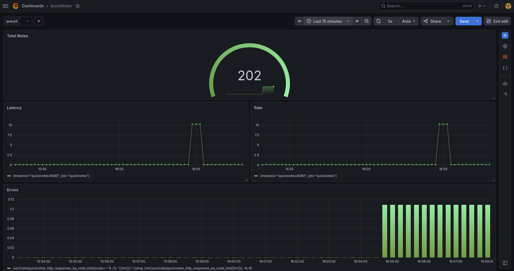
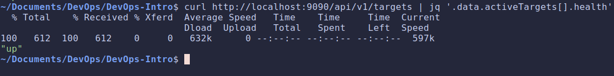
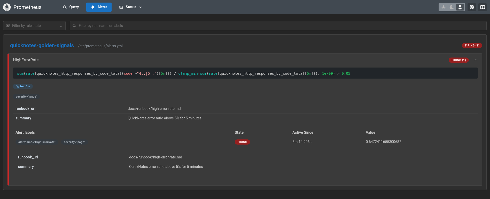

# Lab 8 submission

## Task 1: Prometheus + Grafana with a Provisioned Dashboard

### Configuration files

- [**Docker Compose**](https://github.com/sparrow12345/DevOps-Intro/blob/feature/lab8/compose.yaml)
- [**Prometheus**](https://github.com/sparrow12345/DevOps-Intro/blob/feature/lab8/monitoring/prometheus/prometheus.yml)
- **Grafana:**
  - [datasource.yml](https://github.com/sparrow12345/DevOps-Intro/blob/feature/lab8/monitoring/grafana/provisioning/datasources/datasource.yml)
  - [dashboard.yml](https://github.com/sparrow12345/DevOps-Intro/blob/feature/lab8/monitoring/grafana/provisioning/dashboards/dashboard.yml)

### Grafana dashboard

### Curl output

### Design questions

- **Pull vs push: Prometheus pulls. What does that mean for which side (Prometheus or QuickNotes) needs to be reachable? What's the failure mode if Prometheus can't reach QuickNotes?**

  Pull means prometheus initiates the connection, so QuickNotes must be reachable by prometheus and QuickNotes never needs to reach Prometheus.
  Failure mode: if Prometheus can't reach QuickNotes the target goes `up == 0` and we get old data.

- **`scrape_interval: 15s` is a default. What query problems do you create by setting it to 5s? To 5m?**

  With `scrape_interval: 5s` we get more data: higher storage + memory + cost and rate() windows must still be ≥ 4× the interval so very short ranges get noisy/empty.
  `scrape_interval: 5m` we miss short spikes entirely and alerts react slowly.

- **PromQL `rate()` vs `irate()` vs `delta()` — which one is right for the Traffic panel and why?**

  We use `rate()` for Traffic. `rate()` is the average per-second rate over the window good for dashboards/alerts. `irate()` uses only the last two points not very good for a traffic graph. `delta()` is for gauges, not counters, and isn't reset-aware.

- **Why provision Grafana from files instead of clicking through the UI on every fresh stack?**

  For reproducibility and version control, a fresh docker compose up on any machine will get us the identical datasource + dashboard, without manual setup.

## Task 2: One Good Alert + Runbook

### Alert definition

[Prometheus alert](https://github.com/sparrow12345/DevOps-Intro/blob/feature/lab8/monitoring/prometheus/alerts.yml)

### Firing alert

### Runbook

[Runbook](https://github.com/sparrow12345/DevOps-Intro/blob/feature/lab8/docs/runbook/high-error-rate.md)

### Design questions

- **Why "sustained for 5 minutes" instead of "fire immediately on first bad request"?**

  A single bad request is noise, not an incident. Requiring the ratio to hold for 5 min will lead to paging for ongoing problems while reducing false pages and having less alert fatigue.

- **Symptom alerts vs cause alerts: the alert above is a symptom alert. What's an example of a cause alert someone might write for QuickNotes? Why is it worse?**

  A cause alert would be e.g. "CPU > 90%" or "disk usage > 95%". Cause alerts are worse because high CPU may not hurt users at all, but might be a sign of internal damage or an unknown intrusion while a symptom alert catches any root cause that actually degrades users.

- **Alert fatigue: Lecture 8 cited it as the bigger danger than too few alerts. What's a quantitative threshold ("page X% of the time the user wasn't actually affected") that would mean your alert is too noisy?**

  If more than ~5–10% of pages fire while users were not actually affected, the alert is too noisy and should be changed and tuned.
