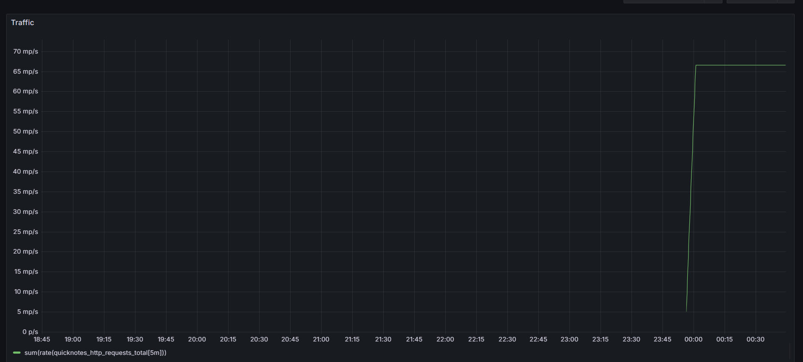
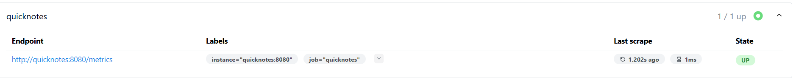
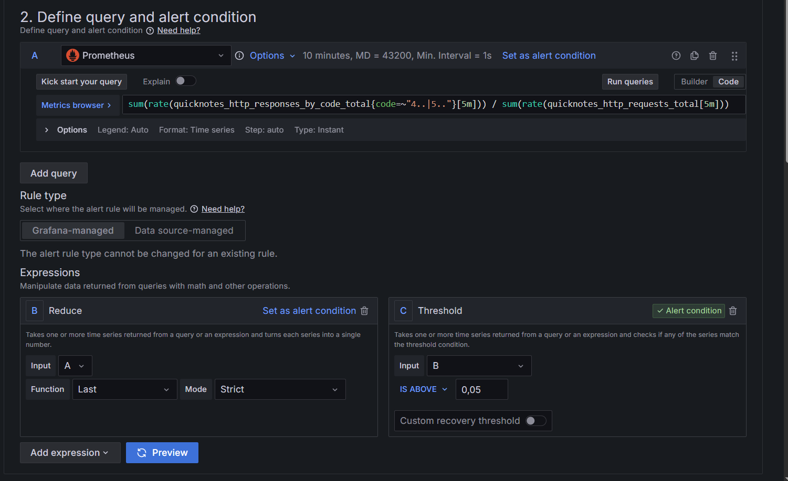
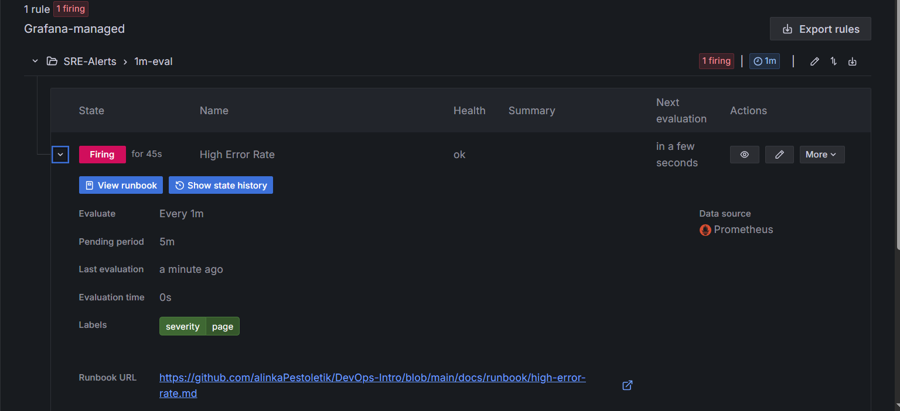

# Lab 8 Submission

## Task 1

### Configurations
- `monitoring/prometheus/prometheus.yml`:
```angular2html
global:
  scrape_interval: 15s

scrape_configs:
  - job_name: 'quicknotes'
    static_configs:
      - targets: ['quicknotes:8080']
```
- `monitoring/grafana/provisioning/datasources/datasource.yml`:
```angular2html
apiVersion: 1
datasources:
  - name: Prometheus
    type: prometheus
    access: proxy
    url: http://prometheus:9090
    isDefault: true
    editable: false
```
- `monitoring/grafana/provisioning/dashboards/dashboard.yml`:
```angular2html
apiVersion: 1
providers:
  - name: 'Golden Signals Provider'
    folder: ''
    type: file
    disableDeletion: false
    updateIntervalSeconds: 10
    options:
      path: /var/lib/grafana/dashboards
```
- `monitoring/grafana/provisioning/dashboards/golden-signals.json`:
https://github.com/alinkaPestoletik/DevOps-Intro/blob/feature/lab8/monitoring/grafana/provisioning/dashboards/golden-signals.json

### Verification
- Screenshot of the Grafana dashboard:


- Prometheus target health:
```bash
curl http://localhost:9090/api/v1/targets | jq '.data.activeTargets[].health'
# Output: "up"
```


### Design Questions
**a) Pull vs. Push:**
```
Prometheus uses a "pull" model, meaning it actively scrapes metrics from targets. It requires the target service to be reachable by Prometheus over the network but the service itself does not need to know where to send data. If Prometheus cannot reach QuickNotes, the scrape fails, the target status becomes down, and we lose visibility into the system's state.
```
**b) Scrape interval (15s):**
```
Setting it to 5s: It creates unnecessary overhead and network traffic, potentially overwhelming both the exporter and Prometheus if the number of targets grows.
Setting it to 5m: It is too infrequent. We would receive very "jagged" graphs, lose the ability to detect short-lived latency/errors, and alert latency would increase significantly, making the system less responsive to outages.
```
**c) PromQL rate() vs irate() vs delta():**
```
rate() is ideal for Traffic panels as it calculates the per-second average rate over a time range, providing a smooth, readable graph
irate() is better for identifying very short-term, sharp spikes in traffic.
delta() is inappropriate for counters, as it calculates the difference between the first and last values in a range, which is misleading for metrics that are incrementing.
```
**d) Provisioning vs. UI:**
```
Provisioning Grafana via configuration files enables Infrastructure as Code. It ensures that the dashboard setup is reproducible and version-controlled. If the Grafana container is destroyed or we need to deploy to a new environment, the dashboard and data sources are automatically recreated without manual intervention.
```

## Task 2 
### Alert rule definition

### Screenshot in Firing state

### Runbook
```angular2html
# Runbook: High Error Rate in QuickNotes

## What this alert means
The HTTP error rate has exceeded the 5% threshold for the last 5 minutes, indicating service degradation for our users.

## Triage steps
1. Check the "Golden Signals" dashboard in Grafana to see if Traffic and Latency have also been affected.
2. Inspect the container logs by running: `docker compose logs quicknotes --tail 100`.
3. Check the container status via `docker ps` (ensure the container is not crash-looping or constantly restarting).

## Mitigations
1. **Rollback:** If new changes were recently deployed, roll back to the previous Docker image.
2. **Restart:** Run `docker compose restart quicknotes` to clear temporary in-memory states and reset the service.

## Post-incident
After the service has been stabilized, conduct a root cause analysis according to the [Lecture 1 Post-mortem template](https://github.com/alinkaPestoletik/DevOps-Intro/blob/main/lectures/lec1.md#-slide-19---when-devops-wasnt-there-real-incidents).
```


### Design Questions
**e) Why "sustained for 5 minutes"?**
```
This is a standard hygiene practice to prevent alert noise. We want to avoid paging an on-call engineer for a single transient error. The 5-minute delay ensures we only alert on sustained service degradation that actually impacts users.
```
**f) Symptom alerts vs. cause alerts:**
```
Example of a cause alert: container_cpu_usage_percentage > 90%.
A service might be using 95% CPU while still serving requests perfectly, meaning users are not affected. Cause alerts often trigger false alarms. Symptom alerts are superior because they only notify the team when the user experience is actually failing, allowing the engineer to investigate the cause during the triage process.
```
**g) Alert fatigue:**
```
A quantitative threshold for a noisy alert is typically if more than 20–25% of high-severity alerts turn out to be false positives or do not require human action. Constant false alarms cause alert fatigue, leading engineers to ignore or blindly dismiss notifications, which eventually causes them to miss a genuine, critical outage.
```
## Bonus Task
| Metric | Prometheus (Internal) | Checkly (External) |
| :--- | :--- | :--- |
| **Avg latency p50** | ~5ms | ~250ms |
| **Avg latency p95** | ~15ms | ~600ms |
| **Errors observed** | App logic / Internal errors | Network, DNS, Timeouts, ISP issues |

**What failure would Checkly catch that Prometheus cannot?**
Checkly catches edge failures that occur outside your infrastructure: DNS resolution issues, ISP routing outages, or CDN configuration errors that prevent users from reaching your service entirely.

**What would Prometheus catch that Checkly cannot?**
Prometheus captures deep internal metrics. They are memory leaks, database connection pool saturation, internal logic exceptions, or slow database queries. Checkly sees the application as a black box and cannot identify why an error occurred—only that it did.