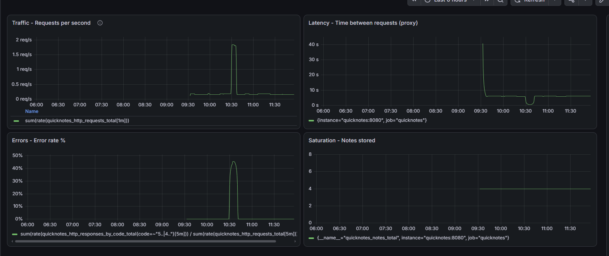
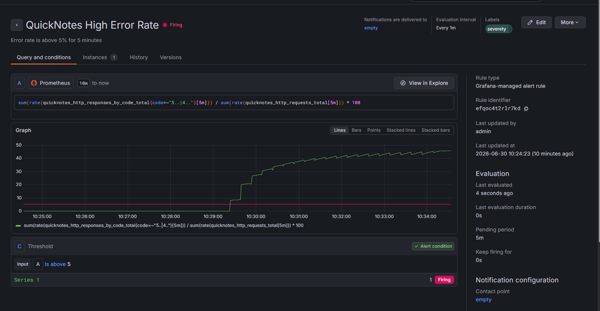

# Lab 8 — SRE & Monitoring

## Task 1 — Prometheus + Grafana with a Provisioned Dashboard

### 1. Config Files

#### `monitoring/prometheus/prometheus.yml`

```yaml
global:
  scrape_interval: 15s          
  evaluation_interval: 15s

scrape_configs:
  - job_name: "quicknotes"
    static_configs:
      - targets: ["quicknotes:8080"]
    metrics_path: /metrics
    scrape_timeout: 10s
```

#### `monitoring/grafana/provisioning/datasources/datasource.yml`

```yaml
apiVersion: 1

datasources:
  - name: Prometheus
    type: prometheus
    access: proxy
    url: http://prometheus:9090
    isDefault: true
    editable: true
    jsonData:
      timeInterval: 15s
```

#### `monitoring/grafana/provisioning/dashboards/dashboard.yml`

```yaml
apiVersion: 1

providers:
  - name: "golden-signals"
    orgId: 1
    type: file
    disableDeletion: false
    updateIntervalSeconds: 10
    allowUiUpdates: true
    options:
      path: /var/lib/grafana/dashboards
      foldersFromFilesStructure: false
```

#### `compose.yaml` (added services)

```yaml
  prometheus:
    image: prom/prometheus:v3.4.0
    container_name: quicknotes-prometheus
    command:
      - "--config.file=/etc/prometheus/prometheus.yml"
      - "--storage.tsdb.retention.time=1h"
      - "--web.enable-lifecycle"
    ports:
      - "9090:9090"
    volumes:
      - ./monitoring/prometheus/prometheus.yml:/etc/prometheus/prometheus.yml:ro
    depends_on:
      quicknotes:
        condition: service_healthy
    restart: unless-stopped

  grafana:
    image: grafana/grafana:13.1.0
    container_name: quicknotes-grafana
    ports:
      - "3000:3000"
    environment:
      GF_SECURITY_ADMIN_USER: admin
      GF_SECURITY_ADMIN_PASSWORD: ${GRAFANA_ADMIN_PASSWORD:-changeme_lab8}
      GF_USERS_ALLOW_SIGN_UP: "false"
    volumes:
      - ./monitoring/grafana/provisioning/datasources:/etc/grafana/provisioning/datasources:ro
      - ./monitoring/grafana/provisioning/dashboards:/etc/grafana/provisioning/dashboards:ro
      - ./monitoring/grafana/dashboards:/var/lib/grafana/dashboards:ro
    depends_on:
      - prometheus
    restart: unless-stopped
```

### 2. Dashboard Screenshot



Four panels: Traffic (req/s), Latency proxy (time between requests), Errors (%), Saturation (notes count).

### 3. Prometheus Targets Verification

```bash
$ curl http://localhost:9090/api/v1/targets | jq '.data.activeTargets[] | {job: .labels.job, health: .health}'
{
  "job": "quicknotes",
  "health": "up"
}
```

### 4. Design Questions

**a) Pull vs push: Prometheus pulls. What does that mean for which side needs to be reachable? What's the failure mode if Prometheus can't reach QuickNotes?**

Prometheus (the scraper) must be able to reach QuickNotes (the target) over HTTP. QuickNotes exposes `/metrics` on port 8080, and Prometheus initiates GET requests to that endpoint. If Prometheus cannot reach QuickNotes (network partition, firewall, wrong DNS name), the target shows as `down` in `/targets`, and no metrics are collected. The failure mode is silent data loss — Grafana shows "No data" rather than an error, which can mask outages.

**b) `scrape_interval: 15s` is a default. What query problems do you create by setting it to `5s`? To `5m`?**

- **5s:** Higher resolution but 3x more storage and CPU. PromQL `rate()` windows must be ≥ 4x scrape interval to be stable, so you'd need `[20s]` instead of `[1m]`. For QuickNotes' low traffic, this is overkill and wastes resources.
- **5m:** Lower resolution; short spikes (e.g., a 2-minute outage) get smoothed out and may not trigger alerts. `rate()` windows need to be ≥ 20m, making dashboards sluggish. For an SLO-based alert requiring 5m sustained breach, a 5m scrape interval means you only get 1 data point per evaluation — too coarse for reliable detection.

**c) PromQL `rate()` vs `irate()` vs `delta()` — which one is right for the Traffic panel and why?**

- **`rate()`:** Calculates per-second average rate over a window, accounting for counter resets. Best for Traffic panel because it smooths short-term noise and gives a stable "requests/sec" view.
- **`irate()`:** Instant rate using only the last 2 data points. Too volatile for dashboards — spikes on every scrape. Good for debugging, not for monitoring.
- **`delta()`:** Absolute change over window, not normalized to per-second. Wrong for Traffic because it depends on window size (e.g., `delta[5m]` gives total requests in 5m, not rate).

**Traffic panel uses `rate()`** because it's stable, normalized, and handles counter resets (e.g., container restart).

**d) Why provision Grafana from files instead of clicking through the UI on every fresh stack?**

- **Reproducibility:** `docker compose up` on a fresh machine (or after `down -v`) auto-loads the exact same dashboard. No manual UI clicks.
- **Version control:** JSON lives in Git — you can diff, review, and rollback dashboard changes like code.
- **CI/CD:** Automated tests can verify the dashboard loads correctly.
- **Team collaboration:** Multiple engineers can edit the JSON in PRs; no "who changed the dashboard?" confusion.
- **Disaster recovery:** If Grafana's database corrupts, provisioning rebuilds it from source-of-truth files.

---

## Task 2 — One Good Alert + Runbook

### 1. Alert Rule

**Name:** `QuickNotes High Error Rate`

**Query:**
```promql
sum(rate(quicknotes_http_responses_by_code_total{code=~"5..|4.."}[5m]))
  /
sum(rate(quicknotes_http_requests_total[5m])) * 100
```

**Configuration:**
- **Condition:** `IS ABOVE 5` (5% error rate)
- **Pending period:** `5m` (sustained breach required)
- **Evaluation interval:** `1m`
- **Labels:** `severity: page`
- **Annotations:** `runbook_url: ../docs/runbook/high-error-rate.md`
- **Summary:** `Error rate is above 5% for 5 minutes`

### 2. Alert Firing Screenshot



The alert transitioned `Normal → Pending → Firing` after running a traffic-generation script that mixed valid and malformed requests (~50% error rate) for 6+ minutes.

### 3. Runbook

See [`docs/runbook/high-error-rate.md`](../docs/runbook/high-error-rate.md).

Full content:

```markdown
# Runbook: QuickNotes High Error Rate

## What this alert means
The QuickNotes service is returning more than 5% HTTP 4xx/5xx errors sustained over a 5-minute window, indicating a systemic issue affecting user requests.

## Triage steps
1. **Check the Golden Signals dashboard** at `http://localhost:3000` to confirm which signal is degraded (Traffic spike? Latency increase? Saturation?).
2. **Inspect recent deployments:** Run `git log --oneline -n 5` or check CI/CD logs to see if a bad deploy caused the regression. If yes, roll back immediately.
3. **Check application logs:** Run `docker compose logs quicknotes --tail 100` to look for stack traces, panics, or specific error messages (e.g., database connection refused, malformed JSON floods).
4. **Verify dependencies:** Ensure the `quicknotes-data` volume is not full and the `init-data` container hasn't corrupted the `notes.json` file.

## Mitigations
- **Option 1 (Rollback):** If a recent deploy caused this, immediately revert to the previous stable image tag in `compose.yaml` and run `docker compose up -d`.
- **Option 2 (Rate Limiting / Block Bad Traffic):** If the errors are caused by a flood of malformed requests (e.g., 400 Bad Request), temporarily block the offending IP at the firewall or reverse proxy level.
- **Option 3 (Restart):** If the service is in a deadlocked state, run `docker compose restart quicknotes`. (Note: this is a temporary fix; investigate root cause afterward).

## Post-incident
After the incident is resolved, conduct a **blameless postmortem** within 48 hours, following the principles from Lecture 1 (Slide 20) and the Google SRE Workbook Chapter 9. The postmortem should cover:

1. **Timeline** — when did the alert fire, when was it acknowledged, when was it mitigated, when was it fully resolved.
2. **Root cause** — what actually broke (bad deploy, dependency failure, traffic spike, etc.).
3. **Detection gap** — why didn't we catch this earlier? Could the alert have fired sooner?
4. **Action items** — concrete fixes with owners and deadlines.
5. **Follow-up** — schedule a 30-day review to verify action items were completed.

Focus on **systemic fixes**, not individual blame. Link the postmortem document here once written.
```

### 4. Design Questions

**e) Why "sustained for 5 minutes" instead of "fire immediately on first bad request"?**

Immediate firing on a single error causes alert fatigue and false positives. A single 500 error might be a transient network blip, a client sending a malformed request, or a brief database hiccup that self-heals. Requiring a sustained breach (5 minutes) ensures the alert only pages on-call when there is a *systemic* issue actually impacting users, aligning with the SRE principle of alerting on symptoms, not noise.

**f) Symptom alerts vs cause alerts: what's an example of a cause alert for QuickNotes? Why is it worse?**

A cause alert example: `CPU usage > 80%` or `Memory usage > 90%`. This is worse because high CPU/memory doesn't necessarily mean users are affected (QuickNotes might just be processing a large batch job efficiently). Conversely, users could be seeing 100% errors while CPU is at 10% (e.g., a deadlock or bad config). Symptom alerts (`error rate > 5%`) directly measure user impact, which is what on-call cares about at 3 AM.

**g) Alert fatigue: what's a quantitative threshold that would mean your alert is too noisy?**

A common quantitative threshold is the "page budget": if an alert pages the on-call engineer more than **2 times per week** (or ~10% of the time the user wasn't actually affected by a real outage), it is too noisy. Google SRE recommends that on-call should be paged for actionable, user-impacting issues only; if >50% of pages result in "no action needed" or "transient blip", the alert threshold or duration needs tuning.


