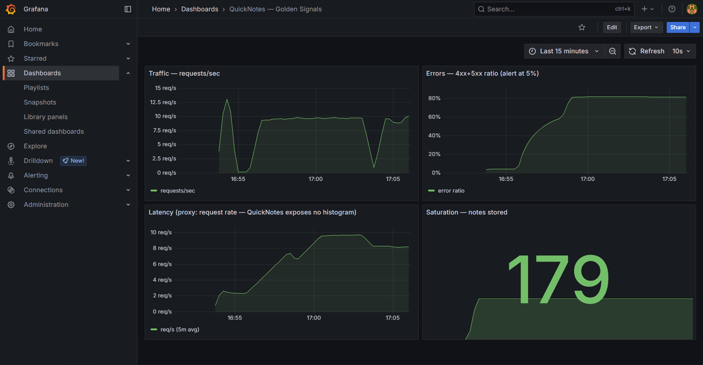
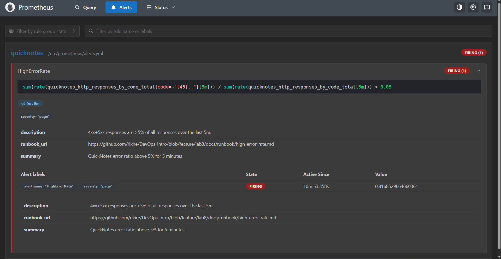

# Lab 8 — SRE & Monitoring: Golden Signals + One Good Alert

`docker compose up -d` brings up QuickNotes + **Prometheus v3.5.0** +
**Grafana 12.0.0** (Grafana 13 isn't released yet; pinned the latest real 12.x).
Config:
[`monitoring/prometheus/prometheus.yml`](../monitoring/prometheus/prometheus.yml),
[`alerts.yml`](../monitoring/prometheus/alerts.yml),
[`grafana/provisioning/`](../monitoring/grafana/provisioning/),
[`golden-signals.json`](../monitoring/grafana/dashboards/golden-signals.json),
[`compose.yaml`](../compose.yaml).

---

## Task 1 — Prometheus + Grafana with a Provisioned Dashboard

### Metrics QuickNotes exposes

`quicknotes_http_requests_total` (counter), `quicknotes_http_responses_by_code_total{code}`
(counter), `quicknotes_notes_total` (gauge). No latency histogram, so the Latency
panel uses the request rate as the documented proxy.

### The four golden-signal panels

| Signal | PromQL |
|--------|--------|
| **Traffic** | `sum(rate(quicknotes_http_requests_total[1m]))` |
| **Errors** | `sum(rate(quicknotes_http_responses_by_code_total{code=~"[45].."}[5m])) / sum(rate(quicknotes_http_responses_by_code_total[5m]))` |
| **Latency** (proxy) | `sum(rate(quicknotes_http_requests_total[5m]))` — no histogram exposed |
| **Saturation** | `quicknotes_notes_total` |

### Verification (real output)

```text
# Prometheus target is UP
$ curl -s localhost:9090/api/v1/targets | jq '.data.activeTargets[].health'
"up"

# Grafana auto-provisioned the datasource + 4-panel dashboard
DS: Prometheus prometheus default=True
Dashboard: QuickNotes — Golden Signals | panels: 4

# error ratio under normal traffic (below the 5% alert threshold)
error_ratio = 0.0407
```

 <!-- Grafana, 4 panels with traffic -->

### 1.5 Design questions

**a) Pull vs push — who must be reachable, and the failure mode.**
Prometheus **pulls** (scrapes), so **Prometheus must be able to reach QuickNotes**
on the network (target host:port must be routable from Prometheus); QuickNotes
never initiates a connection — it just exposes `/metrics` passively. Failure mode
if Prometheus can't reach it: the target flips to **`up == 0`** on `/targets`,
scrapes fail, and there are **gaps** in the series (no new samples). Crucially
QuickNotes keeps serving users fine — only *observability* goes blind, which is
its own danger (you're flying without instruments).

**b) `scrape_interval: 15s` → `5s` or `5m`.**
- **`5s`:** 3× the scrape volume → more storage, more CPU on Prometheus and the
  target, for finer resolution you rarely need on a 15s-scale metric. `rate()`
  over short windows also gets noisier. Over-sampling.
- **`5m`:** coarse — a sub-5-minute spike between scrapes is **invisible**, and
  detection/alerting can't be faster than the interval. Worse, `rate(...[5m])`
  with a 5m interval has only ~1 sample in the window, and `rate()` needs ≥2, so
  short-window rates **break**. Alerts go sluggish.

**c) `rate()` vs `irate()` vs `delta()` for Traffic.**
**`rate()`** is right. It's the per-second average over the window on a
*counter*, smoothed enough for a dashboard and stable enough for alerting, and it
handles counter resets. `irate()` uses only the last two samples → very spiky;
good for zoomed-in debugging, bad for a traffic overview. `delta()` is for
*gauges* (absolute change), not counters — it mishandles resets. So `rate()`.

**d) Why provision Grafana from files.**
Reproducibility as code. Datasource + dashboard live in the repo, so
`docker compose up` on any fresh machine yields the **identical working
dashboard** — no manual clicking, no drift, no "works on my Grafana." It's
reviewed in PRs, survives container/volume recreation, and can't be lost. UI
clicking is imperative, per-instance, and un-versioned.

---

## Task 2 — One Good Alert + Runbook

### Alert rule

[`monitoring/prometheus/alerts.yml`](../monitoring/prometheus/alerts.yml):

```yaml
- alert: HighErrorRate
  expr: |
    sum(rate(quicknotes_http_responses_by_code_total{code=~"[45].."}[5m]))
      / sum(rate(quicknotes_http_responses_by_code_total[5m])) > 0.05
  for: 5m
  labels: { severity: page }
  annotations:
    runbook_url: ".../docs/runbook/high-error-rate.md"
```

`for: 5m` is the sustained-breach gate — a single 4xx burst can't page anyone.

### Trigger — observed `Normal → Pending → Firing`

I drove healthy traffic plus a stream of malformed `POST /notes` (400s) so the
error ratio sat at ~82%, and watched the rule transition:

```text
16:56:04  HighErrorRate -> inactive
16:57:20  HighErrorRate -> pending    (ratio crossed 5%)
17:02:25  HighErrorRate -> firing     (exactly 5m of sustained breach)
```

Firing alert (from the Prometheus API):

```text
alert:    HighErrorRate
state:    firing
severity: page
value:    0.8186
runbook:  https://github.com/rikire/DevOps-Intro/blob/feature/lab8/docs/runbook/high-error-rate.md
summary:  QuickNotes error ratio above 5% for 5 minutes
```

 <!-- Prometheus /alerts, HighErrorRate FIRING -->

Runbook: [`docs/runbook/high-error-rate.md`](../docs/runbook/high-error-rate.md)
— *what it means · triage · mitigations · post-incident*.

### 2.4 Design questions

**e) Why "sustained 5 minutes" instead of firing on the first bad request.**
Single errors are normal noise — a malformed client request, a deploy blip, one
500 — and most self-resolve before anyone can act. Paging on the first error
floods on-call with false alarms (**alert fatigue**) and trains people to ignore
the pager. `for: 5m` proves the condition is **real and ongoing** (users are
consistently affected) before waking someone — you page on a sustained,
actionable symptom, not transient noise.

**f) Symptom vs cause alert.**
`HighErrorRate` is a **symptom** alert — it measures what users actually feel
(errors). A **cause** alert for QuickNotes would be e.g. "container CPU > 80%" or
"memory > 90%" or "restart count rising." Cause alerts are worse because: (1)
they don't track user pain — high CPU can be perfectly fine, so you page on
non-problems; (2) they miss problems that *don't* show in that cause (a logic bug
erroring at low CPU); (3) there are unboundedly many causes but only a few
symptoms — alert on causes and you drown. Use cause metrics for **diagnosis** in
the runbook, not for paging.

**g) Alert fatigue — a quantitative "too noisy" threshold.**
If the alert **pages while users weren't actually affected** more than a set
fraction of the time, it's broken. A workable line: **precision < ~50%** — if
more than half of pages have no real user impact, retune it (raise the threshold,
lengthen `for:`, or alert on an SLO burn rate). Many teams also treat "pages
> 2×/week that need no action" as the signal to fix the alert. The SRE Workbook
frames the ideal version as SLO error-budget burn-rate alerting: page only when
the budget is burning fast enough to matter.

---

## Bonus — Synthetic Monitoring from the Outside

<!-- TODO: Checkly probe from 2 regions + internal-vs-external comparison -->
