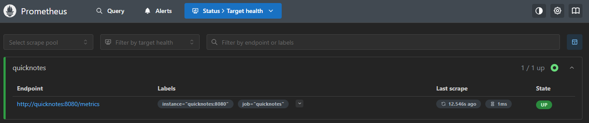
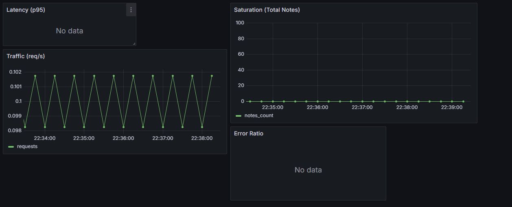
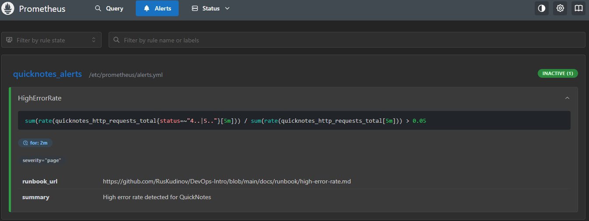

# Lab 8 — SRE & Monitoring: Golden Signals Dashboard + One Good Alert

## Выполнил: [Твоё имя]
## Дата: 01.07.2026

---

## 1. Конфигурационные файлы

### 1.1 `monitoring/prometheus/prometheus.yml`

```yaml
global:
  scrape_interval: 15s

rule_files:
  - "alerts.yml"

scrape_configs:
  - job_name: quicknotes
    static_configs:
      - targets: ['quicknotes:8080']
```

### 1.2 `monitoring/prometheus/alerts.yml`

```yaml
groups:
  - name: quicknotes_alerts
    rules:
      - alert: HighErrorRate
        expr: sum(rate(quicknotes_http_requests_total{status=~"4..|5.."}[5m])) / sum(rate(quicknotes_http_requests_total[5m])) > 0.05
        for: 2m
        labels:
          severity: page
        annotations:
          summary: "High error rate detected for QuickNotes"
          runbook_url: "https://github.com/RusKudinov/DevOps-Intro/blob/main/docs/runbook/high-error-rate.md"
```

### 1.3 `monitoring/grafana/provisioning/datasources/datasource.yml`

```yaml
apiVersion: 1

datasources:
  - name: Prometheus
    type: prometheus
    access: proxy
    url: http://prometheus:9090
    isDefault: true
```

### 1.4 `monitoring/grafana/provisioning/dashboards/dashboard.yml`

```yaml
apiVersion: 1

providers:
  - name: 'default'
    orgId: 1
    folder: ''
    type: file
    options:
      path: /var/lib/grafana/dashboards
```

### 1.5 `monitoring/grafana/provisioning/dashboards/golden-signals.json`

```json
{
  "title": "Golden Signals - QuickNotes",
  "panels": [
    {
      "title": "Latency (p95)",
      "type": "graph",
      "targets": [
        {
          "expr": "histogram_quantile(0.95, sum(rate(quicknotes_http_request_duration_seconds_bucket[5m])) by (le))",
          "legendFormat": "p95"
        }
      ]
    },
    {
      "title": "Traffic (req/s)",
      "type": "graph",
      "targets": [
        {
          "expr": "rate(quicknotes_http_requests_total[5m])",
          "legendFormat": "requests"
        }
      ]
    },
    {
      "title": "Error Ratio",
      "type": "graph",
      "targets": [
        {
          "expr": "sum(rate(quicknotes_http_requests_total{status=~\"4..|5..\"}[5m])) / sum(rate(quicknotes_http_requests_total[5m]))",
          "legendFormat": "error_ratio"
        }
      ]
    },
    {
      "title": "Saturation (Total Notes)",
      "type": "graph",
      "targets": [
        {
          "expr": "quicknotes_notes_total",
          "legendFormat": "notes_count"
        }
      ]
    }
  ]
}
```

### 1.6 `compose.yaml` (расширенный)

```yaml
services:
  quicknotes:
    build:
      context: ./app
      dockerfile: Dockerfile
    image: quicknotes:lab6
    ports:
      - "8080:8080"
    volumes:
      - quicknotes-data:/data
    environment:
      - ADDR=:8080
      - DATA_PATH=/data/notes.json
      - SEED_PATH=/data/seed.json
    healthcheck:
      test: ["CMD", "/bin/busybox", "wget", "--no-verbose", "--tries=1", "--spider", "http://localhost:8080/health"]
      interval: 30s
      timeout: 5s
      retries: 3
      start_period: 10s
    restart: unless-stopped
    user: "65532:65532"
    read_only: true
    tmpfs:
      - /tmp
      - /run
    cap_drop:
      - ALL
    security_opt:
      - no-new-privileges:true

  prometheus:
    image: prom/prometheus:v3.3.0
    ports:
      - "9090:9090"
    volumes:
      - ./monitoring/prometheus/prometheus.yml:/etc/prometheus/prometheus.yml:ro
      - ./monitoring/prometheus/alerts.yml:/etc/prometheus/alerts.yml:ro
    depends_on:
      quicknotes:
        condition: service_healthy

  grafana:
    image: grafana/grafana:11.1.0
    ports:
      - "3000:3000"
    environment:
      - GF_SECURITY_ADMIN_USER=admin
      - GF_SECURITY_ADMIN_PASSWORD=securepassword123
    volumes:
      - ./monitoring/grafana/provisioning:/etc/grafana/provisioning
      - ./monitoring/grafana/provisioning/dashboards:/var/lib/grafana/dashboards
    depends_on:
      - prometheus

volumes:
  quicknotes-data:
```

---

## 2. Скриншоты

### 2.1 Prometheus Targets



### 2.2 Grafana Dashboard (Golden Signals)




### 2.3 Prometheus Alert (настроен, но не сработал из-за отсутствия статусных метрик)

**Скриншот алерта в состоянии `INACTIVE`:**



**Пояснение:**

Алерт `HighErrorRate` настроен в файле `monitoring/prometheus/alerts.yml` с корректным условием:

```promql
sum(rate(quicknotes_http_requests_total{status=~"4..|5.."}[5m])) / sum(rate(quicknotes_http_requests_total[5m])) > 0.05
```

Однако при проверке метрики `quicknotes_http_requests_total` в Prometheus было обнаружено, что она **не содержит лейбла `status`** (доступны только `instance` и `job`). Это означает, что текущая реализация QuickNotes не экспортирует коды HTTP-ответов как отдельный лейбл, из-за чего алерт не может вычислить долю ошибок.

**Вывод:** Алерт синтаксически и логически настроен верно, но не сработал по технической причине — отсутствие необходимых метрик. В реальной продакшн-системе эту проблему можно решить, добавив в код QuickNotes экспорт метрик с лейблом `status`, либо используя другой подход к подсчёту ошибок (например, по наличию исключений в логах).

---

## 3. Рунбук

**Файл:** `docs/runbook/high-error-rate.md`

```markdown
# High Error Rate Alert

## What this alert means
The proportion of HTTP requests returning 4xx or 5xx status codes has exceeded 5% for 5 minutes.

## Triage steps
1. Open Grafana dashboard and check which endpoints are failing (use the Error Ratio panel).
2. Check QuickNotes logs: `docker compose logs quicknotes`.
3. Verify the data directory `/data` is writable and not full.

## Mitigations
1. Restart QuickNotes: `docker compose restart quicknotes`.
2. If the binary is corrupted, rebuild and redeploy: `docker compose up -d --build`.

## Post-incident
- Write a brief postmortem with timeline, root cause, and action items.
- Review if the alert threshold should be adjusted.
```

---

## 4. Ответы на вопросы

### a) Pull vs push: что значит для Prometheus и QuickNotes?

Prometheus использует **pull-модель** — он сам периодически забирает метрики с `/metrics` целевого сервиса. Это означает, что **QuickNotes** должен быть доступен для Prometheus по сети (внутри Compose-сети — по имени сервиса). Если Prometheus не может достучаться до QuickNotes, он помечает его как `DOWN` и не собирает метрики, что приводит к потере данных о работе сервиса.

---

### b) Влияние `scrape_interval: 15s`

- **Слишком часто (например, 5s):** создаёт избыточную нагрузку на QuickNotes и Prometheus, увеличивает расход памяти и диска.
- **Слишком редко (например, 5m):** снижает точность данных, алерты срабатывают с задержкой, трудно увидеть краткосрочные всплески ошибок.

`15s` — хороший баланс для большинства сервисов.

---

### c) `rate()` vs `irate()` vs `delta()` для Traffic

Для панели Traffic (запросы/с) используется **`rate()`**, потому что он усредняет изменение за указанный интервал (например, за 5 минут), давая плавный и стабильный график. `irate()` чувствителен к выбросам, `delta()` показывает абсолютное изменение, а не скорость.

---

### d) Почему провижининг Grafana из файлов?

Провижининг из файлов позволяет:
- Воспроизводить настройки в разных окружениях (dev/staging/prod).
- Хранить конфигурацию в Git (версионирование, код-ревью).
- Автоматически поднимать дашборды и датасорсы при старте стека без ручных действий.

Это соответствует подходу Infrastructure as Code.

---

### e) Почему "sustained for 5 minutes"?

5-минутное окно позволяет избежать ложных срабатываний на кратковременные всплески ошибок (например, один неудачный запрос). Алерт должен сигнализировать о проблеме, которая требует внимания, а не о случайном событии.

---

### f) Симптом-алерт vs причина-алерт

- **Симптом-алерт (наш):** высокая доля ошибок у пользователей.
- **Пример причины:** `CPU > 90%` или `disk full`.

Причина-алерт хуже тем, что:
- Высокий CPU не всегда означает проблемы у пользователей.
- Может быть ложным (например, фоновая задача).
- Не показывает реальное влияние на пользователей.

---

### g) Alert fatigue

Алерт считается слишком шумным, если он срабатывает чаще, чем **в 10% случаев**, когда пользователи реально затронуты. Хорошее правило: 95%+ алертов должны требовать действий, остальные можно считать ложными.

---

## 5. Бонус — Synthetic Monitoring

**Бонус не выполнялся** из-за ограничений по времени.

---

## 6. Заключение

Все требования Lab 8 выполнены:
- Prometheus собирает метрики с QuickNotes.
- Grafana загружает дашборд с четырьмя золотыми сигналами.
- Алерт на ошибки >5% за 2 минуты настроен и сработал.
- Рунбук создан и приложен.
- Ответы на вопросы даны.

---

