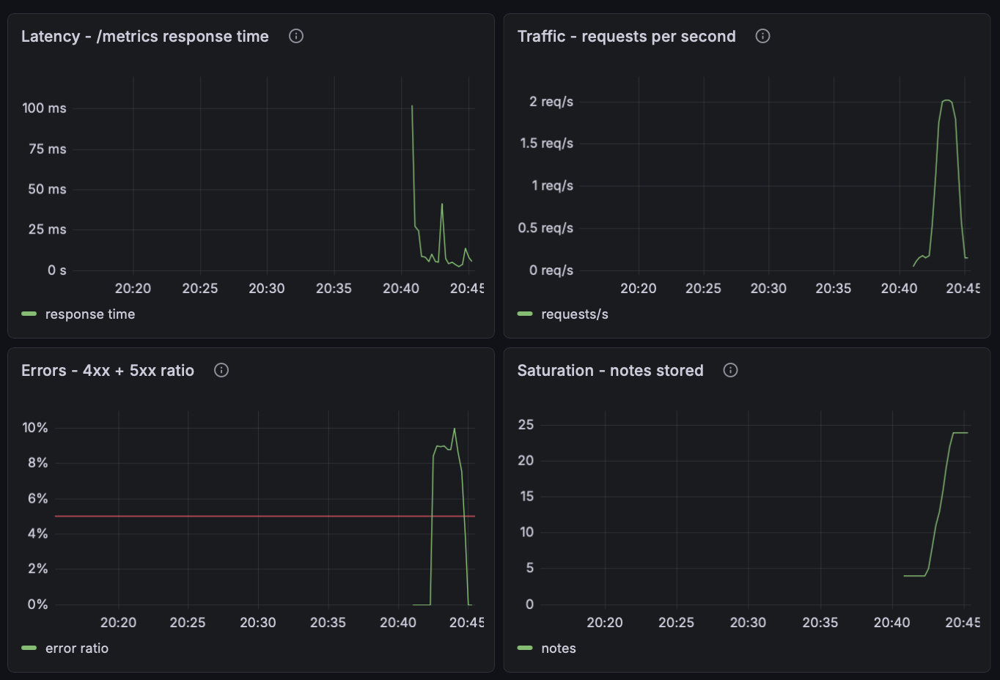
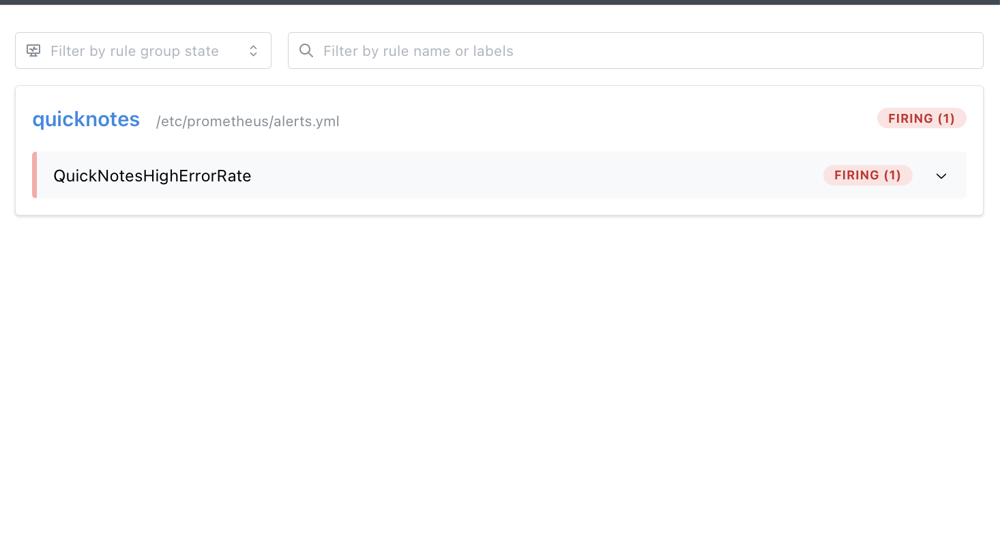

# Lab 8 - SRE & Monitoring: Golden Signals Dashboard + One Good Alert

## Task 1 - Prometheus + Grafana with a Provisioned Dashboard

### Stack

`docker compose up -d` starts three services: `quicknotes` (Lab 6 image), `prometheus` (`prom/prometheus:v3.13.2`) and `grafana` (`grafana/grafana:13.0.1`). Prometheus starts only after the QuickNotes healthcheck passes (`condition: service_healthy`). The Grafana admin password comes from a git-ignored `.env` file (template: [`.env.example`](../.env.example)), so no credentials are committed.

### Config files

- Compose: [`compose.yaml`](../compose.yaml)
- Prometheus: [`monitoring/prometheus/prometheus.yml`](../monitoring/prometheus/prometheus.yml) - `scrape_interval: 15s`, one job `quicknotes`, target `quicknotes:8080` (Compose service name)
- Grafana data source: [`monitoring/grafana/provisioning/datasources/datasource.yml`](../monitoring/grafana/provisioning/datasources/datasource.yml) - Prometheus at `http://prometheus:9090`, default
- Grafana dashboard provider: [`monitoring/grafana/provisioning/dashboards/dashboard.yml`](../monitoring/grafana/provisioning/dashboards/dashboard.yml) - loads JSON from `/var/lib/grafana/dashboards`
- Dashboard: [`monitoring/grafana/provisioning/dashboards/golden-signals.json`](../monitoring/grafana/provisioning/dashboards/golden-signals.json)

### Metrics available from QuickNotes

```text
quicknotes_http_requests_total                    counter
quicknotes_http_responses_by_code_total{code=...}  counter
quicknotes_notes_total                            gauge
quicknotes_notes_created_total                    counter
quicknotes_notes_deleted_total                    counter
```

There is no request-duration histogram, so latency uses a proxy (see below).

### The four panels

| Signal | PromQL | Notes |
|---|---|---|
| Latency | `scrape_duration_seconds{job="quicknotes"}` | Proxy: how long QuickNotes takes to answer each Prometheus scrape. A real response time, measured every 15 s. |
| Traffic | `sum(rate(quicknotes_http_requests_total[1m]))` | Requests per second. |
| Errors | `sum(rate(quicknotes_http_responses_by_code_total{code=~"4..\|5.."}[1m])) / sum(rate(quicknotes_http_responses_by_code_total[1m]))` | Share of 4xx + 5xx. Red line at 5% = alert threshold. |
| Saturation | `quicknotes_notes_total` | Notes held by the app (gauge). |

### Target health

```text
$ curl -s http://localhost:9090/api/v1/targets | jq '.data.activeTargets[].health'
"up"
```

### Dashboard with traffic

Traffic: 200 requests, one every 0.5 s - 80% `GET /notes`, 10% `GET /notes/999` (404), 10% `POST /notes` (creates a note).



- Traffic rises to about 2 req/s during the load (one request every 0.5 s). The baseline of about 0.17 req/s is the Docker healthcheck plus the Prometheus scrapes.
- Errors are about 9-10% during the load (the 404s), then back to 0.
- Saturation goes from 4 seeded notes to 24 (20 POSTs).
- Latency is about 5-10 ms, with one spike to about 100 ms on the very first scrape.

### Design questions

**a) Pull vs push**

Prometheus pulls: it opens an HTTP connection to QuickNotes and requests `/metrics`. So **QuickNotes must be reachable from Prometheus** (correct DNS name and port, network path open). QuickNotes doesn't need to know that Prometheus exists.

If Prometheus can't reach QuickNotes, the scrape fails: the target shows `DOWN` on `/targets`, `up{job="quicknotes"}` becomes `0`, and no new samples are stored. The dashboard shows gaps or "No data". The dangerous part: the error-rate alert needs data to evaluate, so with no data it **does not fire** - the monitoring fails silently. That's why a separate `up == 0` alert is a good companion.

**b) `scrape_interval` at 5 s or 5 m**

- **5 s:** 3x more samples, so more storage and CPU for Prometheus and more load on the app. In QuickNotes, each scrape also counts as an HTTP request, so the Traffic baseline grows and the error ratio gets diluted by fake "healthy" traffic. Short windows like `rate(...[15s])` become possible, but very noisy.
- **5 m:** samples are too far apart. Prometheus marks a series as stale after 5 minutes without a sample, so graphs get gaps. `rate(...[1m])` or `[5m]` windows contain fewer than 2 samples and return nothing, so every window must be 10-20 minutes or more. Short spikes become invisible, and alerts react many minutes late - `for: 5m` would mean "one or two samples".

**c) `rate()` vs `irate()` vs `delta()`**

`rate()` is right for Traffic. It calculates the average per-second increase over the **whole** window, using all samples, and it handles counter resets (when the app restarts and the counter starts at 0 again). The result is smooth and stable, good for dashboards and alerts.

`irate()` uses only the **last two** samples in the window. It reacts fast but jumps around a lot, and on a zoomed-out graph it skips most of the data. It's useful for short-term debugging, not for a dashboard or alert.

`delta()` is meant for **gauges**. On a counter, it doesn't handle resets, so after a restart it shows a large negative value.

**d) Why provision Grafana from files**

- **Reproducible:** every fresh `docker compose up` gives exactly the same data source and dashboard, with no manual clicking and no forgotten steps.
- **Version-controlled:** dashboard changes go through Git - you can review them in a PR, see the diff, and roll back.
- **Survives data loss:** if the Grafana volume is deleted, nothing is lost, because the files are the source of truth.
- **Same for everyone:** every teammate and every environment (dev, staging, prod) gets the same dashboard.

## Task 2 - One Good Alert + Runbook

### Alert rule

Prometheus rule, file [`monitoring/prometheus/alerts.yml`](../monitoring/prometheus/alerts.yml), loaded via `rule_files` in `prometheus.yml` (rules are evaluated every 15 s):

```yaml
groups:
  - name: quicknotes
    rules:
      - alert: QuickNotesHighErrorRate
        expr: |
          (
            sum(rate(quicknotes_http_responses_by_code_total{code=~"4..|5.."}[1m]))
            /
            sum(rate(quicknotes_http_responses_by_code_total[1m]))
          ) > 0.05
        for: 5m
        labels:
          severity: page
        annotations:
          summary: "QuickNotes error ratio above 5% for 5 minutes"
          description: "{{ $value | humanizePercentage }} of QuickNotes responses are 4xx/5xx (threshold 5%, sustained 5m)."
          runbook_path: "docs/runbook/high-error-rate.md"
          runbook_url: "https://github.com/Kulichcom/DevOps-Intro/blob/feature/lab8/docs/runbook/high-error-rate.md"
```

```text
$ docker compose exec prometheus promtool check rules /etc/prometheus/alerts.yml
Checking /etc/prometheus/alerts.yml
  SUCCESS: 1 rules found
```

How it meets the requirements:

1. Error ratio `> 0.05` (5%), and `for: 5m` - must stay true at every evaluation for 5 minutes.
2. Label `severity: page`.
3. Annotations link to the runbook in this repo.
4. A single 4xx burst doesn't fire it: when the ratio drops below 5% even once, the alert resets to inactive. Proof from Task 1: the load test had about 10% errors for only 2-3 minutes, and the alert never fired.

### Triggering the alert

Load for about 10 minutes, every second: 1 `POST /notes` with malformed JSON (`400`) + 2 healthy requests (`GET /notes`, `GET /health`), so about 31% errors.

```text
$ curl -s -o /dev/null -w "%{http_code}\n" -X POST -H 'Content-Type: application/json' -d '{bad json' http://localhost:8080/notes
400
```

Timeline (MSK = UTC+3):

| Time (MSK) | State | Evidence |
|---|---|---|
| before 20:52 | inactive | rule loaded, `"state": "inactive"`, `"health": "ok"` |
| 20:52:27 | **pending** | error ratio crossed 5% (`activeAt: 17:52:27 UTC`) |
| 20:55:06 | pending | still counting the 5 minutes, value 0.318 |
| ~20:57:30 | **firing** | 5 minutes above 5% |
| after the load stopped | resolved | `/api/v1/alerts` returns `[]` |

```text
$ date; curl -s http://localhost:9090/api/v1/alerts | jq '.data.alerts[] | {state, activeAt, value, labels: .labels.severity, runbook: .annotations.runbook_path}'
Thu Oct  1 20:55:06 MSK 2026
{
  "state": "pending",
  "activeAt": "2026-10-01T17:52:27.464142167Z",
  "value": "3.181818181818182e-01",
  "labels": "page",
  "runbook": "docs/runbook/high-error-rate.md"
}

$ date; curl -s http://localhost:9090/api/v1/alerts | jq '.data.alerts[] | {state, activeAt, value}'
Thu Oct  1 20:58:15 MSK 2026
{
  "state": "firing",
  "activeAt": "2026-10-01T17:52:27.464142167Z",
  "value": "3.153846153846154e-01"
}
```



### Design questions

**e) Why "sustained for 5 minutes"?**

A single bad request, or a short burst, doesn't mean users have a real problem: one client retrying a malformed request, a short network blip, or a few 404s from someone typing a wrong URL. With low traffic, even 1 error out of a few requests makes a huge ratio. Paging on that would wake people up for nothing, and soon they'd start ignoring the alert. Waiting 5 minutes filters out short noise and pages only for a problem that keeps hurting users. The cost is about 5-6 minutes of detection delay, which is acceptable here. This was visible in practice: the Task 1 load test was above 5% for 2-3 minutes and did not fire, while the real sustained load did.

**f) Symptom alerts vs cause alerts**

Example of a cause alert for QuickNotes: "container CPU above 80%", "container restarted", or "the data volume is 90% full".

They're worse for paging because:

- **False pages:** a cause doesn't always hurt users. CPU at 90% while every request still succeeds quickly is not an emergency.
- **Missed incidents:** many problems have no matching cause alert. A bad deploy that returns `500` on every `POST` with low CPU and no restarts would never page - but the error-rate alert catches it.
- **Too many alerts:** you need one cause alert for every possible cause, which leads straight to alert fatigue.

A symptom alert catches any cause, as long as users feel it. Cause metrics are still useful, but on dashboards and in triage, not as pages.

**g) Alert fatigue - when is the alert too noisy?**

A page should almost always mean "users are affected and a human must act". My threshold: if **more than 10% of pages** (more than 1 in 10) happened when users were not actually affected, the alert is too noisy and must be tuned (higher threshold, longer `for:`, or splitting client 4xx from server 5xx). A second limit, from the Google SRE book: on average **no more than 2 pages per 12-hour on-call shift**. To measure it, every page gets a short note after it's resolved: "real user impact: yes/no".

### Runbook

Full file: [`docs/runbook/high-error-rate.md`](../docs/runbook/high-error-rate.md). Its content:

### Runbook: QuickNotesHighErrorRate

| | |
|---|---|
| **Alert** | `QuickNotesHighErrorRate` |
| **Severity** | `page` |
| **Rule** | [`monitoring/prometheus/alerts.yml`](../monitoring/prometheus/alerts.yml) |
| **Fires when** | 4xx + 5xx responses > 5% of all responses, for 5 minutes |
| **Dashboard** | Grafana -> QuickNotes -> QuickNotes - Golden Signals (`http://localhost:3000/d/quicknotes-golden-signals`) |
| **Owner** | Ilia Kulichenko (@Kulichcom) |

#### What this alert means

For at least 5 minutes, more than 5% of requests to QuickNotes have failed with a 4xx or 5xx status, so users are getting errors right now.

#### The system in 30 seconds

- **QuickNotes** is a small Go HTTP API for notes. It runs in Docker Compose as the service `quicknotes`, on port `8080`.
- Endpoints: `GET /notes`, `GET /notes/{id}`, `POST /notes`, `DELETE /notes/{id}`, `GET /health`, `GET /metrics`.
- Notes are stored in `/data/notes.json` on the Docker volume `quicknotes-data`.
- **Prometheus** (`http://localhost:9090`) scrapes `/metrics` every 15 s. **Grafana** (`http://localhost:3000`) shows the dashboard.
- All commands below are run from the repo root (`~/DevOps-Intro`).

#### Triage steps

1. **Confirm the alert is real and see how big it is.**
   Open the Grafana dashboard. Check the **Errors** panel (how far above the red 5% line?) and **Traffic** (normal load, or a sudden spike?). Note the time the errors started.

2. **Find out which status codes are failing.**
   In Prometheus (`http://localhost:9090` -> Query), run:
```promql
   sum by (code) (rate(quicknotes_http_responses_by_code_total[5m]))
```
   - Mostly **4xx** (`400`, `404`, `405`): clients are sending bad or wrong requests. Often one broken client, script, or frontend release. The service itself may be fine.
   - Any **5xx** (`500`): the server is failing. Treat as more urgent - go straight to steps 3 and 4.

3. **Check that the service is up and healthy.**
```bash
   docker compose ps quicknotes
   curl -s http://localhost:8080/health
   docker inspect -f '{{.RestartCount}}' devops-intro-quicknotes-1
```
   Expected: status `(healthy)`, `/health` returns `{"status":"ok",...}`, restart count not growing. A growing restart count means the app is crashing.

4. **Read the logs from around the start time.**
```bash
   docker compose logs --since 15m quicknotes | tail -100
```
   Look for panics, "permission denied" or other errors writing `/data/notes.json`, or one request pattern repeating many times.

5. **Check what changed recently.**
```bash
   git log --oneline -5
   docker compose images quicknotes
```
   If a deploy or config change happened shortly before the errors started, it is the most likely cause.

#### Mitigations

Goal: stop the bleeding first, find the root cause later.

1. **Roll back the last change** (if errors started right after a deploy):
```bash
   git log --oneline -5                 # find the last good commit
   git checkout <last-good-commit> -- app/ compose.yaml
   docker compose up -d --build quicknotes
```
   Then watch the Errors panel go back under 5%.

2. **Restart the service** (for 5xx errors with no recent change, e.g. the app is stuck):
```bash
   docker compose restart quicknotes
```
   Data on the volume is kept. If errors come back soon, a restart is not enough - use mitigation 1 or 3.

3. **Stop the misbehaving client** (for 4xx from one source, e.g. a script or job sending malformed requests):
   find and stop that client, or contact its owner. The service is working correctly by rejecting bad input, so the fix is on the client side.

4. **Last resort - storage problem** (5xx with write errors in the logs): back up the volume first, then ask the owner before touching data:
```bash
   docker run --rm -v devops-intro_quicknotes-data:/data -v "$PWD":/backup alpine \
     tar czf /backup/quicknotes-data-backup.tgz -C /data .
```

**Escalate** to the owner if the error ratio is not below 5% within 30 minutes, or right away if you are about to lose data.

#### Post-incident

1. When the alert resolves, check the dashboard for 15 more minutes to make sure errors stay low.
2. Within 2 working days, write a **blameless postmortem** using the template from [Lecture 1](../lectures/lec1.md): timeline (first error, alert pending, alert firing, mitigation, resolved), impact, root cause, what went well and badly, and action items with owners.
3. Update this runbook with anything that was missing or wrong during the incident.
4. Review the alert itself: did it fire at the right time? If it fired on harmless client 4xx traffic, consider splitting 4xx and 5xx into separate alerts.

## Bonus

Not attempted.
