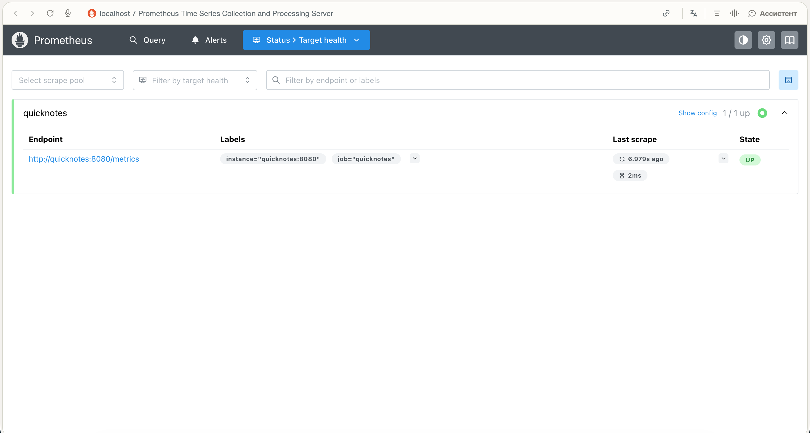
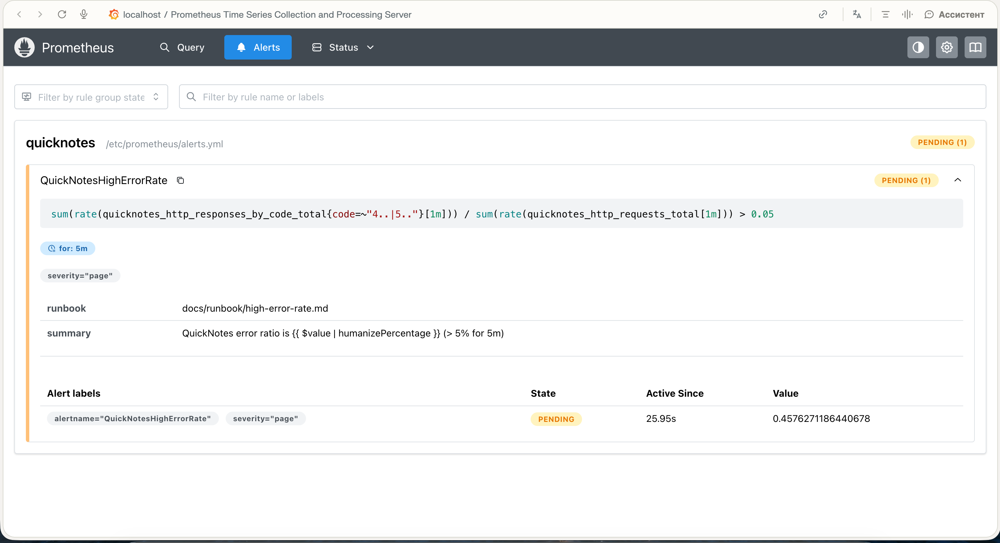
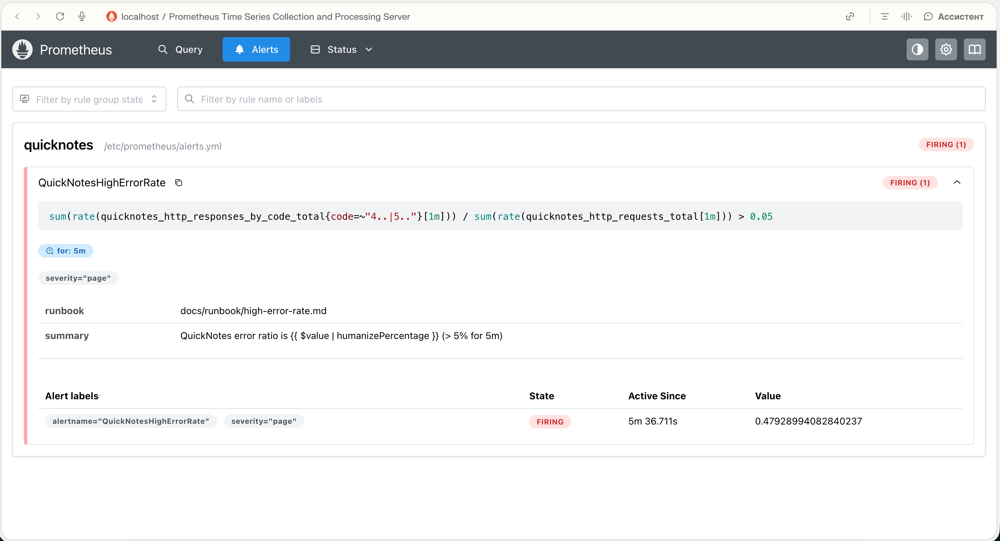
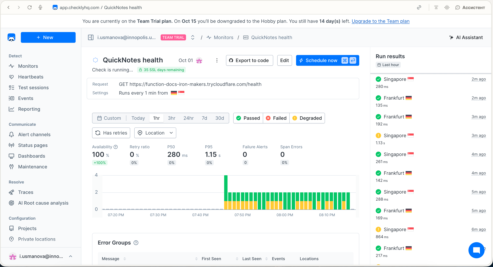
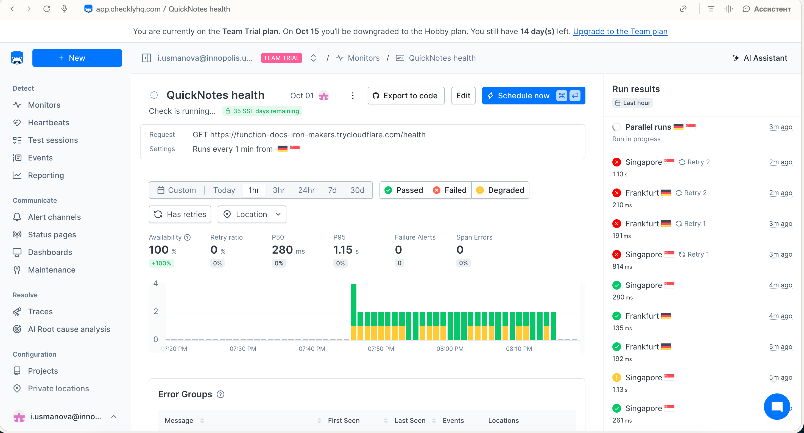

# Lab 8 — SRE & Monitoring: Golden Signals Dashboard + One Good Alert

**Stack:** Docker Compose on my Mac — `quicknotes` (Lab 6 image) + `prom/prometheus:v3.15.0` + `grafana/grafana:13.2.3`.
The Lab 6 `compose.yaml`, `app/Dockerfile`, `app/.dockerignore` and `app/cmd/healthcheck/` are copied into this branch (branched from `upstream/main`), then `compose.yaml` was extended.

## Files

| File | What it does |
|---|---|
| [`compose.yaml`](../compose.yaml) | + `prometheus` (depends on quicknotes **healthy**, `:9090`) and `grafana` (depends on prometheus, `:3000`) |
| [`monitoring/prometheus/prometheus.yml`](../monitoring/prometheus/prometheus.yml) | `scrape_interval: 15s`, one job `quicknotes` → `quicknotes:8080` (Compose DNS) |
| [`monitoring/prometheus/alerts.yml`](../monitoring/prometheus/alerts.yml) | the alert rule (Task 2) |
| [`monitoring/grafana/provisioning/datasources/datasource.yml`](../monitoring/grafana/provisioning/datasources/datasource.yml) | Prometheus at `http://prometheus:9090`, default |
| [`monitoring/grafana/provisioning/dashboards/dashboard.yml`](../monitoring/grafana/provisioning/dashboards/dashboard.yml) | loads dashboards from `/var/lib/grafana/dashboards` |
| [`monitoring/grafana/provisioning/dashboards/golden-signals.json`](../monitoring/grafana/provisioning/dashboards/golden-signals.json) | the 4-panel dashboard |
| [`docs/runbook/high-error-rate.md`](../docs/runbook/high-error-rate.md) | runbook (Task 2) |

Grafana admin password comes from `GF_SECURITY_ADMIN_PASSWORD: ${GF_ADMIN_PASSWORD:?...}`, set in a local `.env` that is **not** committed — no default credentials in Git.

---

## Task 1 — Prometheus + Grafana

### Dashboard panels

| Signal | PromQL | Note |
|---|---|---|
| Latency | `scrape_duration_seconds{job="quicknotes"}` | QuickNotes has no duration histogram, so I use Prometheus' timing of the real HTTP `GET /metrics` as a latency proxy |
| Traffic | `sum(rate(quicknotes_http_requests_total[1m]))` | requests/s |
| Errors | `sum(rate(quicknotes_http_responses_by_code_total{code=~"4..\|5.."}[1m])) / sum(rate(quicknotes_http_requests_total[1m]))` | share of 4xx+5xx |
| Saturation | `quicknotes_notes_total` | notes stored (gauge) |

### Verification

```text
$ docker compose ps
devops-intro-grafana-1      grafana/grafana:13.2.3    Up 2 seconds             0.0.0.0:3000->3000/tcp
devops-intro-prometheus-1   prom/prometheus:v3.15.0   Up 2 seconds             0.0.0.0:9090->9090/tcp
devops-intro-quicknotes-1   quicknotes:lab6           Up 8 seconds (healthy)   0.0.0.0:8080->8080/tcp
```

Traffic: 200 requests over ~1 min — 150 × `GET /notes` (200), 30 × `GET /notes/99999` (404), 20 × `POST /notes` with broken JSON (400).

```text
$ curl -s http://localhost:9090/api/v1/targets | jq '.data.activeTargets[].health'
"up"
```




Latency ~1–5 ms, traffic peak ~3 req/s, error ratio peak ~65% during the mixed burst, 4 notes stored.

### Design questions

**a) Pull vs push.** Prometheus *pulls*, so **QuickNotes must be reachable from Prometheus** (here: `quicknotes:8080` on the Compose network). If Prometheus can't reach it, the target goes `DOWN` (`up == 0`) and the series just stop — no new data, panels go flat/empty. That's actually useful: `up == 0` is itself a signal that something is wrong.

**b) Scrape interval 5 s vs 5 min.** 5 s: much more samples → more storage/CPU, and more load on the app for little gain. 5 min: too coarse — short spikes are invisible, and `rate(...[1m])` breaks completely because a 1-minute window needs at least 2 samples (you'd need windows ≥ 10 min, so alerts react very slowly). Prometheus also marks series stale after 5 min, so graphs get gaps.

**c) `rate()` vs `irate()` vs `delta()`.** **`rate()`** — it's the per-second average over the window, handles counter resets (restarts), and gives a smooth line. `irate()` uses only the last 2 samples → spiky, good for zoomed-in debugging, bad for a dashboard/alert. `delta()` is for gauges, not counters — it breaks on counter resets.

**d) Why provisioning from files.** The datasource and dashboard live in Git, so every `docker compose up` on a fresh machine gives the same working Grafana with no clicking. Changes go through PR review and history, nothing is lost if the container/volume is deleted, and there is no "only works on Ilmira's laptop" configuration drift.

---

## Task 2 — One good alert + runbook

### Alert rule (`monitoring/prometheus/alerts.yml`)

```yaml
groups:
  - name: quicknotes
    rules:
      - alert: QuickNotesHighErrorRate
        expr: |
          sum(rate(quicknotes_http_responses_by_code_total{code=~"4..|5.."}[1m]))
            /
          sum(rate(quicknotes_http_requests_total[1m]))
            > 0.05
        for: 5m
        labels:
          severity: page
        annotations:
          summary: "QuickNotes error ratio is {{ $value | humanizePercentage }} (> 5% for 5m)"
          runbook: "docs/runbook/high-error-rate.md"
```

The expression reduces to one value (`sum / sum`), so it can be pasted into Grafana Explore as is.

### Firing it

Error injection for 8 minutes: one `GET /notes` (200) + one `GET /notes/99999` (404) every 0.5 s → ~48% errors, steady (not bursty).

| State | When | Value |
|---|---|---|
| Inactive (normal) | before the script | — |
| **Pending** | ~26 s after errors started | 0.458 |
| **Firing** | after 5 min of Pending (active 5m 36s) | 0.479 |





```json
$ curl -s http://localhost:9090/api/v1/alerts | jq
{
  "status": "success",
  "data": { "alerts": [ {
    "labels": { "alertname": "QuickNotesHighErrorRate", "severity": "page" },
    "annotations": {
      "runbook": "docs/runbook/high-error-rate.md",
      "summary": "QuickNotes error ratio is 47.65% (> 5% for 5m)"
    },
    "state": "firing",
    "activeAt": "2026-10-01T16:16:42.464142167Z",
    "value": "4.7647058823529415e-01"
  } ] }
}
```

### Runbook — [`docs/runbook/high-error-rate.md`](../docs/runbook/high-error-rate.md)

<details>
<summary>Full text</summary>

# Runbook — QuickNotesHighErrorRate

**Alert:** `QuickNotesHighErrorRate` · **Severity:** `page` · **Rule:** [`monitoring/prometheus/alerts.yml`](../../monitoring/prometheus/alerts.yml)
**Dashboard:** Grafana → QuickNotes → *QuickNotes - Golden Signals* (http://localhost:3000) · **Prometheus:** http://localhost:9090/alerts

## 1. What this alert means

More than **5% of QuickNotes HTTP responses have been 4xx or 5xx for at least 5 minutes**, so a real share of users is getting failed requests right now.

## 2. Triage steps

1. **Confirm it's real and see how bad it is.** Open the *Errors* panel on the dashboard (or run the query below in Prometheus). Is the ratio still above 5%? Rising or falling? When did it start?
   ```promql
   sum(rate(quicknotes_http_responses_by_code_total{code=~"4..|5.."}[1m])) / sum(rate(quicknotes_http_requests_total[1m]))
   ```
2. **Find which status code is growing** — this tells you whether it's the server or the clients:
   ```promql
   sum by (code) (rate(quicknotes_http_responses_by_code_total[5m]))
   ```
   - mostly **5xx** → the app itself is failing (go to step 3 and 4)
   - mostly **4xx** (`400`, `404`, `405`) → clients send bad requests: a broken client release, a bot/scanner, or a changed API path
3. **Check the app is up and healthy.**
   ```bash
   docker compose ps                     # quicknotes must be "Up (healthy)"; check RESTARTS
   curl -s http://localhost:8080/health  # {"status":"ok",...}
   ```
   Also look at the *Traffic* panel: a sudden traffic spike at the same time points to a bot or a client loop.
4. **Read the logs around the start time.**
   ```bash
   docker compose logs --since 15m quicknotes
   ```
   Look for errors writing `/data/notes.json` (disk full / volume problem), panics, or restarts.
5. **Check what changed.** Was anything deployed or reconfigured just before the alert (`git log`, a new image, a changed env var)? A change right before the start time is the most likely cause.

## 3. Mitigations

- **Roll back the last change** — redeploy the previous image / commit (`git checkout <previous>` → `docker compose up -d --build`). First choice if the errors started right after a deploy.
- **Restart the service** if it looks stuck or broken: `docker compose restart quicknotes`, then watch the *Errors* panel for 5 minutes.
- **Block the noisy client** if one bot/client is causing the 4xx flood (rate limit or block it at the reverse proxy / firewall), so real users aren't drowned out.
- **Free disk space / fix the volume** if logs show the data file can't be written.

If none of this helps within 30 minutes, escalate to the QuickNotes owner and post a status update.

## 4. Post-incident

- Write a **blameless postmortem** using the template from [Lecture 1 — Slide 20: Blameless Postmortems](../../lectures/lec1.md): timeline, impact, root cause, what went well/badly, action items with owners.
- Add a link to the postmortem here and update this runbook if a triage step was missing or wrong.
- If the alert fired but users were not actually affected, record it — that counts toward the alert-noise budget (see `submissions/lab8.md`, question g).

</details>

### Design questions

**e) Why 5 minutes sustained?** One failed request or a 10-second blip (a client retry storm, a restart) is normal and fixes itself. Paging someone at 3 AM for that teaches them to ignore pages. `for: 5m` means "this is really hurting users and isn't going away by itself" — worth waking a human.

**f) Symptom vs cause.** A cause alert would be e.g. "QuickNotes container restarted" or "disk usage of the data volume > 90%". It's worse for on-call because it doesn't say whether users are affected (a restart may be invisible to users; a full disk may not matter yet), and it misses causes you didn't think of. The error-rate alert fires on what users actually feel, whatever the cause.

**g) Alert-fatigue threshold.** I'd call this alert too noisy if **more than 30% of its firings in a month** turn out to be "no real user impact" (e.g. a single scanner hitting random URLs, a test script), **or if it fires more than ~2 times a week**. Then I'd tune it: exclude 404s from bots, raise the threshold, or switch to an SLO burn-rate alert.

---

## Bonus — Synthetic monitoring from 2 regions

**Setup:** public URL via `cloudflared tunnel --url http://localhost:8080` → `https://function-docs-iron-makers.trycloudflare.com`.
Checkly **API check** `QuickNotes health`: `GET /health`, assertion `status == 200`, fail if response > 2000 ms, every **1 min** from **Frankfurt + Singapore**. Ran **19:45 → 20:16 (MSK), 31 min**, ~60 runs.



| Metric | Prometheus (internal) | Checkly (external, 2 regions) |
|---|---|---|
| p50 latency | **1.3 ms** | **280 ms** |
| p95 latency | **2.1 ms** | **1.15 s** |
| Error count (30 min) | **0** 4xx/5xx | **0** failed runs (availability 100%) |

Internal values: `quantile_over_time(0.5 / 0.95, scrape_duration_seconds{job="quicknotes"}[30m])` and `sum(increase(quicknotes_http_responses_by_code_total{code=~"4..|5.."}[30m]))`.
Frankfurt runs were ~135–250 ms, Singapore ~260 ms – 1.13 s (some marked *degraded*, but all passed). Almost all of the external time is network: Checkly's timing shows DNS 7 ms, TCP 1 ms, **first byte ~250 ms** — the trip through Cloudflare to my laptop and back, while the app itself answers in ~2 ms.

**Real example right after the window:** at ~20:16 the checks started **failing from both regions at once** (with retries), while Prometheus inside Docker still reported the target `"up"`:

```text
$ curl -s http://localhost:9090/api/v1/targets | jq '.data.activeTargets[].health'
"up"
```



**Failure-mode analysis.** Checkly sees the service the way a user does, so it catches everything *between* the user and the app: DNS problems, an expired TLS cert, a broken tunnel/load balancer/CDN, a regional network issue, or the whole host being offline — exactly what happened at 20:16, when the quick tunnel stopped answering but the app and Prometheus were fine. Prometheus can't see any of that, because it sits next to the app on the same Docker network (and if the whole host dies, Prometheus dies with it and goes silent instead of alerting). On the other hand, Prometheus sees the *inside*: the error ratio of all real traffic, which endpoints/codes fail, the number of stored notes (saturation), and sub-millisecond latency changes that are invisible in a 250 ms network round-trip. External `/health` probes only test one cheap endpoint once a minute, so they would miss a 5% error rate on `POST /notes` that Prometheus alerts on. You need both: Prometheus for "why is it broken", synthetic checks for "can users reach it at all".
