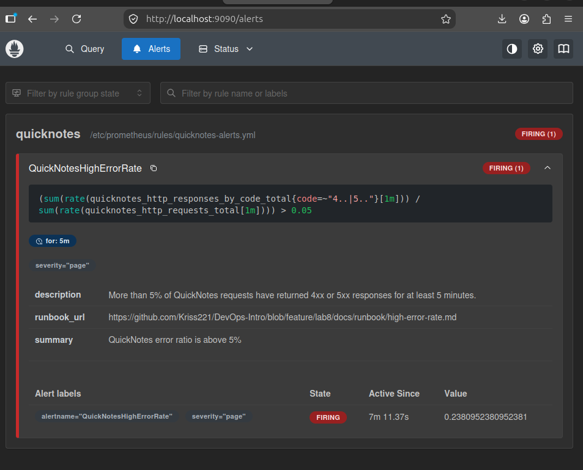

# Lab 8 Submission --- SRE & Monitoring

## Task 1 --- Prometheus + Grafana with a Provisioned Dashboard

### Configuration

The monitoring stack extends the Lab 6 Compose setup with Prometheus and
Grafana. Prometheus scrapes QuickNotes every 15 seconds using the
Compose service name `quicknotes:8080`. Grafana provisions the
Prometheus data source and the Golden Signals dashboard automatically
from files.

### Prometheus configuration

File: `monitoring/prometheus/prometheus.yml`

``` yaml
global:
  scrape_interval: 15s

rule_files:
  - /etc/prometheus/alerts.yml

scrape_configs:
  - job_name: quicknotes
    static_configs:
      - targets:
          - "quicknotes:8080"
```

### Grafana data source provisioning

File: `monitoring/grafana/provisioning/datasources/datasource.yml`

``` yaml
apiVersion: 1

datasources:
  - name: Prometheus
    uid: prometheus
    type: prometheus
    access: proxy
    url: http://prometheus:9090
    isDefault: true
    editable: false
```

### Grafana dashboard provider

File: `monitoring/grafana/provisioning/dashboards/dashboard.yml`

``` yaml
apiVersion: 1

providers:
  - name: QuickNotes
    orgId: 1
    folder: QuickNotes
    type: file
    disableDeletion: false
    updateIntervalSeconds: 10
    options:
      path: /opt/grafana-config/provisioning/dashboards
```

### Golden Signals dashboard

File: `monitoring/grafana/provisioning/dashboards/golden-signals.json`

The provisioned dashboard contains four panels:

1.  **Latency (request-rate proxy)** ---
    `rate(quicknotes_http_requests_total[5m])`. QuickNotes does not
    expose a request-duration histogram, so the request-rate proxy
    allowed by the lab specification is used.

2.  **Traffic** --- `rate(quicknotes_http_requests_total[5m])`.

3.  **Errors** --- ratio of 4xx and 5xx responses to all HTTP responses:

    ``` promql
    sum(rate(quicknotes_http_responses_by_code_total{code=~"4..|5.."}[5m]))
    /
    sum(rate(quicknotes_http_responses_by_code_total[5m]))
    ```

4.  **Saturation** --- `quicknotes_notes_total`.

The complete JSON dashboard is committed at the path above.

### Verification

I generated approximately 200 mixed requests, including successful
requests and requests for a nonexistent note so that the application
recorded real HTTP 404 responses.

Example error request:

``` bash
curl -s -o /dev/null -w "HTTP %{http_code}\n" \
  http://localhost:8080/notes/999999
```

The application returned:

``` text
HTTP 404
```

After mixed traffic, the metrics included:

``` text
quicknotes_http_responses_by_code_total{code="200"} 580
quicknotes_http_responses_by_code_total{code="404"} 21
```

Prometheus target health was verified with the command required by the
lab:

``` bash
curl http://localhost:9090/api/v1/targets | \
  jq '.data.activeTargets[].health'
```

Output:

``` text
"up"
```

The provisioned Grafana dashboard showed non-trivial Traffic and Errors
graphs:


### Design questions

#### a) Pull vs push

Prometheus uses a pull model: Prometheus initiates the connection to the
QuickNotes `/metrics` endpoint. Therefore QuickNotes must be reachable
from Prometheus over the Compose network; QuickNotes does not need to
initiate a connection to Prometheus. If Prometheus cannot reach
QuickNotes, the scrape fails, the target becomes `DOWN`, and Prometheus
stops receiving fresh QuickNotes samples.

#### b) Why use a 15-second scrape interval?

A 5-second interval produces much more time-series data, increasing
storage, network, and processing costs. It can also make queries
unnecessarily expensive when the service does not need that resolution.
A 5-minute interval has the opposite problem: short spikes and failures
may be missed or heavily smoothed, and short-range `rate()` queries may
have too few samples to calculate a useful rate. Fifteen seconds
provides enough resolution for this lab without excessive scrape
overhead.

#### c) `rate()` vs `irate()` vs `delta()`

`rate()` is the appropriate choice for the Traffic panel because
`quicknotes_http_requests_total` is a counter and the dashboard needs a
stable per-second request rate over a time window. `irate()` uses only
the last two samples and is more sensitive to short spikes, so it is
usually noisier for a dashboard. `delta()` calculates the absolute
change over a range and is intended for gauges rather than counter
rates, so it is not appropriate for HTTP request traffic.

#### d) Why provision Grafana from files?

File provisioning makes the monitoring configuration reproducible and
version-controlled. A fresh stack automatically receives the same data
source and dashboard without manual clicking in the Grafana UI. The
configuration can be reviewed in a pull request, reproduced by another
developer, and restored after containers are recreated.

------------------------------------------------------------------------

## Task 2 --- One Good Alert + Runbook

### Alert rule

File: `monitoring/prometheus/alerts.yml`

``` yaml
groups:
  - name: quicknotes-alerts
    rules:
      - alert: QuickNotesHighErrorRate
        expr: |
          (
            sum(rate(quicknotes_http_responses_by_code_total{code=~"4..|5.."}[5m]))
            /
            sum(rate(quicknotes_http_responses_by_code_total[5m]))
          ) > 0.05
        for: 5m
        labels:
          severity: page
        annotations:
          summary: "QuickNotes high HTTP error rate"
          description: "More than 5% of QuickNotes HTTP responses have been 4xx or 5xx for at least 5 minutes."
          runbook: "docs/runbook/high-error-rate.md"
```

The rule pages only after the error ratio remains above 5% for five
minutes. This prevents a single short 4xx burst from immediately firing
the alert.

### Trigger and verification

To trigger the rule deliberately, I generated sustained traffic with
approximately 10% HTTP errors: nine successful health requests followed
by one request for a nonexistent note every second.

``` bash
for i in {1..330}; do
  for j in {1..9}; do
    curl -s -o /dev/null http://localhost:8080/health
  done
  curl -s -o /dev/null http://localhost:8080/notes/999999
  sleep 1
done
```

The alert was observed transitioning from `inactive` to `pending` and
finally to `firing`.

Rule verification while firing:

``` text
{
  "name": "QuickNotesHighErrorRate",
  "state": "firing",
  "health": "ok"
}
```

Prometheus showed the alert in the **FIRING** state with
`severity="page"`, `for: 5m`, and an observed error ratio of
approximately 0.098 (9.8%):



### Runbook

File: `docs/runbook/high-error-rate.md`

``` markdown
# QuickNotes High Error Rate Runbook

## What this alert means

The QuickNotes service has returned HTTP 4xx or 5xx responses for more than 5% of requests continuously for at least 5 minutes.

## Triage

1. Check the QuickNotes Golden Signals dashboard in Grafana and confirm when the error rate started increasing.
2. Check Prometheus metrics to identify which HTTP status codes (4xx or 5xx) are contributing to the elevated error rate.
3. Check the QuickNotes container status and logs with `docker compose ps` and `docker compose logs quicknotes` to identify application errors or unusual requests.
4. Verify the service directly with `curl http://localhost:8080/health` and test the affected endpoint.

## Mitigation

- If the issue was introduced by a recent deployment or configuration change, roll back to the last known working version.
- If malformed or unexpected client requests are causing the errors, identify and stop the problematic traffic while keeping healthy requests available.
- If the QuickNotes container is unhealthy because of a transient failure, restart the service and verify its health and metrics.

## Post-incident

After service recovery, document the incident using the [Lecture 1 blameless postmortem template](../../lectures/lec1.md#-slide-20----blameless-postmortems) and record the timeline, impact, root cause, mitigation, and follow-up actions.
```

### Design questions

#### e) Why require the condition to be sustained for 5 minutes?

A single bad request or a short burst of client errors does not
necessarily represent a service incident. Requiring the error ratio to
remain above 5% for five minutes filters transient noise and makes a
page more likely to correspond to a persistent user-visible problem. It
also reduces alert flapping and unnecessary on-call interruptions.

#### f) Symptom alerts vs cause alerts

A possible cause alert would be something like "page when QuickNotes CPU
usage exceeds 80%." High CPU is only a possible cause and does not
necessarily mean users are experiencing failures; the service may still
be healthy and fast. The error-rate alert is better for paging because
it measures a symptom directly visible to users. Cause metrics such as
CPU are still useful for diagnosis after a symptom alert fires.

#### g) Alert fatigue threshold

I would consider the alert too noisy if at least **20% of its pages
occur when users are not actually affected**. That would mean at least
one in five pages is a false or non-actionable interruption. At that
point I would review the threshold, evaluation window, traffic
assumptions, and whether some expected 4xx responses should be treated
differently.

------------------------------------------------------------------------

## Result

The required 10-point portion of Lab 8 is complete:

-   Prometheus scrapes QuickNotes successfully.
-   Grafana provisions the Prometheus data source and four-panel Golden
    Signals dashboard automatically.
-   Mixed traffic produces visible Traffic and Errors graphs.
-   `QuickNotesHighErrorRate` requires an error ratio above 5% sustained
    for 5 minutes.
-   The alert was observed in `inactive`, `pending`, and `firing`
    states.
-   The alert includes `severity: page` and a runbook annotation.
-   The runbook contains the required meaning, ordered triage,
    mitigations, and post-incident guidance.
-   All design questions a--g are answered.

The optional synthetic-monitoring bonus was not attempted.
