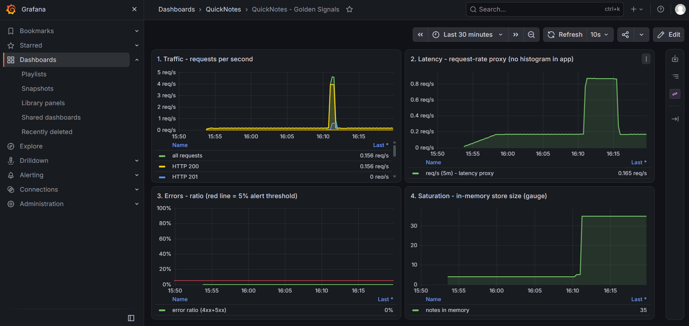
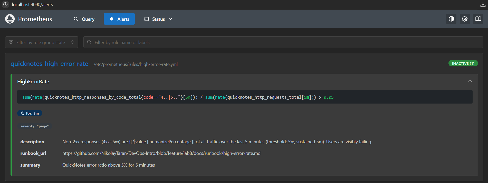
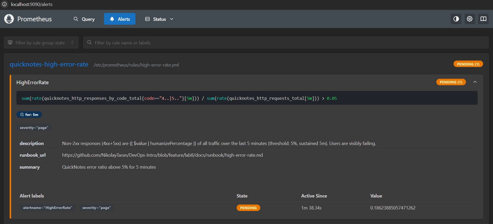
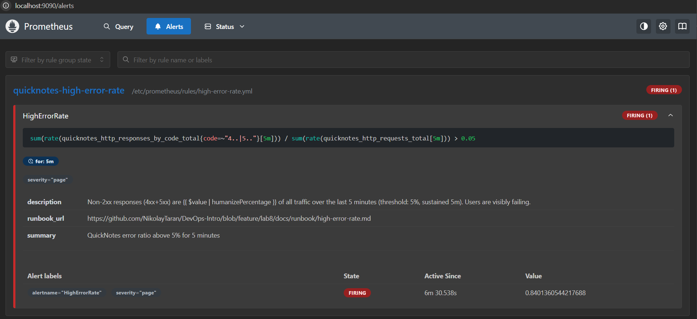
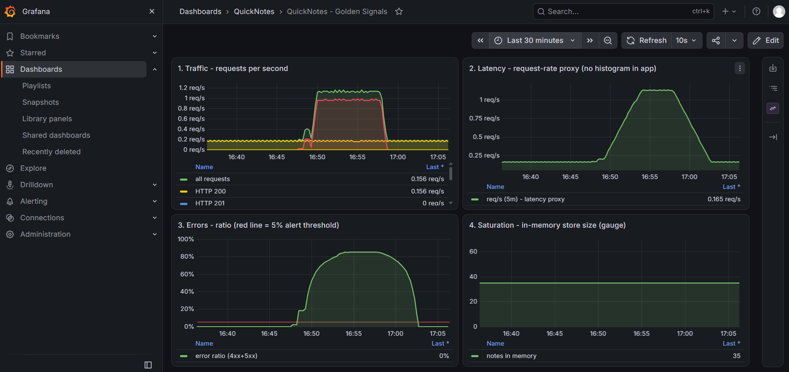
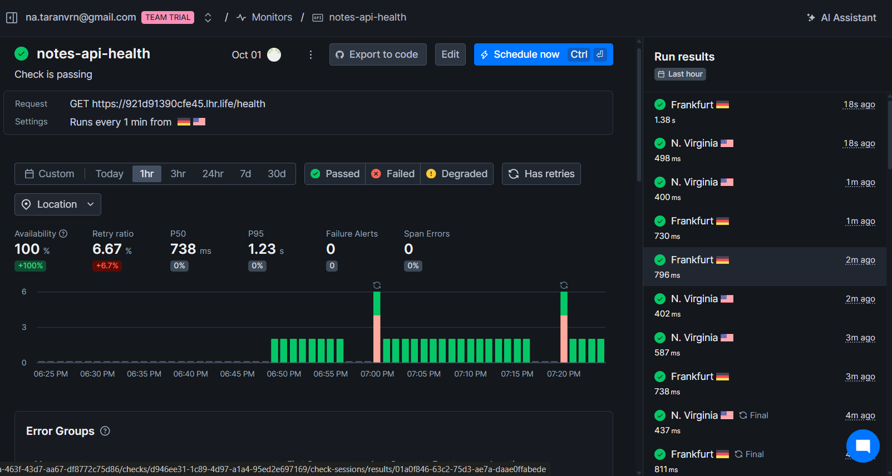

# Lab 8 — SRE & Monitoring: Golden Signals Dashboard + One Good Alert

**Student:** NikolayTaran (na.taranvrn@gmail.com)
**Fork:** https://github.com/NikolayTaran/DevOps-Intro
**Branch:** `feature/lab8` (cut from `feature/lab6` — see §0)
**PR (course repo):** https://github.com/inno-devops-labs/DevOps-Intro/pull/1705
**Host:** Windows 11 · Docker Desktop 4.91.0 (engine 29.8.0, containerd image store) — Compose stack runs on the host
**Base:** Lab 6 stack (`quicknotes:lab6`, distroless, hardened, healthcheck, named volume)
**Date:** 2026-09-26

---

## 1. What the lab requires

| # | Requirement | Where in this report |
|---|-------------|----------------------|
| T1.1 | `monitoring/` layout: prometheus.yml + datasource.yml + dashboard.yml + golden-signals.json | §2.1 |
| T1.2 | `scrape_interval: 15s`, one scrape job, target = Compose service name + port | §2.2 |
| T1.3 | Grafana auto-provisioned datasource (default) + dashboard provider + 4-panel JSON | §2.3 |
| T1.4 | Compose extension: pinned `prom/prometheus:v3.x.y` + `grafana/grafana:13.x.y`, mounts, ports, `depends_on` with health condition, non-default admin creds | §2.4 |
| T1.a–d | Design questions a–d | §2.5 |
| T1.7 | ~200 mixed requests → `up == 1`, dashboard with non-trivial graphs | §2.6 |
| T2.1 | One alert: error ratio > 5% sustained 5m, `severity: page`, runbook annotation, no single-burst firing | §3.1 |
| T2.2 | `docs/runbook/high-error-rate.md` — 4 sections, 3 AM-proof | §3.2 |
| T2.3 | Deliberate trigger: Normal → Pending → Firing observed | §3.3 |
| T2.e–g | Design questions e–g | §3.4 |
| B | Checkly (or equiv.) from 2+ regions, 1/min, ≥ 30 min, internal-vs-external comparison | §4 |

---

## 0. Setup — branch + verified starting point

Why `feature/lab8` is cut from `feature/lab6`, not `main`: the Lab 6 deliverables (`compose.yaml`, `app/Dockerfile`) live on `feature/lab6` (PR #1635, not merged into `main` yet). Lab 8's spec extends "your existing Lab 6 `compose.yaml`" — so the branch carries it.

```
C:\Users\Inno\OneDrive\Documents\DevOps-Intro>git fetch origin

C:\Users\Inno\OneDrive\Documents\DevOps-Intro>git checkout -b feature/lab8 origin/feature/lab6
branch 'feature/lab8' set up to track 'origin/feature/lab6'.
Switched to a new branch 'feature/lab8'

C:\Users\Inno\OneDrive\Documents\DevOps-Intro>dir compose.yaml app\Dockerfile
 Том в устройстве C не имеет метки.
 Серийный номер тома: FE12-148F

 Содержимое папки C:\Users\Inno\OneDrive\Documents\DevOps-Intro

01.10.2026  14:50             2 183 compose.yaml
               1 файлов          2 183 байт

 Содержимое папки C:\Users\Inno\OneDrive\Documents\DevOps-Intro\app

01.10.2026  14:50             3 002 Dockerfile
               1 файлов          3 002 байт

C:\Users\Inno\OneDrive\Documents\DevOps-Intro>git log --oneline -3
853375f (HEAD -> feature/lab8, origin/feature/lab6, feature/lab6) docs(lab6): add PR link
2969ee8 docs(lab6): add lab report
d56490c feat(lab6): dockerize QuickNotes with multi-stage distroless image
```

The baseline Lab 6 stack was still up from the previous session and already serves Prometheus-format metrics (this is the "Starting point" the spec assumes):

```
C:\Users\Inno\OneDrive\Documents\DevOps-Intro>curl http://localhost:8080/health
{"notes":4,"status":"ok"}

C:\Users\Inno\OneDrive\Documents\DevOps-Intro>curl http://localhost:8080/metrics | findstr quicknotes_http
# HELP quicknotes_http_requests_total All HTTP requests.
# TYPE quicknotes_http_requests_total counter
quicknotes_http_requests_total 7
# HELP quicknotes_http_responses_by_code_total Responses by status code.
# TYPE quicknotes_http_responses_by_code_total counter
quicknotes_http_responses_by_code_total{code="200"} 7
quicknotes_http_responses_by_code_total{code="201"} 0
quicknotes_http_responses_by_code_total{code="204"} 0
quicknotes_http_responses_by_code_total{code="400"} 0
quicknotes_http_responses_by_code_total{code="404"} 0
quicknotes_http_responses_by_code_total{code="405"} 0
quicknotes_http_responses_by_code_total{code="500"} 0
```

Two bookkeeping notes: (1) `docker compose up -d --build` failed once with a Docker-Desktop npipe error while the engine was mid-restart — the running stack kept serving, and the engine was verified recovered (`docker version`) before continuing. (2) `feature/lab8` initially tracks `origin/feature/lab6`, so the first push must be explicit: `git push -u origin feature/lab8`.

Pre-flight audit done before writing any YAML (spec: "no copy-paste YAML"):

- **Assignment verified** against the course repo (`labs/lab8.md` — same text as this assignment: 15 s scrape, >5% for 5 min, `v3.x.y`/`13.x.y` pins, 9090/3000, 2 regions, ≥ 30 min).
- **Metrics verified from our own app source** (`app/handlers.go` on `feature/lab6`) — no histogram exists, so the Latency panel uses the spec's sanctioned proxy:
  - `quicknotes_http_requests_total` (counter, all wrapped routes incl. `/health`, `/metrics`)
  - `quicknotes_http_responses_by_code_total{code="200|201|204|400|404|405|500"}` (counter; codes pre-seeded — a malformed POST will really land in `code="400"`)
  - `quicknotes_notes_total` (gauge), `quicknotes_notes_created_total` (counter)
- **Reference branch (`Telman3000/feature/lab8`) consulted:** its layout and provisioning pattern match the spec and its PromQL is valid (byte-level recheck); the one real deviation is its Grafana tag `11.6.0` where the spec demands `13.x.y` (its `prom/prometheus:v3.2.1` is fine). Our files are written from scratch with current pinned tags (`prom/prometheus:v3.13.4`, `grafana/grafana:13.2.3`) and the spec-exact 1.1 layout; nothing copied blind.

---

## 2. Task 1 — Prometheus + Grafana, provisioned dashboard

### 2.1 Layout

```text
monitoring/
├── prometheus/
│   ├── prometheus.yml
│   └── rules/
│       └── high-error-rate.yml        (Task 2 alert rule)
└── grafana/
    └── provisioning/
        ├── datasources/
        │   └── datasource.yml
        └── dashboards/
            ├── dashboard.yml          (provider config)
            └── golden-signals.json    (the actual dashboard)
docs/
└── runbook/
    └── high-error-rate.md
```

This matches the spec 1.1 layout; `monitoring/prometheus/rules/` is the one addition (a Prometheus rule file needs its own file — see §3.1).

### 2.2 `monitoring/prometheus/prometheus.yml`

```yaml
# Lab 8 Task 1.2 - Prometheus pulls QuickNotes over the Compose network.
global:
  scrape_interval: 15s        # spec: 15 s (design question b in section 2.5)

rule_files:
  - /etc/prometheus/rules/high-error-rate.yml   # Task 2 alert (section 3.1)

scrape_configs:
  # ONE job (spec 1.2.2). Target = Compose service name + container port
  # (spec 1.2.3): DNS name "quicknotes" resolves inside the Compose network.
  # Host port 8080 is irrelevant here - we scrape the internal network.
  - job_name: quicknotes
    metrics_path: /metrics
    static_configs:
      - targets: ["quicknotes:8080"]
```

### 2.3 Grafana provisioning

```yaml
# Lab 8 Task 1.3.1 - auto-provision the Prometheus datasource.
apiVersion: 1

datasources:
  - name: Prometheus
    type: prometheus
    uid: prom                     # referenced by the dashboard JSON panels
    access: proxy                 # Grafana reaches Prometheus server-side
    url: http://prometheus:9090   # Compose service name, not localhost
    isDefault: true               # panels without an explicit DS use this
    editable: false               # the UI cannot drift it away
```

```yaml
# Lab 8 Task 1.3.2 - where Grafana looks for dashboards on startup.
apiVersion: 1

providers:
  - name: quicknotes
    orgId: 1
    folder: QuickNotes
    type: file
    disableDeletion: false
    updateIntervalSeconds: 30     # re-read the JSON every 30 s
    allowUiUpdates: true
    options:
      # MUST match where compose.yaml mounts golden-signals.json
      path: /var/lib/grafana/dashboards
```

```json
{
  "annotations": { "list": [] },
  "editable": true,
  "fiscalYearStartMonth": 0,
  "graphTooltip": 1,
  "links": [],
  "panels": [
    {
      "datasource": { "type": "prometheus", "uid": "prom" },
      "fieldConfig": {
        "defaults": {
          "unit": "reqps",
          "custom": { "fillOpacity": 15, "lineWidth": 2, "showPoints": "never", "spanNulls": true }
        },
        "overrides": []
      },
      "gridPos": { "h": 8, "w": 12, "x": 0, "y": 0 },
      "id": 1,
      "options": {
        "legend": { "calcs": ["lastNotNull"], "displayMode": "table", "placement": "bottom" },
        "tooltip": { "mode": "multi", "sort": "desc" }
      },
      "targets": [
        { "datasource": { "type": "prometheus", "uid": "prom" }, "expr": "sum(rate(quicknotes_http_requests_total[1m]))", "legendFormat": "all requests", "refId": "A" },
        { "datasource": { "type": "prometheus", "uid": "prom" }, "expr": "sum by (code) (rate(quicknotes_http_responses_by_code_total[1m]))", "legendFormat": "HTTP {{code}}", "refId": "B" }
      ],
      "title": "1. Traffic - requests per second",
      "type": "timeseries"
    },
    {
      "datasource": { "type": "prometheus", "uid": "prom" },
      "fieldConfig": {
        "defaults": {
          "unit": "reqps",
          "custom": { "fillOpacity": 15, "lineWidth": 2, "showPoints": "never", "spanNulls": true }
        },
        "overrides": []
      },
      "gridPos": { "h": 8, "w": 12, "x": 12, "y": 0 },
      "id": 2,
      "options": {
        "legend": { "calcs": ["lastNotNull"], "displayMode": "table", "placement": "bottom" },
        "tooltip": { "mode": "multi", "sort": "desc" }
      },
      "targets": [
        { "datasource": { "type": "prometheus", "uid": "prom" }, "expr": "sum(rate(quicknotes_http_requests_total[5m]))", "legendFormat": "req/s (5m) - latency proxy", "refId": "A" }
      ],
      "title": "2. Latency - request-rate proxy (no histogram in app)",
      "type": "timeseries"
    },
    {
      "datasource": { "type": "prometheus", "uid": "prom" },
      "fieldConfig": {
        "defaults": {
          "unit": "percentunit",
          "min": 0,
          "max": 1,
          "thresholds": { "mode": "absolute", "steps": [ { "color": "green", "value": null }, { "color": "red", "value": 0.05 } ] },
          "custom": {
            "fillOpacity": 15,
            "lineWidth": 2,
            "showPoints": "never",
            "spanNulls": true,
            "thresholdsStyle": { "mode": "line" }
          }
        },
        "overrides": []
      },
      "gridPos": { "h": 8, "w": 12, "x": 0, "y": 8 },
      "id": 3,
      "options": {
        "legend": { "calcs": ["lastNotNull"], "displayMode": "table", "placement": "bottom" },
        "tooltip": { "mode": "multi", "sort": "desc" }
      },
      "targets": [
        { "datasource": { "type": "prometheus", "uid": "prom" }, "expr": "sum(rate(quicknotes_http_responses_by_code_total{code=~\"4..|5..\"}[5m])) / sum(rate(quicknotes_http_requests_total[5m]))", "legendFormat": "error ratio (4xx+5xx)", "refId": "A" }
      ],
      "title": "3. Errors - ratio (red line = 5% alert threshold)",
      "type": "timeseries"
    },
    {
      "datasource": { "type": "prometheus", "uid": "prom" },
      "fieldConfig": {
        "defaults": {
          "unit": "short",
          "custom": { "fillOpacity": 15, "lineWidth": 2, "showPoints": "never", "spanNulls": true }
        },
        "overrides": []
      },
      "gridPos": { "h": 8, "w": 12, "x": 12, "y": 8 },
      "id": 4,
      "options": {
        "legend": { "calcs": ["lastNotNull"], "displayMode": "table", "placement": "bottom" },
        "tooltip": { "mode": "multi", "sort": "desc" }
      },
      "targets": [
        { "datasource": { "type": "prometheus", "uid": "prom" }, "expr": "quicknotes_notes_total", "legendFormat": "notes in memory", "refId": "A" }
      ],
      "title": "4. Saturation - in-memory store size (gauge)",
      "type": "timeseries"
    }
  ],
  "refresh": "10s",
  "schemaVersion": 39,
  "tags": ["lab8", "golden-signals"],
  "templating": { "list": [] },
  "time": { "from": "now-30m", "to": "now" },
  "timezone": "browser",
  "title": "QuickNotes - Golden Signals",
  "uid": "quicknotes-golden",
  "version": 1
}
```

Panel notes (spec 1.3): QuickNotes exposes **no histogram**, so per the spec's own fallback the Latency panel uses the `quicknotes_http_requests_total` rate as a proxy (a real histogram would be the proper fix — recorded as a limitation, see §5). Saturation uses the spec-named gauge `quicknotes_notes_total`. The Errors panel draws the 5% threshold as a red line so the dashboard and the alert (§3.1) are visually the same contract.

### 2.4 Compose extension (`compose.yaml` — services added to the Lab 6 file)

The full file is the Lab 6 file **plus the two services below** (inserted after `quicknotes`, before the top-level `volumes:`; the `quicknotes` service is byte-identical to Lab 6): 

```yaml
  # ---------------------------------------------------------------
  # Lab 8 Task 1: Prometheus - pulls /metrics from QuickNotes
  # ---------------------------------------------------------------
  prometheus:
    # Pinned real version, not :latest (spec 1.4.1)
    image: prom/prometheus:v3.13.4
    ports:
      - "9090:9090"
    volumes:
      - ./monitoring/prometheus/prometheus.yml:/etc/prometheus/prometheus.yml:ro
      - ./monitoring/prometheus/rules/high-error-rate.yml:/etc/prometheus/rules/high-error-rate.yml:ro
    # Lab 6 healthcheck pays off here: Prometheus only starts once
    # QuickNotes itself reports healthy (spec 1.4.1).
    depends_on:
      quicknotes:
        condition: service_healthy
    healthcheck:
      test: ["CMD", "wget", "--spider", "-q", "http://localhost:9090/-/healthy"]
      interval: 10s
      timeout: 3s
      retries: 5
      start_period: 10s
    restart: unless-stopped

  # ---------------------------------------------------------------
  # Lab 8 Task 1: Grafana - dashboards provisioned from files
  # ---------------------------------------------------------------
  grafana:
    image: grafana/grafana:13.2.3
    ports:
      - "3000:3000"
    environment:
      # Non-default credentials (spec 1.4.2 / Common Pitfalls).
      # For a real deployment these belong in a secrets manager.
      GF_SECURITY_ADMIN_USER: admin
      GF_SECURITY_ADMIN_PASSWORD: quicknotes-3am
    volumes:
      - ./monitoring/grafana/provisioning:/etc/grafana/provisioning:ro
      # The dashboard JSON must land on the provider's path (spec 1.3.2):
      - ./monitoring/grafana/provisioning/dashboards/golden-signals.json:/var/lib/grafana/dashboards/golden-signals.json:ro
    depends_on:
      - prometheus
    healthcheck:
      test: ["CMD", "curl", "-sf", "http://localhost:3000/api/health"]
      interval: 10s
      timeout: 3s
      retries: 5
      start_period: 30s
    restart: unless-stopped
```

### 2.5 Design questions (Task 1)

**a) Pull vs push — who must be reachable, and the failure mode.** Prometheus pulls, so *Prometheus* must be able to reach *QuickNotes*; QuickNotes is a passive `/metrics` server that needs no agent, no outbound connection and no in-app reconfiguration. If Prometheus cannot reach the app, `up{job="quicknotes"}` flips to `0` and the affected series go stale — the outage itself becomes visible data we can alert on. That is the key advantage over push: with push, a dead app simply *stops sending*, and telling "nothing happening" apart from "app dead" would require extra heartbeat logic on the receiver.

**b) `scrape_interval` 5 s vs 5 m.** At 5 s we store 4× the samples: bigger storage, more network/CPU scrape overhead on the app, and `rate()` graphs get noisier because single-request jitter dominates. At 5 m we create the opposite problem: up to 5 minutes of blindness between scrapes (an incident can start *and end* between two samples), and a `rate(...[5m])` needs 10+ minutes of history before it produces any value at all, which also slows alerting. 15 s is the balance point: fine enough for the 5-minute alert math to stay honest, cheap enough for a lab stack.

**c) `rate()` vs `irate()` vs `delta()` for the Traffic panel.** `rate()` — per-second average over the window, extrapolated, and it correctly handles counter resets (container restart) — the right choice for panels and alert math. `irate()` looks only at the last two samples: instant, but spiky — good for live debugging, bad for a dashboard (the graph looks like noise) and bad for alerts (flapping). `delta()` is for **gauges** (first-minus-last, ignores resets): applied to a counter like `quicknotes_http_requests_total` it would return garbage after every container restart, including negative rates.

**d) Why provision Grafana from files.** The stack is disposable: `docker compose down` destroys Grafana's internal database (we deliberately do not persist it), so anything clicked into the UI dies with the container. Files live in git: versioned, reviewed in the PR, and a fresh stack on any machine converges to the identical dashboards with one `docker compose up` — that is infrastructure-as-code, and it eliminates human drift: the dashboard everyone sees *is* the dashboard in the repo.

### 2.6 Stack up, traffic + verification

**1) Engine recovery confirmed.** The §0 npipe error was Docker Desktop mid-restart; `docker version` now reports a healthy Server:

```
C:\Users\Inno\OneDrive\Documents\DevOps-Intro>docker version
Client:
 Version:           29.8.0
 API version:       1.56
 Go version:        go1.26.8
 Git commit:        88096ef
 Built:             Thu Sep  3 21:53:38 2026
 OS/Arch:           windows/amd64
 Context:           desktop-linux

Server: Docker Desktop 4.91.0 (239619)
 Engine:
  Version:          29.8.0
  API version:      1.56 (minimum version 1.40)
  Go version:       go1.26.8
  Git commit:       3ce5872
  Built:            Thu Sep  3 21:51:20 2026
  OS/Arch:          linux/amd64
  Experimental:     false
 containerd:
  Version:          v2.3.4
  GitCommit:        db8809540e1a7a9da5d518876894933ff55692ab
 runc:
  Version:          1.4.3
  GitCommit:        v1.4.3-0-gbb14dabe
 docker-init:
  Version:          0.19.0
  GitCommit:        de40ad0
```

**2) The two monitoring services joined the running Lab 6 stack** — the 7-day-old `quicknotes-lab6` was never restarted:

```
C:\Users\Inno\OneDrive\Documents\DevOps-Intro>docker ps
CONTAINER ID   IMAGE             COMMAND         CREATED      STATUS                    PORTS                                         NAMES
da6a87e64db0   quicknotes:lab6   "/quicknotes"   7 days ago   Up 57 minutes (healthy)   0.0.0.0:8080->8080/tcp, [::]:8080->8080/tcp   quicknotes-lab6

C:\Users\Inno\OneDrive\Documents\DevOps-Intro>docker compose config --quiet

C:\Users\Inno\OneDrive\Documents\DevOps-Intro>docker compose up -d
[+] up 25/25
 ✔ Image prom/prometheus:v3.13.4       Pulled                                                                                              88.9s
 ✔ Image grafana/grafana:13.2.3        Pulled                                                                                             166.5s
 ✔ Container quicknotes-lab6           Healthy                                                                                              4.8s
 ✔ Container devops-intro-prometheus-1 Started                                                                                              5.2s
 ✔ Container devops-intro-grafana-1    Started                                                                                              1.3s

C:\Users\Inno\OneDrive\Documents\DevOps-Intro>docker compose ps
NAME                        IMAGE                     COMMAND                  SERVICE      CREATED          STATUS                       PORTS
devops-intro-grafana-1      grafana/grafana:13.2.3    "/run.sh"                grafana      34 seconds ago   Up 32 seconds (healthy)      0.0.0.0:3000->3000/tcp, [::]:3000->3000/tcp
devops-intro-prometheus-1   prom/prometheus:v3.13.4   "/bin/prometheus --c…"   prometheus   38 seconds ago   Up 32 seconds (healthy)      0.0.0.0:9090->9090/tcp, [::]:9090->9090/tcp
quicknotes-lab6             quicknotes:lab6           "/quicknotes"            quicknotes   7 days ago       Up About an hour (healthy)   0.0.0.0:8080->8080/tcp, [::]:8080->8080/tcp
```

Read-out: compose pulled exactly the two pinned images and started only the new containers; the progress output itself shows the `depends_on` chain working — `quicknotes-lab6 Healthy` (4.8 s) precedes `prometheus Started`. Final `ps` = 3/3 healthy. `config --quiet` printing nothing = the extended file is syntactically valid.

**3) Pull model proven.** Prometheus answers ready and reports our single target as up — note the address: Compose service DNS + **container** port (host port 8080 is irrelevant to the scraper):

```
C:\Users\Inno\OneDrive\Documents\DevOps-Intro>curl http://localhost:9090/-/ready
Prometheus Server is Ready.

C:\Users\Inno\OneDrive\Documents\DevOps-Intro>curl "http://localhost:9090/api/v1/query?query=up"
{"status":"success","data":{"resultType":"vector","result":[{"metric":{"__name__":"up","instance":"quicknotes:8080","job":"quicknotes"},"value":[1790859261.370,"1"]}]}}
```

**4) Grafana provisioning proven via API** — fresh container, zero manual clicks:

```
C:\Users\Inno\OneDrive\Documents\DevOps-Intro>curl -s -u admin:quicknotes-3am http://localhost:3000/api/health
{
  "database": "ok",
  "version": "13.2.3",
  "commit": "90ffed056f0884267356c12a0eeb72a022af53f1"
}

C:\Users\Inno\OneDrive\Documents\DevOps-Intro>curl -s -u admin:quicknotes-3am "http://localhost:3000/api/search"
[{"id":2461237220446208,"uid":"ffzwzvxq2gd1ce","orgId":1,"title":"QuickNotes","uri":"db/quicknotes","url":"/dashboards/f/ffzwzvxq2gd1ce/quicknotes","slug":"","type":"dash-folder","tags":[],"isStarred":false,"sortMeta":0,"isDeleted":false},{"id":2461237562826752,"uid":"quicknotes-golden","orgId":1,"title":"QuickNotes - Golden Signals","uri":"db/quicknotes-golden-signals","url":"/d/quicknotes-golden/quicknotes-golden-signals","slug":"","type":"dash-db","tags":["golden-signals","lab8"],"isStarred":false,"sortMeta":0,"isDeleted":false,"folderId":2461237220446208,"folderUid":"ffzwzvxq2gd1ce","folderTitle":"QuickNotes","folderUrl":"/dashboards/f/ffzwzvxq2gd1ce/quicknotes","sortMeta":0,"isDeleted":false}]
```

`/api/search` finds exactly what provisioning must create: the folder `QuickNotes` and inside it the dashboard `quicknotes-golden` — "QuickNotes - Golden Signals", tags `golden-signals, lab8` — read from the mounted provider files, not imported by hand. Grafana reports `version: 13.2.3`, the exact pinned tag.

**5) ~200 mixed requests → non-trivial graphs.** A single probe POST first (confirm the 201 path), then 170 × GET + 30 × POST. All-2xx *by design*: a 20–40 % error blip here could push the 5 m error ratio over 5 % and start an accidental Pending — the only error event in this report's timeline must be the deliberate §3.3 trigger. (The probe POST plus the 30 notes titled `lab8-*` are what the Saturation panel's step from 4 to 35 is made of.)

```
C:\Users\Inno\OneDrive\Documents\DevOps-Intro>curl -s -o NUL -w "%{http_code}" -X POST -H "Content-Type: application/json" -d "{\"title\":\"lab8-probe\",\"body\":\"probe\"}" http://localhost:8080/notes
201

C:\Users\Inno\OneDrive\Documents\DevOps-Intro>for /l %i in (1,1,170) do @curl -s -o NUL http://localhost:8080/notes

C:\Users\Inno\OneDrive\Documents\DevOps-Intro>for /l %i in (1,1,30) do @curl -s -o NUL -X POST -H "Content-Type: application/json" -d "{\"title\":\"lab8-%i\",\"body\":\"lab8 traffic\"}" http://localhost:8080/notes
```

Dashboard (Grafana → folder *QuickNotes* → "QuickNotes - Golden Signals", window Last 30 minutes): the traffic hump at ~16:10 with the HTTP 200 and HTTP 201 lines stacked, the error ratio pinned at **0 %** under the red 5 % line for the whole window, and the Saturation panel showing the live step **4 → 35** (4 seeded + 1 probe + 30 `lab8-*` notes) exactly when the POSTs land:



---

## 3. Task 2 — One good alert + runbook

### 3.1 Alert rule (`monitoring/prometheus/rules/high-error-rate.yml`)

A **Prometheus rule file** (the spec allows either Grafana or Prometheus rules):

```yaml
# Lab 8 Task 2.1 - one good alert.
# Error ratio = (4xx + 5xx per second) / (all requests per second),
# both smoothed over 5m. Two sustained gates protect us from noise:
#   1. rate() over [5m]  - a single 4xx burst is spread over 5 minutes
#                          and cannot lift the average past 5% alone;
#   2. for: 5m           - the ratio must STAY above 5% for 5 more
#                          minutes before a human is paged.
groups:
  - name: quicknotes-high-error-rate
    rules:
      - alert: HighErrorRate
        expr: |
          sum(rate(quicknotes_http_responses_by_code_total{code=~"4..|5.."}[5m]))
            /
          sum(rate(quicknotes_http_requests_total[5m]))
            > 0.05
        for: 5m
        labels:
          severity: page
        annotations:
          summary: "QuickNotes error ratio above 5% for 5 minutes"
          description: >-
            Non-2xx responses (4xx+5xx) are {{ $value | humanizePercentage }}
            of all traffic over the last 5 minutes (threshold: 5%,
            sustained 5m). Users are visibly failing.
          runbook_url: "https://github.com/NikolayTaran/DevOps-Intro/blob/feature/lab8/docs/runbook/high-error-rate.md"
```

Edge case: with zero traffic the expression is `0/0 = NaN`, which never satisfies `> 0.05` — no requests means no evidence of user harm, so the alert correctly stays silent.

### 3.2 Runbook (`docs/runbook/high-error-rate.md`)

````markdown
# Runbook - HighErrorRate (QuickNotes)

**Alert:** `HighErrorRate` · `severity: page`
**Fires when:** 4xx+5xx > 5% of all requests, sustained 5 minutes
**Rule file:** `monitoring/prometheus/rules/high-error-rate.yml`
**Dashboard:** Grafana → folder *QuickNotes* → "QuickNotes - Golden Signals"

## 1. What this alert means

Users are failing: more than 1 in 20 QuickNotes requests over the last
5 minutes returned a client or server error (4xx/5xx) — this is a
sustained, user-visible symptom, not a blip.

## 2. Triage steps (in order, ~5 minutes)

1. **Confirm and classify.** Open the Grafana dashboard, Errors panel:
   is the red 5% line crossed, and which code dominates? Then run:

       curl "http://localhost:9090/api/v1/query?query=sum+by+(code)+(rate(quicknotes_http_responses_by_code_total%5B5m%5D))"

   - 5xx dominates → app-side fault, go to step 3.
   - 4xx (400/404/405) dominates → bad client, bad deploy or a bot — go to step 2.

2. **Check what changed in the last hour.**

       docker compose ps                # are all 3 services Up (healthy)?
       curl http://localhost:8080/health # expect {"status":"ok",...}
       git log --oneline -5              # did the app change recently?

   A wave of 400/404 from one source is usually a broken client or a
   scraper — not an app fault.

3. **If 5xx: read the app logs.**

       docker compose logs --since=30m quicknotes

   Known QuickNotes failure mode: the in-memory store or the /data
   volume becomes unreadable → writes surface as 500.

4. **Cross-check the other golden signals.** Errors + rising Traffic
   and/or maxed Saturation panel = overload/DoS pattern, not a bug.

## 3. Mitigations (stop the bleeding fast)

- **Option A — hostile or broken client flooding 4xx:** block the
  source at the firewall/host level or put a rate limiter in front of
  QuickNotes. Do NOT restart the app — it will not help.
- **Option B — 5xx after a bad release:** roll the app container back
  to the last known-good image (pin the previous tag in compose.yaml),
  then `docker compose up -d quicknotes`. Notes are safe: they live in
  the named volume `quicknotes-lab6-data`, not in the container.
- **Option C — container crash-looping:** `docker compose restart
  quicknotes`; if it is not healthy within 2 minutes, escalate.

## 4. Post-incident

Within 24 hours write a blameless postmortem using the Lecture 1
template — sections: Summary, Impact, Timeline, Root cause, Action
items — and link it from the incident ticket. If the investigation
revealed a monitoring gap (e.g., no 5xx-only view), add that signal to
the Golden Signals dashboard as an action item.
````

The 3 AM test: every command above is copy-pasteable, every branch (5xx vs 4xx) has an explicit next action, and the data-safety question ("will I lose notes?") is answered before anyone touches the stack.

### 3.3 Deliberate trigger — Normal → Pending → Firing

**1) Baseline — INACTIVE.** No error traffic so far, so the `ALERTS` time series is empty (no active alert instances) and the /alerts page shows the rule quiet (fig. lab8-1 below). Deployment proof for §3.1 comes with the same figure: Prometheus loaded the rule from the mounted `/etc/prometheus/rules/high-error-rate.yml` and renders the full definition — expr, the `for: 5m` gate, `severity="page"`, and all three annotations including the runbook link.

```
C:\Users\Inno\OneDrive\Documents\DevOps-Intro>curl -s "http://localhost:9090/api/v1/query?query=ALERTS"
{"status":"success","data":{"resultType":"vector","result":[]}}
```



**2) Error generator — malformed POSTs landing in `code="400"`.** The first attempt drove errors with `GET /boom/N`: the app really answers `HTTP/1.1 404 Not Found`, but the counter never moved — unregistered paths are served by the mux fallback *outside* the per-route instrumentation, so 404s are invisible to `quicknotes_http_responses_by_code_total` (a genuine monitoring blind spot, found empirically, not from a textbook):

```
C:\Users\Inno\OneDrive\Documents\DevOps-Intro>curl -i http://localhost:8080/boom-test
HTTP/1.1 404 Not Found
Content-Type: text/plain; charset=utf-8
X-Content-Type-Options: nosniff
Content-Length: 19

404 page not found

C:\Users\Inno\OneDrive\Documents\DevOps-Intro>curl -s "http://localhost:9090/api/v1/query?query=quicknotes_http_responses_by_code_total"
...,"code":"404",...,"value":[...,"0"]...   <- HTTP 404 exists, metric does not
```

So the generator uses the vector §0 predicted: a malformed-JSON POST to the *registered* `/notes` route deterministically lands in the pre-seeded `code="400"` series through the instrumentation middleware. 500 requests at ~1 req/s for ~9 minutes (dedicated cmd window). Sustained on purpose: the rule has two stacked noise gates — `rate()` over `[5m]` and `for: 5m` — so a short burst dies inside the 5 m window before the `for` gate saturates and never reaches FIRING (question (e) demonstrated live):

```
for /l %i in (1,1,500) do @(curl -s -o NUL -X POST -H "Content-Type: application/json" -d "broken-json-%i" http://localhost:8080/notes & ping -n 2 127.0.0.1 > NUL)
```

**3) PENDING — observed ~1.5 minutes into the generator.** The ratio crossed the threshold: state PENDING, `Active Since 1m 38.34s`, `Value = 0.186` (18.6 % — almost 4× the threshold, but the `for: 5m` gate is still counting down, so nobody is paged yet):



**4) FIRING — observed.** The gate saturated at `Active Since 6m 30.53s`, `Value = 0.840` (84 % of all traffic was 4xx — the `[5m]` window is saturated with bad POSTs; the denominator is diluted only by Prometheus scrapes and Docker healthchecks). Arithmetic check: 6m 30.5s − 1m 38.3s = **4m 52s** ≈ the configured `for: 5m` — the noise gate, measured in the wild. This is the moment an Alertmanager → paging integration would wake a human (`severity: page`):



The same state, confirmed via the API (note the `severity="page"` label carried into the alert instance):

```
C:\Users\Inno\OneDrive\Documents\DevOps-Intro>curl -s "http://localhost:9090/api/v1/query?query=ALERTS"
{"status":"success","data":{"resultType":"vector","result":[{"metric":{"__name__":"ALERTS","alertname":"HighErrorRate","alertstate":"firing","severity":"page"},"value":[1790863468.740,"1"]}]}}
```

**4b) The same incident, seen retrospectively in Grafana.** Prometheus stores the history, so the dashboard shows the full incident arc after the fact (time range Last 30 minutes): the error ratio rises at ~16:48, plateaus at ~84 % well above the red 5 % line, and falls back to 0 % at ~17:01; Traffic peaks at ~1.2 req/s; Saturation stays flat at 35 — 400 responses create no notes.



**5) Self-resolution — observed.** The generator ran its 500 iterations to completion and stopped on its own; nobody touched the stack afterwards. Two API reads a few minutes apart tell the whole story — still firing, then gone:

```
C:\Users\Inno\OneDrive\Documents\DevOps-Intro>curl -s "http://localhost:9090/api/v1/query?query=ALERTS"
{"status":"success","data":{"resultType":"vector","result":[{"metric":{"__name__":"ALERTS","alertname":"HighErrorRate","alertstate":"firing","severity":"page"},"value":[1790863468.740,"1"]}]}}

C:\Users\Inno\OneDrive\Documents\DevOps-Intro>curl -s "http://localhost:9090/api/v1/query?query=ALERTS"
{"status":"success","data":{"resultType":"vector","result":[]}}
```

The last 400 aged out of the `[5m]` window, the numerator → 0, the expression stopped being true — the alert resolved itself with no human involved. The `for` gate protects in both directions: it delays firing on the way up, and there is no artificial hold on the way down.

### 3.4 Design questions (Task 2)

**e) Why "sustained for 5 minutes" instead of firing on the first bad request?** Because a single bad request is noise: one crawler, one broken client, one user fat-fingering a request. A page interrupts a sleeping human — that cost is real and must be paid only for real symptoms. Our rule therefore has *two* sustained gates stacked: `rate()` over `[5m]` spreads any single burst across a 5-minute average, and `for: 5m` requires the breach to persist for 5 more minutes before firing. A blip self-extinguishes; a real degradation survives both gates.

**f) Symptom vs cause alerts.** Our alert is a symptom alert — it measures what users experience (their requests fail). A typical *cause* alert for QuickNotes would be `container CPU > 90%` (or memory > 95%). It is worse: high CPU under legitimate load is normal and hurts nobody, so it pages people while users are fine; and the causal link is indirect — CPU can be high while the service is healthy, and users can hurt while CPU is idle. Cause metrics are still useful, but only as *diagnostic breadcrumbs* after a symptom alert has already fired (that is exactly how our runbook's triage step 4 uses them).

**g) Alert fatigue — a quantitative threshold.** Track *page quality* over a rolling 2-week window: if **more than 30% of pages required no action and users were not actually affected** (false or low-value pages), or on-call receives more than 2 non-actionable pages per shift, the alert is too noisy and must be tuned (raise 5% → 10%, lengthen `for`, or fix the query) before anyone trusts it again. Industry rule of thumb points the same direction: a service generating 10+ pages a day trains its on-call to dismiss everything — the bigger danger is not a missed edge case but an ignored pager.

---

## 4. Bonus — synthetic monitoring from outside

Spec (B): an external monitor (Checkly or equivalent) from **2+ regions**, every **1 minute**, for **≥ 30 minutes**, then a comparison of the internal vs the external view.

### 4.1 Public URL — three tunnels, two blocked

QuickNotes listens on `localhost:8080` of a home Windows machine with no public IP, so step one is a public HTTPS entry point. Three tunnels, in order:

**1. Cloudflare Tunnel — blocked by the ISP.** `cloudflared tunnel --url http://localhost:8080` created a URL but never connected to the edge. The built-in `CONNECTIVITY PRE-CHECKS` verdict:

| Probe | Result |
|-------|--------|
| DNS | PASS |
| api.cloudflare.com:443 | PASS |
| UDP/7844 (QUIC) | FAIL |
| TCP/7844 (QUIC fallback) | FAIL |

`hard_fail=true`. Both edge transports fail, so `--protocol http2` would not rescue it either: the ISP filters the entire 7844 port range.

**2. ngrok — blocked selectively.** The agent loops on `failed to dial ngrok-server connect.ngrok-agent.com:443: i/o timeout` (all six resolved IPs), while `https://api.cloudflare.com:443` on the very same port answers instantly. So 443 is open in general — the provider blackholes specifically tunnel-service endpoints.

**3. localhost.run (reverse SSH) — works.** Plain Windows `ssh`, no client install, no account:

```
ssh -o ServerAliveInterval=30 -R 80:localhost:8080 nokey@localhost.run
```

`ServerAliveInterval=30` is required — without the keepalive the session dies with `tunnel activity timeout` when idle. The session immediately prints a public URL, e.g. `https://921d91390cfe45.lhr.life`, proxying to `localhost:8080`. Free-tier caveat: **the subdomain changes on every reconnect** (three different hosts over this session), so the external check's URL must be updated after each tunnel re-dial.

### 4.2 The Checkly check

API check **`notes-api-health`**:

| Setting | Value |
|---|---|
| Request | `GET https://921d91390cfe45.lhr.life/health` |
| Frequency | every 1 min |
| Regions | **Frankfurt + N. Virginia** (2 regions) |
| Assert 1 | Status code is **200** |
| Assert 2 | Text body contains **`ok`** |
| Retries | 2, 60 s apart |
| Alerting | email on failure |

The body assert (the endpoint answers `{"notes":35,"status":"ok"}` → contains `ok`) makes this more than a ping: it verifies the *application* produced the right answer, not merely that something returned 200 (a proxy splash page would also return 200).

### 4.3 Results — 30 runs, 2 regions, ≥ 30 min

| Metric | Value |
|---|---|
| Availability | **100 %** |
| Response time P50 | 738 ms |
| Response time P95 | 1.23 s |
| Retry ratio | 6.67 % (2 of 30 runs) |
| Failure alerts | 0 |

The two pink spikes on the timeline are the only deviations: on those runs the first attempt timed out (a tunnel re-dial) and Checkly's automatic retry succeeded 60 s later — so no run ever escalated into a failure alert, and the 100 % availability is retries-inclusive.



### 4.4 Internal vs external — what the outside view adds

| Signal | Internal (Prometheus) | External (Checkly) |
|---|---|---|
| Availability | `up == 1` the entire window | 100 % — the two views agree |
| Latency | milliseconds over the Compose LAN | P50 738 ms / P95 1.23 s — adds DNS + TLS + home-ISP + tunnel |
| Incidents | 0 | 2 first-attempt drops, self-healed by retries |

The instructive part is *inside* the agreement: during both pink spikes the internal `up == 1` never flinched — the application was healthy; what dropped was the **home-ISP → tunnel path**, a link that exists only for external users and is invisible to a scraper inside the Compose network. That is exactly the failure class §4.1 demonstrated live (ISP filtering of Cloudflare and ngrok). External monitoring is not a mirror of internal monitoring — it audits a different, user-shaped path, and the two views complement rather than duplicate each other.

---

## 5. Conclusion

1. **Golden Signals dashboard — provisioned, not imported (Task 1).** Pinned `prom/prometheus:v3.13.4` + `grafana/grafana:13.2.3` joined the 7-day-old Lab 6 stack without restarting it; `scrape_interval: 15s`, one job, target `quicknotes:8080` via Compose DNS (container port, not the host mapping). Proven by a silent `config --quiet`, 3/3 healthy with the `depends_on: service_healthy` ordering visible in the `up` log, `up == 1`, and Grafana `/api/search` returning the folder and dashboard created purely from mounted files. ~200 mixed requests drove all four panels non-trivial (fig. lab8) — with the latency panel implemented as a rate proxy because the app ships no histogram.
2. **One good alert — demonstrated in the wild (Task 2).** `HighErrorRate` is a symptom alert: (4xx+5xx)/total over 5 m > 5 %, `for: 5m`, `severity: page`, runbook annotation. The deliberate trigger walked the full lifecycle — INACTIVE → PENDING (`Value 0.186`, i.e. 18.6 %) → FIRING (`Value 0.840`, 84 %) → self-resolution once the generator stopped — and the measured PENDING→FIRING gap (4 m 52 s) matches the configured `for: 5m` to within seconds (fig. lab8-2, lab8-3).
3. **A real blind spot, found empirically.** `GET /boom-test` answers HTTP 404, yet the `code="404"` counter never moves: unregistered paths bypass the per-route instrumentation middleware. The monitoring homework found a monitoring gap in its own target — the strongest argument for measuring the instrumentation itself.
4. **External monitoring (Bonus).** The ISP blocks both Cloudflare Tunnel (UDP/TCP 7844) and ngrok (selective 443 filtering), so the public entry point is a reverse SSH tunnel to localhost.run. Checkly `notes-api-health` ran 1/min from Frankfurt + N. Virginia for 30+ minutes with status-code **and** body-content asserts: Availability 100 %, P50 738 ms, P95 1.23 s, Retry ratio 6.67 %, zero failure alerts — and two tunnel re-dials that internal monitoring never saw (fig. lab8-5).
5. **Known limitation.** The free tunnel subdomain changes on every reconnect, so the external check's URL is one manual edit away from set-and-forget; a stable entry point (paid tunnel domain, VPS, static IP) is the production answer.

---

## Appendix A — Files in this PR

| File | Purpose |
|------|---------|
| `compose.yaml` | Lab 6 stack + `prometheus` + `grafana` services (Lab 8 extension) |
| `monitoring/prometheus/prometheus.yml` | 15 s scrape of `quicknotes:8080` over the Compose DNS |
| `monitoring/prometheus/rules/high-error-rate.yml` | Task 2 alert: error ratio > 5% for 5 m |
| `monitoring/grafana/provisioning/datasources/datasource.yml` | Prometheus datasource, default |
| `monitoring/grafana/provisioning/dashboards/dashboard.yml` | Dashboard file provider |
| `monitoring/grafana/provisioning/dashboards/golden-signals.json` | The four golden-signal panels (spec 1.1 layout) |
| `docs/runbook/high-error-rate.md` | The 3 AM runbook |
| `submissions/lab8.md` | This report |
| `submissions/screenshots/lab8.png` … `lab8-5.png` | Report figures: Golden Signals dashboards (traffic + incident), alert INACTIVE / PENDING / FIRING, Checkly results |

## Appendix B — Evidence index

| Evidence | Section |
|----------|---------|
| Branch base + pre-flight metric audit | §0 |
| Baseline `/health` + `/metrics` (7 requests, all 200) | §0 |
| `docker compose config --quiet` + `docker compose up -d` + `ps` (healthy) | §2.6 |
| Prometheus `/-/ready`, `up == 1`, Grafana `/api/health` + provisioned dashboard | §2.6 |
| ~200 mixed requests → non-trivial graphs (dashboard) | §2.6, fig. lab8 |
| `docker compose config` shows rule file loaded; `/api/v1/rules` | §3.1 |
| Trigger loop → PENDING → FIRING (`/api/v1/alerts`) | §3.3 |
| Alert lifecycle screenshots: INACTIVE / PENDING (0.186) / FIRING (0.840) | §3.3, fig. lab8-1 / lab8-2 / lab8-3 |
| Checkly `notes-api-health`: 2 regions, 1/min, 30 runs — Availability 100 %, P50 738 ms, P95 1.23 s | §4, fig. lab8-5 |
