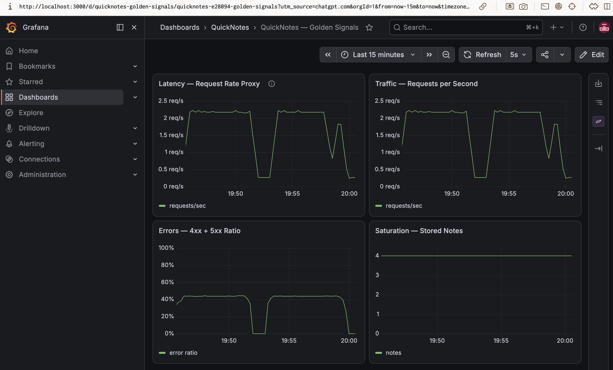
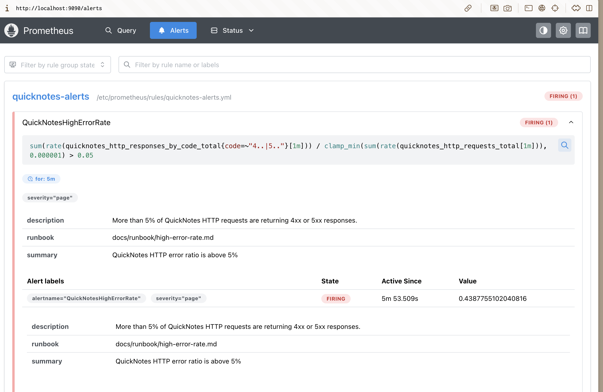

# Lab 8 — SRE & Monitoring

## Task 1 — Prometheus and Grafana

I extended the Lab 6 Compose stack with Prometheus and Grafana. Prometheus scrapes the QuickNotes `/metrics` endpoint every 15 seconds, while Grafana uses Prometheus as its default provisioned data source. The Golden Signals dashboard is also provisioned automatically from files.

### Configuration files

- [Prometheus configuration](../monitoring/prometheus/prometheus.yml)
- [Grafana data source](../monitoring/grafana/provisioning/datasources/datasource.yml)
- [Grafana dashboard provider](../monitoring/grafana/provisioning/dashboards/dashboard.yml)
- [Golden Signals dashboard](../monitoring/grafana/dashboards/golden-signals.json)
- [Docker Compose configuration](../compose.yaml)

The dashboard contains exactly four panels:

1. **Latency** — `rate(quicknotes_http_requests_total[1m])` is used as a proxy because QuickNotes does not expose a request-duration histogram.
2. **Traffic** — request rate calculated with `rate(quicknotes_http_requests_total[1m])`.
3. **Errors** — ratio of 4xx and 5xx responses to all HTTP requests.
4. **Saturation** — current number of stored notes from `quicknotes_notes_total`.

### Grafana dashboard



I generated more than 200 requests against QuickNotes to produce non-trivial traffic in the dashboard.

### Prometheus target verification

```console
$ curl http://localhost:9090/api/v1/targets | jq '.data.activeTargets[].health'
"up"
```

Prometheus successfully reaches QuickNotes using the Compose service name `quicknotes:8080`.

### Design questions

**a) Pull vs push**

Prometheus uses a pull model, so Prometheus must be able to reach the QuickNotes metrics endpoint. QuickNotes does not need to initiate a connection to Prometheus. If Prometheus cannot reach QuickNotes, the target becomes `DOWN` and new metrics cannot be collected.

**b) Scrape interval**

A 5-second interval gives higher-resolution data and faster detection, but creates more network, processing, and storage overhead. A 5-minute interval reduces overhead but can miss short spikes and makes queries and alerts much less responsive.

**c) `rate()` vs `irate()` vs `delta()`**

I use `rate()` for the Traffic panel because HTTP requests are represented by a counter. `rate()` calculates the average per-second counter increase over a time window and handles counter resets. `irate()` uses only the latest two samples and is more sensitive to short spikes, while `delta()` calculates the difference between the first and last value and is more appropriate for gauges.

**d) Grafana provisioning**

Provisioning from files makes the monitoring setup reproducible and version-controlled. A fresh stack automatically gets the same data source and dashboard without manual configuration in the Grafana UI. The configuration can also be reviewed in Git and reproduced by other developers.

---

## Task 2 — High Error Rate Alert

I created a Prometheus alert named `QuickNotesHighErrorRate`.

The alert fires when more than 5% of HTTP requests return 4xx or 5xx responses continuously for 5 minutes.

### Alert rule

The complete rule is available in [quicknotes-alerts.yml](../monitoring/prometheus/rules/quicknotes-alerts.yml).

```yaml
groups:
  - name: quicknotes-alerts
    rules:
      - alert: QuickNotesHighErrorRate
        expr: |
          sum(rate(quicknotes_http_responses_by_code_total{code=~"4..|5.."}[1m]))
          /
          clamp_min(sum(rate(quicknotes_http_requests_total[1m])), 0.000001)
          > 0.05
        for: 5m
        labels:
          severity: page
        annotations:
          summary: "QuickNotes HTTP error ratio is above 5%"
          description: "More than 5% of QuickNotes HTTP requests are returning 4xx or 5xx responses."
          runbook: "docs/runbook/high-error-rate.md"
```

### Alert verification

To trigger the alert, I continuously sent healthy requests together with malformed `POST /notes` requests. The malformed requests returned HTTP 400 and kept the error ratio above 5% for more than five minutes.

The alert transitioned from `Pending` to `Firing`:

```json
{
  "state": "firing",
  "labels": {
    "alertname": "QuickNotesHighErrorRate",
    "severity": "page"
  },
  "annotations": {
    "description": "More than 5% of QuickNotes HTTP requests are returning 4xx or 5xx responses.",
    "runbook": "docs/runbook/high-error-rate.md",
    "summary": "QuickNotes HTTP error ratio is above 5%"
  }
}
```



After the malformed traffic stopped, the alert returned to the normal state.

### Runbook

The full runbook is available at [docs/runbook/high-error-rate.md](../docs/runbook/high-error-rate.md).

It contains the alert meaning, ordered triage steps, immediate mitigations, and post-incident actions using the blameless postmortem format from Lecture 1.

### Design questions

**e) Why require the condition for 5 minutes?**

A single bad request or a short burst of errors does not necessarily mean that users are experiencing a persistent problem. Requiring the error ratio to stay above 5% for five minutes filters out temporary spikes and reduces unnecessary pages.

**f) Symptom alerts vs cause alerts**

A cause alert could page when QuickNotes CPU usage becomes high. This is worse as the primary page because high CPU does not necessarily mean that users are affected, while real HTTP errors can be caused by many things other than CPU. The error-ratio alert directly measures a user-visible symptom.

**g) Alert fatigue**

I would consider the alert too noisy if more than 20% of its pages occurred while users were not actually affected. In that case, the threshold, evaluation window, or alert logic should be adjusted to reduce false pages.

---

## Result

The Compose stack now starts QuickNotes, Prometheus, and Grafana together. Prometheus successfully scrapes QuickNotes, Grafana automatically loads the four-panel Golden Signals dashboard, and the high-error-rate alert only fires after a sustained five-minute breach. The associated runbook provides the steps needed to investigate and mitigate the incident.

The optional external synthetic monitoring bonus was not attempted.