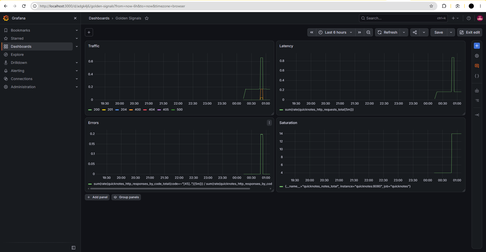
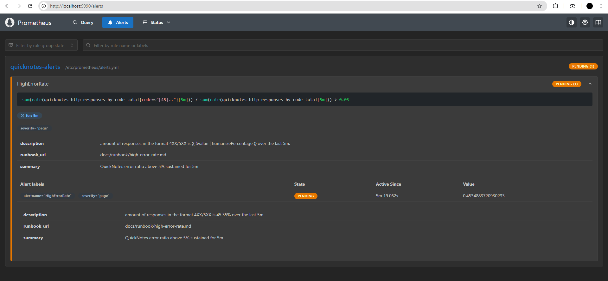
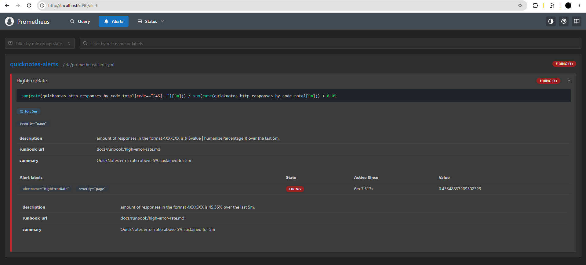
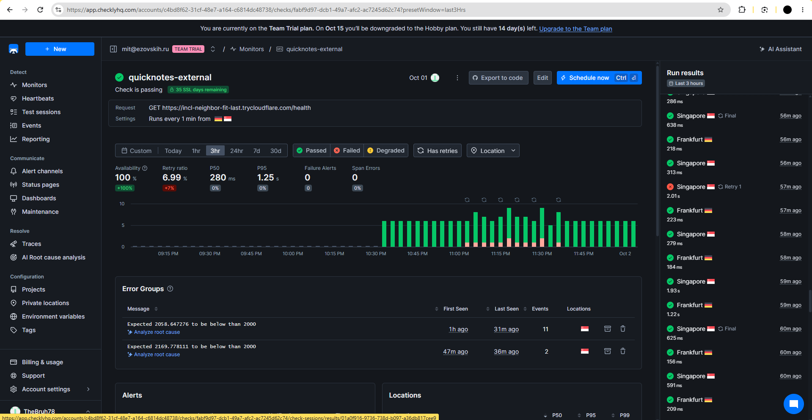
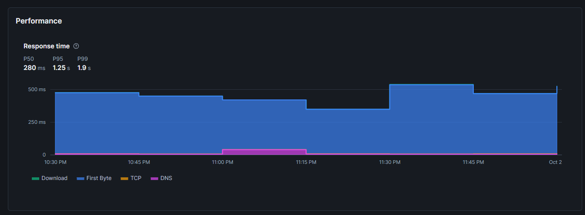
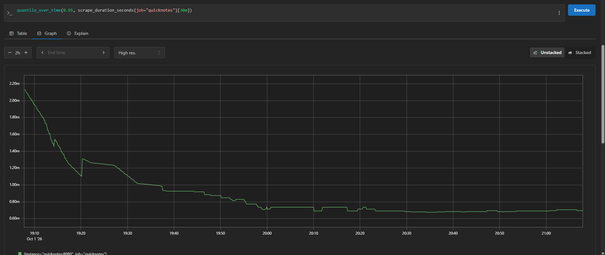
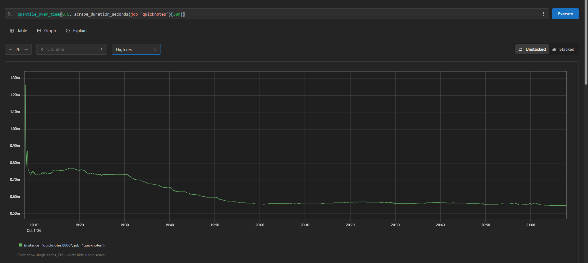
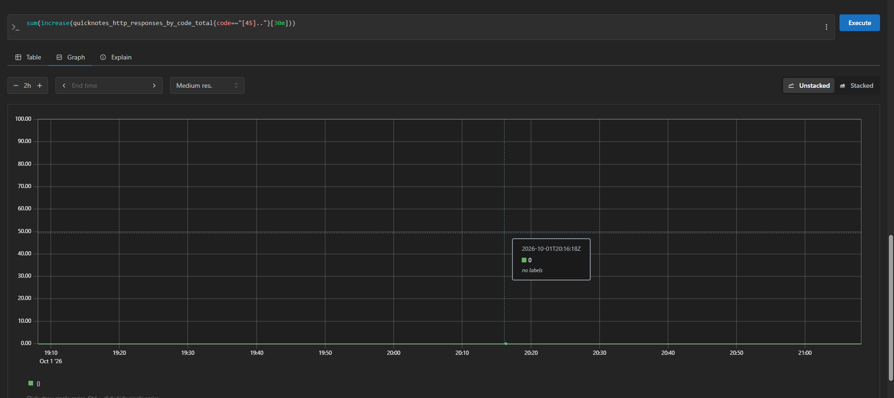

# Lab 8
## TASK 1

### Config files

Prometheus scrape config: [`monitoring/prometheus/prometheus.yml`](../monitoring/prometheus/prometheus.yml)

Grafana datasource provisioning: [`monitoring/grafana/provisioning/datasources/datasource.yml`](../monitoring/grafana/provisioning/datasources/datasource.yml)

Grafana dashboard provider: [`monitoring/grafana/provisioning/dashboards/dashboard.yml`](../monitoring/grafana/provisioning/dashboards/dashboard.yml)

Grafana dashboard: [`monitoring/grafana/provisioning/dashboards/golden-signals.json`](../monitoring/grafana/provisioning/dashboards/golden-signals.json)

compose.yaml: [`compose.yaml`](../compose.yaml)

The following command was used to generate traffic. it creates 10 notes, 50 errors and 140 GET requests

```
thebruh@thebruh-PC MINGW64 ~/Desktop/DevOpsCourse/DevOps-Intro (feature/lab8)
$ for i in $(seq 1 200); do
  if [ $((i % 4)) -eq 0 ]; then
    curl -s -o /dev/null -X POST http://localhost:8080/notes -H "Content-Type: application/json" -d '{bad json'
  elif [ $((i % 10)) -eq 0 ]; then
    curl -s -o /dev/null -X POST http://localhost:8080/notes -H "Content-Type: application/json" -d '{"title":"t","body":"b"}'
  else
    curl -s -o /dev/null http://localhost:8080/notes
  fi
done
```

### Screenshot of the Grafana dashboard



### Health check:
```
thebruh@thebruh-PC MINGW64 ~/Desktop/DevOpsCourse/DevOps-Intro (feature/lab8)
$ curl -s http://localhost:9090/api/v1/targets | grep -o '"health":"[a-z]*"'
"health":"up"
```

### Design Questions
#### a) Pull vs push: Prometheus pulls. What does that mean for which side (Prometheus or QuickNotes) needs to be reachable? What's the failure mode if Prometheus can't reach QuickNotes?
It means QuickNotes must be network-reachable by Prometheus. If it can't reach it, it will return DOWN. However, that doesn't necessary mean that QuickNotes is down. So basically Prometheus will be giving a false information and won't tell about it.
#### b) scrape_interval: 15s is a default. What query problems do you create by setting it to 5s? To 5m?
5 seconds increases the CPU load, traffic and possibly can send requests faster than they are processed. \
5 minutes is quite a lot of time, it doesn't break or overload anything, but it just makes the data very low resolution. Functions like rate() will be extremely smoothed, some error spikes and another brief events will be entirely missed
#### c) PromQL rate() vs irate() vs delta() — which one is right for the Traffic panel and why?
rate() is right for the Traffic panel. rate() returns average rate across all data. In the same time, irate() returns a slope only defined by two last points, it's not suitable for a time series graph, becuase it basically ignores the time. And delta() returns the difference between the last and first value. It is also not suitable, because it just returns the difference, not connected to the time.
#### d) Why provision Grafana from files instead of clicking through the UI on every fresh stack?
Because it makes the process faster and more reliable. Clicking and setting up UI again and again takes some time and it's a tedious work. Moreover, doing everything in UI unavoidably intoduces much more human errors.

## TASK 2

### Configured rule:
Alert rule: [`monitoring/prometheus/alerts.yml`](../monitoring/prometheus/alerts.yml)

### Alert trigger
It spams broken POST requests and valid GET requests for 400 seconds. So the theoretical error rate is 50%
```
end=$((SECONDS + 400))
while [ $SECONDS -lt $end ]; do
  curl -s -o /dev/null -X POST http://localhost:8080/notes -H "Content-Type: application/json" -d '{broken json!'
  curl -s -o /dev/null http://localhost:8080/notes
  sleep 1
done
```

### Alert pending



### Alert firing



### Runbook
[Alert runbook](../docs/runbook/high-error-rate.md)

### Design questions
#### e) Why "sustained for 5 minutes" instead of "fire immediately on first bad request"?
It prevents false alerts caused by some rare failures. Alert shouldn't report every bad request, it should report if something bad is happening already for some time.
#### f) Symptom alerts vs cause alerts: the alert above is a symptom alert. What's an example of a cause alert someone might write for QuickNotes? Why is it worse?
One obvious example of a cause alert is "CPU is used at over 95%". It doesn't say anything about the validity of the requests. They can be completely fine. Maybe the reason of the CPU load is that the server is being DDoSed, or the QuickNotes app itself updated and during some unnoticed bug, overloaded the CPU. It is not saying anything about user end. However, such alerts of course can serve different purposes, as in two examples I described above.

#### g) Alert fatigue: Lecture 8 cited it as the bigger danger than too few alerts. What's a quantitative threshold ("page X% of the time the user wasn't actually affected") that would mean your alert is too noisy?
In the lecture, it is specified, that the alert is too noisy when more than 50% of the pages fire, while users are unaffected, and these alerts are ignored. However, i would say, that over 10% of all alerts are pure noise, it is already something that should be investigated.

## Bonus task
I picked cloudflared since it's very easy to setup. VPN was used, because the internet provider was disrupting the connection to the cloudflare servers.

### Internal and external comparison

#### Table

| | Prometheus | Checkly |
|--|---|---|
| Avg latency p50 | 0.56ms | 280ms |
| Avg latency p95 | 0.7 ms | 1250ms |
| Errors observed | 0 | 0 |

#### Images






### What kind of failure would Checkly catch that Prometheus cannot?
Routing issues, DNS issues, cloud provider issues, expired SSL certificates
### What kind would Prometheus catch that Checkly cannot?
Memory leaks, CPU problems, other infrastructure failures.