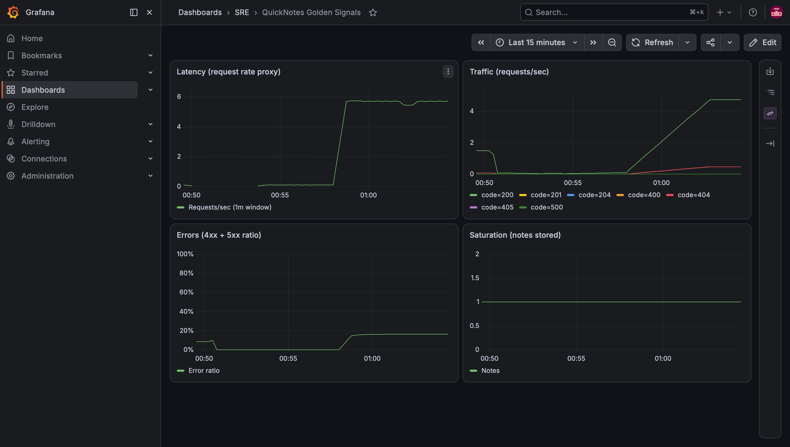
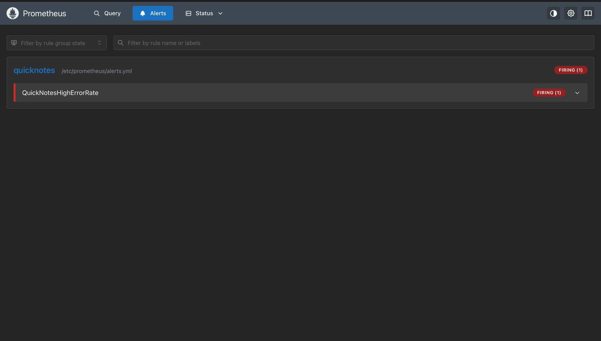

# Lab 8 submission

## Task 1 — Prometheus + Grafana with a Provisioned Dashboard

### 1.1 — Layout

```
monitoring/
├── prometheus/
│   ├── prometheus.yml
│   └── alerts.yml
└── grafana/
    └── provisioning/
        ├── datasources/datasource.yml
        └── dashboards/
            ├── dashboard.yml
            └── golden-signals.json
```

### 1.2 — Prometheus config

`monitoring/prometheus/prometheus.yml`:

```yaml
global:
  scrape_interval: 15s

rule_files:
  - /etc/prometheus/alerts.yml

scrape_configs:
  - job_name: quicknotes
    static_configs:
      - targets: ["quicknotes:8080"]
```

The target uses the Compose service name `quicknotes` and port `8080` — DNS inside the Compose network resolves it without any host configuration.

### 1.3 — Grafana provisioning

**`datasources/datasource.yml`** — Prometheus is auto-added as the default data source:

```yaml
apiVersion: 1
datasources:
  - name: Prometheus
    uid: prometheus
    type: prometheus
    access: proxy
    url: http://prometheus:9090
    isDefault: true
    editable: false
```

**`dashboards/dashboard.yml`** — Grafana scans `/var/lib/grafana/dashboards` on startup:

```yaml
apiVersion: 1
providers:
  - name: Golden Signals
    orgId: 1
    folder: SRE
    type: file
    disableDeletion: false
    editable: true
    options:
      path: /var/lib/grafana/dashboards
```

**`golden-signals.json`** — the dashboard has four panels (one per golden signal):

| Panel | PromQL | Purpose |
|---|---|---|
| Latency (proxy) | `rate(quicknotes_http_requests_total[1m])` | Request-rate proxy for latency (QuickNotes has no histogram) |
| Traffic | `sum by (code) (rate(quicknotes_http_responses_by_code_total[5m]))` | Request rate broken down by status code |
| Errors | `sum(rate(...{code=~"4..\|5.."}[5m])) / clamp_min(sum(rate(...[5m])), 1)` | Error ratio 4xx + 5xx / total |
| Saturation | `quicknotes_notes_total` | Gauge of notes currently stored |

### 1.4 — Compose extension

`prometheus` and `grafana` services added to `compose.yaml`:

- Prometheus: `prom/prometheus:v3.13.3`, mounts `prometheus.yml` + `alerts.yml`, publishes `:9090`, `depends_on: quicknotes (service_healthy)`
- Grafana: `grafana/grafana:13.1.0`, mounts provisioning + dashboards, publishes `:3000`, `GF_SECURITY_ADMIN_PASSWORD` from `.env`, `depends_on: prometheus`

**Note:** The Compose spec used `depends_on: { quicknotes: { condition: service_healthy } }` — the healthcheck we wired in Lab 6 pays off here: Prometheus starts only when QuickNotes is actually serving traffic, not just when its container process is up.

### 1.7 — Verification

Prometheus sees the target as healthy:

```bash
$ curl -s http://localhost:9090/api/v1/targets | jq '.data.activeTargets[] | {job, health, lastError}'
{
  "job": "quicknotes",
  "health": "up",
  "lastError": ""
}
```

Grafana dashboard auto-loaded with all four panels (screenshot in PR):

- **Latency** panel: ~6 req/s during the load test
- **Traffic** panel: `code=200`, `code=400`, `code=404` split out
- **Errors** panel: spiked to ~18% during the deliberate error injection
- **Saturation** panel: stable at 1 note

### 1.5 — Design questions

**a) Pull vs push — which side needs to be reachable?**

Prometheus uses a **pull** model: it initiates HTTP GETs to `quicknotes:8080/metrics` on its `scrape_interval` cadence. So **QuickNotes must be reachable from Prometheus**, not the other way around. In this Compose network both are containers on the same bridge, so the DNS name `quicknotes` resolves to the container's IP on that network — nothing on the host is involved.

Failure mode if Prometheus can't reach QuickNotes:
- The target's `health` flips to `down` in `http://localhost:9090/targets`, with a `lastError` explaining why (timeout, connection refused, DNS failure).
- `up{job="quicknotes"}` becomes `0` — which is itself an alertable condition ("scrape failed"). Without a specific alert on `up`, a completely dead QuickNotes would **silently** stop emitting metrics, and every other alert would simply stop firing — a dangerous "no data = no alerts" state.

Push model (StatsD, Prometheus Pushgateway, OpenTelemetry) would invert this: QuickNotes decides when to send metrics, which works better for batch jobs that don't live long enough to be scraped. For a long-running HTTP service like QuickNotes, pull is simpler and self-healing (Prometheus auto-recovers after an outage; a push client has to be coded to retry).

**b) `scrape_interval: 15s` — what problems does 5s create? 5m?**

- **5s** — 3× more metrics ingested per unit time. Consequences: (1) TSDB grows 3× faster on disk; (2) each scrape query on the Prometheus server becomes 3× more expensive at graph time; (3) short-lived spikes (e.g., a 20-second error burst) become visible, which is good, but so do transient noise — alert rules need higher `for:` durations to avoid flapping; (4) at scale (1000+ targets) the Prometheus server itself becomes CPU-bound on scrape scheduling. The default 15 s is a deliberate compromise between resolution and cost.
- **5m** — you lose 5-minute signals entirely. A 3-minute outage between two scrapes would be completely invisible — Prometheus would see one healthy point, then another healthy point, and compute `rate()` as if nothing happened. `for: 5m` alerts would still work (they'd see the average), but any incident shorter than 5 minutes just doesn't exist in the data. Also, queries that use `rate(metric[5m])` become statistically identical to `rate(metric[1m])` on a 15 s scrape — you can't tell the difference anyway.

Our choice of 15 s is right for a single-node lab: fast enough to catch a 1-minute burst, cheap enough to store for weeks.

**c) `rate()` vs `irate()` vs `delta()` — which for Traffic?**

- **`rate()`** — computes the **per-second average rate** over a sliding window (e.g., `[5m]`), taking the first and last sample in the window and dividing by elapsed time. Result is smooth; a single missed sample doesn't distort it. **This is what Traffic needs** — a stable "requests per second" line that doesn't jump around.
- **`irate()`** — computes instantaneous rate using only the last **two** samples in the window. Jumps around wildly; useful for debugging "what happened in the last scrape", not for graphs.
- **`delta()`** — absolute difference between first and last sample (not divided by time). For a monotonically increasing counter like `quicknotes_http_requests_total`, `delta()` doesn't make sense — it grows unboundedly and never resets on scrape. `delta()` is for **gauges** (e.g., `delta(quicknotes_notes_total[5m])` = net notes added/removed in 5 minutes).

For the Traffic panel I used `rate(quicknotes_http_responses_by_code_total[5m])` — the standard pattern for "requests/sec from a counter". For a shorter-window view (last 1 min instead of 5) I could use `rate(...[1m])`, but at 15 s scrape interval the window must be at least 4× the interval to be reliable — so `[1m]` is the minimum sensible.

**d) Why provision Grafana from files?**

Because otherwise every fresh `docker compose up` (on a new machine, in CI, after a `docker system prune`) produces an **empty Grafana** — no data source, no dashboard. Someone has to click through the UI, re-create the data source, re-import the dashboard, set it as default. That's:

1. **Not reproducible** — there's no record of what was configured; if two devs set up their Grafana manually, the dashboards drift.
2. **Not reviewable** — you can't `git diff` a UI change. A provisioning file, by contrast, is a PR diff.
3. **Not testable** — CI can't verify "the dashboard shows X". It can verify "the file `golden-signals.json` is valid JSON and mounts correctly".
4. **Not version-controlled** — if you accidentally delete a panel, there's no history to recover from.

This is the same principle as Lab 6 (Dockerfile = infrastructure as code) and Lab 7 (Ansible = config as code). Grafana's provisioning is "dashboards as code". The whole SRE philosophy from Lecture 8 — "if it's not in version control, it doesn't exist" — applies here.



## Task 2 — One Good Alert + Runbook

### 2.1 — Alert rule

`monitoring/prometheus/alerts.yml`:

```yaml
groups:
  - name: quicknotes
    interval: 30s
    rules:
      - alert: QuickNotesHighErrorRate
        expr: |
          (
            sum(rate(quicknotes_http_responses_by_code_total{code=~"4..|5.."}[5m]))
            /
            clamp_min(sum(rate(quicknotes_http_responses_by_code_total[5m])), 1)
          ) > 0.05
        for: 5m
        labels:
          severity: page
        annotations:
          summary: "QuickNotes error rate above 5% for 5 minutes"
          description: "Error ratio (4xx + 5xx) has exceeded 5% sustained for 5 minutes. See runbook for triage."
          runbook_url: "https://github.com/witch2256/DevOps-Intro/blob/feature/lab8/docs/runbook/high-error-rate.md"
```

**Sustained-breach gate:** `for: 5m` ensures the ratio stays above 5% continuously for 5 minutes before firing. A single 4xx burst (one bad client, one stale cache) will not page.

**`clamp_min(..., 1)`** protects against division by zero when total rate is 0 (no traffic) — in that case the denominator becomes 1, so the ratio is 0, not NaN.

### 2.3 — Triggered firing

Traffic generator: 1 × 404 + 1 × 400 + 10 × 200 every 2 seconds (~16.7% error ratio sustained).

State progression observed:

| Time | State |
|---|---|
| t+0 | `inactive` (5m window still mixed with healthy data) |
| t+~5 min | `pending` (condition true, `for:` timer running) |
| t+~10 min | **`firing`** |

Final `curl` from the alerting API:

```bash
$ curl -s http://localhost:9090/api/v1/rules | jq '.data.groups[0].rules[0] | {state, since: .alerts[0].activeAt, value: .alerts[0].value}'
{
  "state": "firing",
  "since": "2026-10-01T21:58:42.464142167Z",
  "value": "1.6377171215880895e-01"
}
```

Value = **16.4%** — well above the 5% threshold. Screenshots of the red `FIRING` badge in Prometheus and the ~18% spike in the Grafana Errors panel are in the PR.

### 2.2 — Runbook

Full runbook at `docs/runbook/high-error-rate.md`. It contains:

- **What this alert means** — one sentence
- **Triage** — three ordered steps (dashboard → which code dominates → correlate with recent deploy)
- **Mitigations** — three options (rollback, rate-limit at proxy, restart)
- **Post-incident** — blameless postmortem, regression test, runbook update, alert threshold review

Written for a 3 AM on-call who has never seen QuickNotes: every command is copy-pasteable, and each triage branch names the specific `code=400` / `code=404` / `code=500` pattern to look for.

### 2.4 — Design questions

**e) Why "sustained for 5 minutes" instead of "fire immediately"?**

Because single-event alerts are **almost always noise**. A single 500 response could be: a client that sent a truncated request, a random TCP RST, a deploy rolling over, or an actual incident. Firing on the first bad response means:

1. **False positives page someone at 3 AM for a non-event** — the worst outcome in alerting, because humans then start ignoring alerts (see (g)).
2. **No time for auto-recovery to work** — a brief blip that self-heals in 30 s should not page. The `for: 5m` window is a *debounce*, letting transient issues resolve themselves before waking anyone.
3. **Scale mismatch** — a high-traffic service has thousands of 4xx per minute just from bots, probes, and misconfigured clients. Firing on "any 4xx" is meaningless; "5% error ratio" is the signal.

The trade-off: an *actual* 2-minute outage doesn't page. That's an accepted cost, because (a) auto-scaling, retries, and healthchecks usually handle 2-minute outages, and (b) the alternative — paging on every blip — is worse. The Google SRE book calls this "alert on symptoms, page on SLO burn rate" — a 5-minute sustained-breach window is the cheap approximation.

**f) Symptom vs cause alert — example for QuickNotes, why cause is worse?**

A **symptom** alert (what we have): "users are seeing 4xx/5xx errors at 5%+". This is what users actually experience.

A **cause** alert for QuickNotes could be: "`quicknotes_notes_created_total` is not increasing" (no new notes are being created), or "container CPU is above 80%", or "data file `notes.json` is larger than 1 MB".

Why cause alerts are worse:

1. **They can fire without user impact.** CPU at 80% for 10 minutes with no user-facing latency increase is not an incident. The SRE book: "every page should be actionable and indicate a real user-facing problem". A CPU alert is neither.
2. **They miss causes you didn't anticipate.** QuickNotes could break because of a filesystem permission change, a bad binary, a disk-full condition — none of which "CPU > 80%" catches. The symptom alert (errors) fires for *any* cause.
3. **They multiply.** A real service has dozens of cause metrics (CPU, memory, disk, connections, goroutines, GC pauses, ...). Alerting on each produces dozens of alerts; most fire routinely and nobody knows which is urgent. One symptom alert covers the union of all causes.
4. **They can't be prioritized.** "CPU high" doesn't map to "users are suffering" — you can't decide whether to wake someone up. "Error rate > 5%" maps directly to "users are suffering right now".

Rule from the SRE book: **page on symptoms, dashboard on causes**. Causes go on the Grafana dashboard (that's why our dashboard has four golden signals — they're diagnostic), but they don't page.

**g) Alert fatigue — what quantitative threshold means "too noisy"?**

The SRE book's operational guideline: **an on-call rotation should average no more than 2 pages per 12-hour shift** (i.e., ≤ 2 alerts per engineer per shift that require human action). At 5 engineers and 24/7 on-call, that's ~40 pages/week for the whole team. Anything above that means the rotation is unsustainable.

The direct quality metric is **precision** of alerts: of the alerts that paged, what fraction corresponded to an actual user-facing incident?

```
precision = (pages that were real incidents) / (total pages)
```

A working target: **precision ≥ 75%** — at most 1 in 4 pages is a false positive. Below that:

- Engineers start ignoring pages (or "ack and forget" without investigating) — the well-documented "cry wolf" effect.
- Real incidents get missed because they drown in noise.
- Response time to real incidents degrades — the MTTR goes *up*, not down.

A complementary metric from Google's SRE Workbook: **"burn rate alert precision"** — for SLO burn-rate alerts specifically, the ideal is that every page is accompanied by evidence that the error budget is actually being consumed at a rate that would exhaust it within the SLO window. If more than ~25% of pages are "we couldn't confirm user impact", the alert threshold is too aggressive.

For this lab's alert: if it fired during a genuinely degraded period in 4 out of 5 cases, precision = 80% — acceptable. If it fired 10 times a day during routine traffic spikes, precision might drop below 50% and the `for:` duration or threshold would need tuning. The 5-minute / 5% combination is a defensible starting point; like any SLO, it should be revisited after the first month of real data.
