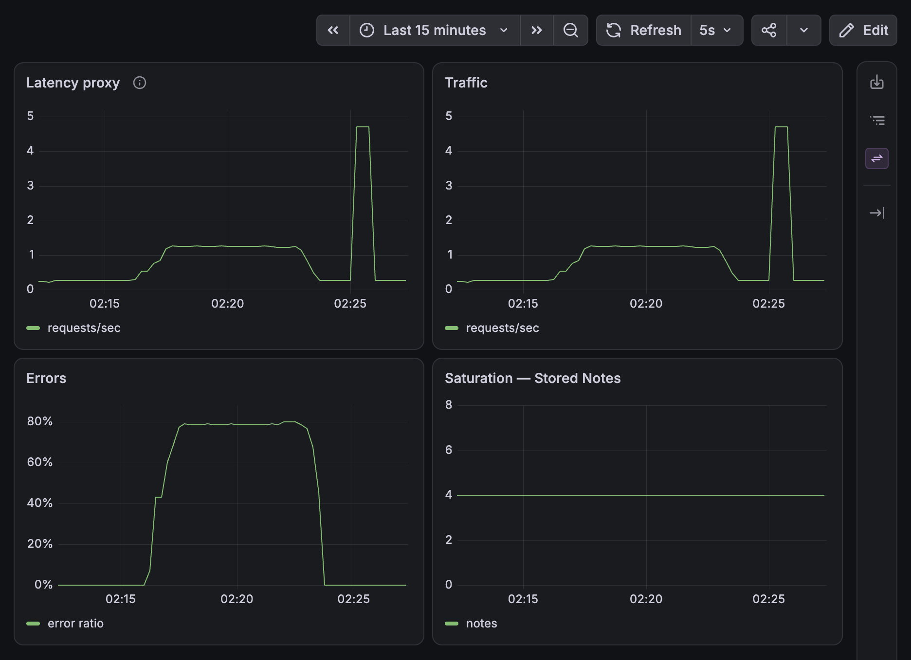
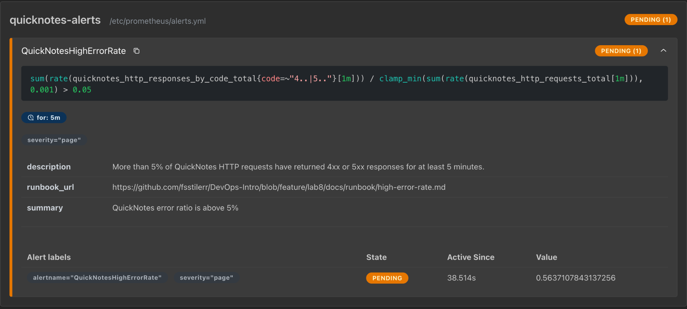
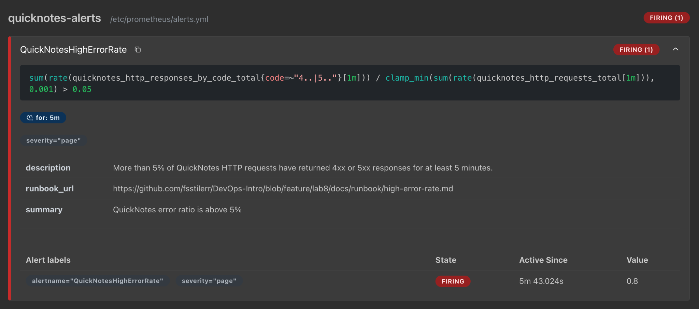
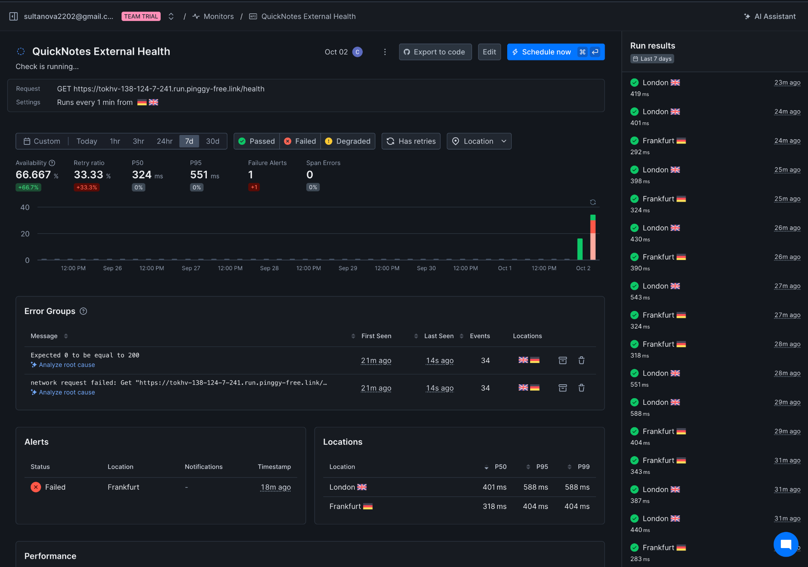

# Lab 8 — SRE & Monitoring: Golden Signals Dashboard + One Good Alert

**Student:** Sofiia Sultanova  
**GitHub:** `fsstilerr`  
**Branch:** `feature/lab8`

## Goal

Extend the Lab 6 QuickNotes Compose stack with Prometheus and Grafana, provision a four-panel golden-signals dashboard, define and deliberately trigger one sustained high-error-rate alert, write an actionable runbook, and complete the bonus external synthetic monitoring task.

---

## Task 1 — Prometheus + Grafana with a Provisioned Dashboard

### Stack

`docker compose up -d` runs:

- `quicknotes` on port `8080`
- `prometheus` on port `9090`
- `grafana` on port `3000`

QuickNotes remains protected by the Lab 6 container hardening and healthcheck. Prometheus starts after QuickNotes becomes healthy, and Grafana depends on Prometheus.

### Configuration files

- [Prometheus configuration](../monitoring/prometheus/prometheus.yml)
- [Grafana Prometheus datasource](../monitoring/grafana/provisioning/datasources/datasource.yml)
- [Grafana dashboard provider](../monitoring/grafana/provisioning/dashboards/dashboard.yml)
- [Golden Signals dashboard JSON](../monitoring/grafana/dashboards/golden-signals.json)
- [Compose stack](../compose.yaml)

Prometheus uses a 15-second scrape interval and scrapes the Compose service at `quicknotes:8080/metrics`.

Grafana provisions Prometheus automatically as the default datasource and loads the QuickNotes dashboard from JSON at startup.

### Prometheus target verification

Command:

```bash
curl -s http://localhost:9090/api/v1/targets | python3 -m json.tool
```

Observed target state:

```text
"health": "up"
```

Prometheus readiness was also verified with:

```bash
curl -s http://localhost:9090/-/ready
```

Observed:

```text
Prometheus Server is Ready.
```

### Golden Signals dashboard

The dashboard contains four panels:

1. **Latency proxy** — `rate(quicknotes_http_requests_total[1m])`. QuickNotes does not expose a request-duration histogram, so the lab-approved request-rate proxy is used.
2. **Traffic** — request rate from `quicknotes_http_requests_total`.
3. **Errors** — ratio of 4xx + 5xx responses to all HTTP requests.
4. **Saturation** — `quicknotes_notes_total`.

Traffic was generated against QuickNotes and the provisioned dashboard displayed non-trivial graphs.



### Design questions

#### a) Pull vs push

Prometheus uses a pull model: Prometheus initiates HTTP requests to QuickNotes `/metrics`. Therefore QuickNotes must be reachable from Prometheus inside the Compose network. QuickNotes does not need to know where Prometheus is.

If Prometheus cannot reach QuickNotes, the scrape fails and the target becomes `DOWN`; metrics for that target stop being updated. The application itself may still be serving users even while monitoring is blind.

#### b) What happens with 5 s or 5 min scrape intervals?

A `5s` interval provides finer resolution but creates more samples, more storage and query cost, and can amplify short-lived noise. It also increases scrape traffic to the application.

A `5m` interval is too sparse for this workload: short incidents may be completely missed, `rate()` has too few samples for useful short windows, dashboards react slowly, and a five-minute alert can be detected far too late.

The selected `15s` interval is a practical balance between resolution and overhead.

#### c) `rate()` vs `irate()` vs `delta()`

`rate()` is appropriate for the Traffic panel because `quicknotes_http_requests_total` is a counter and the dashboard should show a stable per-second request rate over a time window.

`irate()` only uses the last two samples and is much more sensitive to short spikes, making it less suitable for a primary traffic graph. `delta()` calculates an absolute change and is intended for gauges rather than monotonically increasing counters.

#### d) Why provision Grafana from files?

File provisioning makes the monitoring setup reproducible and version-controlled. A fresh `docker compose up` recreates the same datasource and dashboard without manual clicking. Changes are reviewable in Git, can be tested in a PR, and avoid configuration drift between environments.

---

## Task 2 — One Good Alert + Runbook

### Alert rule

The Prometheus alert rule is stored in [monitoring/prometheus/alerts.yml](../monitoring/prometheus/alerts.yml).

```yaml
groups:
  - name: quicknotes-alerts
    rules:
      - alert: QuickNotesHighErrorRate
        expr: |
          sum(rate(quicknotes_http_responses_by_code_total{code=~"4..|5.."}[1m]))
          /
          clamp_min(sum(rate(quicknotes_http_requests_total[1m])), 0.001)
          > 0.05
        for: 5m
        labels:
          severity: page
        annotations:
          summary: "QuickNotes error ratio is above 5%"
          description: "More than 5% of QuickNotes HTTP requests have returned 4xx or 5xx responses for at least 5 minutes."
          runbook_url: "https://github.com/fsstilerr/DevOps-Intro/blob/feature/lab8/docs/runbook/high-error-rate.md"
```

The rule requires an error ratio above 5% continuously for five minutes, so a single short 4xx burst does not page.

### Deliberate trigger

Errors were generated with requests to a nonexistent note endpoint that is instrumented by QuickNotes:

```bash
for i in {1..360}; do
  curl -s -o /dev/null http://localhost:8080/notes/999999
  sleep 1
done
```

The alert transitioned from `INACTIVE` to `PENDING`, then to `FIRING` after the sustained five-minute breach.

#### Pending



#### Firing



The firing evidence shows:

- `for: 5m`
- `severity="page"`
- state `FIRING`
- error-ratio value approximately `0.8`

After the error generator stopped and healthy traffic resumed, the alert returned to normal.

### Runbook

Full runbook: [docs/runbook/high-error-rate.md](../docs/runbook/high-error-rate.md)

# QuickNotes High Error Rate Runbook

## What this alert means

More than 5% of QuickNotes HTTP requests have returned 4xx or 5xx responses continuously for at least five minutes.

## Triage steps

1. Confirm the alert and current error ratio in Prometheus or the Grafana Golden Signals dashboard. Check whether the increase is caused primarily by 4xx or 5xx responses.
2. Check QuickNotes health and container state with `curl http://localhost:8080/health`, `docker compose ps`, and `docker compose logs --tail=100 quicknotes`.
3. Inspect `quicknotes_http_responses_by_code_total` at `/metrics` to determine which HTTP status codes are increasing.
4. Check whether the increase correlates with a recent deployment, configuration change, malformed client traffic, or application restart.

## Mitigations

1. If a recent application or configuration change caused the errors, roll back to the last known-good version and verify that the error ratio returns below 5%.
2. If malformed or abusive client traffic is responsible, stop or isolate the offending traffic source while keeping healthy traffic available.
3. If QuickNotes is unhealthy, restart the service and verify `/health`, Prometheus targets, and the Grafana dashboard before declaring recovery.

## Post-incident

After service recovery, document the timeline, impact, root cause, detection, mitigation, and follow-up actions. Use the Lecture 1 postmortem process and record monitoring or application improvements required to prevent recurrence.

### Design questions

#### e) Why sustain the breach for 5 minutes?

Paging on the first bad request would make normal client mistakes and short transient failures wake an on-call engineer. Requiring five minutes confirms that the symptom is persistent and likely user-impacting. This reduces false positives while still detecting a meaningful outage quickly enough to act.

#### f) Symptom alert vs cause alert

`QuickNotesHighErrorRate` is a symptom alert because it detects a user-visible outcome: HTTP requests are failing.

A cause alert could page on high CPU usage or container memory usage. That is worse as a primary page because high resource usage does not necessarily mean users are affected, while real user errors can occur without abnormal CPU. Cause metrics are useful for diagnosis, but symptom metrics are better paging signals.

#### g) Quantitative alert-fatigue threshold

I would consider the alert too noisy if more than **20% of pages** over a representative period occurred when users were not actually affected or no operator action was required. At that point at least one in five pages is a false or non-actionable interruption, which is high enough to reduce trust in the alert and should trigger threshold/query/runbook review.

---

## Bonus — Synthetic Monitoring from the Outside

### External probe

QuickNotes was temporarily exposed through a Pinggy HTTPS tunnel and monitored by Checkly.

Check configuration:

- **Name:** `QuickNotes External Health`
- **Method:** `GET`
- **Path:** `/health`
- **Frequency:** every 1 minute
- **Regions:** London and Frankfurt
- **Assertions:** HTTP status must equal `200`; response time must remain below `2s`
- **Observation period:** at least 30 minutes

Checkly recorded successful checks from both regions for more than 30 minutes.



The Checkly view also captured the public-path failure after the temporary tunnel became unavailable, demonstrating why an external probe provides different information from internal Prometheus scraping.

### Internal vs external comparison

| Signal | Prometheus — inside Compose network | Checkly — London + Frankfurt |
| --- | --- | --- |
| Latency p50 | N/A — QuickNotes exposes no request-duration histogram; Task 1 uses the permitted request-rate proxy | **324 ms** |
| Latency p95 | N/A — no internal request-duration histogram is exported | **551 ms** |
| Errors observed | Deliberately generated 404 traffic; error ratio reached approximately **80%** and `QuickNotesHighErrorRate` fired | Successful regional checks followed by public-path/network/status failures when the temporary tunnel became unavailable; Checkly showed failure events |

The missing internal p50/p95 values are intentional rather than fabricated: the application does not export a request-duration histogram, and the lab explicitly permits a request-rate proxy for the Latency panel.

An external synthetic check can catch failures that internal Prometheus cannot, such as public DNS, TLS, routing, CDN/tunnel, or internet-facing endpoint failures while QuickNotes remains healthy inside the Compose network. This was visible when Checkly lost the temporary public path while internal QuickNotes/Prometheus continued to run.

Prometheus can catch internal application and metric-level problems that a simple external `/health` probe may not expose, such as rising per-status-code errors, notes gauge changes, scrape failures, or detailed service behavior. The two approaches therefore complement each other: Prometheus explains the service from inside, while Checkly validates the user-facing path from outside.

---

## Verification summary

- QuickNotes container healthy
- Prometheus ready and QuickNotes target `UP`
- Grafana datasource provisioned automatically
- Golden Signals dashboard provisioned automatically
- Four dashboard panels populated
- Error-ratio alert configured with `>5% for 5m`
- `severity: page` present
- Runbook linked from the alert
- Alert observed in `PENDING` and `FIRING`
- Alert recovered after the deliberate error traffic stopped
- Checkly external monitor ran every minute from two regions for at least 30 minutes
- External synthetic evidence captured
