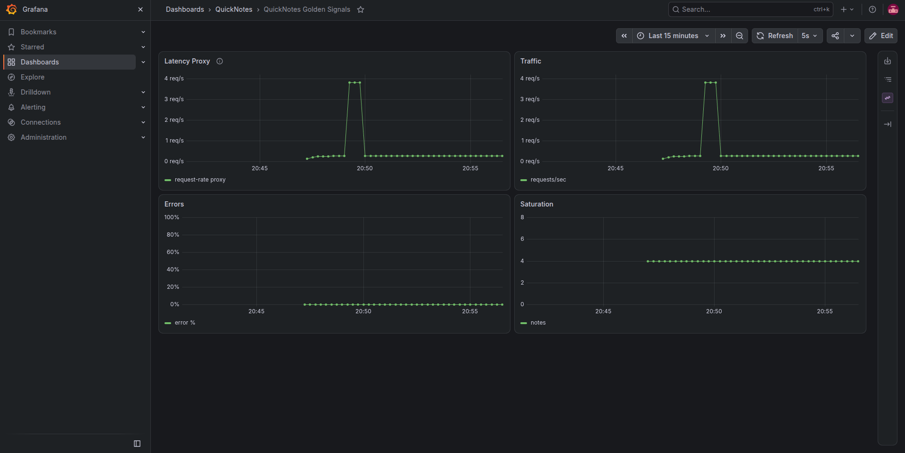
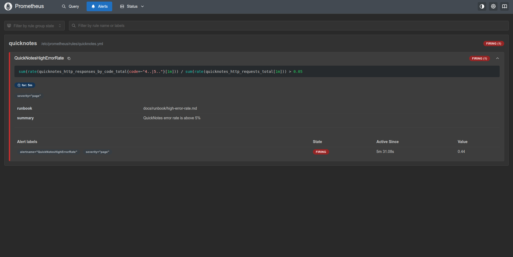

# Lab 8 — SRE & Monitoring

## Task 1 — Prometheus + Grafana

### Configuration

- Prometheus: [`../monitoring/prometheus/prometheus.yml`](../monitoring/prometheus/prometheus.yml)
- Grafana datasource: [`../monitoring/grafana/provisioning/datasources/datasource.yml`](../monitoring/grafana/provisioning/datasources/datasource.yml)
- Dashboard provider: [`../monitoring/grafana/provisioning/dashboards/dashboard.yml`](../monitoring/grafana/provisioning/dashboards/dashboard.yml)
- Golden Signals dashboard: [`../monitoring/grafana/dashboards/golden-signals.json`](../monitoring/grafana/dashboards/golden-signals.json)

Prometheus uses a 15-second scrape interval and scrapes QuickNotes at `quicknotes:8080`.

### Prometheus target

```text
{
  "job": "quicknotes",
  "health": "up"
}
```

### Golden Signals

The provisioned dashboard contains four panels:

1. Latency Proxy — `rate(quicknotes_http_requests_total[1m])`
2. Traffic — `rate(quicknotes_http_requests_total[1m])`
3. Errors — ratio of 4xx + 5xx responses to total requests
4. Saturation — `quicknotes_notes_total`

QuickNotes does not expose a request-duration histogram, so the allowed request-rate proxy is used for the latency panel.

### Dashboard evidence



### Design questions

#### a) Pull vs push

Prometheus pulls metrics from QuickNotes, so Prometheus must be able to reach the QuickNotes `/metrics` endpoint.

If Prometheus cannot reach QuickNotes, the target becomes `DOWN` and no new samples are collected.

#### b) Scrape interval

A 5-second interval gives higher resolution but increases storage, network, CPU, and query cost.

A 5-minute interval gives poor resolution and can completely miss short incidents.

A 15-second interval provides a reasonable balance.

#### c) `rate()` vs `irate()` vs `delta()`

`rate()` is appropriate for the Traffic panel because `quicknotes_http_requests_total` is a counter. It calculates a stable average per-second increase over a window.

`irate()` uses only the latest two samples and is more sensitive and noisy.

`delta()` measures the difference between values and is generally more appropriate for gauges than request counters.

#### d) Why provision Grafana from files?

File provisioning makes dashboards reproducible, version-controlled, reviewable, and automatically recreated when the stack starts.

Manual UI configuration would need to be repeated for every new environment.

---

## Task 2 — High Error Rate Alert

### Alert rule

The alert definition is stored in:

[`../monitoring/prometheus/rules/quicknotes.yml`](../monitoring/prometheus/rules/quicknotes.yml)

```yaml
groups:
  - name: quicknotes
    rules:
      - alert: QuickNotesHighErrorRate
        expr: |
          sum(rate(quicknotes_http_responses_by_code_total{code=~"4..|5.."}[1m]))
          /
          sum(rate(quicknotes_http_requests_total[1m]))
          > 0.05
        for: 5m
        labels:
          severity: page
        annotations:
          summary: "QuickNotes error rate is above 5%"
          runbook: "docs/runbook/high-error-rate.md"
```

Validation:

```text
Checking /etc/prometheus/rules/quicknotes.yml
  SUCCESS: 1 rules found
```

Initial state:

```text
{
  "name": "QuickNotesHighErrorRate",
  "state": "inactive",
  "health": "ok"
}
```

Malformed requests were generated continuously together with healthy requests.

The alert transitioned through:

```text
inactive -> pending -> firing
```

### Firing evidence



The screenshot shows the alert in `FIRING` state after the sustained 5-minute breach.

### Runbook

The full runbook is available at:

[`../docs/runbook/high-error-rate.md`](../docs/runbook/high-error-rate.md)

It contains the alert meaning, ordered triage steps, mitigations, and post-incident actions.

### Design questions

#### e) Why sustained for 5 minutes?

A single failed request or a short burst does not necessarily represent a real incident.

Requiring the error ratio to remain above 5% for 5 minutes filters transient noise and avoids unnecessary pages.

#### f) Symptom vs cause alerts

The error-rate alert is a symptom alert because it measures a failure directly visible to users.

A cause alert could be `CPU > 80%`.

That is worse as a page because high CPU does not necessarily mean users are affected, while users can experience failures even when CPU is normal.

#### g) Alert fatigue

I would consider this alert too noisy if more than about 10% of pages happen when users are not actually affected.

For example, if 2 out of every 20 pages require no action and correspond to no user-visible degradation, the alert logic or threshold should be reviewed.
