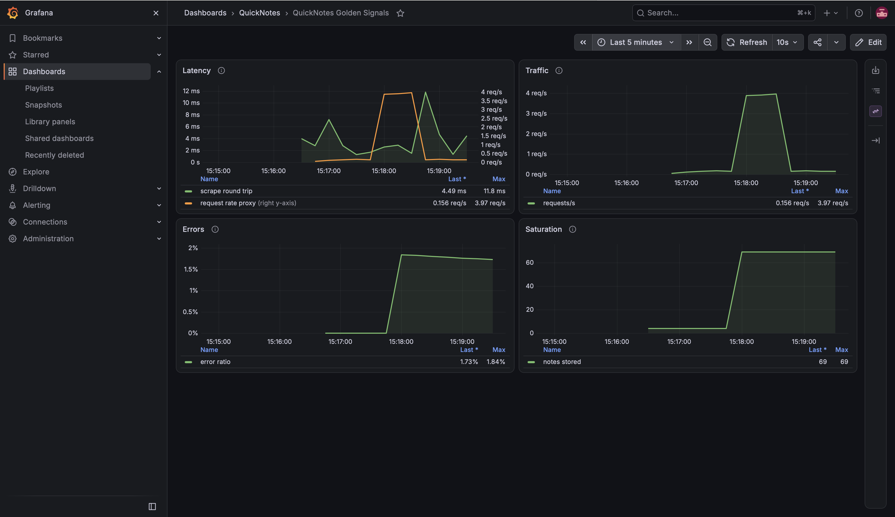
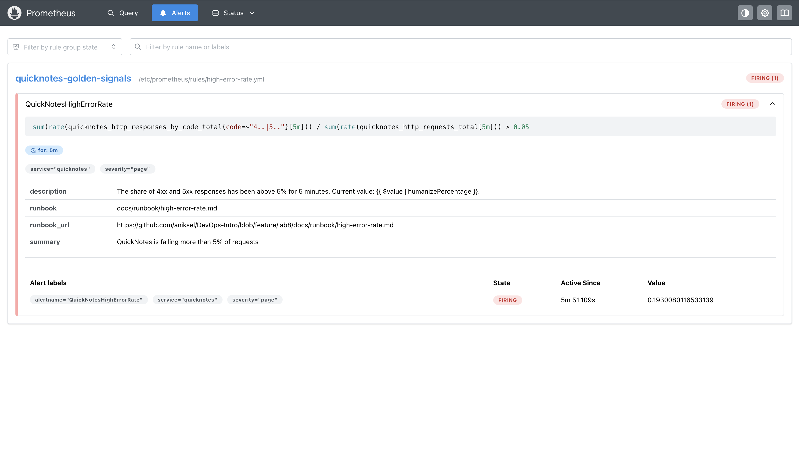

# Lab 8 submission

## Task 1: Prometheus and Grafana with a Provisioned Dashboard

### Config files

- Prometheus: [monitoring/prometheus/prometheus.yml](../monitoring/prometheus/prometheus.yml)
- Grafana data source: [monitoring/grafana/provisioning/datasources/datasource.yml](../monitoring/grafana/provisioning/datasources/datasource.yml)
- Grafana dashboard provider: [monitoring/grafana/provisioning/dashboards/dashboard.yml](../monitoring/grafana/provisioning/dashboards/dashboard.yml)
- Dashboard JSON: [monitoring/grafana/dashboards/golden-signals.json](../monitoring/grafana/dashboards/golden-signals.json)
- Compose services: [compose.yaml](../compose.yaml)

```yaml
# monitoring/prometheus/prometheus.yml
global:
  scrape_interval: 15s
  evaluation_interval: 15s

rule_files:
  - /etc/prometheus/rules/*.yml

scrape_configs:
  - job_name: quicknotes
    static_configs:
      - targets: ["quicknotes:8080"]
```

```yaml
# monitoring/grafana/provisioning/datasources/datasource.yml
apiVersion: 1

datasources:
  - name: Prometheus
    uid: quicknotes-prometheus
    type: prometheus
    access: proxy
    url: http://prometheus:9090
    isDefault: true
    editable: false
    jsonData:
      timeInterval: 15s
```

```yaml
# monitoring/grafana/provisioning/dashboards/dashboard.yml
apiVersion: 1

providers:
  - name: quicknotes
    orgId: 1
    folder: QuickNotes
    type: file
    disableDeletion: true
    allowUiUpdates: false
    updateIntervalSeconds: 30
    options:
      path: /var/lib/grafana/dashboards
      foldersFromFilesStructure: false
```

```yaml
# compose.yaml, the two services added to the Lab 6 stack
  prometheus:
    image: prom/prometheus:v3.13.3
    volumes:
      - ./monitoring/prometheus/prometheus.yml:/etc/prometheus/prometheus.yml:ro
      - ./monitoring/prometheus/rules:/etc/prometheus/rules:ro
      - prometheus-data:/prometheus
    ports:
      - "9090:9090"
    depends_on:
      quicknotes:
        condition: service_healthy
    restart: unless-stopped

  grafana:
    image: grafana/grafana:13.2.3
    volumes:
      - ./monitoring/grafana/provisioning:/etc/grafana/provisioning:ro
      - ./monitoring/grafana/dashboards:/var/lib/grafana/dashboards:ro
    environment:
      GF_SECURITY_ADMIN_USER: "${GF_ADMIN_USER:-quicknotes}"
      GF_SECURITY_ADMIN_PASSWORD: "${GF_ADMIN_PASSWORD:?set GF_ADMIN_PASSWORD before starting the stack}"
      GF_USERS_ALLOW_SIGN_UP: "false"
    ports:
      - "3000:3000"
    depends_on:
      - prometheus
    restart: unless-stopped
```

No password is stored in the repository. Compose refuses to start the stack if
GF_ADMIN_PASSWORD is not supplied from the environment.

### The four panels

| Panel | Query | Unit |
|---|---|---|
| Latency | `scrape_duration_seconds{job="quicknotes"}` and `sum(rate(quicknotes_http_requests_total[1m]))` on the right axis | s and req/s |
| Traffic | `sum(rate(quicknotes_http_requests_total[1m]))` | req/s |
| Errors | `sum(rate(quicknotes_http_responses_by_code_total{code=~"4..\|5.."}[5m])) / sum(rate(quicknotes_http_requests_total[5m]))` | percent |
| Saturation | `quicknotes_notes_total` | notes |

QuickNotes exposes no latency histogram. So the Latency panel shows the round
trip that Prometheus itself measures when it scrapes the app. That is the only
real duration available here. The request rate the lab suggests as a fallback is
drawn in the same panel, on the right axis.

### Target is up

```
$ curl -s http://localhost:9090/api/v1/targets | jq '.data.activeTargets[].health'
"up"

$ curl -s http://localhost:9090/api/v1/targets | jq '.data.activeTargets[] | {job: .labels.job, health, lastError}'
{
  "job": "quicknotes",
  "health": "up",
  "lastError": ""
}
```

### Provisioning worked

```
$ curl -s -u "quicknotes:$GF_ADMIN_PASSWORD" "http://localhost:3000/api/datasources" | jq '.[] | {name, type, url, isDefault}'
{
  "name": "Prometheus",
  "type": "prometheus",
  "url": "http://prometheus:9090",
  "isDefault": true
}

$ curl -s -u "quicknotes:$GF_ADMIN_PASSWORD" "http://localhost:3000/api/search?query=Golden" | jq '.[] | {title, uid, folderTitle}'
{
  "title": "QuickNotes Golden Signals",
  "uid": "quicknotes-golden",
  "folderTitle": "QuickNotes"
}
```

### Traffic generated, 215 requests

```
$ curl -s http://localhost:8080/metrics | grep -E "quicknotes_http_requests_total |quicknotes_notes_total |quicknotes_http_responses_by_code_total"
quicknotes_notes_total 69
quicknotes_http_requests_total 215
quicknotes_http_responses_by_code_total{code="200"} 146
quicknotes_http_responses_by_code_total{code="201"} 65
quicknotes_http_responses_by_code_total{code="204"} 0
quicknotes_http_responses_by_code_total{code="400"} 0
quicknotes_http_responses_by_code_total{code="404"} 4
quicknotes_http_responses_by_code_total{code="405"} 0
quicknotes_http_responses_by_code_total{code="500"} 0
```

### The dashboard



### Design questions

**a) Prometheus pulls. Which side has to be reachable, and what breaks if it cannot reach QuickNotes**

Prometheus opens the connection and asks for the metrics. So the target is the
side that has to be reachable. QuickNotes must listen on a port that Prometheus
can connect to. QuickNotes never connects to Prometheus, and it does not need to
know that Prometheus exists. In this stack both run on the same Compose network,
so the service name quicknotes resolves and port 8080 is open inside it.

If Prometheus cannot reach the target, the scrape fails. Prometheus still writes
one metric of its own, up{job="quicknotes"} = 0. But it stores no application
metric for that moment. Everything built on those metrics goes empty. The panels
show gaps, and rate() over a window with no samples returns nothing. The alert
does not fire either, because its expression has no data. So a full outage of the
target looks like silence and not like an alarm. This is why a second alert on
up == 0 normally sits next to the error rate alert.

**b) What breaks at scrape_interval 5s, and at 5m**

At 5 seconds there are three times more samples than at 15 seconds. That is three
times the storage and memory for the same retention. It also costs more CPU on
both sides, because the app renders its whole metrics page three times as often.
Queries get noisier too. A short rate() window then covers very few seconds of
real time, so it reacts to every small spike.

At 5 minutes each series gets one point every five minutes. rate() needs at least
two samples inside its range. So rate(...[5m]) often returns nothing, and any
range shorter than ten minutes becomes unusable. Detection also gets slow. A
problem can last five minutes before the first sample shows it, so a five minute
alert really means ten. Prometheus marks a series stale after five minutes
without a sample, so series start to disappear between scrapes.

**c) rate, irate or delta for the Traffic panel**

rate() is the right one. It takes the first and the last sample in the range. It
handles counter resets, and it averages over the whole window. That gives the
smooth line a dashboard needs.

irate() uses only the last two samples in the range. It reacts instantly, but it
is very noisy. On a wide panel Grafana asks for far fewer points than there are
samples, so most of the data is thrown away. It is a tool for zooming into one
short spike, not for a traffic panel.

delta() is meant for gauges. It returns the difference between the ends of the
range, with no counter reset handling. On a counter it gives a wrong and often
negative number as soon as the process restarts and the counter goes back to
zero. The counter version is increase(), but that is a total and not a rate.

**d) Why provision Grafana from files**

Because the dashboard and the data source become code. They live in Git next to
the service. A pull request reviews them, and the history says who changed a
panel and why.

A fresh stack also comes up fully configured. Another laptop, a CI job or a new
machine gets the same dashboards with nobody clicking anything. Nothing is lost
when the Grafana container is removed. That matters here, because Grafana keeps
UI edits in its own database inside the container.

It also removes a whole class of incident. The dashboard the on-call needs at
3 am cannot be missing because somebody edited or deleted it by hand. The
provider in this lab sets disableDeletion and allowUiUpdates to false for that
reason, so the file stays the single source of truth.

---

## Task 2: One Good Alert and its Runbook

### Alert rule

Rule file: [monitoring/prometheus/rules/high-error-rate.yml](../monitoring/prometheus/rules/high-error-rate.yml)

```yaml
groups:
  - name: quicknotes-golden-signals
    rules:
      - alert: QuickNotesHighErrorRate
        expr: |
          sum(rate(quicknotes_http_responses_by_code_total{code=~"4..|5.."}[5m]))
            /
          sum(rate(quicknotes_http_requests_total[5m]))
            > 0.05
        for: 5m
        labels:
          severity: page
          service: quicknotes
        annotations:
          summary: "QuickNotes is failing more than 5% of requests"
          description: >-
            The share of 4xx and 5xx responses has been above 5% for 5 minutes.
            Current value: {{ $value | humanizePercentage }}.
          runbook: docs/runbook/high-error-rate.md
          runbook_url: https://github.com/aniksel/DevOps-Intro/blob/feature/lab8/docs/runbook/high-error-rate.md
```

### Triggering it on purpose

A script sent five requests per second for eight minutes, one of them a POST with
a broken JSON body, so about 20% of all responses were errors. The rule state was
polled every 15 seconds:

```
12:22:05  state=inactive  ratio=0.015872442645074224
12:22:20  state=inactive  ratio=0.03538772563176895
12:22:35  state=pending   ratio=0.06780680115273775
12:22:50  state=pending   ratio=0.15362411674347157
12:23:05  state=pending   ratio=0.1639994425087108
...
12:27:21  state=pending   ratio=0.1925872093023256
12:27:36  state=firing    ratio=0.19314868804664725
12:27:51  state=firing    ratio=0.1930080116533139
12:28:06  state=firing    ratio=0.19314868804664723
```

The ratio crossed 5% at 12:22:35 and the rule went to pending at the same
evaluation. It became firing at 12:27:36, five minutes and one evaluation later,
which is exactly what the for clause promises.



### Runbook

The file is [docs/runbook/high-error-rate.md](../docs/runbook/high-error-rate.md).
Its full text follows.

| | |
|---|---|
| Alert | `QuickNotesHighErrorRate` |
| Severity | `page` |
| Service | QuickNotes |
| Rule file | [monitoring/prometheus/rules/high-error-rate.yml](../monitoring/prometheus/rules/high-error-rate.yml) |
| Dashboard | Grafana, folder QuickNotes, dashboard "QuickNotes Golden Signals" |

#### What this alert means

More than 5% of all HTTP responses from QuickNotes have been 4xx or 5xx for the
last 5 minutes, which means real users are getting errors right now.

#### Triage steps

Work top to bottom. Do not skip a step: each one removes a whole group of causes.

1. **Confirm the service is up at all.**

   ```
   curl -s -o /dev/null -w '%{http_code}\n' http://localhost:8080/health
   docker compose ps
   ```

   If `/health` does not answer, or the container is not `Up (healthy)`, this is
   an outage and not an error-rate problem. Go straight to mitigation 1.

2. **Find out which status code is growing.** A rise in 5xx means the service is
   broken. A rise in 4xx usually means a client, a bad deploy of a caller, or a
   scanner is sending wrong requests.

   ```
   curl -s http://localhost:8080/metrics | grep quicknotes_http_responses_by_code_total
   ```

   The same split is in Prometheus:

   ```
   sum by (code) (rate(quicknotes_http_responses_by_code_total[5m]))
   ```

3. **Find out which requests fail.** Read the container log and look at the
   paths and the bodies of the failing requests.

   ```
   docker compose logs --since 15m quicknotes | tail -50
   ```

4. **Check whether anything changed.** Most incidents follow a change. Look at
   the last deploy and the last config change.

   ```
   docker compose images
   git log --oneline -5
   ```

5. **Check the other three golden signals** on the dashboard. If Traffic jumped
   at the same moment, the service is probably overloaded rather than broken. If
   Saturation (`quicknotes_notes_total`) is flat while errors rise, writes are
   failing.

#### Mitigations

Stop the bleeding first, find the root cause afterwards.

1. **Restart the service.** It clears a stuck process, an exhausted connection
   pool or a bad in-memory state, and it takes seconds.

   ```
   docker compose restart quicknotes
   ```

2. **Roll back to the last image that was healthy.** Use this when the errors
   started right after a deploy.

   ```
   docker compose down
   docker tag quicknotes:<last-good> quicknotes:lab6
   docker compose up -d
   ```

3. **Block or rate limit the source of bad traffic.** Use this when step 2 of
   triage showed 4xx from one client or one endpoint, and the service itself is
   fine. Drop that source at the proxy, or disable the endpoint, so the rest of
   the users keep working.

4. **Restore the data file.** Use this when the log shows read or write errors
   on `/data/notes.json`. The data lives in the named volume
   `devops-intro_quicknotes-data`, so the container can be recreated without
   losing it.

#### Post-incident

1. Write a blameless postmortem: what happened, when, why, and what will change.
   Blame the system and not the person. The course covers this in
   [lectures/lec1.md](../lectures/lec1.md), Slide 20, and the full format is
   in the Google SRE Workbook, Chapter 9:
   https://sre.google/workbook/postmortem-culture/
2. Record the timeline with real timestamps: first bad request, alert fired,
   human acknowledged, mitigation applied, errors back to normal. These give the
   MTTR number from the DORA metrics.
3. Decide whether the alert behaved well. If it fired late, lower the `for`
   duration. If it fired when nobody was affected, raise the threshold. Note the
   decision in the postmortem.
4. Turn the fix into code. A manual step that was needed during the incident
   belongs in the playbook, the Compose file or the CI pipeline, so that the next
   person does not have to remember it.

### Design questions

**e) Why sustained for 5 minutes and not on the first bad request**

Because one bad request is not an incident. A single malformed POST, a crawler
probing a path that does not exist, or one client retrying once can push the
ratio over 5% for a few seconds. Waking a human for that is pure cost. It is also
how an alert earns the reputation of being ignorable.

The for clause says the condition must hold at every evaluation for five minutes.
Short spikes therefore never reach a person. It also covers a deploy that breaks
and then recovers by itself inside a minute.

The price is delay. A real outage pages five minutes after it starts. That is the
trade this threshold makes, and the run above shows both sides of it.

**f) Symptom alerts versus cause alerts**

This alert is a symptom alert. It measures the share of failed responses, which
is what a user feels when the app is broken.

A cause alert for QuickNotes would be something like CPU above 80% for five
minutes, or a notes file larger than 100 MB, or a container restart. It is worse
for three reasons.

It pages when nothing is wrong, because a service can sit at 95% CPU and still
answer every request correctly. It stays quiet when something is wrong, because
QuickNotes can return 500 for every request while the CPU is near zero. And there
is no end to it. Every component has many possible causes, so the list grows
without limit and still misses the next failure.

Those metrics are still worth having. They belong on a dashboard used during
triage, not on a pager.

**g) A quantitative threshold for alert fatigue**

The SRE Workbook, Chapter 5, calls this precision. Precision is the share of
pages that were about a real, user-visible problem. A workable line is 75
percent. If fewer than three pages out of four affected users, the alert is too
noisy and has to be changed.

In practice: count every page this rule produced over a month. Mark each one as
"users were affected" or "nothing was wrong". If one page in four was false, act
on it. The fixes are to raise the threshold, to make the for duration longer, or
to narrow the query so the traffic that caused the noise is not counted.
