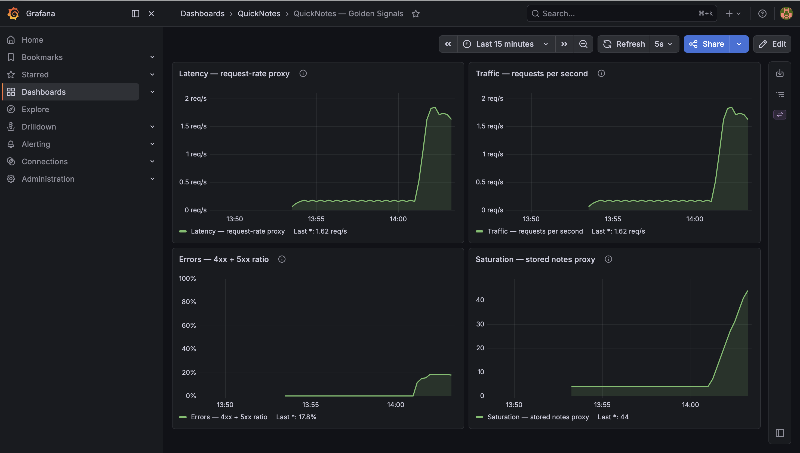
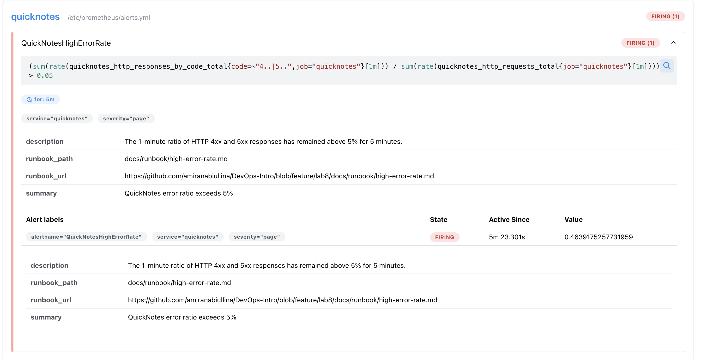
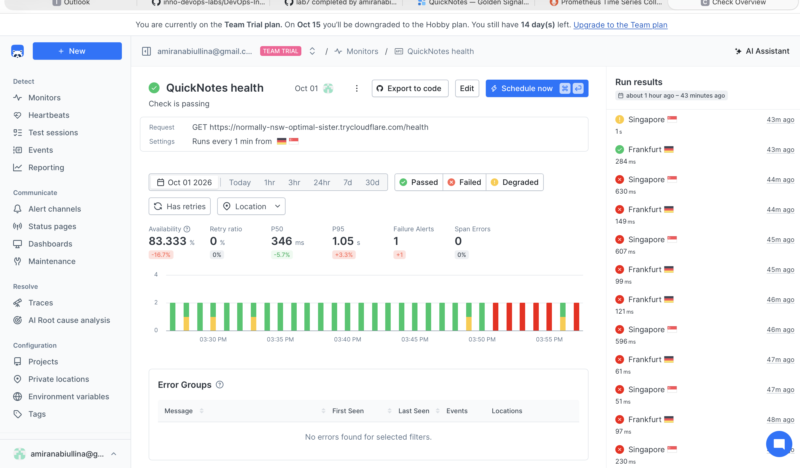
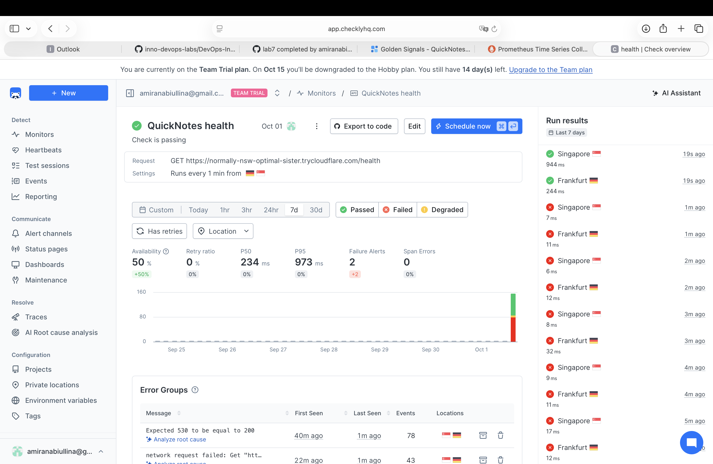

# Lab 8 — SRE & Monitoring

## Scope

Tasks 1 and 2: Prometheus scraping, a provisioned Grafana dashboard,
one sustained-error alert, a runbook, and an observed firing/recovery cycle.

## Implementation files

- [Compose stack](../compose.yaml)
- [Prometheus configuration](../monitoring/prometheus/prometheus.yml)
- [Grafana data source](../monitoring/grafana/provisioning/datasources/datasource.yml)
- [Grafana dashboard provider](../monitoring/grafana/provisioning/dashboards/dashboard.yml)
- [Golden Signals dashboard JSON](../monitoring/grafana/dashboards/golden-signals.json)
- [Alert rule](../monitoring/prometheus/alerts.yml)
- [Runbook](../docs/runbook/high-error-rate.md)
- [Error traffic generator](../monitoring/trigger-alert.py)
- [Healthcheck program](../app/cmd/healthcheck/main.go)
- [Dockerfile](../app/Dockerfile)
- [Environment example](../.env.example)

## Task 1 — Prometheus and Grafana

### Configuration

Prometheus uses the pinned image `prom/prometheus:v3.5.0`.
It scrapes one job, `quicknotes`, every 15 seconds at
`http://quicknotes:8080/metrics`.

QuickNotes has a native Compose healthcheck. A small static Go program
checks `/health`, because the distroless image does not contain curl or
a shell. Prometheus waits for QuickNotes to become healthy.

Grafana uses the pinned image `grafana/grafana:13.0.10`.
Its default Prometheus data source points to `http://prometheus:9090`.
The provisioned dashboard provider loads JSON from
`/var/lib/grafana/dashboards`.

Configuration mounts are read-only. Named volumes preserve Prometheus
and Grafana data. Their published ports are bound to localhost:
9090 and 3000.

Grafana credentials come from the ignored `.env` file.
A random password was generated locally; it is not committed.

On a fresh checkout, copy `.env.example` to `.env`, set a unique password,
and run:

```bash
docker compose up -d --build
```

### Dashboard panels

| Golden signal | Implementation |
|---|---|
| Latency | Explicitly labelled request-rate proxy, as permitted by the lab |
| Traffic | `sum(rate(quicknotes_http_requests_total{job="quicknotes"}[1m]))` |
| Errors | Rate of 4xx and 5xx responses divided by the total request rate |
| Saturation | `sum(quicknotes_notes_total{job="quicknotes"})` |

QuickNotes exposes no duration histogram. The latency proxy is measured
in requests/second and duplicates Traffic; it does not measure latency
or provide p50/p95. The notes gauge is a workload proxy, not a percentage
of storage capacity.

The error query is:

```promql
sum(rate(quicknotes_http_responses_by_code_total{job="quicknotes",code=~"4..|5.."}[1m]))
/
sum(rate(quicknotes_http_requests_total{job="quicknotes"}[1m]))
```

The application includes health checks and metric scrapes in its counters.
These successful requests dilute the measured error ratio.

### Verification

Prometheus reported:

```json
{
  "job": "quicknotes",
  "health": "up",
  "scrapeUrl": "http://quicknotes:8080/metrics",
  "lastError": ""
}
```

The required health-only check is:

```bash
curl -fsS http://localhost:9090/api/v1/targets \
  | jq '.data.activeTargets[].health'
```

Result: `"up"`.

[Saved target response](lab8-logs/01-targets.json).

Grafana's health endpoint reported `database: ok`, version `13.0.10`.
[Saved Grafana health response](lab8-logs/02-grafana-health.json).

The initial traffic test completed on 2026-10-01 at 11:03:02 UTC:

```text
Total requests: 200
Responses: {200: 120, 201: 40, 400: 40}
```

[Traffic log](lab8-logs/03-traffic.txt).

The dashboard showed non-trivial traffic, an error ratio around 18%,
and growth from 4 to 44 stored notes. The generator itself produced
20% errors; monitoring requests explain the lower dashboard ratio.



### a) Pull versus push

Prometheus initiates requests, so QuickNotes must be reachable from
Prometheus on the Compose network. QuickNotes does not need to initiate
connections to Prometheus.

A DNS, network or application failure can prevent scraping. Prometheus
then reports `up = 0` for the failed scrape, and fresh application samples
stop arriving. An empty error-rate graph must not be interpreted as
zero errors.

### b) Scrape intervals: 5 seconds versus 5 minutes

At 5 seconds, Prometheus stores approximately three times as many samples
as at 15 seconds. Queries over the same time range process more samples.
Very short rate windows can produce noisier graphs; 5-second scraping
does not inherently make a correctly configured rate query invalid.
The scrape timeout must also be no greater than the scrape interval.

At 5 minutes, our `[1m]` rate queries normally contain fewer than two
samples and cannot calculate a rate. Much larger windows would be needed.
Short incidents become harder to resolve in time, gauges can miss brief
changes, and alert detection becomes slower.

### c) rate(), irate() and delta()

`rate()` is appropriate for Traffic: it calculates an average per-second
counter increase over the selected window and accounts for counter resets.

`irate()` uses the last two samples, so it reacts more sharply to changes
and is less suitable for a stable overview or a sustained-error alert.

`delta()` measures a gauge's change over a window. It is not appropriate
for a request counter because it does not handle counter resets as a rate.

See the [Prometheus function reference](https://prometheus.io/docs/prometheus/latest/querying/functions/).

### d) Why provision Grafana from files?

Provisioning makes a fresh stack reproducible. The source, queries and
panel layout are versioned alongside the application, can be reviewed
in a PR, and can be restored without repeating manual UI setup.

See [Grafana provisioning](https://grafana.com/docs/grafana/latest/administration/provisioning/).

## Task 2 — One good alert

### Rule definition

The complete rule is in [alerts.yml](../monitoring/prometheus/alerts.yml).

- Name: `QuickNotesHighErrorRate`.
- Condition: the rolling one-minute error ratio is strictly greater than 5%.
- Pending duration: `for: 5m`.
- Labels: `severity: page`, `service: quicknotes`.
- Annotations: description, repository runbook path and runbook URL.

The aggregated expression produces one alert instance when the condition
is true. The one-minute query window and the five-minute pending duration
serve different purposes. An isolated short burst leaves the query window
before it can satisfy the pending duration.

The rule does not detect missing metrics or a complete lack of traffic.
With zero total traffic the ratio is undefined. This is a limitation of
this single error-ratio alert.

The page label is configured, but external notification delivery is not:
this lab verifies the firing state in Prometheus.

### Deliberate trigger and recovery

The generator repeatedly sent a successful `GET /notes` alongside
a malformed `POST /notes`. The expected responses were 200 and 400.

Run command:

```bash
python -u monitoring/trigger-alert.py \
  | tee submissions/lab8-logs/05-alert-trigger.txt
```

The observed timeline on 2026-10-01 was:

| Event | UTC time |
|---|---|
| Generator started | 11:06:34 |
| First observed inactive state | 11:06:34 |
| First observed pending state | 11:06:49 |
| First observed firing state | 11:11:52 |
| After traffic stopped | Inactive, with rule health OK |

These are observation times from polling, not exact evaluation timestamps.

The firing screenshot shows an error ratio of approximately 46.4%,
the five-minute pending duration, the severity label and runbook annotations.



Evidence:

- [Initial rule configuration and state](lab8-logs/04-alert-rule.json)
- [Trigger timeline](lab8-logs/05-alert-trigger.txt)
- [Inactive snapshot](lab8-logs/alert-inactive.json)
- [Pending snapshot](lab8-logs/alert-pending.json)
- [Firing snapshot](lab8-logs/alert-firing.json)
- [Recovered rule state](lab8-logs/06-alert-recovered.json)

After stopping the generator, the rule returned to `inactive`.
QuickNotes still returned `{"notes":44,"status":"ok"}` and the scrape
target remained `up`, confirming that recovery was not caused by
the application disappearing.

### e) Why sustain the condition for five minutes?

A single bad request can be an isolated client mistake. Paging on every
such event would interrupt the on-call without evidence of an ongoing
problem. The pending duration filters brief spikes, at the cost of
delaying notification of a persistent issue.

See [Prometheus alerting rules](https://prometheus.io/docs/prometheus/latest/configuration/alerting_rules/).

### f) Symptom alerts versus cause alerts

An example cause alert is "QuickNotes container CPU exceeds 80% for
five minutes", if container CPU metrics are collected.

High CPU can occur while users still receive successful, fast responses.
Conversely, users can see errors while CPU is low. CPU is useful for
diagnosis and capacity planning, but alone is a weaker reason to page
than a user-facing failure. Our alert detects failed HTTP responses.

### g) Quantitative alert-fatigue threshold

I would review and tune the alert if more than 10% of its pages over
a rolling 30-day window had no actual user impact or required action.

For example, 3 such pages out of 20 is a 15% false-page rate and exceeds
this proposed threshold. With few incidents, I would also review each
page individually. Planned lab tests should be tracked separately.

This is my proposed operational threshold, not a universal SRE rule or
a numeric threshold specified by Lecture 8. The lecture warns that
repeated noise trains the on-call to ignore pages.

## Full runbook

### QuickNotesHighErrorRate

#### What this alert means

More than 5% of instrumented QuickNotes HTTP responses are 4xx or 5xx, measured over a rolling one-minute window, and this condition has persisted for five minutes.

#### Triage steps

Run commands from the repository root on the machine running Docker Compose.

1. Open http://localhost:9090/alerts and locate
   `QuickNotesHighErrorRate`. Record the state, activation time and
   current error ratio. Open the Golden Signals dashboard:
   http://localhost:3000/d/quicknotes-golden-signals.

2. Confirm the monitoring target is UP at
   http://localhost:9090/targets. Check containers and application health:

   ```bash
   docker compose ps
   curl --max-time 5 -i http://localhost:8080/health
   curl --max-time 5 -i http://localhost:8080/notes
   ```

   If the target is DOWN, missing error-rate data does not mean recovery.

3. Separate client errors from server errors using this Prometheus query:

   ```promql
   sum by (code) (
     rate(quicknotes_http_responses_by_code_total{job="quicknotes"}[1m])
   )
   ```

   HTTP 400 suggests malformed JSON or a missing title. HTTP 404 can mean
   a missing note. HTTP 500 can indicate a failure to persist a note.
   Check whether a lab traffic generator is still running.

4. Inspect recent logs and changes:

   ```bash
   docker compose logs --since=15m --tail=200 quicknotes
   git log -5 --oneline
   docker system df
   ```

   Correlate the start of errors with traffic generation, deployments
   or storage problems. Logs may not contain individual HTTP requests;
   use the status-code metrics and direct requests as additional evidence.

#### Mitigations

- For malformed traffic or a broken client, stop the offending generator
  with Ctrl+C in its terminal, or pause the client. Correct the request
  body before resuming. Valid note creation requires JSON with a non-empty
  `title`.

- For errors introduced by a deployment, restore the previously verified
  application image and configuration, then recreate only QuickNotes:

  ```bash
  docker compose up -d --no-deps quicknotes
  ```

  Verify the selected image is actually the previous working image before
  running this command. Preserve the named data volume.

- If health checks fail and evidence indicates a stuck application process,
  capture its logs, then restart only the application:

  ```bash
  docker compose restart quicknotes
  ```

  A restart does not repair full storage or incorrect permissions.
  For persistence failures, restore writable capacity or correct the
  diagnosed data-volume permissions. Do not delete the data volume or
  run `docker compose down -v`.

After mitigation, verify `/health` and `/notes` return 200, the target is UP,
and the error ratio falls below 5%. Allow at least one minute plus a rule
evaluation for old errors to leave the query window. Confirm the alert
becomes inactive and monitor the dashboard for another five minutes.

#### Post-incident

Write a blameless postmortem following the guidance in
[Lecture 1, Slide 20 — Blameless Postmortems](../lectures/lec1.md).

Include impact, a UTC timeline, contributing factors, mitigation,
and preventive actions with owners and deadlines. Attach dashboard and
alert evidence. Review whether the page reflected actual user impact.

This lab counts health checks and metric scrapes in total traffic, so they
can dilute the measured error ratio. Missing traffic or missing metrics
does not trigger this rule. The latency and saturation panels are proxies.

The `severity: page` label classifies the alert. External notifications
are not configured in this lab; firing is observed in Prometheus.

## Bonus — External synthetic monitoring

### Configuration

A Checkly API check named `QuickNotes health` monitors `GET /health`
through a public Cloudflare Quick Tunnel.

- Frequency: every minute.
- Scheduling: parallel runs.
- Regions: Frankfurt and Singapore.
- Assertion: HTTP status equals 200.
- Degraded response threshold: 1000 ms.
- Failed response threshold: 2000 ms.
- Retries: none.
- Notification escalation: after one failed check.
- Reminder count: zero.
- Automatic repair: off.
- Checkly account: Team Trial, with no paid upgrade purchased.

The tunnel was started with:

```bash
cloudflared tunnel --protocol http2 --url http://localhost:8080
```

HTTP/2 was selected because QUIC connection attempts timed out,
while the TCP connectivity checks succeeded.

The URL used during the comparison window was:

```text
https://sie-females-surprised-wildlife.trycloudflare.com/health
```

After the tunnel stopped working, a new tunnel was created and the
existing Checkly check was updated to:

```text
https://normally-nsw-optimal-sister.trycloudflare.com/health
```

The check's history was preserved. The current URL shown in screenshots
is the replacement URL; historical results refer to the URL configured
when those runs occurred. Quick Tunnel URLs are temporary.

### Internal HTTP probe

The application has no request-duration histogram. To obtain real
internal latency measurements for the bonus, I added Blackbox Exporter:

- Image: `prom/blackbox-exporter:v0.27.0`.
- Target: `http://quicknotes:8080/health` inside the Compose network.
- Method: GET.
- Required status: 200.
- Timeout: 2 seconds.
- Probe interval: 60 seconds.
- Prometheus job: `quicknotes-internal-probe`.

[Blackbox configuration](../monitoring/blackbox/blackbox.yml).

The original `quicknotes` job continues scraping application metrics
every 15 seconds. The additional job collects probe duration, HTTP status
and probe success. The main dashboard's latency panel remains explicitly
labelled as a request-rate proxy.

### Shared observation window

Date: 2026-10-01.

- Start: 12:27:09 UTC / 15:27:09 Moscow.
- End: 12:57:09 UTC / 15:57:09 Moscow.
- Duration: 30 minutes.

[Saved window](lab8-logs/bonus-window.json).

| Measurement | Prometheus: internal HTTP probe | Checkly: Frankfurt and Singapore |
|---|---|---|
| Latency p50 | 2.4228 ms | 346 ms |
| Latency p95 | 3.1191 ms | 1050 ms |
| Errors observed | 0 failed probes among 25 observed samples | Failed runs visible; UI availability 83.333% |
| Observation coverage | 25 samples; approximately 30 expected | External monitoring continued during the host interruption |

The internal percentiles were calculated from successful probe durations,
using linear interpolation between sorted samples. External percentiles
are the values displayed by Checkly for the selected window and both
regions; they were not recomputed from a raw external export.
These are percentiles, not arithmetic averages.

Internal requests use HTTP within the Compose network. External requests
also traverse public DNS, HTTPS and the Cloudflare tunnel. The paths and
sample populations therefore differ; this is an internal-versus-external
comparison, not a measurement of identical network conditions.

Evidence:

- [Raw internal samples](lab8-logs/bonus-internal-raw.json)
- [Internal statistics](lab8-logs/bonus-internal-summary.json)



### Host sleep, missing data and recovery

The laptop lid was accidentally closed during the experiment.
The internal series contains 25 probe samples instead of approximately 30.
Its largest gap, including the window boundaries, is 354.47 seconds.

Zero observed internal failures does not mean 100% availability:
there are no internal observations for part of the window.
Missing samples were not replaced with successful results.

Checkly recorded external failures while the local environment was
interrupted. Its availability for the selected window was 83.333%.
The displayed `Failure Alerts: 1` is an alert count, not a failed-request
count. I did not infer an exact number of failed requests from that field.

During later troubleshooting, the old tunnel reported
`Unauthorized: Tunnel not found`, and both the local DNS resolver and
1.1.1.1 returned NXDOMAIN for its hostname. QuickNotes itself still
returned HTTP 200 locally.

After creating a new HTTP/2 tunnel and updating the existing Checkly
check, both regions passed again. The recovery screenshot shows
244 ms from Frankfurt and 944 ms from Singapore; these are individual
post-recovery runs outside the comparison window.



### Failure-mode comparison

Checkly can detect public DNS, TLS, tunnel or regional connectivity
failures that an internal probe can miss when QuickNotes remains
reachable inside Compose. In this experiment, the external monitor
continued recording failures while the local monitoring series had
a gap. Prometheus additionally observes application request counters,
status-code distribution and stored-note counts, which a simple external
health check does not expose. It can reveal errors on note creation even
when `/health` still returns 200. Both perspectives are needed: successful
health probes do not establish that every application operation works,
and missing internal data must not be interpreted as successful service.
