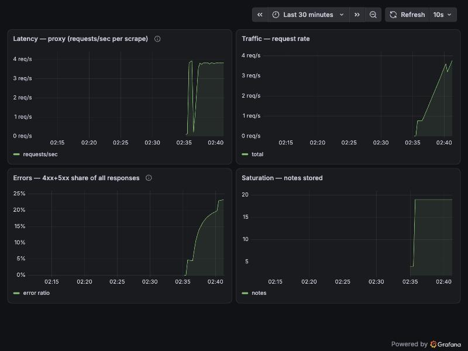
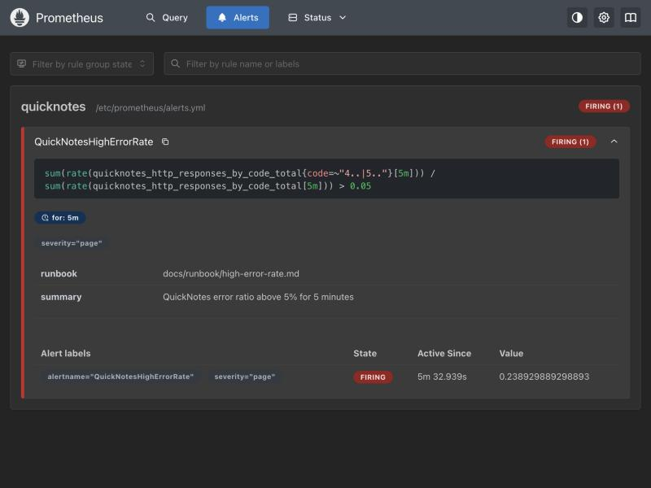

# Lab 8 — SRE & Monitoring: Golden Signals Dashboard + One Good Alert

**Author:** Kolpakova Valeriia — v.kolpakova@innopolis.university

**Scope:** Tasks 1 and 2 are complete. The Bonus is **not** done — it requires a Checkly (or
Pingdom / Better Stack) account, which I did not create.

**Note on ports:** `compose.yaml` publishes QuickNotes on 8080 as Lab 6 defined it. On this
machine an unrelated local nginx holds `127.0.0.1:8080`, so Docker's publish landed on the IPv6
loopback: `http://[::1]:8080` reaches QuickNotes while `http://127.0.0.1:8080` reaches nginx.
Traffic generation below therefore targets `[::1]`. Nothing inside the Compose network is
affected — Prometheus scrapes `quicknotes:8080` over Compose DNS.

---

## Task 1 — Prometheus + Grafana with a Provisioned Dashboard

### `monitoring/prometheus/prometheus.yml`

```yaml
global:
  scrape_interval: 15s

rule_files:
  - /etc/prometheus/alerts.yml

scrape_configs:
  # Resolved by Compose DNS: "quicknotes" is the service name, 8080 the port it
  # listens on inside the network (not the published host port).
  - job_name: quicknotes
    static_configs:
      - targets:
          - quicknotes:8080
```

### `monitoring/grafana/provisioning/datasources/datasource.yml`

```yaml
apiVersion: 1

datasources:
  - name: Prometheus
    uid: prometheus
    type: prometheus
    access: proxy
    url: http://prometheus:9090
    isDefault: true
```

The explicit `uid` matters: the dashboard JSON references the data source by uid, and letting
Grafana generate a random one would break that reference on every fresh stack.

### `monitoring/grafana/provisioning/dashboards/dashboard.yml`

```yaml
apiVersion: 1

providers:
  - name: golden-signals
    type: file
    options:
      # Must match where compose mounts the dashboard JSON.
      path: /var/lib/grafana/dashboards
```

### `monitoring/grafana/dashboards/golden-signals.json`

Four panels, one per golden signal. The queries, in full:

| Panel | Query |
|---|---|
| **Latency** (proxy) | `rate(quicknotes_http_requests_total[1m])` |
| **Traffic** | `sum(rate(quicknotes_http_requests_total[5m]))` |
| **Errors** | `sum(rate(quicknotes_http_responses_by_code_total{code=~"4..\|5.."}[5m])) / sum(rate(quicknotes_http_responses_by_code_total[5m]))` |
| **Saturation** | `quicknotes_notes_total` |

QuickNotes exposes no duration histogram — `/metrics` emits four scalars
(`quicknotes_notes_total`, `quicknotes_notes_created_total`, `quicknotes_notes_deleted_total`,
`quicknotes_http_requests_total`) plus `quicknotes_http_responses_by_code_total` labelled by
code. So the Latency panel uses the request rate as the proxy the brief allows, and the panel
title says so rather than pretending it is a real latency measurement.

The Errors panel is set to `percentunit` with a red threshold at `0.05`, so the panel turns red
at exactly the value the alert fires on.

### Compose extension

Added to the Lab 6 `compose.yaml`:

```yaml
  prometheus:
    image: prom/prometheus:v3.15.0
    ports:
      - "9090:9090"
    volumes:
      - ./monitoring/prometheus:/etc/prometheus:ro
    depends_on:
      quicknotes:
        condition: service_healthy
    restart: unless-stopped

  grafana:
    image: grafana/grafana:13.2.3
    ports:
      - "3000:3000"
    environment:
      GF_SECURITY_ADMIN_USER: quicknotes-admin
      GF_SECURITY_ADMIN_PASSWORD: ${GRAFANA_ADMIN_PASSWORD:?set GRAFANA_ADMIN_PASSWORD in .env}
    volumes:
      - ./monitoring/grafana/provisioning:/etc/grafana/provisioning:ro
      - ./monitoring/grafana/dashboards:/var/lib/grafana/dashboards:ro
    depends_on:
      - prometheus
    restart: unless-stopped
```

No admin password is committed. `${GRAFANA_ADMIN_PASSWORD:?...}` makes Compose **refuse to
start** if the variable is unset, which is a better failure than silently falling back to
`admin/admin`. I kept the value in an environment variable outside the repo rather than in a
`.env` file, because `.env` is not in this repo's `.gitignore` and a committed secret is not a
mistake worth risking.

`depends_on: {quicknotes: {condition: service_healthy}}` is Lab 6's healthcheck paying off —
Prometheus waits for the app to be genuinely ready, not merely started:

```console
 Container devops-intro-quicknotes-1  Waiting
 Container devops-intro-quicknotes-1  Healthy
 Container devops-intro-prometheus-1  Started
 Container devops-intro-grafana-1     Started
```

### Verification

```console
$ curl -s http://localhost:9090/api/v1/targets | jq '.data.activeTargets[].health'
"up"

$ curl -s http://localhost:9090/api/v1/targets | jq -r '.data.activeTargets[] | "\(.job) \(.scrapeUrl)"'
quicknotes http://quicknotes:8080/metrics
```

After ~200 mixed requests plus the sustained error load from Task 2, the response counters:

```console
код 200: 1321    код 201: 15    код 400: 352    код 404: 10
```

### Dashboard



All four panels with live data: traffic climbing to ~4 req/s, the error ratio rising past 20%
as the Task 2 injector runs, and saturation stepping from 4 seeded notes to 19.

**One real problem worth recording.** The first version of this dashboard provisioned fine and
rendered four empty panels. The data source was healthy and the queries worked when I ran them
through Grafana's own proxy:

```console
$ curl -u ... http://localhost:3000/api/datasources/proxy/uid/prometheus/api/v1/query?query=quicknotes_http_requests_total
success  1071
```

The cause was in the panel targets: without `"range": true`, Grafana issues an *instant* query,
which returns a single sample — and a time-series panel given one point draws nothing. Adding
`"range": true` (plus `"instant": false"` and an `options` block for legend/tooltip) to every
target fixed it. Worth knowing that "panel is empty" is far more often a malformed panel
definition than a broken scrape, and that `/api/datasources/proxy/...` is the fastest way to
tell those two apart.

### 1.5 — Design questions

**a) Pull vs push — which side has to be reachable, and what breaks if it can't be?**

Prometheus pulls, so **QuickNotes must be reachable from Prometheus**, not the other way round.
Nothing in the app ever opens a connection to the monitoring stack; it just serves `/metrics`
to whoever asks. In this Compose setup that means Prometheus must be able to resolve and
connect to `quicknotes:8080` on the shared network.

If it cannot — wrong service name, wrong port, network partition, app down — the target's
`health` goes from `up` to `down` and the synthetic `up{job="quicknotes"}` series drops to `0`.
Importantly, the application-level series simply **stop**, they do not go to zero: `rate()` over
a gap produces no data rather than `0 req/s`. That is a useful property, because "no data" and
"genuinely zero traffic" stay distinguishable — but it also means a dashboard panel can go
blank for two completely different reasons, which is exactly why `up == 1` deserves its own
alert in a real deployment.

**b) `scrape_interval: 15s` — what breaks at `5s`? At `5m`?**

At **5s** the main cost is volume: three times the samples, so three times the storage, memory
for the head block and query cost over a given window. It also triples the load the scrape
itself puts on the app. And the resolution is often false precision — a counter that only moves
on request arrival does not become more truthful when sampled more often.

At **5m** the problem is correctness of the queries built on top. PromQL range functions need
at least two samples inside the window, and the convention is a window of at least 4× the
scrape interval — so `rate(...[5m])` with a 5-minute scrape interval can see a single point and
return nothing at all. Short spikes vanish entirely, and alerts built on `for: 5m` cannot
evaluate meaningfully because they may only get one evaluation's worth of data. My
`rate(...[5m])` over a 15s interval has ~20 samples per window, which is comfortable.

**c) `rate()` vs `irate()` vs `delta()` for the Traffic panel?**

**`rate()`** is right. It computes the per-second average increase of a counter across the whole
window, using all samples in it, and it handles counter resets — which matters because
`quicknotes_http_requests_total` restarts at zero every time the container restarts, and a naive
difference would read that as a huge negative jump.

`irate()` uses only the last two samples. It reacts fast and is useful for debugging a live
spike, but on a dashboard it is visually noisy and, worse, it can miss activity entirely when
the panel's resolution is coarser than the scrape interval, because intermediate samples are
simply never looked at.

`delta()` is wrong by construction here: it is built for **gauges**, computes a raw difference
rather than a per-second rate, and does not correct for counter resets. It would be the right
choice for a question like "how much did `quicknotes_notes_total` change over the last hour".

**d) Why provision Grafana from files instead of clicking the UI?**

Because clicking produces state that lives only in Grafana's own database, and that database is
in a container. The moment anyone runs `docker compose down -v`, or the stack is rebuilt on a
colleague's laptop or in CI, the dashboard is gone and must be rebuilt by hand from memory.

Provisioning makes the dashboard and the data source part of the repository: they are reviewed
in pull requests, versioned alongside the code whose behaviour they display, and recreated
identically on every fresh `docker compose up`. It also removes a bootstrap step from the
runbook — nobody needs to be told "now go add a Prometheus data source" before monitoring works.

The practical constraint is that provisioned dashboards are read-only in the UI, so the real
workflow is the one the brief describes: build it interactively, export the JSON Model, commit
that.

---

## Task 2 — One Good Alert + Runbook

### Alert rule — `monitoring/prometheus/alerts.yml`

```yaml
groups:
  - name: quicknotes
    rules:
      # Symptom alert: the share of requests users see fail. The `for: 5m` is what
      # keeps a single 4xx burst from paging anyone -- the ratio has to stay above
      # the threshold for five consecutive evaluations' worth of time.
      - alert: QuickNotesHighErrorRate
        expr: |
          sum(rate(quicknotes_http_responses_by_code_total{code=~"4..|5.."}[5m]))
            /
          sum(rate(quicknotes_http_responses_by_code_total[5m]))
            > 0.05
        for: 5m
        labels:
          severity: page
        annotations:
          summary: QuickNotes error ratio above 5% for 5 minutes
          runbook: docs/runbook/high-error-rate.md
```

All four requirements from 2.1: >5% error ratio, `for: 5m` sustained, `severity: page`, and an
annotation pointing at the runbook path inside this repo.

### Firing

I ran a generator sending three healthy requests and one malformed `POST /notes` per second —
roughly a 25% error ratio against a 5% threshold — and watched the transition
`Normal → Pending → Firing`:

- `23:37:12` — ratio crosses 5%, alert becomes **Pending**
- `23:42:19` — five minutes later, alert becomes **Firing**



The screenshot shows the rule definition and its state together: `FIRING (1)`, the expression,
`for: 5m`, `severity="page"`, `runbook docs/runbook/high-error-rate.md`, and the observed value
`0.238929889298893` — 23.9%.

### Runbook

[`docs/runbook/high-error-rate.md`](../docs/runbook/high-error-rate.md), with all four required
sections. Its triage path is built around one branch that matters at 3 AM: splitting the
symptom by status code, because **5xx means QuickNotes is broken** and **4xx means its callers
are**, and those are different incidents with different fixes.

### 2.4 — Design questions

**e) Why "sustained for 5 minutes" instead of firing on the first bad request?**

Because a single failed request is not an incident, and paging a human is expensive — it costs
a person's sleep and, repeated often enough, their trust in the alert. Error rates are spiky by
nature: one client retrying with a stale payload, a scanner probing nonexistent paths, a pod
restarting mid-request. Nearly all of those resolve themselves within seconds and need no human
at all.

`for: 5m` encodes a judgement about what is worth waking someone for: a problem that is still
happening five minutes later is unlikely to resolve itself and is long enough that users have
noticed. The cost is five minutes of detection delay, which is the right trade for anything
short of a total outage — and a total outage will trip an availability alert, not this one.

**f) Symptom alerts vs cause alerts — give a cause alert for QuickNotes and say why it's worse.**

A cause alert for QuickNotes would be something like *"the container's memory usage is above
80% of its limit for 10 minutes"*, or *"notes_total has grown past 10,000"*.

It is worse on both error directions. It **false-positives**: a service can sit at 85% memory
indefinitely and serve every request perfectly, so the page wakes someone to look at a system
that is working. And it **false-negatives**, which is the more dangerous half: it enumerates one
way the service can break, so it stays silent for every other way — a corrupted data file, a
deadlock, a bad config pushed to `SEED_PATH`, an upstream dependency failing. Users are getting
errors and no alert fires, because memory happened to be fine.

The error-ratio alert inverts both properties: it says nothing about *why*, and precisely
because of that it catches every cause that actually reaches a user. Cause metrics are for the
dashboard you open *after* the page, to work out which of the many possible causes it was.

**g) Alert fatigue — a quantitative threshold for "too noisy".**

The number to track is the **actionability rate**: of the pages this alert sent over, say, the
last 30 days, what share resulted in a human doing something — a mitigation, a rollback, a
config change?

My threshold: **if more than 25% of pages are closed with no action taken, the alert is too
noisy** and the fix is mine to make, not the on-call's to tolerate. In practice I would start
worrying earlier, around 10-15%, because the damage is not linear — an alert that cries wolf
one time in five stops being read carefully long before it stops firing, and by the time it is
ignored it is worse than having no alert, since it occupies the slot where a working one would
have been.

The corresponding knobs are the threshold (5%), the window (`for: 5m`), and the expression
itself — for instance excluding 404s, which here are mostly scanner noise rather than a
QuickNotes failure.

---

## Bonus Task — not attempted

The bonus requires a Checkly (or Pingdom / Better Stack / Route 53) account to run the external
probe from two regions. I did not create one, so there is no comparison table and no
external-vs-internal analysis. Everything else needed for it is in place — `cloudflared` is
installed and would give a public URL without an account — so only the monitoring-service
signup is missing.
