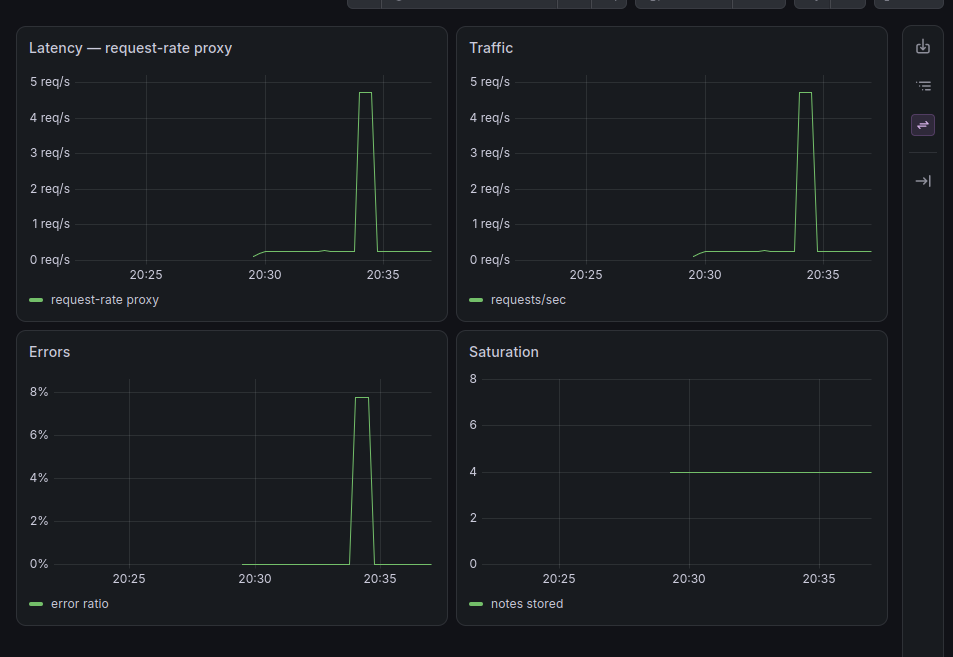

# Lab 8 — SRE & Monitoring

## Task 1 — Golden Signals Dashboard

### Prometheus configuration

Prometheus scrapes QuickNotes every 15 seconds through the Docker Compose service name `quicknotes` on port `8080`.

```yaml
global:
  scrape_interval: 15s

rule_files:
  - /etc/prometheus/rules/*.yml

scrape_configs:
  - job_name: quicknotes
    metrics_path: /metrics
    static_configs:
      - targets:
          - quicknotes:8080
```

### Grafana datasource

Grafana uses the Prometheus service inside the Docker Compose network.

```yaml
apiVersion: 1

datasources:
  - name: Prometheus
    uid: prometheus
    type: prometheus
    access: proxy
    url: http://prometheus:9090
    isDefault: true
    editable: false
```

### Dashboard provisioning

```yaml
apiVersion: 1

providers:
  - name: QuickNotes
    orgId: 1
    folder: QuickNotes
    type: file
    disableDeletion: false
    editable: true
    options:
      path: /var/lib/grafana/dashboards
```

The dashboard contains four panels:

1. **Latency** — request rate is used as a proxy because QuickNotes does not expose a request latency histogram.
2. **Traffic** — request rate calculated from `quicknotes_http_requests_total`.
3. **Errors** — ratio of HTTP 4xx and 5xx responses to all HTTP requests.
4. **Saturation** — current number of stored notes from `quicknotes_notes_total`.

### Golden Signals dashboard



### Prometheus target verification

The QuickNotes target was successfully discovered and scraped by Prometheus.

```json
{
  "job": "quicknotes",
  "health": "up",
  "scrapeUrl": "http://quicknotes:8080/metrics",
  "lastError": ""
}
```

The required health check also returned:

```text
"up"
```

### Design questions

#### a. Why does Prometheus need network access to QuickNotes?

Prometheus uses a pull-based model. It periodically connects to the QuickNotes `/metrics` endpoint and retrieves metrics. If Prometheus cannot reach QuickNotes, the target becomes `DOWN` and no new application metrics are collected.

#### b. Why use a 15-second scrape interval instead of 5 seconds or 5 minutes?

A 5-second interval produces more monitoring traffic, storage usage, and processing overhead. A 5-minute interval has very low resolution and may miss short incidents or make rate calculations inaccurate. A 15-second interval provides a reasonable balance between visibility and monitoring overhead.

#### c. Why use `rate()` instead of `irate()` or `delta()` for traffic?

`rate()` calculates the average per-second increase of a counter over a time window and correctly handles counter resets. `irate()` uses only the last two samples and is therefore much noisier. `delta()` is mainly intended for gauges and absolute changes rather than monotonically increasing request counters.

#### d. Why provision Grafana configuration as files?

Provisioning makes dashboards and datasources reproducible and version-controlled. The monitoring setup can be reviewed in Git and recreated automatically on another machine without manually configuring Grafana through the UI.

---

## Task 2 — High Error Rate Alert

### Alert rule

The alert detects an HTTP error ratio above 5% sustained for at least 5 minutes.

```yaml
groups:
  - name: quicknotes
    rules:
      - alert: QuickNotesHighErrorRate
        expr: |
          (
            sum(rate(quicknotes_http_responses_by_code_total{code=~"4..|5.."}[1m]))
            /
            sum(rate(quicknotes_http_requests_total[1m]))
          ) > 0.05
        for: 5m
        labels:
          severity: page
        annotations:
          summary: "QuickNotes error ratio is above 5%"
          description: "More than 5% of QuickNotes requests have returned 4xx or 5xx responses for at least 5 minutes."
          runbook_url: "https://github.com/Kriss221/DevOps-Intro/blob/feature/lab8/docs/runbook/high-error-rate.md"
```

The rule configuration was validated successfully with `promtool`.

```text
SUCCESS: 1 rule files found
SUCCESS: 1 rules found
```

### Alert firing

Sustained malformed requests were generated together with healthy traffic. The observed error ratio reached approximately 43%, and the alert transitioned from `Pending` to `Firing` after the configured five-minute duration.


### Runbook

The runbook is stored at:

```text
docs/runbook/high-error-rate.md
```

It includes:

- a description of the alert;
- steps to verify the current error ratio;
- checks for HTTP status codes;
- application health and log inspection;
- recent deployment/configuration checks;
- rollback, traffic control, and restart mitigations;
- post-incident guidance based on the course material on blameless postmortems.

### Alert design questions

#### e. Why require the condition to remain true for 5 minutes?

The five-minute duration prevents temporary spikes from immediately paging the on-call engineer. A single malformed request or short network problem may briefly increase the error ratio but does not necessarily indicate a sustained incident. Requiring five minutes reduces alert noise and flapping while still detecting persistent user-visible failures.

#### f. Why is an error-rate symptom alert better than an alert such as CPU > 90% or container restart?

High CPU usage or a container restart is a possible cause of a problem, but it does not always result in user-visible impact. At the same time, requests may fail for reasons unrelated to CPU usage or restarts. The HTTP error ratio directly measures a symptom experienced by clients, so it is more appropriate for paging.

#### g. When should the alert threshold or duration be changed?

The threshold or duration should be reviewed if the alert produces too many false-positive pages. For example, if more than two out of twenty monthly alerts correspond to situations without meaningful user-visible impact, the error threshold, duration, or PromQL query should be reconsidered.

---

## Result

The Lab 8 monitoring stack includes:

- Prometheus scraping QuickNotes metrics every 15 seconds;
- a provisioned Grafana Prometheus datasource;
- a provisioned Golden Signals dashboard;
- a High Error Rate alert with a five-minute sustained condition;
- a documented incident runbook.

The optional external synthetic monitoring bonus was not implemented.