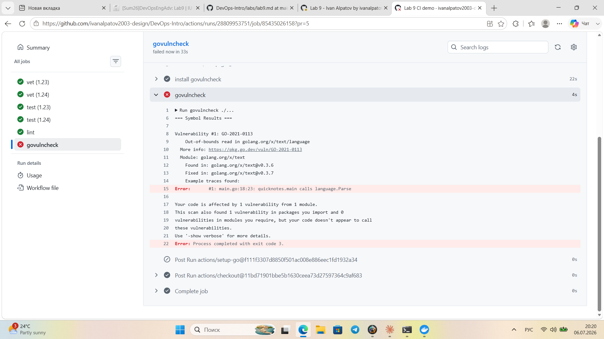
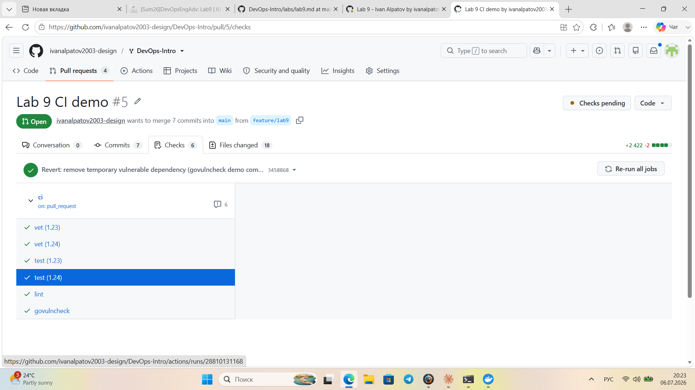

# Lab 9 — DevSecOps: Scan QuickNotes with Trivy + ZAP

**Author:** Ivan Alpatov
**Tools:** Trivy 0.72.0 (pinned), OWASP ZAP `ghcr.io/zaproxy/zaproxy:stable` pinned by digest
`sha256:8d387b1a63e3425beef4846e39719f5af2a787753af2d8b6558c6257d7a577a2` (numbered tags like
`2.16.x` are no longer published upstream; a digest is a stricter pin than a tag anyway — it can't
be moved to point at a different build later).

---

## Task 1 — Trivy: Image + Filesystem + Config + SBOM

### Scans run

```
trivy image quicknotes:lab6 --severity HIGH,CRITICAL
trivy fs . --severity HIGH,CRITICAL
trivy config .
trivy image quicknotes:lab6 --format cyclonedx --output sbom.cyclonedx.json --scanners vuln
```

### 1. Image scan (before fix)

```
Report Summary
+-------------------------------+----------+-----------------+---------+
|            Target             |   Type   | Vulnerabilities | Secrets |
+-------------------------------+----------+-----------------+---------+
| quicknotes:lab6 (debian 13.5) |  debian  |        0        |    -    |
+-------------------------------+----------+-----------------+---------+
| quicknotes                    | gobinary |       11        |    -    |
+-------------------------------+----------+-----------------+---------+
```

11 HIGH findings, all in the Go **standard library** compiled into the static binary
(installed version `v1.24.13`), not in application code or third-party dependencies
(`go.mod` has zero external dependencies). Affected packages: `net/url`, `crypto/x509`,
`crypto/tls`, `net`, `net/http/internal/http2`, `net/mail`.

### 2. Filesystem scan

```
.vagrant/machines/default/virtualbox/private_key (secrets)
HIGH: AsymmetricPrivateKey (private-key)
Total: 1 (HIGH: 1, CRITICAL: 0)
```

Go dependency scan (`app/go.mod`, gomod): 0 findings.

### 3. Config scan

```
app/Dockerfile (dockerfile)
Tests: 27 (SUCCESSES: 26, FAILURES: 1)
DS-0026 (LOW): Add HEALTHCHECK instruction in your Dockerfile
```

Only a LOW finding (below the HIGH/CRITICAL triage threshold this lab requires), noted here for
completeness: the healthcheck is declared at the Compose level (`test: ["CMD", "/quicknotes",
"-healthcheck"]`) rather than inside the Dockerfile itself, which is why this rule doesn't see it.

### 4. Image scan (after fix — see Task 1 disposition below)

```
Report Summary
+-------------------------------+----------+-----------------+---------+
|            Target             |   Type   | Vulnerabilities | Secrets |
+-------------------------------+----------+-----------------+---------+
| quicknotes:lab6 (debian 13.5) |  debian  |        0        |    -    |
+-------------------------------+----------+-----------------+---------+
| quicknotes                    | gobinary |        0        |    -    |
+-------------------------------+----------+-----------------+---------+
```

### Triage table (every HIGH/CRITICAL)

| Finding | Library | Severity | Disposition | Reason |
|---|---|---|---|---|
| CVE-2026-25679 | stdlib net/url | HIGH | **FIX** | IPv6 host-literal parsing bug. Fixed by bumping builder image `golang:1.24-alpine` -> `golang:1.26.4-alpine` (commit in this PR). Re-scan: 0 HIGH. |
| CVE-2026-27145 | stdlib crypto/x509 | HIGH | **FIX** | Same commit — fixed version `1.26.4` matches our new build image exactly. |
| CVE-2026-32280 | stdlib crypto/x509/tls | HIGH | **FIX** | Same commit. |
| CVE-2026-32281 | stdlib crypto/x509 | HIGH | **FIX** | Same commit. |
| CVE-2026-32283 | stdlib crypto/tls | HIGH | **FIX** | Same commit. |
| CVE-2026-33811 | stdlib net | HIGH | **FIX** | Same commit. |
| CVE-2026-33814 | stdlib net/http (http2) | HIGH | **FIX** | Same commit. |
| CVE-2026-39820 | stdlib net/mail | HIGH | **FIX** | Same commit. |
| CVE-2026-39836 | stdlib (ELSA-2026-22121) | HIGH | **FIX** | Same commit. |
| CVE-2026-42499 | stdlib net/mail | HIGH | **FIX** | Same commit. |
| CVE-2026-42504 | stdlib net/mail (MIME) | HIGH | **FIX** | Same commit — highest fixed-version requirement across all 11 CVEs was `1.26.4`, so one bump closes all of them. |
| AsymmetricPrivateKey (secret) | `.vagrant/machines/default/virtualbox/private_key` | HIGH | **ACCEPT** | Vagrant-generated local SSH key for the Lab 5 VM. Verified with `git log --all -- <path>` and `git ls-files \| grep vagrant` — the file has **never** been committed; `.gitignore` has always excluded `.vagrant/`. It exists only on the local disk that generated it, never left the machine or entered version control. Re-evaluate by: **2027-01-06** (6 months) — re-verify `.gitignore` coverage still holds after any Vagrant/CI changes. |

All 11 stdlib CVEs were fixed with a **single change**: bumping the builder stage in
`app/Dockerfile` from `golang:1.24-alpine` to `golang:1.26.4-alpine`. Before/after image scans
(above) confirm 11 HIGH -> 0 HIGH.

### First 30 lines of the CycloneDX SBOM

```json
{
  "$schema": "http://cyclonedx.org/schema/bom-1.7.schema.json",
  "bomFormat": "CycloneDX",
  "specVersion": "1.7",
  "serialNumber": "urn:uuid:bea81b12-f455-4ed1-a6b1-74124b1bc4f2",
  "version": 1,
  "metadata": {
    "timestamp": "2026-07-06T16:14:08+00:00",
    "tools": {
      "components": [
        {
          "type": "application",
          "manufacturer": {
            "name": "Aqua Security Software Ltd."
          },
          "group": "aquasecurity",
          "name": "trivy",
          "version": "0.72.0"
        }
      ]
    },
    "component": {
      "bom-ref": "pkg:oci/quicknotes@sha256:4c659da6f2fb04f244110ee97a94e41e2e34a72789f50791c061f95119e58399?arch=amd64&repository_url=index.docker.io%2Flibrary%2Fquicknotes",
      "type": "container",
      "name": "quicknotes:lab6",
      "purl": "pkg:oci/quicknotes@sha256:4c659da6f2fb04f244110ee97a94e41e2e34a72789f50791c061f95119e58399?arch=amd64&repository_url=index.docker.io%2Flibrary%2Fquicknotes",
      "properties": [
        {
          "name": "aquasecurity:trivy:DiffID",
          "value": "sha256:187cfc6d1e3e8a40a5e64653bcd3239c140807dcf1c09e48021178705a5a6139"
```

### Design questions

**a) Severity is one input, not the answer.**
CVE severity (CVSS base score) describes the theoretical worst case in isolation — it says nothing
about whether *this* deployment can actually be hit. What else matters: **reachability** (is the
vulnerable function ever called by our code, or just sitting unused in a linked package? —
`govulncheck` in the bonus task answers exactly this for Go); **exploit availability** (a HIGH CVE
with a public working PoC is a different risk than a HIGH CVE that's only a theoretical DoS with no
known exploit); **deployment context** (QuickNotes runs as a non-root, read-only, capability-dropped
container behind no public ingress in this lab — a vuln that needs local filesystem write access is
far less relevant here than the same CVE on an internet-facing service running as root); and
**data sensitivity** (a DoS bug on a demo app storing four seed notes is not the same risk as the
same bug on a service holding real user data). Severity narrows the list; triage decides the list.

**b) Distroless as the strongest single control.**
A distroless (or scratch) base ships only the compiled binary and its direct runtime needs — no
shell, no package manager, no libc utilities, no OS-level userland at all. Trivy's OS-layer scan
here came back `0` findings not because Debian 13.5 has zero known CVEs in the abstract, but because
there is almost nothing installed for a CVE to attach to. This also collapses the *attack surface*
after a compromise: even if an attacker gets code execution inside the container, there's no shell to
pivot with, no `curl`/`wget` to exfiltrate through, no package manager to install tools. One image
choice removes an entire category of findings and post-exploitation techniques simultaneously —
that's a stronger lever than patching any single CVE.

**c) `.trivyignore` — legitimate move vs. security theater.**
Legitimate: a documented, dated, re-evaluated **ACCEPT** or **FALSE POSITIVE** — exactly like the
private-key finding above, where the reasoning is written down, verifiable (`git log` proof), and
has a re-check date. Security theater: suppressing a HIGH/CRITICAL with no reasoning, no date, and
no plan to ever revisit it — at that point `.trivyignore` isn't documenting a risk decision, it's
hiding the finding from the next scan run so the report looks clean. The test is whether the
suppression could survive being read by someone who wasn't in the room when it was written.

**d) What SBOM solves *before* you need it.**
An SBOM turns "are we affected by CVE-X?" from a days-long fire-drill into a single query. During
Log4Shell (December 2021), most organizations' first days were spent just *finding out* which of
their systems even had Log4j embedded — often three or four dependency layers deep, bundled inside
other libraries — before anyone could start patching. A CycloneDX SBOM generated ahead of time means
that question is a `grep` or a purl lookup against an already-generated document, not an emergency
inventory project. The SBOM we generated here already lists every OS package and Go stdlib version
baked into `quicknotes:lab6`; if a new CVE in `crypto/tls` drops tomorrow, checking exposure is
instant instead of requiring a fresh scan and a scramble.

---

## Task 2 — OWASP ZAP Baseline + Fix

### Run

```
docker run --rm --network devops-intro_default -v "${PWD}:/zap/wrk/:rw" \
  ghcr.io/zaproxy/zaproxy:stable \
  zap-baseline.py -t http://quicknotes:8080 -r zap-baseline-report.html -J zap-baseline-report.json
```

### Before fix

```
Total of 3 URLs
[... 66 PASS rules ...]
WARN-NEW: Storable and Cacheable Content [10049] x 2
        http://quicknotes:8080 (404 Not Found)
        http://quicknotes:8080/sitemap.xml (404 Not Found)
FAIL-NEW: 0     FAIL-INPROG: 0  WARN-NEW: 1     WARN-INPROG: 0  INFO: 0 IGNORE: 0       PASS: 66
Automation plan warnings:
        Job spider error accessing URL http://quicknotes:8080 status code returned : 404 expected 200
```

### After fix

```
Total of 3 URLs
[... 66 PASS rules ...]
WARN-NEW: Non-Storable Content [10049] x 2
        http://quicknotes:8080 (404 Not Found)
        http://quicknotes:8080/robots.txt (404 Not Found)
FAIL-NEW: 0     FAIL-INPROG: 0  WARN-NEW: 1     WARN-INPROG: 0  INFO: 0 IGNORE: 0       PASS: 66
Automation plan warnings:
        Job spider error accessing URL http://quicknotes:8080 status code returned : 404 expected 200
```

### Triage table

| ID | Name | Risk | Affected URL | Disposition | Reason |
|---|---|---|---|---|---|
| 10049 | Storable and Cacheable Content (before fix) | WARN | `http://quicknotes:8080`, `/sitemap.xml` | **FIX** | No `Cache-Control` header on responses (including 404s), so intermediaries could store/replay them. Fixed with `noStoreCache` middleware (see below). |
| 10049 | Non-Storable Content (after fix) | WARN | `http://quicknotes:8080`, `/robots.txt` | **FALSE POSITIVE** | `zap-baseline.py` reports *every* fired alert as WARN by default regardless of the alert's actual risk level. "Non-Storable Content" is ZAP's own confirmation that `Cache-Control: no-store` is now present — it's describing the fixed state, not a new problem. |
| — | Spider 404 on `/` | n/a (automation-plan warning, not a scan alert) | `http://quicknotes:8080` | **ACCEPT** | QuickNotes is a pure JSON API with no route registered on `/` — a 404 there is correct behavior, not a missing page. The spider has nothing to crawl past the root by design. |
| 66 PASS rules (CSP, X-Content-Type-Options, HSTS, clickjacking, etc.) | — | PASS | all endpoints | **ACCEPT (context)** | Not all of these PASS because a header is actually set — several HTML/browser-oriented checks are skipped by ZAP entirely for a JSON API response (no `text/html` content-type to evaluate). Recorded here so the PASS count isn't mistaken for "every browser security header is configured." |

### The fix

**Requirement:** middleware wrapping the router (not per-handler calls), applied to all routes,
guarded by a unit test that fails without it.

`app/handlers.go` diff:

```diff
-func (s *Server) Routes() *http.ServeMux {
+func (s *Server) Routes() http.Handler {
 	mux := http.NewServeMux()
 	mux.HandleFunc("GET /health", s.wrap(s.handleHealth))
 	mux.HandleFunc("GET /metrics", s.wrap(s.handleMetrics))
 	mux.HandleFunc("GET /notes", s.wrap(s.handleListNotes))
 	mux.HandleFunc("POST /notes", s.wrap(s.handleCreateNote))
 	mux.HandleFunc("GET /notes/{id}", s.wrap(s.handleGetNote))
 	mux.HandleFunc("DELETE /notes/{id}", s.wrap(s.handleDeleteNote))
-	return mux
+	return noStoreCache(mux)
+}
+
+func noStoreCache(next http.Handler) http.Handler {
+	return http.HandlerFunc(func(w http.ResponseWriter, r *http.Request) {
+		w.Header().Set("Cache-Control", "no-store")
+		next.ServeHTTP(w, r)
+	})
 }
```

The middleware wraps the *entire* `mux`, not individual handlers — this matters because Go's
`http.ServeMux` serves its own built-in 404 for unregistered paths (like `/`) *before* any
per-handler middleware (`s.wrap`) would ever run. Wrapping only registered handlers would have left
every 404 response (exactly what ZAP flagged) uncovered.

`app/handlers_test.go` — new test:

```go
func TestNoStoreCache_AppliesToAllResponses(t *testing.T) {
	srv := newTestServer(t)

	// Registered route (200 OK)
	rec := do(t, srv, http.MethodGet, "/health", nil)
	if got := rec.Header().Get("Cache-Control"); got != "no-store" {
		t.Errorf("GET /health: Cache-Control = %q, want %q", got, "no-store")
	}

	// Unregistered route (mux 404) - the path ZAP flagged
	rec = do(t, srv, http.MethodGet, "/", nil)
	if rec.Code != http.StatusNotFound {
		t.Fatalf("GET /: status = %d, want %d", rec.Code, http.StatusNotFound)
	}
	if got := rec.Header().Get("Cache-Control"); got != "no-store" {
		t.Errorf("GET / (404): Cache-Control = %q, want %q", got, "no-store")
	}
}
```

**Proof the test is guarded** (temporarily reverted `return noStoreCache(mux)` -> `return mux`):

```
=== RUN   TestNoStoreCache_AppliesToAllResponses
    handlers_test.go:141: GET /health: Cache-Control = "", want "no-store"
    handlers_test.go:152: GET / (404): Cache-Control = "", want "no-store"
--- FAIL: TestNoStoreCache_AppliesToAllResponses (0.00s)
FAIL
```

Full suite after restoring the fix — all 12 tests pass, nothing else broken:

```
=== RUN   TestHealth_ReportsCount
--- PASS: TestHealth_ReportsCount (0.00s)
=== RUN   TestCreateNote_RoundTrip
--- PASS: TestCreateNote_RoundTrip (0.00s)
=== RUN   TestCreateNote_RejectsEmptyTitle
--- PASS: TestCreateNote_RejectsEmptyTitle (0.00s)
=== RUN   TestCreateNote_RejectsUnknownField
--- PASS: TestCreateNote_RejectsUnknownField (0.00s)
=== RUN   TestGetNote_NotFound
--- PASS: TestGetNote_NotFound (0.00s)
=== RUN   TestDeleteNote_RemovesAndReturns204
--- PASS: TestDeleteNote_RemovesAndReturns204 (0.00s)
=== RUN   TestMetrics_ExposesPrometheusFormat
--- PASS: TestMetrics_ExposesPrometheusFormat (0.00s)
=== RUN   TestNoStoreCache_AppliesToAllResponses
--- PASS: TestNoStoreCache_AppliesToAllResponses (0.00s)
=== RUN   TestStore_CreateAndGet
--- PASS: TestStore_CreateAndGet (0.00s)
=== RUN   TestStore_NextIDIncrements
--- PASS: TestStore_NextIDIncrements (0.00s)
=== RUN   TestStore_Delete
--- PASS: TestStore_Delete (0.00s)
=== RUN   TestStore_PersistsAcrossReload
--- PASS: TestStore_PersistsAcrossReload (0.00s)
PASS
ok      quicknotes      0.012s
```

### Design questions

**e) Why middleware, not per-handler header sets.**
A per-handler approach means every new route someone adds is a place the header can silently be
forgotten — the compiler won't catch a missing `w.Header().Set(...)` line, and neither will code
review reliably, six routes and three PRs from now. Middleware wrapping the router makes the header
a property of *the transport*, not of each handler's discipline: it's structurally impossible for a
new route to skip it, because the wrapping happens once, outside and independent of individual
handler logic. It's also why we wrapped the whole `mux` rather than each `s.wrap(...)` call — the
built-in 404 path (which ZAP actually flagged) isn't a "handler" in the app's own code at all, so
only a router-level middleware could reach it.

**f) `Content-Security-Policy: default-src 'none'`.**
This CSP directive blocks loading *any* resource by default from *any* source unless a more specific
directive overrides it — no scripts, no stylesheets, no images, no fonts, no XHR/fetch targets, no
frames, nothing. For a real website this is normally too strict out of the box: it would break inline
`<script>` tags, third-party analytics, web fonts, CDN-hosted libraries, and any `fetch()` call to
another origin — sites need a carefully allowlisted CSP (`script-src 'self' https://cdn...`, etc.),
not a blanket `none`. For QuickNotes it's fine precisely because it's a pure JSON API with no HTML
templates, no client-side script, no images to render — there is nothing on the response side of
this service that a browser would ever be asked to load in the first place, so the strictest possible
policy costs nothing and forecloses an entire class of content-injection risk.

**g) Cost of blanket-accepting informational findings.**
Marking every ZAP-flagged item "accepted" without reading it defeats the point of running the scanner
at all — we saw this directly in our own re-scan, where the post-fix "Non-Storable Content" alert
*looks* identical in form to a real problem (same rule ID, same WARN label) but actually confirms the
fix worked. A team that reflexively accepts everything would either (a) waste a triage cycle
re-investigating something already fixed, or worse (b) develop the habit of accepting real findings
alongside the noise because "ZAP always has a WARN or two, that's normal." The discipline this lab
asks for — a reason per finding, not a blanket status — is what prevents alert fatigue from
silently swallowing an actual security regression.

---

## Bonus — `govulncheck` as a CI PR Gate

### Job added to Lab 3 CI (`.github/workflows/ci.yml`)

```yaml
  govulncheck:
    name: govulncheck
    runs-on: ubuntu-24.04
    steps:
      - uses: actions/checkout@11bd71901bbe5b1630ceea73d27597364c9af683 # v4.2.2
        with:
          fetch-depth: 1
      - uses: actions/setup-go@f111f3307d8850f501ac008e886eec1fd1932a34 # v5.3.0
        with:
          go-version: "1.26.4"
          cache: true
          cache-dependency-path: app/go.mod
      - name: install govulncheck
        run: go install golang.org/x/vuln/cmd/govulncheck@v1.4.0
      - name: govulncheck
        working-directory: app
        run: govulncheck ./...
```

Pinned scanner version `v1.4.0` (not `@latest`). The Go toolchain used to run the check is `1.26.4`
— deliberately *not* matched to the `vet`/`test` matrix (`1.23`/`1.24`), because this job's purpose
is scanning the same Go version that actually ships in the production image (`app/Dockerfile`'s
builder stage), not testing source-level compatibility across Go versions.

### Unplanned first finding — a real toolchain drift, caught immediately

The job was first wired up with `go-version: "1.24"` to match the rest of CI. On the very first run
it went **red** — not from a staged example, but from a genuine mismatch: CI was scanning against
`go1.24.13` while the production Dockerfile had already been bumped to `golang:1.26.4-alpine` (Task 1
fix). `govulncheck` found 8 reachable stdlib CVEs with concrete call traces, e.g.:

```
Vulnerability #2: GO-2026-5037
    Inefficient candidate hostname parsing in crypto/x509
    Found in: crypto/x509@go1.24.13   Fixed in: crypto/x509@go1.25.11
    #1: main.go:37:31: quicknotes.main calls http.Server.ListenAndServe, which eventually calls x509.Certificate.Verify
```

Fixed by pointing the job's `go-version` at `1.26.4` (same commit history as this PR) — this is
itself a live demonstration of the tool doing its job: it caught a real drift between "what we scan"
and "what we ship" before it could hide a false sense of security.

### Deliberate red -> green demonstration

To satisfy B.2.5 explicitly, a known-vulnerable dependency was introduced on top of the (by-then
clean) state:

1. Added `golang.org/x/text v0.3.6` to `app/go.mod` and a reachable call `language.Parse("en-US")` in
   `main()`. This version carries **GO-2021-0113** (out-of-bounds read in BCP 47 tag parsing).
2. Verified locally first: `govulncheck ./...` reported the vulnerability with an exact trace
   (`main.go:18:23: quicknotes.main calls language.Parse`), fixed in `v0.3.7`.
3. Pushed to a demo PR (`ivanalpatov2003-design/DevOps-Intro#5`, opened against my own fork's `main`
   since the upstream course repo does not run Actions for external-fork PRs — see below). CI's
   `govulncheck` job went **red**, all other jobs (`vet`, `test`, `lint`) stayed green — the security
   gate failed in isolation, exactly as intended:

```
govulncheck — failed now in 33s
=== Symbol Results ===
Vulnerability #1: GO-2021-0113
    Out-of-bounds read in golang.org/x/text/language
    Module: golang.org/x/text
    Found in: golang.org/x/text@v0.3.6   Fixed in: golang.org/x/text@v0.3.7
    Example traces found:
      #1: main.go:18:23: quicknotes.main calls language.Parse
Your code is affected by 1 vulnerability from 1 module.
Error: Process completed with exit code 3.
```



4. Reverted `main.go` and `go.mod` to their prior clean state, pushed again. CI returned to **green**
   across all 6 checks (`vet` x2, `test` x2, `lint`, `govulncheck`).



*Note on where this ran:* `inno-devops-labs/DevOps-Intro` does not trigger Actions runs for pull
requests opened from external forks (confirmed: zero `ci` workflow runs appear under the repo's own
Actions tab for PR #1350, only an unrelated `Copilot code review` workflow). To get a real CI
execution for this red/green demonstration, the same branch was also opened as a PR against my own
fork's `main` (`ivanalpatov2003-design/DevOps-Intro#5`), where `pull_request` correctly triggers the
workflow. The `govulncheck` job itself is identical either way — only the repo triggering it differs.

### Design questions

**h) Reachability vs. presence.**
"This module has a CVE" (Trivy's module-presence view) and "this module has a CVE *and my code calls
the affected function*" (govulncheck's reachability view) are very different triage inputs. A module
can sit in `go.mod` for one small helper function while carrying a CVE in a completely unrelated part
of its API surface that the project never touches — that's a CVE with zero actual exposure. Our own
scan is a live example: `govulncheck` reported the app affected by 1 vulnerability it actually calls,
but *also* found "4 vulnerabilities in packages you import and 8 vulnerabilities in modules you
require" that the code doesn't call — those don't even make it into the failing "Symbol Results"
section. Without reachability, every one of those 12 non-reachable findings would need the same
manual triage effort as the one that actually matters, multiplying investigation workload for
findings that carry no real risk. Reachability turns "how many CVEs does this dependency tree have"
into "how many of them can actually hurt us" — a much smaller and more actionable number.

**i) Why pin the scanner version, not just `@latest`.**
A vulnerability *database* update (new CVEs added) should change what govulncheck reports — that's
the whole point of running it regularly. But a *scanner tool version* update can change reachability
analysis behavior, output format, or exit-code semantics between releases, silently altering what
counts as a CI failure without anyone touching application code. `@latest` in a CI gate means the
gate's pass/fail criteria can shift on a schedule you don't control — a run that was green yesterday
could turn red today purely because the tool itself changed, with no code change to investigate. The
same discipline that applies to pinning `prom/prometheus` or `grafana/grafana` images in Lab 8 applies
here: pin the tool, let the vulnerability *data* stay current (it's fetched live from vuln.go.dev on
every run regardless of scanner version), and upgrade the scanner version deliberately, in its own
reviewed commit.

**j) What govulncheck misses that Trivy's image scan catches.**
`govulncheck` only understands the Go module graph and Go source/binary symbols — it has no idea the
container exists. Trivy's image scan additionally covers everything govulncheck structurally cannot
see: **OS package vulnerabilities** in the base image's Debian/Alpine layer (though in our distroless
case that layer is empty by design — see Task 1 design question b); **secrets accidentally baked into
the image** (an API key in an env var or a leftover credential file); **IaC/config misconfigurations**
in the Dockerfile or Compose file itself (the `config` scan's job, not `govulncheck`'s); and
vulnerabilities in **non-Go artifacts** shipped in the same image (a vendored binary, a static asset,
a `seed.json` with unexpected content). The two tools are complementary by design: govulncheck is a
precise, reachability-aware scalpel for the Go dependency graph specifically; Trivy is the broader
sweep across everything else that ends up inside the shipped container.
