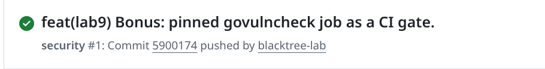
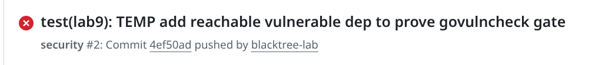
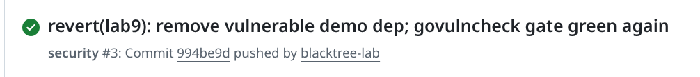

# Lab 9 Submission - DevSecOps: Scan QuickNotes with Trivy + ZAP

> Trivy 0.71.2 (pinned, not `:latest`) · OWASP ZAP `ghcr.io/zaproxy/zaproxy:2.16.1`

---

## Task 1 - Trivy: Image + Filesystem + Config + SBOM

### 1.1 Image scan (before fix)

```text
$ trivy image --severity HIGH,CRITICAL quicknotes:lab6
┌───────────────────────────────┬──────────┬─────────────────┬─────────┐
│            Target             │   Type   │ Vulnerabilities │ Secrets │
├───────────────────────────────┼──────────┼─────────────────┼─────────┤
│ quicknotes:lab6 (debian 13.5) │  debian  │        0        │    -    │
│ healthcheck                   │ gobinary │       11        │    -    │
│ quicknotes                    │ gobinary │       11        │    -    │
└───────────────────────────────┴──────────┴─────────────────┴─────────┘
```
All 22 are Go **stdlib 1.24.13** HIGH CVEs (DoS-class, all `fixed` in ≥1.25.11):
`CVE-2026-25679, -27145, -32280, -32281, -32283, -33811, -33814, -39820, -39836, -42499, -42504` (identical set on both gobinaries).

### 1.2 Filesystem scan

```text
$ trivy fs --severity HIGH,CRITICAL .
│ app/go.mod                                       │ gomod │  0  │  -  │
│ .vagrant/machines/default/virtualbox/private_key │ text  │  -  │  1  │

.vagrant/.../private_key: HIGH  AsymmetricPrivateKey (private-key)
```
`app/go.mod`: 0 vulns (pure stdlib, no third-party deps).

### 1.3 Config scan

```text
$ trivy config .
app/Dockerfile (dockerfile)  Tests: 27 (SUCCESSES: 26, FAILURES: 1)
DS-0026 (LOW): Add HEALTHCHECK instruction in your Dockerfile
```
Only a single LOW; no HIGH/CRITICAL misconfig.

### 1.4 SBOM (CycloneDX, first lines)

```text
$ trivy image --format cyclonedx --output quicknotes.cdx.json quicknotes:lab6
{
  "$schema": "http://cyclonedx.org/schema/bom-1.7.schema.json",
  "bomFormat": "CycloneDX",
  "specVersion": "1.7",
  "metadata": {
    "tools": { "components": [ { "name": "trivy", "version": "0.71.2" } ] },
    "component": {
      "type": "container",
      "name": "quicknotes:lab6",
      "purl": "pkg:oci/quicknotes@sha256:8d513dfed171..."
    }
  }
}
```

### 1.5 Triage table (every HIGH/CRITICAL)

| Finding | Scan | Severity | Disposition | Reasoning / evidence |
|---------|------|----------|-------------|----------------------|
| 22× Go stdlib CVEs (`1.24.13`), both gobinaries | image | HIGH | **FIX** | Bumped Dockerfile `golang:1.24-alpine -> golang:1.25-alpine` (≥1.25.11 fixes all); rebuild -> **0 HIGH** (see 1.6). |
| `AsymmetricPrivateKey` - `.vagrant/.../private_key` | fs | HIGH | **ACCEPT** | Vagrant per-VM insecure SSH key; **gitignored**, never in git history or the image; local-only. Re-eval: keep `.vagrant/` ignored; add `--skip-dirs .vagrant` in CI. Date: 2026-12. |
| `app/go.mod` dependency CVEs | fs | - | n/a | 0 findings (pure stdlib). |
| DS-0026 (Dockerfile `HEALTHCHECK`) | config | LOW | **ACCEPT** | Below HIGH/CRITICAL; healthcheck is defined at the **compose** layer (`/healthcheck` binary), not the Dockerfile. |

### 1.6 FIX evidence (image re-scan after Go bump)

```text
$ trivy image --severity HIGH,CRITICAL quicknotes:lab6
│ quicknotes:lab6 (debian 13.5) │  debian  │  0  │  -  │
│ healthcheck                   │ gobinary │  0  │  -  │
│ quicknotes                    │ gobinary │  0  │  -  │
```
22 HIGH -> **0**.

### 1.7 Design Questions

**a) CVE severity is one input - what else matters?**
- **Reachability** - does our code actually call the vulnerable function on the affected path? (These stdlib DoS CVEs live in TLS/x509/`net/mail` paths that a plain HTTP JSON API barely exercises.)
- **Exploit availability/maturity** - public PoC? actively exploited (CISA KEV)? A CRITICAL with no exploit can rank below a HIGH being exploited in the wild.
- **Deployment context** - is the component exposed to untrusted/internet input, behind auth, is the feature even enabled?
- **Impact type & data sensitivity** - DoS vs RCE vs info-disclosure; what data is at risk.
- **Fix cost** - here it was a one-line Go bump, so "FIX" beat "ACCEPT" easily.
CVSS is a generic base score; real risk = severity × reachability × exploitability × context.

**b) Why is the minimal base the strongest single control?**
Distroless `static` has ~5 OS packages and **no shell, package manager, or libc/utilities**. That removes whole *classes* of problems at once: fewer components means fewer CVEs to patch, and no shell/curl means an attacker who gains RCE has nothing to pivot with (can't spawn `sh`, can't pull a payload). Our debian base scanned **0** - every finding was in *our* Go binaries, not the base. One choice eliminates most of the OS attack surface and most post-exploitation, for free.

**c) When is `.trivyignore` right vs theater?**
Right: a **documented, dated, reasoned** acceptance - a true false positive, an unreachable finding, or one with no upstream fix yet (WATCH) - recorded with *why* and *when to re-check*. It keeps the signal clean so genuinely new findings stand out. Theater: silencing findings you just don't want to deal with, no reasoning, no expiry - that's hiding risk to make the dashboard green. Every suppression must carry a justification and a re-evaluation date.

**d) What future problem does the SBOM solve? (Log4Shell)**
When the next Log4Shell-class CVE drops, the first question is "am I affected, and where?" With an SBOM - a machine-readable inventory of every component + version - you answer in seconds across all services (`grype sbom:quicknotes.cdx.json`). Without it you're manually grepping build files and reverse-engineering images under time pressure while attackers scan. Generating it now (stored with the artifact) means the inventory exists *before* you need it.

---

## Task 2 - OWASP ZAP Baseline + Fix

### 2.1 Baseline scan (before)

Targeting a 200 endpoint (`/notes`) so passive rules evaluate a real response (the root `/` is 404 - no `GET /` route):

```text
$ zap-baseline.py -t http://127.0.0.1:8080/notes ...
WARN-NEW: X-Content-Type-Options Header Missing [10021] x 1   (/notes 200)
WARN-NEW: Storable and Cacheable Content [10049] x 4          (/, /notes, robots, sitemap)
WARN-NEW: ZAP is Out of Date [10116] x 1
WARN-NEW: Insufficient Site Isolation Against Spectre [90004] x 1  (/notes 200)
FAIL-NEW: 0   WARN-NEW: 4   PASS: 63
```

### 2.2 Triage table

| ZAP ID | Finding | Risk | URL | Disposition | Action |
|--------|---------|------|-----|-------------|--------|
| 10021 | X-Content-Type-Options Header Missing | Low | `/notes` 200 | **FIX** | middleware `X-Content-Type-Options: nosniff` |
| 90004 | Insufficient Site Isolation (Spectre) | Low | `/notes` 200 | **FIX** | middleware `Cross-Origin-Resource-Policy: same-origin` |
| 10049 | Storable and Cacheable Content | Info | `/`, `/notes`, `/robots.txt`, `/sitemap.xml` | **FIX** | middleware `Cache-Control: no-store` |
| 10116 | ZAP is Out of Date | Info | - | **FALSE POSITIVE** | ZAP's own version self-report, not a QuickNotes defect |

### 2.3 Fix - security-headers middleware (`app/middleware.go`)

```go
func securityHeaders(next http.Handler) http.Handler {
      return http.HandlerFunc(func(w http.ResponseWriter, r *http.Request) {
              h := w.Header()
              h.Set("X-Content-Type-Options", "nosniff")
              h.Set("Content-Security-Policy", "default-src 'none'; frame-ancestors 'none'")
              h.Set("X-Frame-Options", "DENY")
              h.Set("Cross-Origin-Resource-Policy", "same-origin")
              h.Set("Cross-Origin-Opener-Policy", "same-origin")
              h.Set("Cache-Control", "no-store")
              h.Set("Referrer-Policy", "no-referrer")
              next.ServeHTTP(w, r)
      })
}
```
Wired once around the whole mux in `Routes()`: `return securityHeaders(mux)` - so it applies to **all** routes.

Guarded by a unit test (`app/middleware_test.go`) that fails if the middleware is removed:
```go
func TestSecurityHeaders_PresentOnAllRoutes(t *testing.T) {
      srv := newTestServer(t)
      rec := do(t, srv, http.MethodGet, "/notes", nil)
      // asserts X-Content-Type-Options=nosniff, Cross-Origin-Resource-Policy=same-origin,
      // Cache-Control=no-store, and a non-empty Content-Security-Policy
}
```
```text
$ go test ./...
ok  quicknotes
```

### 2.4 Re-scan (after) - findings gone

```text
$ curl -sI http://127.0.0.1:8080/notes
X-Content-Type-Options: nosniff
Cache-Control: no-store
Cross-Origin-Resource-Policy: same-origin
Content-Security-Policy: default-src 'none'; frame-ancestors 'none'
...

$ zap-baseline.py -t http://127.0.0.1:8080/notes ...
PASS: X-Content-Type-Options Header Missing [10021]                  <-- was WARN
PASS: Insufficient Site Isolation Against Spectre [90004]            <-- was WARN
WARN-NEW: Non-Storable Content [10049] x 4     <-- 10049 flipped: no-store now confirmed
WARN-NEW: ZAP is Out of Date [10116] x 1       <-- FALSE POSITIVE (tool self-report)
FAIL-NEW: 0   WARN-NEW: 2   PASS: 65
```
`10021` and `90004` now **PASS**; `10049` flipped from "Storable and Cacheable" (the risk) to "Non-Storable Content" (ZAP confirming `no-store` works). WARN-NEW 4 -> 2.

### 2.5 Design Questions

**e) Why middleware, not per-handler header sets?**
One wrapper guarantees the headers on **every** route - including 404s and any future endpoint - with nothing forgotten (the one handler you forget is the hole). It's DRY (one place to change policy), keeps handlers focused on business logic (separation of concerns), and is guarded by a single test that covers all routes. Per-handler `Header().Set` is duplicated, easy to miss, and untestable as a whole.

**f) `Content-Security-Policy: default-src 'none'` - what breaks, why OK for an API?**
`default-src 'none'` forbids the browser from loading *any* resource (scripts, styles, images, fonts, XHR, frames) for that document. QuickNotes is a **JSON API with no HTML UI** - there's nothing to load, and its clients (curl/fetch) ignore CSP - so nothing breaks. On a **website** it would break everything: no CSS/JS/images would load and the page renders blank. A real site needs a CSP that *allowlists* exactly the sources it uses; an API can safely use the strictest possible policy because it serves no renderable content.

**g) Cost of marking all informational findings "accepted" without reading them?**
You blanket-dismiss the real issue hiding in the noise, and you defeat the point of triage - it's the same as not scanning, but with a false paper trail that *looks* like due diligence to an auditor. It also poisons the baseline: future "no new findings" comparisons can't be trusted because the baseline is full of unread accepts. Each finding should be read once and dispositioned with a reason - even "informational, N/A because X" is a real decision.

---

## Bonus Task - govulncheck CI gate

### B.1 CI workflow (`.github/workflows/security.yml`)

```yaml
name: security
on:
  push:
  pull_request:
permissions:
  contents: read
jobs:
  govulncheck:
    name: govulncheck (Go SCA, reachability)
    runs-on: ubuntu-latest
    steps:
      - uses: actions/checkout@v4
      - uses: actions/setup-go@v5
        with:
          go-version: "1.25"
          cache: false
      - name: Install govulncheck
        run: go install golang.org/x/vuln/cmd/govulncheck@v1.1.4   # pinned, not @latest
      - name: Run govulncheck against app/
        working-directory: app
        run: govulncheck ./...
```
The job is its own status check; a non-zero `govulncheck` exit fails it and blocks the PR.

### B.2 Demonstration - green -> red -> green

| Run | Commit | Change | Result |
|-----|--------|--------|--------|
| `security #1` | `5900174` | baseline (clean, stdlib-only) | green |
| `security #2` | `4ef50ad` | added `x/text@v0.3.0` + reachable `language.ParseAcceptLanguage` call | **red** |
| `security #3` | `994be9d` | reverted the vulnerable dep | green |





Local proof the gate catches a **reachable** vuln (same as CI):
```text
$ go run golang.org/x/vuln/cmd/govulncheck@v1.1.4 ./...
Vulnerability #1: GO-2022-1059  (Denial of service via crafted Accept-Language header)
    Found in: golang.org/x/text@v0.3.0   Fixed in: golang.org/x/text@v0.3.8
      #1: vuln_demo.go:14:40: quicknotes.init#1 calls language.ParseAcceptLanguage
Vulnerability #2: GO-2021-0113  (Out-of-bounds read in golang.org/x/text/language)
    Found in: golang.org/x/text@v0.3.0   Fixed in: golang.org/x/text@v0.3.7
      #1: vuln_demo.go:14:40: quicknotes.init#1 calls language.ParseAcceptLanguage
Your code is affected by 2 vulnerabilities from 1 module.
... (exit status 3)
```
Note govulncheck also reported "1 vulnerability in modules you require, but your code doesn't appear to call" - it did **not** fail on that one (unreachable), which is the whole point of reachability.

### B.3 Design Questions

**h) Reachability - "has a CVE" vs "we call the affected function", and the triage-workload impact.**
Generic SCA (Trivy) flags a CVE whenever the vulnerable **module is present** in your dependency tree, regardless of whether your code ever calls the affected function. govulncheck does **call-graph analysis** and only reports a vuln when a vulnerable **symbol is reachable** from your code. Module-presence produces long lists dominated by findings in code paths you never execute - each needs manual "are we actually exploitable?" investigation -> high, mostly-noise triage workload. Reachability pre-filters to the ones your code truly reaches -> you triage a handful of real issues and can confidently defer the rest (the tool proved they're not called). Our demo showed both sides: it failed on the 2 reachable vulns and explicitly did *not* fail on the 1 require-only, unreachable one.

**i) Why pin the *scanner* version, not `@latest`?**
Reproducibility and determinism. `@latest` means CI (or a teammate) may silently run a different govulncheck with different logic, so a build that passed yesterday can fail today for reasons unrelated to your code. Pinning `@v1.1.4` makes the gate deterministic and makes scanner upgrades a deliberate, reviewed change (bump the pin in a PR, see what new findings appear). It also guards against a regressed release breaking CI and against pulling an unexpected version (supply-chain hygiene). The vulnerability **database** still updates continuously - pinning the *tool* but not the *data* is the right balance: stable tool behavior, fresh vuln data.

**j) govulncheck only knows Go - what won't it catch that Trivy would?**
It only analyzes Go code + the Go vuln DB, so it misses: **OS-package CVEs** in the base image (glibc/openssl/Debian libs - Trivy image scan reads the OS package DB); **non-Go dependencies** (Python/npm/Java bundled in the image); **image misconfigurations** (running as root, missing `USER`, no drop-caps - Trivy config); and **secrets** baked into files/layers (Trivy secret scan). They're complementary: govulncheck is deep, reachability-aware, Go-only; Trivy is broad - whole image, multi-language, misconfig, secrets - but module-presence, not reachability. Use both (layered defense).