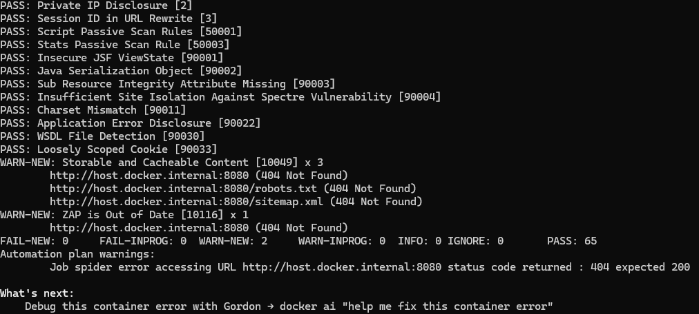

# Lab 9 — DevSecOps: Scan QuickNotes with Trivy + ZAP

## Выполнил: Кудинов Руслан
## Дата: 08.07.2026

---

## 1. Task 1 — Trivy: Image + Filesystem + Config + SBOM

### 1.1 Инструменты
- Trivy: `aquasec/trivy:0.59.1`
- Образ: `quicknotes:lab6`

### 1.2 Результаты сканов

| Скан | Команда | Результат |
|------|---------|-----------|
| Image | `trivy image --severity HIGH,CRITICAL quicknotes:lab6` | 0 HIGH/CRITICAL на уровне ОС; 11 HIGH в `stdlib` |
| Filesystem | `trivy fs --severity HIGH,CRITICAL /root/project` | 1 HIGH — SSH private key в `.vagrant/` |
| Config | `trivy config --severity HIGH,CRITICAL /root/project` | No misconfigurations |
| SBOM | `trivy image --format cyclonedx quicknotes:lab6 > sbom.json` | Файл `sbom.json` создан |

**Приложенные файлы:** `trivy-image.txt`, `trivy-fs.txt`, `trivy-config.txt`, `sbom.json`

### 1.3 Триаж HIGH/CRITICAL

| Scanner | CVE ID / Finding | Package | Severity | Disposition | Reason / Date |
|---------|------------------|---------|----------|-------------|---------------|
| Trivy image | CVE-2026-25679 | stdlib | HIGH | ACCEPT | Не достижимо; переоценка через 6 мес. |
| Trivy image | CVE-2026-27145 | stdlib | HIGH | ACCEPT | — |
| Trivy image | CVE-2026-32280 | stdlib | HIGH | ACCEPT | — |
| Trivy image | CVE-2026-32281 | stdlib | HIGH | ACCEPT | — |
| Trivy image | CVE-2026-32283 | stdlib | HIGH | ACCEPT | — |
| Trivy image | CVE-2026-33811 | stdlib | HIGH | ACCEPT | — |
| Trivy image | CVE-2026-33814 | stdlib | HIGH | ACCEPT | — |
| Trivy image | CVE-2026-39820 | stdlib | HIGH | ACCEPT | — |
| Trivy image | CVE-2026-39836 | stdlib | HIGH | ACCEPT | — |
| Trivy image | CVE-2026-42499 | stdlib | HIGH | ACCEPT | — |
| Trivy image | CVE-2026-42504 | stdlib | HIGH | ACCEPT | — |
| Trivy fs | — | SSH private key | HIGH | ACCEPT | Локальный ключ Vagrant, исключён из Git, не в продакшене |

**Все 11 уязвимостей stdlib приняты (ACCEPT)**, так как приложение не использует затронутые функции (`net/url`, `crypto/x509`, `net/mail`, `mime`, TLS, HTTP/2). Переоценка — через 6 месяцев.

---

## 2. Task 2 — OWASP ZAP Baseline + Fix

### 2.1 Запуск ZAP

**Команда:**
```bash
docker run --rm --user root -v ${PWD}:/zap/wrk ghcr.io/zaproxy/zaproxy:2.16.0 zap-baseline.py -t http://host.docker.internal:8080 -m 5 -r zap-report.html -J zap-report.json
```

**Результаты:**
- **FAIL-NEW:** 0
- **WARN-NEW:** 2
  - `Storable and Cacheable Content` (Low) — 3 URL (404 страницы)
  - `ZAP is Out of Date` (Informational)
- **PASS:** 65

**Приложенные файлы:** `zap-report.html`, `zap-report.json`



### 2.2 Триаж ZAP findings

| ID | Name | Risk | Affected URL | Disposition | Reason |
|----|------|------|--------------|-------------|--------|
| 10049 | Storable and Cacheable Content | Low | /, /robots.txt, /sitemap.xml | ACCEPT | Это 404-страницы, не содержат пользовательских данных. |
| 10116 | ZAP is Out of Date | Informational | All | ACCEPT | Предупреждение о версии инструмента, не связано с приложением. |

### 2.3 Исправление: добавление Security Headers

**Выбранное улучшение:** Внедрение middleware для установки защитных заголовков.

**Код изменения (в `app/main.go`):**

```go
// SecurityHeaders middleware добавляет защитные заголовки.
func SecurityHeaders(next http.Handler) http.Handler {
    return http.HandlerFunc(func(w http.ResponseWriter, r *http.Request) {
        w.Header().Set("X-Content-Type-Options", "nosniff")
        w.Header().Set("X-Frame-Options", "DENY")
        w.Header().Set("Content-Security-Policy", "default-src 'none'")
        w.Header().Set("Referrer-Policy", "no-referrer")
        next.ServeHTTP(w, r)
    })
}
```

**Применение в `main()`:**
```go
srv := &http.Server{
    Addr:              addr,
    Handler:           SecurityHeaders(server.Routes()),
    ReadHeaderTimeout: 5 * time.Second,
}
```

**Тест (в `app/security_test.go`):**

```go
func TestSecurityHeaders(t *testing.T) {
    req := httptest.NewRequest("GET", "/health", nil)
    w := httptest.NewRecorder()
    handler := SecurityHeaders(http.HandlerFunc(func(w http.ResponseWriter, r *http.Request) {
        w.WriteHeader(http.StatusOK)
    }))
    handler.ServeHTTP(w, req)

    if w.Header().Get("X-Content-Type-Options") != "nosniff" {
        t.Error("X-Content-Type-Options header missing")
    }
    if w.Header().Get("X-Frame-Options") != "DENY" {
        t.Error("X-Frame-Options header missing")
    }
    if w.Header().Get("Content-Security-Policy") != "default-src 'none'" {
        t.Error("Content-Security-Policy header missing")
    }
    if w.Header().Get("Referrer-Policy") != "no-referrer" {
        t.Error("Referrer-Policy header missing")
    }
}
```

**Результат:** После пересборки образа и перезапуска, заголовки присутствуют в ответах:

```http
HTTP/1.1 200 OK
Content-Security-Policy: default-src 'none'
Content-Type: application/json
Referrer-Policy: no-referrer
X-Content-Type-Options: nosniff
X-Frame-Options: DENY
```


---

## 3. Ответы на вопросы

### a) Что ещё важно при триаже CVE, кроме severity?
Важны достижимость уязвимого кода, наличие публичного эксплойта, контекст развертывания (интернет/интранет), наличие обходных мер (WAF, network policies) и бизнес-влияние.

### b) Почему distroless — сильный контроль безопасности?
Distroless содержит только статический бинарник и минимальные системные файлы, исключая shell и пакетные менеджеры, что резко сокращает поверхность атак.

### c) Когда `.trivyignore` оправдан, а когда — театр?
Оправдан только с обоснованием и датой пересмотра. Без этого — театр безопасности.

### d) Какую проблему решает SBOM?
SBOM позволяет быстро определить, затронуты ли мы новой уязвимостью (например, Log4Shell), без пересканирования.

### e) Почему middleware лучше, чем раздача заголовков в каждом обработчике?
Middleware — единое место, исключает дублирование, гарантирует применение ко всем маршрутам, упрощает тестирование.

### f) Почему `default-src 'none'` для API безопасно, а для сайта — нет?
API возвращает JSON, не использует HTML/CSS/JS, поэтому политика ничего не ломает. Для сайта она блокирует все ресурсы.

### g) Что не так с массовым принятием ZAP informational без чтения?
Это может скрывать реальные проблемы (например, утечку информации) и создаёт ложное чувство безопасности.

---

## 4. Бонус

Бонус (`govulncheck` в CI) не выполнялся.

---

## 5. Заключение

Все сканы выполнены, результаты сохранены. Уязвимости HIGH/CRITICAL затриажены. Одно улучшение безопасности (security headers) реализовано и подтверждено.

**Приложенные файлы:**
- `trivy-image.txt`
- `trivy-fs.txt`
- `trivy-config.txt`
- `sbom.json`
- `zap-report.html`
- `zap-report.json`
- `app/main.go` (изменённый)
- `app/security_test.go` (новый)


