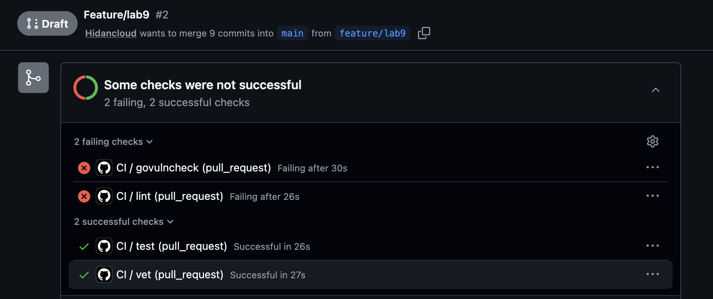

# Lab 9 — DevSecOps: Trivy + OWASP ZAP

## Objective

The goal of this lab was to scan QuickNotes as both a container image and a running HTTP service, then make engineering decisions from the findings instead of treating scanner output as a checkbox. I ran Trivy image, filesystem, config, and CycloneDX SBOM generation with a pinned scanner image. I also ran OWASP ZAP baseline with a pinned ZAP image, fixed security header findings in Go middleware, added regression coverage, and added a pinned `govulncheck` CI job.

## Environment

| Item | Value |
|---|---|
| Date | 2026-07-07 |
| Branch | `feature/lab9` |
| App image | `quicknotes:lab6` |
| Trivy image | `aquasec/trivy:0.59.1` |
| ZAP image | `ghcr.io/zaproxy/zaproxy:2.16.1` |
| Go on host | `go1.26.4 darwin/arm64` |
| CI Go version | `1.24.13`, matching the course CI major/minor requirement and using the patched 1.24 line |

Generated artifacts are committed under `security/lab9/`:

```text
security/lab9/trivy/trivy-image.txt
security/lab9/trivy/trivy-image-before.txt
security/lab9/trivy/trivy-fs.txt
security/lab9/trivy/trivy-config.txt
security/lab9/trivy/quicknotes-lab6.cdx.json
security/lab9/zap/zap-before-localhost.json
security/lab9/zap/zap-before-localhost.html
security/lab9/zap/zap-before-localhost.txt
security/lab9/zap/zap-before-health.json
security/lab9/zap/zap-before-health.html
security/lab9/zap/zap-before-health.txt
security/lab9/zap/zap-after-localhost.json
security/lab9/zap/zap-after-localhost.html
security/lab9/zap/zap-after-localhost.txt
security/lab9/zap/zap-after-health.json
security/lab9/zap/zap-after-health.html
security/lab9/zap/zap-after-health.txt
security/lab9/govulncheck-red-demo.txt
security/lab9/govulncheck-green.txt
```

---

## Task 1 — Trivy scans, triage, and SBOM

### Commands executed

```bash
docker build -t quicknotes:lab6 ./app

docker run --rm \
  -v /var/run/docker.sock:/var/run/docker.sock \
  aquasec/trivy:0.59.1 image --severity HIGH,CRITICAL --no-progress quicknotes:lab6

docker run --rm \
  -v "$PWD:/repo" \
  -w /repo \
  aquasec/trivy:0.59.1 fs --severity HIGH,CRITICAL --no-progress \
  --skip-dirs .git --skip-dirs .vagrant --skip-dirs security/lab9 .

docker run --rm \
  -v "$PWD:/repo" \
  -w /repo \
  aquasec/trivy:0.59.1 config --include-non-failures --skip-check-update \
  --skip-dirs .git --skip-dirs .vagrant --skip-dirs security/lab9 .

docker run --rm \
  -v /var/run/docker.sock:/var/run/docker.sock \
  -v "$PWD/security/lab9/trivy:/out" \
  aquasec/trivy:0.59.1 image --format cyclonedx \
  --output /out/quicknotes-lab6.cdx.json quicknotes:lab6
```

Note: in Trivy `0.59.1`, CycloneDX SBOM generation for a container image is performed through the `image --format cyclonedx` target. The `sbom` target is for scanning an existing SBOM file, so using `image --format cyclonedx` is the image-generation path for this pinned version.

### Image scan output excerpt

Final scan after remediation:

```text
quicknotes:lab6 (debian 13.5)
=============================
Total: 0 (HIGH: 0, CRITICAL: 0)
```

Before remediation, the archived image `quicknotes:lab9-before` showed Go standard library findings in both Go binaries:

```text
healthcheck (gobinary)
======================
Total: 14 (HIGH: 13, CRITICAL: 1)

quicknotes (gobinary)
=====================
Total: 14 (HIGH: 13, CRITICAL: 1)
```

The root cause was the pinned builder image `golang:1.24.5`. I fixed it by rebuilding both static binaries with `golang:1.26.4`, while keeping the distroless runtime image.

### Filesystem scan output excerpt

```text
2026-07-07T11:20:02Z INFO [vuln] Vulnerability scanning is enabled
2026-07-07T11:20:02Z INFO [secret] Secret scanning is enabled
2026-07-07T11:20:02Z INFO Number of language-specific files num=1
2026-07-07T11:20:02Z INFO [gomod] Detecting vulnerabilities...
```

No HIGH or CRITICAL findings were reported in the repository filesystem scan.

### Config scan output excerpt

After adding a Dockerfile `HEALTHCHECK`, the config scan passed all Dockerfile checks:

```text
app/Dockerfile (dockerfile)
===========================
Tests: 28 (SUCCESSES: 28, FAILURES: 0)
Failures: 0 (UNKNOWN: 0, LOW: 0, MEDIUM: 0, HIGH: 0, CRITICAL: 0)
```

I used Trivy embedded checks with `--skip-check-update` for this artifact so the result is reproducible and not affected by a transient upstream policy bundle. The repository had one detected config file for this scan: `app/Dockerfile`.

### Trivy HIGH/CRITICAL triage table

| Source | Finding | Severity | Installed | Fixed in | Disposition | Reason |
|---|---|---:|---|---|---|---|
| `quicknotes` + `healthcheck` Go binaries | `CVE-2025-68121` | CRITICAL | Go `1.24.5` | `1.24.13`, `1.25.7`, `1.26.0-rc.3` | FIX | Fixed in this PR by changing `app/Dockerfile` to build with `golang:1.26.4`; final image scan is zero HIGH/CRITICAL. |
| `quicknotes` + `healthcheck` Go binaries | `CVE-2025-61726` | HIGH | Go `1.24.5` | `1.24.12`, `1.25.6` | FIX | Fixed in this PR by the same builder upgrade, which removed the vulnerable stdlib from both static binaries. |
| `quicknotes` + `healthcheck` Go binaries | `CVE-2025-61729` | HIGH | Go `1.24.5` | `1.24.11`, `1.25.5` | FIX | Fixed in this PR by the same builder upgrade, which removed the vulnerable stdlib from both static binaries. |
| `quicknotes` + `healthcheck` Go binaries | `CVE-2026-25679` | HIGH | Go `1.24.5` | `1.25.8`, `1.26.1` | FIX | Fixed in this PR by the same builder upgrade, which removed the vulnerable stdlib from both static binaries. |
| `quicknotes` + `healthcheck` Go binaries | `CVE-2026-27145` | HIGH | Go `1.24.5` | `1.25.11`, `1.26.4` | FIX | Fixed in this PR by the same builder upgrade, which removed the vulnerable stdlib from both static binaries. |
| `quicknotes` + `healthcheck` Go binaries | `CVE-2026-32280` | HIGH | Go `1.24.5` | `1.25.9`, `1.26.2` | FIX | Fixed in this PR by the same builder upgrade, which removed the vulnerable stdlib from both static binaries. |
| `quicknotes` + `healthcheck` Go binaries | `CVE-2026-32281` | HIGH | Go `1.24.5` | `1.25.9`, `1.26.2` | FIX | Fixed in this PR by the same builder upgrade, which removed the vulnerable stdlib from both static binaries. |
| `quicknotes` + `healthcheck` Go binaries | `CVE-2026-32283` | HIGH | Go `1.24.5` | `1.25.9`, `1.26.2` | FIX | Fixed in this PR by the same builder upgrade, which removed the vulnerable stdlib from both static binaries. |
| `quicknotes` + `healthcheck` Go binaries | `CVE-2026-33811` | HIGH | Go `1.24.5` | `1.25.10`, `1.26.3` | FIX | Fixed in this PR by the same builder upgrade, which removed the vulnerable stdlib from both static binaries. |
| `quicknotes` + `healthcheck` Go binaries | `CVE-2026-33814` | HIGH | Go `1.24.5` | `1.25.10`, `1.26.3` | FIX | Fixed in this PR by the same builder upgrade, which removed the vulnerable stdlib from both static binaries. |
| `quicknotes` + `healthcheck` Go binaries | `CVE-2026-39820` | HIGH | Go `1.24.5` | `1.25.10`, `1.26.3` | FIX | Fixed in this PR by the same builder upgrade, which removed the vulnerable stdlib from both static binaries. |
| `quicknotes` + `healthcheck` Go binaries | `CVE-2026-39836` | HIGH | Go `1.24.5` | `1.25.10`, `1.26.3` | FIX | Fixed in this PR by the same builder upgrade, which removed the vulnerable stdlib from both static binaries. |
| `quicknotes` + `healthcheck` Go binaries | `CVE-2026-42499` | HIGH | Go `1.24.5` | `1.25.10`, `1.26.3` | FIX | Fixed in this PR by the same builder upgrade, which removed the vulnerable stdlib from both static binaries. |
| `quicknotes` + `healthcheck` Go binaries | `CVE-2026-42504` | HIGH | Go `1.24.5` | `1.25.11`, `1.26.4` | FIX | Fixed in this PR by the same builder upgrade, which removed the vulnerable stdlib from both static binaries. |

Final result: image scan, filesystem scan, and config scan have no remaining HIGH or CRITICAL findings.

### CycloneDX SBOM first 30 lines

```json
{
  "$schema": "http://cyclonedx.org/schema/bom-1.6.schema.json",
  "bomFormat": "CycloneDX",
  "specVersion": "1.6",
  "serialNumber": "urn:uuid:5d2390f0-b737-4326-b87a-05b04173ba82",
  "version": 1,
  "metadata": {
    "timestamp": "2026-07-07T11:20:06+00:00",
    "tools": {
      "components": [
        {
          "type": "application",
          "group": "aquasecurity",
          "name": "trivy",
          "version": "0.59.1"
        }
      ]
    },
    "component": {
      "bom-ref": "pkg:oci/quicknotes@sha256%3A7563fb5d9ff374fd90f39f55462796959edbf828a6efabfb7b36b086120a247c?arch=arm64&repository_url=index.docker.io%2Flibrary%2Fquicknotes",
      "type": "container",
      "name": "quicknotes:lab6",
      "purl": "pkg:oci/quicknotes@sha256%3A7563fb5d9ff374fd90f39f55462796959edbf828a6efabfb7b36b086120a247c?arch=arm64&repository_url=index.docker.io%2Flibrary%2Fquicknotes",
      "properties": [
        {
          "name": "aquasecurity:trivy:DiffID",
          "value": "sha256:187cfc6d1e3e8a40a5e64653bcd3239c140807dcf1c09e48021178705a5a6139"
        },
        {
          "name": "aquasecurity:trivy:DiffID",
```

### Design questions

**a) CVE severity is one input, not the answer. What else matters?**

Severity tells me the theoretical impact, but triage must also consider reachability, exploit maturity, exposed attack surface, runtime permissions, data sensitivity, and compensating controls. For example, a HIGH CVE in a package that is never called is different from a HIGH CVE in public HTTP request parsing. Deployment context also matters: an internal demo service, a public internet API, and a privileged production control-plane component have different risk profiles.

**b) Why is a minimal base the strongest single security control?**

A minimal image removes entire classes of problems before scanning starts. QuickNotes uses distroless static nonroot, so there is no shell, no package manager, and only a tiny runtime filesystem. This reduces exploit tooling inside the container and reduces the number of OS packages that can carry CVEs.

**c) When is `.trivyignore` right, and when is it security theater?**

`.trivyignore` is right when the team has a documented false positive or a dated risk acceptance with owner, reason, and re-check date. It is security theater when it hides noisy findings without analysis, especially if a fixed version exists and the only reason is “the pipeline is red.” Suppression should be reviewable engineering evidence, not a broom.

**d) What future problem does having an SBOM solve?**

An SBOM lets us answer “are we affected?” quickly when a new vulnerability appears. During incidents like Log4Shell, teams without component inventories had to manually inspect every service under pressure. With `quicknotes-lab6.cdx.json`, we can query exact image components and decide quickly whether to patch, rebuild, or ignore.

---

## Task 2 — OWASP ZAP baseline and code fix

### Commands executed

```bash
docker run -d --name quicknotes-lab9-before -p 8080:8080 quicknotes:lab9-before

docker run --rm -u 0 \
  -v "$PWD/security/lab9/zap:/zap/wrk:rw" \
  ghcr.io/zaproxy/zaproxy:2.16.1 zap-baseline.py \
  -t http://localhost:8080 \
  -J zap-before-localhost.json \
  -r zap-before-localhost.html \
  -I

docker run --rm -u 0 \
  -v "$PWD/security/lab9/zap:/zap/wrk:rw" \
  ghcr.io/zaproxy/zaproxy:2.16.1 zap-baseline.py \
  -t http://localhost:8080/health \
  -J zap-before-health.json \
  -r zap-before-health.html \
  -I

docker run -d --name quicknotes-lab9-after -p 8080:8080 quicknotes:lab6

docker run --rm -u 0 \
  -v "$PWD/security/lab9/zap:/zap/wrk:rw" \
  ghcr.io/zaproxy/zaproxy:2.16.1 zap-baseline.py \
  -t http://localhost:8080 \
  -J zap-after-localhost.json \
  -r zap-after-localhost.html \
  -I

docker run --rm -u 0 \
  -v "$PWD/security/lab9/zap:/zap/wrk:rw" \
  ghcr.io/zaproxy/zaproxy:2.16.1 zap-baseline.py \
  -t http://localhost:8080/health \
  -J zap-after-health.json \
  -r zap-after-health.html \
  -I
```

I ran the required baseline target as `http://localhost:8080`. I also ran a second baseline against `http://localhost:8080/health` because the QuickNotes root path intentionally returns `404`, while `/health` exercises a normal `200 OK` API response and gives clearer before/after header evidence.

### Before evidence

Response headers before the fix:

```text
HTTP/1.1 200 OK
Content-Type: application/json
Date: Tue, 07 Jul 2026 16:42:27 GMT
Content-Length: 26

{"notes":4,"status":"ok"}
```

ZAP before excerpt:

```text
WARN-NEW: X-Content-Type-Options Header Missing [10021] x 1
    http://localhost:8080/health (200 OK)
WARN-NEW: Storable and Cacheable Content [10049] x 4
WARN-NEW: ZAP is Out of Date [10116] x 1
WARN-NEW: Insufficient Site Isolation Against Spectre Vulnerability [90004] x 1
FAIL-NEW: 0 FAIL-INPROG: 0 WARN-NEW: 4 WARN-INPROG: 0 INFO: 0 IGNORE: 0 PASS: 63
```

### Code fix

I implemented security headers as middleware that wraps the router in `app/handlers.go`, so the policy applies to all routes consistently. I also added a regression test in `app/handlers_test.go` that checks several routes, including `/health`, `/metrics`, `GET /notes`, and `POST /notes`. If the middleware is removed, the test fails.

Key diff excerpt:

```diff
-func (s *Server) Routes() *http.ServeMux {
+func (s *Server) Routes() http.Handler {
     mux := http.NewServeMux()
     mux.HandleFunc("GET /health", s.wrap(s.handleHealth))
     mux.HandleFunc("GET /metrics", s.wrap(s.handleMetrics))
     mux.HandleFunc("GET /notes", s.wrap(s.handleListNotes))
     mux.HandleFunc("POST /notes", s.wrap(s.handleCreateNote))
     mux.HandleFunc("GET /notes/{id}", s.wrap(s.handleGetNote))
     mux.HandleFunc("DELETE /notes/{id}", s.wrap(s.handleDeleteNote))
-    return mux
+    return securityHeaders(mux)
 }
+
+func securityHeaders(next http.Handler) http.Handler {
+    return http.HandlerFunc(func(w http.ResponseWriter, r *http.Request) {
+        w.Header().Set("Cache-Control", "no-store")
+        w.Header().Set("Content-Security-Policy", "default-src 'none'")
+        w.Header().Set("Cross-Origin-Embedder-Policy", "require-corp")
+        w.Header().Set("Cross-Origin-Opener-Policy", "same-origin")
+        w.Header().Set("Cross-Origin-Resource-Policy", "same-origin")
+        w.Header().Set("Referrer-Policy", "no-referrer")
+        w.Header().Set("X-Content-Type-Options", "nosniff")
+        w.Header().Set("X-Frame-Options", "DENY")
+        next.ServeHTTP(w, r)
+    })
+}
```

### Test output

```text
ok      quicknotes  1.616s
?       quicknotes/cmd/healthcheck  [no test files]
```

### After evidence

Response headers after the fix:

```text
HTTP/1.1 200 OK
Cache-Control: no-store
Content-Security-Policy: default-src 'none'
Content-Type: application/json
Cross-Origin-Embedder-Policy: require-corp
Cross-Origin-Opener-Policy: same-origin
Cross-Origin-Resource-Policy: same-origin
Referrer-Policy: no-referrer
X-Content-Type-Options: nosniff
X-Frame-Options: DENY
Date: Tue, 07 Jul 2026 16:43:51 GMT
Content-Length: 26

{"notes":4,"status":"ok"}
```

ZAP after excerpt:

```text
PASS: X-Content-Type-Options Header Missing [10021]
PASS: Content Security Policy (CSP) Header Not Set [10038]
PASS: Insufficient Site Isolation Against Spectre Vulnerability [90004]
WARN-NEW: Non-Storable Content [10049] x 4
WARN-NEW: ZAP is Out of Date [10116] x 1
FAIL-NEW: 0 FAIL-INPROG: 0 WARN-NEW: 2 WARN-INPROG: 0 INFO: 0 IGNORE: 0 PASS: 65
```

### ZAP finding triage table

| ID | Name | Risk | Affected URL / parameter | Disposition | Reason |
|---:|---|---|---|---|---|
| `10021` | X-Content-Type-Options Header Missing | Low (Medium confidence) | `/health`, parameter `x-content-type-options` | FIX | Added middleware header `X-Content-Type-Options: nosniff`; after report shows PASS. |
| `90004` | Insufficient Site Isolation Against Spectre Vulnerability | Low (Medium confidence) | `/health`, parameter `Cross-Origin-Resource-Policy` | FIX | Added COEP, COOP, and CORP headers in middleware; after report shows PASS. |
| `10049` | Storable and Cacheable Content | Informational (Medium confidence) | `/`, `/health`, `/robots.txt`, `/sitemap.xml` | FIX | Added `Cache-Control: no-store`; after report changed to `Non-Storable Content`, so the original cacheability risk is fixed. |
| `10049` | Non-Storable Content | Informational (Medium confidence) | `/`, `/health`, `/robots.txt`, `/sitemap.xml` | ACCEPT | This is ZAP confirming the response is non-storable after the fix, not an application weakness. Re-check by 2026-10-07. |
| `10116` | ZAP is Out of Date | Low (High confidence) | Scanner metadata on root request | ACCEPT | This is not an application vulnerability. The lab required a pinned image; `2.16.1` is pinned for repeatability. Re-evaluate scanner version by 2026-08-07. |

### Design questions

**e) Why middleware and not per-handler header sets?**

Middleware creates one enforcement point. If headers are added in each handler, a future route can easily forget one and silently regress. Wrapping the router makes security headers a default property of the service, and the unit test proves the policy is applied across multiple routes.

**f) What does `Content-Security-Policy: default-src 'none'` break, and why is it OK for QuickNotes?**

`default-src 'none'` blocks loading scripts, styles, images, fonts, frames, and network resources unless explicitly allowed. That would break a normal website or Swagger UI because browsers need assets to render the page. QuickNotes is a JSON API, not a browser UI, so a strict CSP is safe and useful defense-in-depth if an API response is ever rendered by a browser.

**g) What is the cost of marking all informational ZAP issues as accepted without reading them?**

It trains the team to ignore scanners and hides the one “informational” issue that actually points to a bad assumption. Informational findings can reveal caching mistakes, metadata leakage, or scanner configuration problems. Reading them is cheap compared with explaining later why the team accepted evidence it never evaluated.

---

## Bonus Task — `govulncheck` as CI PR gate

### CI workflow change

I restored the Lab 3 CI workflow and added a dedicated `govulncheck` job in `.github/workflows/ci.yml`. The job runs in `app/`, uses Go `1.24.13`, installs a pinned scanner version, and runs `govulncheck ./...`.

```yaml
govulncheck:
  name: govulncheck
  runs-on: ubuntu-24.04
  timeout-minutes: 10

  defaults:
    run:
      working-directory: app

  steps:
    - name: Checkout repository
      uses: actions/checkout@b4ffde65f46336ab88eb53be808477a3936bae11 # v4.2.2

    - name: Set up Go
      uses: actions/setup-go@40f1582b2485089dde7abd97c1529aa768e1baff # v5.5.0
      with:
        go-version: "1.24.13"
        cache: true
        cache-dependency-path: app/go.mod

    - name: Install govulncheck
      run: go install golang.org/x/vuln/cmd/govulncheck@v1.1.4

    - name: Run govulncheck
      run: $(go env GOPATH)/bin/govulncheck ./...
      env:
        GOFLAGS: -buildvcs=false
```

### Red demonstration log

I used a temporary local copy of `app/` to avoid committing a vulnerable dependency to the final lab branch. The temporary copy added a reachable call to vulnerable `golang.org/x/text/language.ParseAcceptLanguage` with `golang.org/x/text@v0.3.7`. This is the same command that the CI job runs.



```text
=== Symbol Results ===

Vulnerability #1: GO-2022-1059
    Denial of service via crafted Accept-Language header in
    golang.org/x/text/language
  More info: https://pkg.go.dev/vuln/GO-2022-1059
  Module: golang.org/x/text
    Found in: golang.org/x/text@v0.3.7
    Fixed in: golang.org/x/text@v0.3.8
    Example traces found:
      #1: vuln_demo.go:6:37: quicknotes.vulnerableAcceptLanguage calls language.ParseAcceptLanguage

Your code is affected by 1 vulnerability from 1 module.
```

### Green demonstration log

Final app state:

```text
No vulnerabilities found.
```

Manual note: I did not push a temporary vulnerable commit to GitHub from this environment. After opening the PR, the remote CI proof can be produced by pushing the same temporary vulnerable dependency to a throwaway branch/commit, observing the red `govulncheck` status, then reverting it. The committed workflow and local red/green logs demonstrate the exact command path without leaving vulnerable code in the portfolio branch.

### Design questions

**h) How is reachability different from “module has a CVE”?**

A module-level scanner says “this dependency version is known vulnerable.” `govulncheck` goes further and asks whether our call graph reaches the vulnerable symbol. That reduces triage noise: a vulnerability in an unused function may still need tracking, but it is not the same urgency as a reachable vulnerability in request-handling code.

**i) Why pin the scanner version?**

A scanner is part of the build toolchain. If it floats on `@latest`, the same commit can pass today and fail tomorrow because scanner behavior changed. Pinning `govulncheck@v1.1.4` makes CI reproducible; upgrades become intentional maintenance with reviewable diffs.

**j) What will `govulncheck` not catch that Trivy image scan would?**

`govulncheck` only understands Go code and Go vulnerability data. It will not catch OS package CVEs, vulnerable base images, Dockerfile misconfigurations, shell tools, OpenSSL packages in the image, or leaked secrets in files. That is why this lab uses both Trivy and `govulncheck`: they answer different questions.

---

## Final validation

```bash
cd app && go test -race -count=1 ./... && go vet ./...
```

```text
ok      quicknotes  1.616s
?       quicknotes/cmd/healthcheck  [no test files]
```

```bash
cd app && "$(go env GOPATH)/bin/govulncheck" ./...
```

```text
No vulnerabilities found.
```

## Summary of engineering changes

- Upgraded Docker builder from `golang:1.24.5` to `golang:1.26.4`, removing Go stdlib CVEs from both static binaries.
- Added Dockerfile `HEALTHCHECK` using the existing `/healthcheck` binary.
- Added centralized HTTP security header middleware for all QuickNotes routes.
- Added regression tests that fail if the security header middleware is removed.
- Added committed Trivy, CycloneDX SBOM, and ZAP report artifacts.
- Added pinned `govulncheck` CI job as a separate PR status check.
