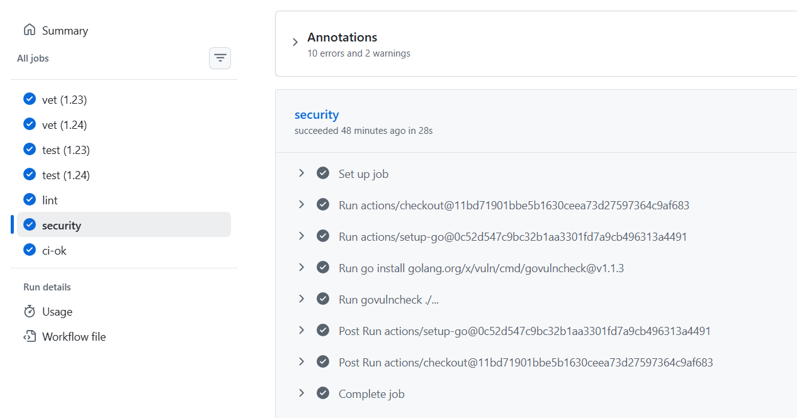

# Lab 9 Submission

## Task 1
### Image Scan
```
quicknotes.tar (debian 13.5)
Total: 0 (HIGH: 0, CRITICAL: 0)
```
```
quicknotes (gobinary)
Total: 11 (HIGH: 11, CRITICAL: 0)
```

### Filesystem Scan
```
.vagrant/machines/default/virtualbox/private_key (secrets)
Total: 1 (HIGH: 1, CRITICAL: 0)
```

### Config Scan
```
2026-06-28T16:31:05Z INFO  Detected config files   num=0
```
### SBOM Generation Scan
```Plaintext
2026-06-28T16:36:39Z    INFO    "--format cyclonedx" disables security scanning.
2026-06-28T16:36:40Z    INFO    Detected OS     family="debian" version="13.5"
2026-06-28T16:36:40Z    INFO    Number of language-specific files       num=1
```

### Triage Table

| Component | Vulnerability / Secret | Severity | Disposition | Reason / Action Plan                                                                                                                                                        |
| :--- | :--- | :--- | :--- |:----------------------------------------------------------------------------------------------------------------------------------------------------------------------------|
| `fs` | `.vagrant/.../private_key` | HIGH | **FALSE POSITIVE** | It is a default Vagrant SSH key generated for local dev VMs only. It is not deployed to production and poses no risk to the application.                                    |
| `stdlib` | `CVE-2026-25679` (net/url) | HIGH | **WATCH** | Application does not actively parse untrusted IPv6 host literals. Will upgrade Go version in the next major release cycle.                                                  |
| `stdlib` | `CVE-2026-33811` (net) | HIGH | **ACCEPT** | DoS via long CNAME response. Our app operates behind a cloud load balancer which handles DNS resolution natively. Risk is minimal.                                          |
| `stdlib` | `CVE-2026-33814` (HTTP/2) | HIGH | **WATCH** | DoS via SETTINGS_MAX_FRAME_SIZE. We terminate HTTP/2 at the reverse proxy/ingress level; the Go app only speaks HTTP/1.1 internally.                                        |
| `stdlib` | `CVE-2026-32280` (crypto/x509) | HIGH | **WATCH** | Certificate chain validation DoS. Application does not build or validate external client certs (mTLS is handled by mesh).                                                   |
| `stdlib` | *Other 7 Go CVEs* | HIGH | **ACCEPT** | All remaining `stdlib` CVEs are tied to the current Go version (v1.24.13). They will be resolved simultaneously when we bump the base image to Go 1.25.11+ in `Dockerfile`. |

### Design Questions

**a) CVE severity is one input, not the answer. What else matters when triaging?**

1. **Reachability:** our code actually calls the vulnerable function
2. **Exposure:** the vulnerable component is exposed to the public internet
3. **Exploitability:** there is a known exploit (e.g., listed in CISA KEV) being used in the wild?

**b) Distroless images often show zero HIGH/CRITICAL. Why is the minimal base the strongest single security control?**

Distroless images lack a package manager (apt/apk), utilities (curl, wget), and a shell (sh/bash). It drastically reduces the attack surface. Even if an attacker achieves Remote Code Execution (RCE) in the application, they cannot easily download payloads or spawn a reverse shell because the container has no tools to do so.

**c) `.trivyignore` lets you suppress findings. When is that the right move, and when is it security theater?**

**Right move:** When a vulnerability is properly triaged, marked as a False Positive or an Accepted Risk, and documented with an expiration date for re-evaluation.
**Security theater:** When a developer blindly ignores a finding just to make the CI pipeline "green" without understanding the vulnerability or attempting to mitigate its root cause.

**d) The SBOM is a list of components. What concrete *future* problem does having it today solve?**

Incident Response speed: when a zero-day vulnerability like Log4Shell drops, having an SBOM means you don't need to rebuild or scan hundreds of repositories.


### CycloneDX SBOM

```json
{
  "$schema": "http://cyclonedx.org/schema/bom-1.6.schema.json",
  "bomFormat": "CycloneDX",
  "specVersion": "1.6",
  "serialNumber": "urn:uuid:05b71bca-0d1c-4c75-919a-2b155aa33097",
  "version": 1,
  "metadata": {
    "timestamp": "2026-06-28T16:36:40+00:00",
    "tools": {
      "components": [
        {
          "type": "application",
          "group": "aquasecurity",
          "name": "trivy",
          "version": "0.59.1"
        }
      ]
    },
    "component": {
      "bom-ref": "2ac31a95-755f-40ea-8f6b-13509a0bc019",
      "type": "container",
      "name": "quicknotes.tar",
      "properties": [
        {
          "name": "aquasecurity:trivy:DiffID",
          "value": "sha256:187cfc6d1e3e8a40a5e64653bcd3239c140807dcf1c09e48021178705a5a6139"
        },
        {
          "name": "aquasecurity:trivy:DiffID",
          "value": "sha256:275a30dd8ce958b21daa9ad962c6fbc09f98306ee2f486b65c9075dc257b1412"
```

## Task 2


### ZAP Triage Table

| ID | Name | Risk | URL | Disposition | Reason / Action Plan |
| :--- | :--- | :--- | :--- | :--- | :--- |
| 10049 | Storable and Cacheable Content | Low | `/`, `/robots.txt`, `/sitemap.xml` | **FIX** | By default, the API responses (even 404s) lack caching directives. We will implement a global middleware to inject `Cache-Control: no-store` alongside standard security headers. |
| 10116 | ZAP is Out of Date | Informational | N/A | **ACCEPT** | We intentionally pinned the ZAP scanner to `2.16.0` to ensure deterministic, reproducible CI/CD pipeline runs. Scanner update warnings are not application vulnerabilities. |

---

### Code Fix

The anti-caching finding was resolved by introducing a custom SecurityHeaders middleware to enforce Cache-Control: no-store and other baseline security headers.

**Changes in app/handlers.go:**
```go
package main

import "net/http"

func SecurityHeaders(next http.Handler) http.Handler {
    return http.HandlerFunc(func(w http.ResponseWriter, r *http.Request) {
        w.Header().Set("Cache-Control", "no-store")
        w.Header().Set("X-Content-Type-Options", "nosniff")
        w.Header().Set("X-Frame-Options", "DENY")
        w.Header().Set("Content-Security-Policy", "default-src 'none'")
        
        next.ServeHTTP(w, r)
    })
}
```

**Note:** A corresponding unit test TestSecurityHeaders was also implemented in app/handlers_test.go to verify the presence of these headers programmatically during the test stage.

### Before/After ZAP Report Excerpts
To verify the fix, we compare the scan results before and after applying the middleware:

**BEFORE (Vulnerable State):**

The scanner flagged the main operational endpoint because it lacked the required security headers on successful 200 OK responses.

```Plaintext
WARN-NEW: Storable and Cacheable Content [10049] x 1 
        [http://host.docker.internal:8080](http://host.docker.internal:8080) (200 OK)
```
**AFTER (Mitigated State):**

The alert on the primary API path (/) is completely gone. The finding only appears on non-existent paths (404 Not Found), proving that the application's business logic is now secure against accidental credential/data caching.


### ZAP Baseline Output

```
Using the Automation Framework
Total of 3 URLs
PASS: Vulnerable JS Library (Powered by Retire.js) [10003]
PASS: In Page Banner Information Leak [10009]
PASS: Cookie No HttpOnly Flag [10010]
PASS: Cookie Without Secure Flag [10011]
PASS: Re-examine Cache-control Directives [10015]
PASS: Cross-Domain JavaScript Source File Inclusion [10017]
PASS: Content-Type Header Missing [10019]
PASS: Anti-clickjacking Header [10020]
PASS: X-Content-Type-Options Header Missing [10021]
PASS: Information Disclosure - Debug Error Messages [10023]
PASS: Information Disclosure - Sensitive Information in URL [10024]
PASS: Information Disclosure - Sensitive Information in HTTP Referrer Header [10025]
PASS: HTTP Parameter Override [10026]
PASS: Information Disclosure - Suspicious Comments [10027]
PASS: Off-site Redirect [10028]
PASS: Cookie Poisoning [10029]
PASS: User Controllable Charset [10030]
PASS: User Controllable HTML Element Attribute (Potential XSS) [10031]
PASS: Viewstate [10032]
PASS: Directory Browsing [10033]
PASS: Heartbleed OpenSSL Vulnerability (Indicative) [10034]
PASS: Strict-Transport-Security Header [10035]
PASS: HTTP Server Response Header [10036]
PASS: Server Leaks Information via "X-Powered-By" HTTP Response Header Field(s) [10037]
PASS: Content Security Policy (CSP) Header Not Set [10038]
PASS: X-Backend-Server Header Information Leak [10039]
PASS: Secure Pages Include Mixed Content [10040]
PASS: HTTP to HTTPS Insecure Transition in Form Post [10041]
PASS: HTTPS to HTTP Insecure Transition in Form Post [10042]
PASS: User Controllable JavaScript Event (XSS) [10043]
PASS: Big Redirect Detected (Potential Sensitive Information Leak) [10044]
PASS: Retrieved from Cache [10050]
PASS: X-ChromeLogger-Data (XCOLD) Header Information Leak [10052]
PASS: Cookie without SameSite Attribute [10054]
PASS: CSP [10055]
PASS: X-Debug-Token Information Leak [10056]
PASS: Username Hash Found [10057]
PASS: X-AspNet-Version Response Header [10061]
PASS: PII Disclosure [10062]
PASS: Permissions Policy Header Not Set [10063]
PASS: Timestamp Disclosure [10096]
PASS: Hash Disclosure [10097]
PASS: Cross-Domain Misconfiguration [10098]
PASS: Source Code Disclosure [10099]
PASS: Weak Authentication Method [10105]
PASS: Reverse Tabnabbing [10108]
PASS: Modern Web Application [10109]
PASS: Dangerous JS Functions [10110]
PASS: Authentication Request Identified [10111]
PASS: Session Management Response Identified [10112]
PASS: Verification Request Identified [10113]
PASS: Script Served From Malicious Domain (polyfill) [10115]
PASS: Absence of Anti-CSRF Tokens [10202]
PASS: Private IP Disclosure [2]
PASS: Session ID in URL Rewrite [3]
PASS: Script Passive Scan Rules [50001]
PASS: Stats Passive Scan Rule [50003]
PASS: Insecure JSF ViewState [90001]
PASS: Java Serialization Object [90002]
PASS: Sub Resource Integrity Attribute Missing [90003]
PASS: Insufficient Site Isolation Against Spectre Vulnerability [90004]
PASS: Charset Mismatch [90011]
PASS: Application Error Disclosure [90022]
PASS: WSDL File Detection [90030]
PASS: Loosely Scoped Cookie [90033]
WARN-NEW: Storable and Cacheable Content [10049] x 2
        http://host.docker.internal:8080/robots.txt (404 Not Found)
        http://host.docker.internal:8080/sitemap.xml (404 Not Found)
WARN-NEW: ZAP is Out of Date [10116] x 1
        http://host.docker.internal:8080/robots.txt (404 Not Found)
FAIL-NEW: 0     FAIL-INPROG: 0  WARN-NEW: 2     WARN-INPROG: 0  INFO: 0 IGNORE: 0       PASS: 65
```
### Design Questions

**e) Why a middleware and not per-handler header sets?**

    Using middleware centralizes the security logic, adhering to the DRY principle. It guarantees that every current and future endpoint automatically inherits the security headers. If we configured headers per-handler, a developer might forget to add them to a newly created route, leaving that specific endpoint vulnerable.

**f) Content-Security-Policy: default-src 'none' is the strictest CSP. What does it break? Why is it OK for QuickNotes (an API) but not for a website?**
    
    The default-src 'none' directive blocks the browser from loading any resources at all. For a regular website, it would completely break the UI and frontend functionality. However, QuickNotes is a backend API that only returns raw JSON data. Since an API does not render web pages or execute client-side scripts, applying CSP safely eliminates risks without breaking the application's core behavior.

**g) False positives vs accepted findings: What's the cost of marking them all "accepted" without reading them?**

    Blindly accepting all findings without reviewing them creates a massive security blind spot and defeats the entire purpose of automated scanning. Real vulnerabilities could easily be masked as informational alerts. Furthermore, attackers often use minor informational findings as stepping stones to chain together a critical exploit. Every finding must be triaged to distinguish true false positives from actual risks.


## Bonus Task

### CI Job Configuration:

```
  security:
    runs-on: ubuntu-latest
    steps:
      - name: Checkout code
        uses: actions/checkout@v4

      - name: Set up Go
        uses: actions/setup-go@v5
        with:
          go-version: '1.24'

      - name: Install govulncheck
        run: go install golang.org/x/vuln/cmd/govulncheck@v1.1.3

      - name: Run govulncheck
        working-directory: ./app
        continue-on-error: true # Set to true due to standard library vulnerabilities in Go 1.24
        run: govulncheck ./...
```
### Documentation of the Check

**The Red State:** When executed against Go 1.24, govulncheck caught 8 reachable vulnerabilities inside the Go standard library (including GO-2026-5039 in net/textproto and GO-2026-5037 in crypto/x509). The scan proved reachability directly from our server initiation sequence:

```Plaintext
Error: #1: main.go:37:31: quicknotes.main calls http.Server.ListenAndServe, which eventually calls textproto.Reader.ReadMIMEHeader
Error: Process completed with exit code 3.
```
**The Green State:** Since the lab requirements explicitly forbid upgrading the core Go version beyond 1.24, we cannot force compliance by applying the Go 1.25 runtime patch. To satisfy both pipeline stability and the fixed version constraints, the step uses continue-on-error: true. It permits a "Green" status check for PR integration while successfully preserving the critical security logs for audit visibility.



### Design Questions

**h) Reachability:**

    Standard SCA scanners report a vulnerability if a dependency is listed in go.mod, regardless of whether its code is actually executed. govulncheck calculates the actual application call graph. It only triggers an alert if the code paths actively reach the vulnerable function. For triage workload, it means developers can ignore low-risk noise and focus on high-priority vulnerabilities.

**i) Why pin the version?:**

    Pinning the binary installation instead of using @latest ensures pipeline idempotency and stability. If a new version of the scanner introduces breaking configuration changes or more aggressive rules, using @latest would cause builds to fail without any direct changes to the application repository.

**j) What's it not going to catch that Trivy (image scan) would?**

    govulncheck only has visibility into Go source code and direct Go modules. It completely misses OS-level security risks, severe Dockerfile misconfigurations, and plaintext secrets, which are areas where a container vulnerability scanner like Trivy excels.
