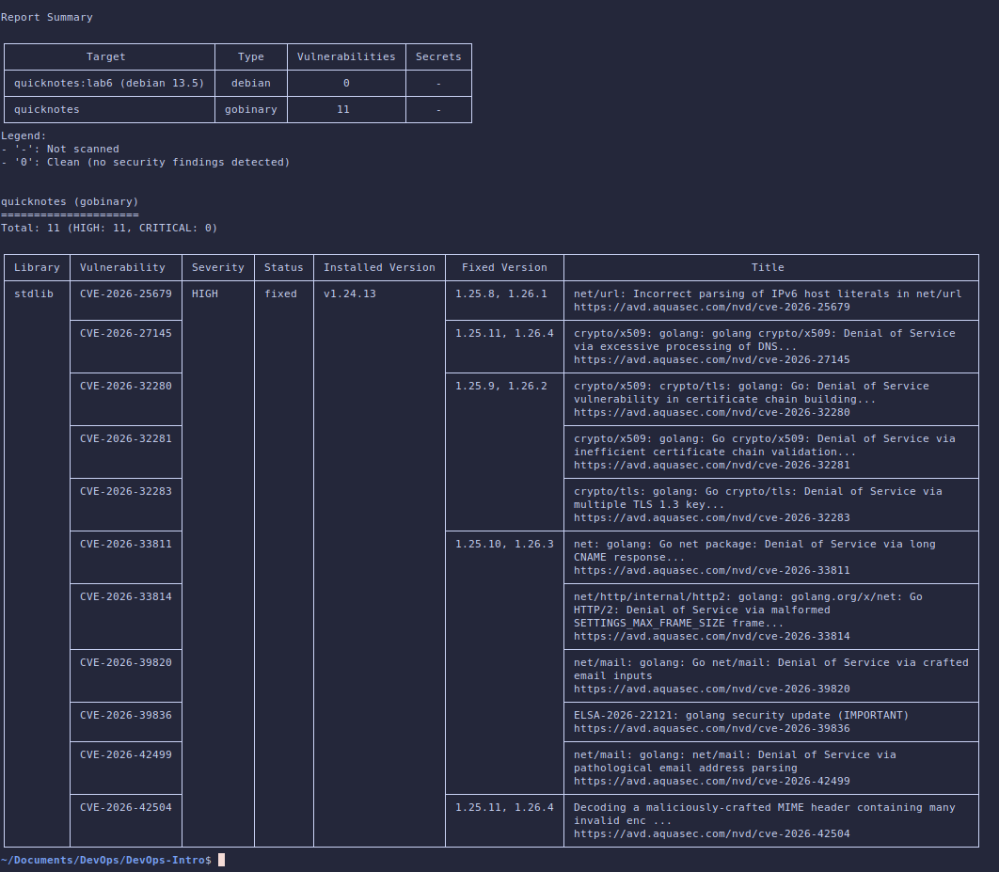
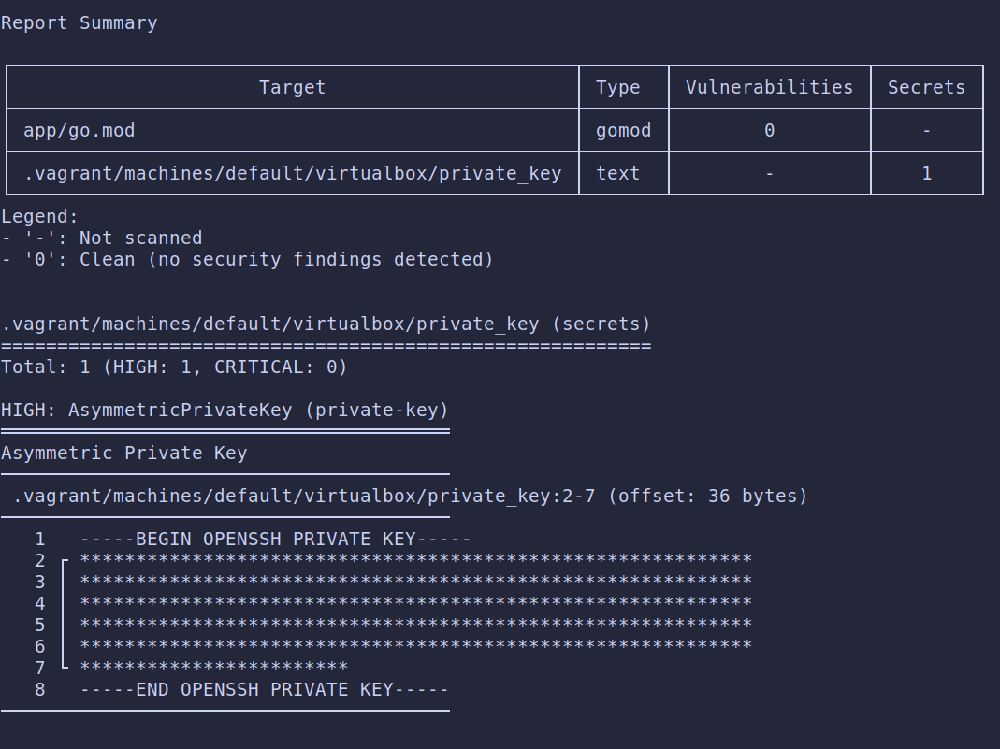
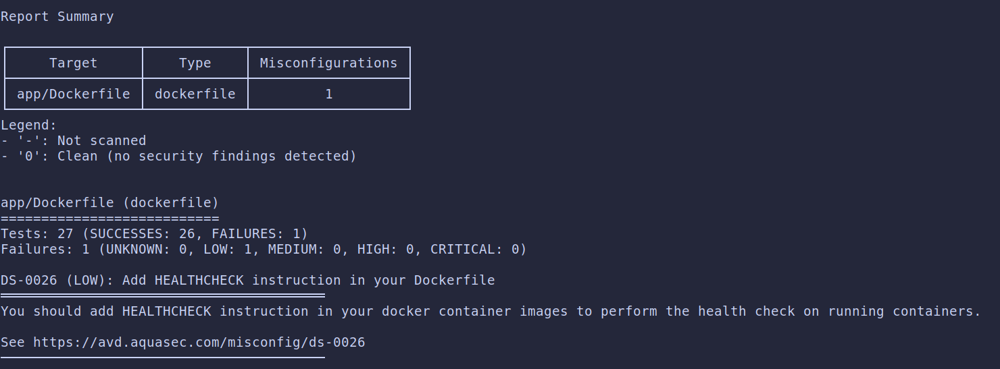
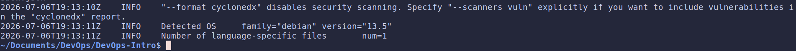

# Lab 9 submission

## Task 1: Trivy Image + Filesystem + Config + SBOM

### Scans

1. **Image Scan:**

    ```bash
    docker run --rm -v /var/run/docker.sock:/var/run/docker.sock aquasec/trivy:0.59.1 image --severity HIGH,CRITICAL quicknotes:lab6
    ```

    

2. **Filesystem Scan:**

    ```bash
    docker run --rm -v ./:/DevOps-Intro aquasec/trivy:0.59.1 fs --severity HIGH,CRITICAL /DevOps-Intro
    ```

    

3. **Config Scan:**

    ```bash
    docker run --rm -v ./:/DevOps-Intro aquasec/trivy:0.59.1 config /DevOps-Intro
    ```

    

4. **SBOM:**

    ```bash
    docker run --rm -v /var/run/docker.sock:/var/run/docker.sock aquasec/trivy:0.59.1 image --format cyclonedx quicknotes:lab6 > sbom.json
    ```

    

### Triage table

- **Image scan**

    | Finding | Disposition | Means | Reason |
    |---------|:-----------:|-------|--------|
    | CVE-2026-25679 (`net/url`) | **FIX** | Patch / upgrade now | Go stdlib DoS bug, rebuild on Go 1.25.11 fixes it |
    | CVE-2026-27145 (`crypto/x509`) | **FIX** | Patch / upgrade now | Go stdlib DoS bug, rebuild on Go 1.25.11 fixes it |
    | CVE-2026-32280 (`crypto/x509`) | **FIX** | Patch / upgrade now | Go stdlib DoS bug, rebuild on Go 1.25.11 fixes it |
    | CVE-2026-32281 (`crypto/x509`) | **FIX** | Patch / upgrade now | Go stdlib DoS bug, rebuild on Go 1.25.11 fixes it |
    | CVE-2026-32283 (`crypto/tls`) | **FIX** | Patch / upgrade now | Go stdlib DoS bug, rebuild on Go 1.25.11 fixes it |
    | CVE-2026-33811 (`net`) | **FIX** | Patch / upgrade now | Go stdlib DoS bug, rebuild on Go 1.25.11 fixes it |
    | CVE-2026-33814 (`net/http`) | **FIX** | Patch / upgrade now | Go stdlib DoS bug, rebuild on Go 1.25.11 fixes it |
    | CVE-2026-39820 (`net/mail`) | **FIX** | Patch / upgrade now | Go stdlib DoS bug, rebuild on Go 1.25.11 fixes it |
    | CVE-2026-39836 (golang update) | **FIX** | Patch / upgrade now | Go stdlib DoS bug, rebuild on Go 1.25.11 fixes it |
    | CVE-2026-42499 (`net/mail`) | **FIX** | Patch / upgrade now | Go stdlib DoS bug, rebuild on Go 1.25.11 fixes it |
    | CVE-2026-42504 (`mime`) | **FIX** | Patch / upgrade now | Go stdlib DoS bug, rebuild on Go 1.25.11 fixes it |

- **Filesystem scan**

    | Finding | Disposition | Means | Reason |
    |---------|:-----------:|-------|--------|
    | Private key in `.vagrant/.../private_key` | **FALSE POSITIVE** | Scanner is wrong | Local Vagrant VM key, gitignored and never committed |

### SBOM

First 30 lines of the CycloneDX SBOM (`sbom.json`):

```json
{
  "$schema": "http://cyclonedx.org/schema/bom-1.6.schema.json",
  "bomFormat": "CycloneDX",
  "specVersion": "1.6",
  "serialNumber": "urn:uuid:4c15b36e-71f7-47d4-8fc0-56b074a8211e",
  "version": 1,
  "metadata": {
    "timestamp": "2026-07-06T19:13:11+00:00",
    "tools": {
      "components": [
        {
          "type": "application",
          "group": "aquasecurity",
          "name": "trivy",
          "version": "0.59.1"
        }
      ]
    },
    "component": {
      "bom-ref": "ab8f8462-d31b-426c-8614-88d530c350a2",
      "type": "container",
      "name": "quicknotes:lab6",
      "properties": [
        {
          "name": "aquasecurity:trivy:DiffID",
          "value": "sha256:187cfc6d1e3e8a40a5e64653bcd3239c140807dcf1c09e48021178705a5a6139"
        },
        {
          "name": "aquasecurity:trivy:DiffID",
          "value": "sha256:275a30dd8ce958b21daa9ad962c6fbc09f98306ee2f486b65c9075dc257b1412"
        }
```

### Design questions

- **CVE severity is one input, not the answer. What else (reachability, exploit availability, deployment context) matters when triaging?**

  Severity only tells us how bad it is if exploited. We also need: reachability (does our code actually call the vulnerable function?), exploit availability (is there a public exploit), and deployment context. A CRITICAL in code we never call, on an internal service, is less urgent than a MEDIUM that's deployed for users with a working exploit.

- **Distroless images often show zero HIGH/CRITICAL. Why is the minimal base the strongest single security control?**

  A minimal base has almost no packages (distroless has no shell, no package manager, no OS libraries). This reduce the surface of attack and remove the need to patch system vulnerabilities our app never use.

- **`.trivyignore` lets you suppress findings. When is that the right move, and when is it security theater?**

  It's right when we make a documented, dated decision, ex: a false positive, or a finding with no upstream fix yet and we write down why. It's security theater when we ignore a finding just to make the scan green without understanding it.

- **The SBOM is a list of components. What concrete future problem does having it today solve?**

  When the next Log4Shell drops, the SBOM lets us instantly answer "do we ship this component, and which version?" by searching one file, instead of manually auditing every image under pressure. It turns "are we affected?" from days of investigation into a lookup.

## Task 2: OWASP ZAP Baseline + Fix at Least One Finding

### Baseline scan

```bash
docker run --rm --network host -v $(pwd):/zap/wrk/:rw  ghcr.io/zaproxy/zaproxy:2.17.0 zap-baseline.py -t http://localhost:8080 -r zap-before.html -J zap-before.json
```

The scan returned a single finding:

```bash
FAIL-NEW: 0   FAIL-INPROG: 0   WARN-NEW: 1   WARN-INPROG: 0   INFO: 0   IGNORE: 0   PASS: 66
```

### Triage table

| ID | Name | Risk | Affected URL | Disposition | Reason |
|----|------|:----:|--------------|:-----------:|--------|
| 10049 | Storable and Cacheable Content | Informational | `http://localhost:8080`, `/sitemap.xml` | **FIX** | Responses have no `Cache-Control`, so a shared proxy could cache them. Fixed in code by adding `Cache-Control: no-store` in middleware. |

### Code fix

Added a `securityHeaders` middleware that wraps the router (`app/middleware.go`) and applied it to all routes in `Routes()` (`app/handlers.go`).

```go
func securityHeaders(next http.Handler) http.Handler {
	return http.HandlerFunc(func(w http.ResponseWriter, r *http.Request) {
		w.Header().Set("Cache-Control", "no-store")
		next.ServeHTTP(w, r)
	})
}
```

```go
func (s *Server) Routes() http.Handler {
	mux := http.NewServeMux()
	...
	return securityHeaders(mux)
}
```

Guard test (`app/handlers_test.go`) fails if the middleware is removed:

```go
func TestSecurityHeaders_PresentOnAllRoutes(t *testing.T) {
	srv := newTestServer(t)
	for _, target := range []string{"/health", "/notes", "/metrics"} {
		rec := do(t, srv, http.MethodGet, target, nil)
		if got := rec.Header().Get("Cache-Control"); got != "no-store" {
			t.Errorf("%s: Cache-Control = %q, want no-store", target, got)
		}
	}
}
```

### Before / after

**Before:**

```bash
WARN-NEW: Storable and Cacheable Content [10049] x 2
```

**After:**

```bash
WARN-NEW: Non-Storable Content [10049] x 2
```

### Design questions

- **Why a middleware and not per-handler header sets?**

  A middleware sets the headers in one place for every route, and new routes get them automatically. Per-handler `Header().Set` calls are duplicated everywhere, and the guarantee breaks the moment someone adds a handler and forgets to copy them.

- **`Content-Security-Policy: default-src 'none'` is the strictest CSP. What does it break? Why is it OK for QuickNotes (an API) but not for a website?**

  It blocks all scripts, styles, images, fonts and frames, so a browser can't load any resource. That's fine for QuickNotes because it's a JSON API with no web page to render. On a real website it would show a blank/broken page.

- **False positives vs accepted findings: what's the cost of marking informational issues all "accepted" without reading them?**

  If we accept everything we stop reading the findings, so a real issue hiding in the informational noise gets bypassed along with the harmless ones. Accept-all is the same as not triaging at all.
