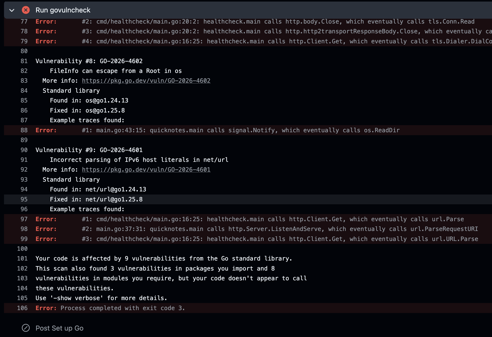

# Lab 9 Submission - DevSecOps

## Task 1 - Trivy

Pinned scanner: `aquasec/trivy:0.59.1`

Reports:

- `security/trivy/image.txt`
- `security/trivy/image.json`
- `security/trivy/filesystem.txt`
- `security/trivy/filesystem.json`
- `security/trivy/config.txt`
- `security/trivy/quicknotes-lab6.cdx.json`

### Scan Output Tops

Image scan:

```text
/scan-tmp/quicknotes-lab6.tar (debian 13.5)
===========================================
Total: 0 (HIGH: 0, CRITICAL: 0)

healthcheck (gobinary)
======================
Total: 11 (HIGH: 11, CRITICAL: 0)
```

Filesystem scan:

```text
No HIGH or CRITICAL findings in the clean repository filesystem scan.
```

Config scan:

```text
app/Dockerfile (dockerfile)
===========================
Tests: 28 (SUCCESSES: 27, FAILURES: 1)
Failures: 1 (UNKNOWN: 0, LOW: 1, MEDIUM: 0, HIGH: 0, CRITICAL: 0)

AVD-DS-0026 (LOW): Add HEALTHCHECK instruction in your Dockerfile
```

SBOM first 30 lines:

```json
{
  "$schema": "http://cyclonedx.org/schema/bom-1.6.schema.json",
  "bomFormat": "CycloneDX",
  "specVersion": "1.6",
  "serialNumber": "urn:uuid:75bb7075-4508-406b-81f3-c4b84ae94e7c",
  "version": 1,
  "metadata": {
    "timestamp": "2026-07-05T16:41:44+00:00",
    "tools": {
      "components": [
        {
          "type": "application",
          "group": "aquasecurity",
          "name": "trivy",
          "version": "0.59.1"
        }
      ]
    },
    "component": {
      "bom-ref": "25049b3b-8cd4-49e3-b441-b2e062d85fc8",
      "type": "container",
      "name": "/scan-tmp/quicknotes-lab6.tar",
      "properties": [
        {
          "name": "aquasecurity:trivy:DiffID",
          "value": "sha256:187cfc6d1e3e8a40a5e64653bcd3239c140807dcf1c09e48021178705a5a6139"
        },
        {
```

### Trivy Triage

Each image row below appears twice in `security/trivy/image.txt`: once for `quicknotes` and once for `healthcheck`. There are no HIGH/CRITICAL findings in the Debian base image, the clean filesystem scan, or the config scan.

| Source | Target(s) | Finding | Severity | Disposition | Reason |
|---|---|---|---:|---|---|
| Image | `quicknotes`, `healthcheck` | CVE-2026-25679, Go stdlib `net/url` | HIGH | ACCEPT | Requires upgrading from Go 1.24.13 to Go 1.25.8/1.26.1. Course CI is pinned to Go 1.24; QuickNotes does not parse untrusted URLs except trusted healthcheck configuration. Re-evaluate by 2026-10-05. |
| Image | `quicknotes`, `healthcheck` | CVE-2026-27145, Go stdlib `crypto/x509` | HIGH | ACCEPT | TLS certificate validation is not used by the HTTP API path in this container; the app is served as plain HTTP behind local lab infrastructure. Upgrade when Go 1.25/1.26 is allowed. Re-evaluate by 2026-10-05. |
| Image | `quicknotes`, `healthcheck` | CVE-2026-32280, Go stdlib `crypto/x509`/`crypto/tls` | HIGH | ACCEPT | Same TLS reachability assessment: not reachable from QuickNotes HTTP handlers in this lab deployment. Re-evaluate by 2026-10-05. |
| Image | `quicknotes`, `healthcheck` | CVE-2026-32281, Go stdlib `crypto/x509` | HIGH | ACCEPT | Certificate-chain validation DoS is not reachable from the API handlers. Re-evaluate by 2026-10-05. |
| Image | `quicknotes`, `healthcheck` | CVE-2026-32283, Go stdlib `crypto/tls` | HIGH | ACCEPT | TLS 1.3 key-update handling is not reachable because the container serves HTTP, not TLS. Re-evaluate by 2026-10-05. |
| Image | `quicknotes`, `healthcheck` | CVE-2026-33811, Go stdlib `net` | HIGH | ACCEPT | DNS CNAME lookup issue is not exercised by request handlers; healthcheck target is trusted config. Re-evaluate by 2026-10-05. |
| Image | `quicknotes`, `healthcheck` | CVE-2026-33814, Go stdlib HTTP/2 | HIGH | ACCEPT | The container is not serving TLS/HTTP2 directly in this lab setup. Re-evaluate by 2026-10-05. |
| Image | `quicknotes`, `healthcheck` | CVE-2026-39820, Go stdlib `net/mail` | HIGH | ACCEPT | QuickNotes has no email parsing feature, so the vulnerable parser is not reachable. Re-evaluate by 2026-10-05. |
| Image | `quicknotes`, `healthcheck` | CVE-2026-39836, Go stdlib security update umbrella | HIGH | ACCEPT | Covered by the Go runtime upgrade constraint above; no direct exposed path identified. Re-evaluate by 2026-10-05. |
| Image | `quicknotes`, `healthcheck` | CVE-2026-42499, Go stdlib `net/mail` | HIGH | ACCEPT | QuickNotes does not parse email addresses. Re-evaluate by 2026-10-05. |
| Image | `quicknotes`, `healthcheck` | CVE-2026-42504, Go MIME header decoding | HIGH | ACCEPT | No mail/MIME parsing feature is present in QuickNotes. Re-evaluate by 2026-10-05. |
| Config | `app/Dockerfile` | AVD-DS-0026 missing Dockerfile `HEALTHCHECK` | LOW | ACCEPT | Compose already defines a container healthcheck using `/healthcheck`. This is below the HIGH/CRITICAL triage threshold. Re-evaluate if the image is run outside Compose. |

### Design Questions

a) Severity is only one input. I also consider reachability, whether exploit code exists, whether the vulnerable function is used, exposure to untrusted users, container privileges, runtime network placement, and whether compensating controls reduce impact.

b) Distroless/minimal images remove shells, package managers, and unused libraries. That lowers both attack surface and patch workload, which is stronger than shipping unnecessary software and trying to monitor it forever.

c) `.trivyignore` is appropriate for documented false positives or dated risk acceptances with an owner. It is security theater when it hides findings just to make the report green.

d) An SBOM lets us answer future incident questions quickly. If a new Log4Shell-style vulnerability appears, we can search shipped components and identify affected artifacts without rebuilding from memory.

## Task 2 - OWASP ZAP

Pinned scanner: `ghcr.io/zaproxy/zaproxy:2.16.1`

Reports:

- `security/zap/zap-before-health.json`
- `security/zap/zap-before-health.html`
- `security/zap/zap-after-health.json`
- `security/zap/zap-after-health.html`

Before target: `http://qn-zap-before-lab9:8080/health`

After target: `http://qn-zap-after-lab9:8080/health`

### ZAP Triage

| ID | Name | Risk | Affected URL / Parameter | Disposition | Reason |
|---|---|---|---|---|---|
| 90004 | Insufficient Site Isolation Against Spectre Vulnerability | Low (Medium) | Before: `/health`, parameter `Cross-Origin-Resource-Policy` | FIX | Added `Cross-Origin-Resource-Policy: same-origin` in router middleware. After report shows this rule as `PASS`. |
| 10049 | Storable and Cacheable Content | Informational (Medium) | Before: `/`, `/health`, `/robots.txt` | FIX | Added `Cache-Control: no-store` and `Pragma: no-cache` in middleware. After report changes to `Non-Storable Content`. |
| 10116 | ZAP is Out of Date | Low (High) | Scanner metadata | ACCEPT | The lab explicitly asked for a pinned ZAP image; `2.16.1` is pinned for reproducibility. Re-evaluate scanner pin by 2026-08-05. |
| 10049 | Non-Storable Content | Informational (Medium) | After: `/`, `/health`, `/sitemap.xml` | ACCEPT | This is the expected outcome after setting no-store cache headers; no application risk. Re-evaluate if browser UI/static content is added. |

### Code Fix

Middleware:

```go
func securityHeaders(next http.Handler) http.Handler {
	return http.HandlerFunc(func(w http.ResponseWriter, r *http.Request) {
		w.Header().Set("Content-Security-Policy", "default-src 'none'; frame-ancestors 'none'")
		w.Header().Set("Cross-Origin-Resource-Policy", "same-origin")
		w.Header().Set("Cache-Control", "no-store")
		w.Header().Set("Pragma", "no-cache")
		w.Header().Set("X-Content-Type-Options", "nosniff")
		w.Header().Set("X-Frame-Options", "DENY")
		w.Header().Set("Referrer-Policy", "no-referrer")
		next.ServeHTTP(w, r)
	})
}
```

The router returns `securityHeaders(mux)`, so all routes are covered.

Guarding test:

```go
func TestRoutes_AddSecurityHeaders(t *testing.T) {
	srv := newTestServer(t)
	rec := do(t, srv, http.MethodGet, "/notes", nil)
	if rec.Code != http.StatusOK {
		t.Fatalf("expected 200, got %d", rec.Code)
	}
	for name, want := range map[string]string{
		"Content-Security-Policy":      "default-src 'none'; frame-ancestors 'none'",
		"Cross-Origin-Resource-Policy": "same-origin",
		"Cache-Control":                "no-store",
		"Pragma":                       "no-cache",
		"X-Content-Type-Options":       "nosniff",
		"X-Frame-Options":              "DENY",
		"Referrer-Policy":              "no-referrer",
	} {
		if got := rec.Header().Get(name); got != want {
			t.Errorf("%s = %q, want %q", name, got, want)
		}
	}
}
```

Before excerpt:

```text
WARN-NEW: Insufficient Site Isolation Against Spectre Vulnerability [90004] x 1
  http://qn-zap-before-lab9:8080/health (200 OK)
```

After excerpt:

```text
PASS: Insufficient Site Isolation Against Spectre Vulnerability [90004]
WARN-NEW: Non-Storable Content [10049] x 3
FAIL-NEW: 0
```

### Design Questions

e) Middleware is the right boundary because security headers are cross-cutting HTTP policy. One wrapper covers every current and future route without per-handler drift.

f) `Content-Security-Policy: default-src 'none'` blocks scripts, styles, images, fonts, frames, and fetches unless explicitly allowed. That would break most websites, but QuickNotes is a JSON API, so there is no browser UI that needs those resources.

g) Accepting informational findings without reading them creates blind spots. Some are harmless, but others expose weak defaults or deployment assumptions that become real problems when the app changes.

## Bonus - govulncheck CI Gate

Added `.github/workflows/ci.yml` with a dedicated status check:

```yaml
  govulncheck:
    name: govulncheck
    runs-on: ubuntu-24.04
    timeout-minutes: 5
    steps:
      - name: Check out repository
        uses: actions/checkout@11bd71901bbe5b1630ceea73d27597364c9af683 # v4.2.2

      - name: Set up Go
        uses: actions/setup-go@d35c59abb061a4a6fb18e82ac0862c26744d6ab5 # v5.5.0
        with:
          go-version: "1.24"
          cache: true
          cache-dependency-path: app/go.mod

      - name: Install govulncheck
        run: go install golang.org/x/vuln/cmd/govulncheck@v1.1.4

      - name: Run govulncheck
        working-directory: app
        run: govulncheck ./...
```

Failed CI job:


### Bonus Design Questions

h) Reachability means a vulnerable module is not automatically a vulnerable application. If QuickNotes does not call the affected function, triage can focus first on reachable issues.

i) Pinning the scanner version makes CI reproducible. `@latest` can change behavior or output between PRs with no code change.

j) `govulncheck` only covers Go code and Go dependencies. It will not catch base-image CVEs, Dockerfile/Compose misconfigurations, exposed secrets, OS packages, or non-Go runtime components.
