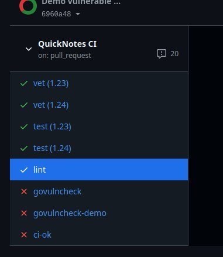
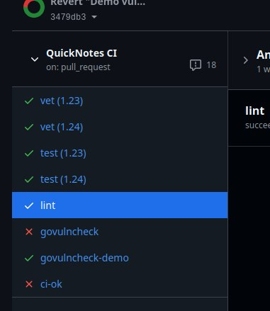

# Lab 9 — DevSecOps: Trivy + OWASP ZAP

## Task 1 — Trivy: Image + Filesystem + Config + SBOM

Trivy was pinned to version `0.59.1`.

Scan artifacts are stored in:

```text
reports/lab9/
├── trivy-image.txt
├── trivy-fs.txt
├── trivy-config.txt
├── quicknotes-sbom.cdx.json
└── trivy-image-after-go-upgrade.txt
```

### 1. Image scan

The original Lab 6 image was scanned for HIGH and CRITICAL vulnerabilities:

```bash
trivy image --severity HIGH,CRITICAL quicknotes:lab6
```

Top of the scan result:

```text
quicknotes:lab6 (debian 13.7)
=============================
Total: 0 (HIGH: 0, CRITICAL: 0)

healthcheck (gobinary)
======================
Total: 19 (HIGH: 19, CRITICAL: 0)

quicknotes (gobinary)
=====================
Total: 19 (HIGH: 19, CRITICAL: 0)
```

All 19 vulnerabilities reported for both Go binaries came from the Go standard library embedded in binaries built with Go `v1.24.13`.

The runtime OS packages themselves contained no HIGH or CRITICAL vulnerabilities.

### 2. Filesystem scan

The repository was scanned with:

```bash
trivy fs --severity HIGH,CRITICAL <repo>
```

The scan found one HIGH severity secret:

```text
.vagrant/machines/default/virtualbox/private_key (secrets)
==========================================================
Total: 1 (HIGH: 1, CRITICAL: 0)

HIGH: AsymmetricPrivateKey (private-key)
```

The private-key contents are intentionally not reproduced in this report.

The file is ignored by Git:

```text
.gitignore:27:.vagrant/ .vagrant/machines/default/virtualbox/private_key
```

and:

```bash
git ls-files .vagrant
```

returned no tracked files.

### 3. Config scan

The repository configuration was scanned with:

```bash
trivy config <repo>
```

Result:

```text
app/Dockerfile (dockerfile)
===========================
Tests: 28 (SUCCESSES: 27, FAILURES: 1)
Failures: 1 (UNKNOWN: 0, LOW: 1, MEDIUM: 0, HIGH: 0, CRITICAL: 0)

AVD-DS-0026 (LOW): Add HEALTHCHECK instruction in your Dockerfile
```

The config scan contained no HIGH or CRITICAL findings.

The single LOW finding is that the Dockerfile itself does not contain a `HEALTHCHECK` instruction. QuickNotes uses a Compose healthcheck with a dedicated `/healthcheck` binary, but this finding is below the severity required for the mandatory HIGH/CRITICAL triage.

### 4. CycloneDX SBOM

A CycloneDX SBOM was generated for the QuickNotes image and saved as:

```text
reports/lab9/quicknotes-sbom.cdx.json
```

First 30 lines:

```json
{
  "$schema": "http://cyclonedx.org/schema/bom-1.6.schema.json",
  "bomFormat": "CycloneDX",
  "specVersion": "1.6",
  "serialNumber": "urn:uuid:e7269f72-a358-40ff-9709-81261ff84ca4",
  "version": 1,
  "metadata": {
    "timestamp": "2026-10-02T17:23:38+00:00",
    "tools": {
      "components": [
        {
          "type": "application",
          "group": "aquasecurity",
          "name": "trivy",
          "version": "0.59.1"
        }
      ]
    },
    "component": {
      "bom-ref": "fe73be53-7b95-4605-91e7-71f5af5bfc36",
      "type": "container",
      "name": "quicknotes:lab6",
      "properties": [
        {
          "name": "aquasecurity:trivy:DiffID",
          "value": "sha256:163a8d96fd11ac50f9c1531196ce9924e719feaeecb8d493d204ec7c09173307"
        },
        {
          "name": "aquasecurity:trivy:DiffID",
          "value": "sha256:187cfc6d1e3e8a40a5e64653bcd3239c140807dcf1c09e48021178705a5a6139"
```

## HIGH / CRITICAL Triage

Each Go CVE below was reported twice: once in the `quicknotes` binary and once in the `healthcheck` binary. Both binaries were built with the same vulnerable Go `stdlib v1.24.13`, so each row covers both occurrences.

| Finding | Severity | Affected | Disposition | Reason |
|---|---|---|---|---|
| CVE-2026-25679 | HIGH | `quicknotes`, `healthcheck` | **FIX** | Go stdlib vulnerability. Builder upgraded from Go 1.24 to `1.25.13`, which is newer than the fixed 1.25.8 release. |
| CVE-2026-27145 | HIGH | `quicknotes`, `healthcheck` | **FIX** | Go stdlib vulnerability. Fixed by upgrading builder to Go `1.25.13` (fixed since 1.25.11). |
| CVE-2026-32280 | HIGH | `quicknotes`, `healthcheck` | **FIX** | Go stdlib vulnerability. Fixed by upgrading builder to Go `1.25.13` (fixed since 1.25.9). |
| CVE-2026-32281 | HIGH | `quicknotes`, `healthcheck` | **FIX** | Go stdlib vulnerability. Fixed by rebuilding with Go `1.25.13`. |
| CVE-2026-32283 | HIGH | `quicknotes`, `healthcheck` | **FIX** | Go stdlib vulnerability. Fixed by rebuilding with Go `1.25.13`. |
| CVE-2026-33811 | HIGH | `quicknotes`, `healthcheck` | **FIX** | Go stdlib vulnerability. Fixed by upgrading builder to Go `1.25.13` (fixed since 1.25.10). |
| CVE-2026-33814 | HIGH | `quicknotes`, `healthcheck` | **FIX** | Go stdlib HTTP/2 vulnerability. Fixed by rebuilding with Go `1.25.13`. |
| CVE-2026-33818 | HIGH | `quicknotes`, `healthcheck` | **FIX** | Go stdlib vulnerability. Go `1.25.13` contains the fix. |
| CVE-2026-39820 | HIGH | `quicknotes`, `healthcheck` | **FIX** | Go stdlib vulnerability. Fixed by upgrading builder to Go `1.25.13` (fixed since 1.25.10). |
| CVE-2026-39821 | HIGH | `quicknotes`, `healthcheck` | **FIX** | Go stdlib vulnerability. Go `1.25.13` contains the fix. |
| CVE-2026-39822 | HIGH | `quicknotes`, `healthcheck` | **FIX** | Go stdlib vulnerability. Fixed by upgrading builder to Go `1.25.13` (fixed since 1.25.12). |
| CVE-2026-39836 | HIGH | `quicknotes`, `healthcheck` | **FIX** | Go stdlib vulnerability. Fixed by upgrading builder to Go `1.25.13`. |
| CVE-2026-42499 | HIGH | `quicknotes`, `healthcheck` | **FIX** | Go stdlib vulnerability. Fixed by rebuilding with Go `1.25.13`. |
| CVE-2026-42504 | HIGH | `quicknotes`, `healthcheck` | **FIX** | Go stdlib vulnerability. Fixed by upgrading builder to Go `1.25.13` (fixed since 1.25.11). |
| CVE-2026-56853 | HIGH | `quicknotes`, `healthcheck` | **FIX** | Go stdlib HTTP vulnerability. Go `1.25.13` contains the fix. |
| CVE-2026-56858 | HIGH | `quicknotes`, `healthcheck` | **FIX** | Go stdlib vulnerability. Go `1.25.13` contains the fix. |
| CVE-2026-56859 | HIGH | `quicknotes`, `healthcheck` | **FIX** | Go stdlib vulnerability. Go `1.25.13` contains the fix. |
| CVE-2026-56860 | HIGH | `quicknotes`, `healthcheck` | **FIX** | Go stdlib vulnerability. Go `1.25.13` contains the fix. |
| CVE-2026-56862 | HIGH | `quicknotes`, `healthcheck` | **FIX** | Go stdlib TLS vulnerability. Go `1.25.13` contains the fix. |
| `.vagrant/machines/default/virtualbox/private_key` | HIGH | Local repository filesystem | **ACCEPT** | This is a local Vagrant-generated private key. `.vagrant/` is ignored by Git, the file is not tracked, and it is outside the `app/` Docker build context, so it is not shipped in the QuickNotes image. Re-evaluate by **2027-03-31**. |

### Vulnerability fix

The image scan showed that both Go binaries contained vulnerable Go `stdlib v1.24.13`.

The builder image was upgraded:

```diff
-FROM golang:1.24-alpine AS builder
+FROM golang:1.25.13-alpine AS builder
```

The application was rebuilt as `quicknotes:lab9` and scanned again.

After the upgrade:

```text
quicknotes:lab9 (debian 13.7)
=============================
Total: 0 (HIGH: 0, CRITICAL: 0)
```

This provides before/after evidence that the Go standard-library HIGH findings were removed.

The FIX is included in [PR #1725](https://github.com/inno-devops-labs/DevOps-Intro/pull/1725).

## Design Questions

### a. CVE severity is one input, not the answer. What else matters when triaging?

Severity alone does not determine the real risk. We also need to consider whether the vulnerable code is reachable in our application, whether a working exploit is publicly available, whether the affected component is exposed to untrusted input, and the deployment context. A HIGH CVE in an unused or unreachable function may be lower priority than a MEDIUM vulnerability in an internet-facing endpoint.

### b. Why is a minimal/distroless base image such a strong security control?

A minimal image contains fewer packages, libraries, shells, and utilities, which reduces the attack surface and the number of components that can contain vulnerabilities. It also gives an attacker fewer tools to use after gaining access to the container. Because unnecessary software is removed entirely, many vulnerabilities are prevented rather than merely detected later.

### c. When is `.trivyignore` appropriate, and when is it security theater?

`.trivyignore` is appropriate when a finding has been investigated and there is a documented reason not to fix it immediately, such as a confirmed false positive, an unreachable vulnerability, or a vulnerability with no upstream fix. The suppression should have an owner, justification, and re-evaluation date. It becomes security theater when findings are ignored only to make the scan pass without understanding or documenting the risk.

### d. What future problem does an SBOM solve?

An SBOM provides an inventory of the exact components and versions shipped in an artifact. When a new vulnerability is disclosed, such as Log4Shell, the team can quickly determine whether the affected component exists in the deployed artifact instead of manually investigating every application. This makes vulnerability impact analysis and incident response much faster.

---

## Task 2 — OWASP ZAP Baseline + Security Header Fix

### Initial ZAP baseline

OWASP ZAP was pinned to version `2.16.1`.

The initial passive baseline scan was run against:

```text
http://localhost:8080
```

The scan produced the following findings:

```text
WARN-NEW: Storable and Cacheable Content [10049] x 3
WARN-NEW: ZAP is Out of Date [10116] x 1
FAIL-NEW: 0
WARN-NEW: 2
```

A focused baseline scan was also run against:

```text
http://localhost:8080/health
```

This exposed application security-header findings that were not discovered by the root spider because `/` returns 404.

### ZAP findings triage

| ID | Finding | Risk | Affected URL / Parameter | Disposition | Reason |
|---|---|---|---|---|---|
| 10021 | X-Content-Type-Options Header Missing | Low (Medium) | `GET /health`, `x-content-type-options` | **FIX** | The API did not send `X-Content-Type-Options`. Added `X-Content-Type-Options: nosniff` in global security middleware and protected it with a unit test. |
| 90004 | Insufficient Site Isolation Against Spectre Vulnerability | Low (Medium) | `GET /health`, `Cross-Origin-Resource-Policy` | **ACCEPT** | QuickNotes is a small JSON API with no browser UI or cross-origin resource embedding. The risk is low in the current deployment context. Re-evaluate by **2027-03-31**. |
| 10116 | ZAP is Out of Date | Low (High) | ZAP scan target | **SUPPRESS** | This finding describes the scanner version, not a QuickNotes vulnerability. ZAP was intentionally pinned to `2.16.1` for reproducibility as required by the lab. |
| 10049 | Storable and Cacheable Content / Non-Storable Content | Informational (Medium) | `/`, `/health`, `/robots.txt`, `/sitemap.xml` | **ACCEPT** | The application now sends `Cache-Control: no-store`. ZAP therefore changed the finding from “Storable and Cacheable Content” to “Non-Storable Content”. This is informational and confirms that caching is disabled. Re-evaluate by **2027-03-31**. |

### Security middleware fix

The application now wraps the entire router with security middleware:

```go
func securityHeaders(next http.Handler) http.Handler {
	return http.HandlerFunc(func(w http.ResponseWriter, r *http.Request) {
		w.Header().Set("Cache-Control", "no-store")
		w.Header().Set("X-Content-Type-Options", "nosniff")
		next.ServeHTTP(w, r)
	})
}
```

The middleware is applied to the complete router, so it also affects error responses and future routes.

The response now contains:

```text
HTTP/1.1 200 OK
Cache-Control: no-store
X-Content-Type-Options: nosniff
Content-Type: application/json
```

### Unit test

A unit test verifies that the security headers are present on both an existing route and a route that produces a 404 response.

```go
func TestSecurityHeaders_AppliedToAllRoutes(t *testing.T) {
	srv := newTestServer(t)

	for _, target := range []string{"/health", "/robots.txt"} {
		rec := do(t, srv, http.MethodGet, target, nil)

		if got := rec.Header().Get("Cache-Control"); got != "no-store" {
			t.Errorf("%s: Cache-Control = %q, want %q", target, got, "no-store")
		}

		if got := rec.Header().Get("X-Content-Type-Options"); got != "nosniff" {
			t.Errorf("%s: X-Content-Type-Options = %q, want %q", target, got, "nosniff")
		}
	}
}
```

All Go tests pass:

```text
ok      quicknotes
?       quicknotes/cmd/healthcheck      [no test files]
```

### Before / after evidence

Before the fix:

```text
{
  "id": "10021",
  "name": "X-Content-Type-Options Header Missing",
  "risk": "Low (Medium)",
  "instances": [
    {
      "uri": "http://localhost:8080/health",
      "method": "GET",
      "param": "x-content-type-options"
    }
  ]
}
```

After the middleware fix, ZAP no longer reports alert `10021`.

Remaining findings after the re-scan:

```text
90004 — Insufficient Site Isolation Against Spectre Vulnerability
10116 — ZAP is Out of Date
10049 — Non-Storable Content
```

The fixed `X-Content-Type-Options Header Missing [10021]` finding is absent.

The before and after reports are stored in:

```text
reports/lab9/zap-health-before.html
reports/lab9/zap-health-before.json
reports/lab9/zap-health-after.html
reports/lab9/zap-health-after.json
```

The security-header code fix is included in [PR #1725](https://github.com/inno-devops-labs/DevOps-Intro/pull/1725).

## Task 2 Design Questions

### e. Why a middleware and not per-handler header sets?

Middleware applies the security policy consistently to every route, including error responses and future endpoints. If headers are configured separately inside each handler, it is easy to forget one route or introduce inconsistent behavior. A middleware centralizes the policy and makes it easier to test and maintain.

### f. What does `Content-Security-Policy: default-src 'none'` break, and why is it acceptable for QuickNotes?

`default-src 'none'` blocks loading scripts, stylesheets, images, fonts, frames, and other external resources unless explicitly allowed by another CSP directive. This would break a normal website that depends on browser assets. QuickNotes is a JSON API and does not render a browser UI, so it does not require these resources and can use a much stricter policy.

### g. What is the cost of accepting all informational ZAP findings without reading them?

Automatically accepting informational findings can hide real configuration weaknesses and removes the value of security triage. Informational findings may expose conditions that become important when combined with other vulnerabilities. Each finding should therefore be reviewed and given an explicit decision based on its actual context.

---

## Bonus Task — govulncheck CI Gate

A separate `govulncheck` job was added to the Lab 3 CI workflow.

The required job uses Go 1.24 and a pinned scanner version:

```yaml
govulncheck:
  name: govulncheck
  runs-on: ubuntu-24.04

  steps:
    - name: Checkout repository
      uses: actions/checkout@11bd71901bbe5b1630ceea73d27597364c9af683 # v4.2.2

    - name: Set up Go
      uses: actions/setup-go@d35c59abb061a4a6fb18e82ac0862c26744d6ab5 # v5.5.0
      with:
        go-version: '1.24'
        cache: true
        cache-dependency-path: app/go.mod

    - name: Install govulncheck
      run: go install golang.org/x/vuln/cmd/govulncheck@v1.6.0

    - name: Run govulncheck
      working-directory: app
      run: ~/go/bin/govulncheck ./...
```

The job is also included in the final `ci-ok` gate.

### Real Go 1.24 findings

The required Go 1.24 job currently detects reachable vulnerabilities in the Go 1.24.13 standard library.

Example:

```text
Vulnerability #10: GO-2026-4870
Unauthenticated TLS 1.3 KeyUpdate record can cause persistent connection
retention and DoS in crypto/tls

Found in: crypto/tls@go1.24.13
Fixed in: crypto/tls@go1.25.9

Example traces found:
#1: main.go:37:31: quicknotes.main calls http.Server.ListenAndServe,
    which eventually calls tls.Conn.HandshakeContext
```

The scan reports:

```text
Your code is affected by 12 vulnerabilities from the Go standard library.
```

This is a real security-gate failure rather than a CI configuration error.

### Vulnerable dependency demonstration

Because the required Go 1.24 job already fails on real standard-library vulnerabilities, a separate temporary `govulncheck-demo` job using Go 1.25.13 was used only to demonstrate the required clean → vulnerable → clean transition.

A deliberately vulnerable dependency was introduced:

```text
golang.org/x/text v0.3.5
```

A reachable call was added to:

```go
language.Parse("en")
```

`govulncheck` detected:

```text
Vulnerability #1: GO-2021-0113
Out-of-bounds read in golang.org/x/text/language

Module: golang.org/x/text
Found in: golang.org/x/text@v0.3.5
Fixed in: golang.org/x/text@v0.3.7

Example traces found:
#1: vuln_demo.go:6:23:
    quicknotes.vulnerableDependencyDemo calls language.Parse

Your code is affected by 1 vulnerability from 1 module.
```

The CI behavior was:

```text
Clean baseline:
govulncheck-demo ✅

After vulnerable dependency was introduced:
govulncheck-demo ❌

After reverting the vulnerable dependency:
govulncheck-demo ✅
```

The vulnerable dependency was committed only temporarily for CI demonstration and was then reverted.

### Bonus Design Questions

#### h. How is “this module has a CVE but we do not call the affected function” different from “this module has a CVE”?

A module can contain a vulnerable function without the application ever reaching that function. Module-presence scanners therefore produce a larger set of potential findings. `govulncheck` analyzes the call graph and distinguishes vulnerabilities that are actually reachable from application code. This reduces triage workload because reachable vulnerabilities can be prioritized over vulnerabilities in unused code paths.

#### i. Why pin the version of govulncheck instead of using `@latest`?

Pinning the scanner makes CI reproducible. A new scanner release can change vulnerability data handling, output, behavior, or introduce regressions. If CI always installs `@latest`, the same commit may pass one day and fail another without any code change. A pinned version makes changes to the security tool explicit and reviewable.

#### j. What does govulncheck not catch that Trivy image scanning can catch?

`govulncheck` only analyzes Go code, Go modules, the Go standard library, and reachable Go call paths. It does not inspect operating-system packages, container base-image packages, binaries installed outside the Go module graph, Docker configuration, secrets, or other language ecosystems. Trivy image scanning can detect vulnerabilities in those container and OS components even when they are unrelated to Go dependencies.

### Red CI run



### Green CI run after revert

